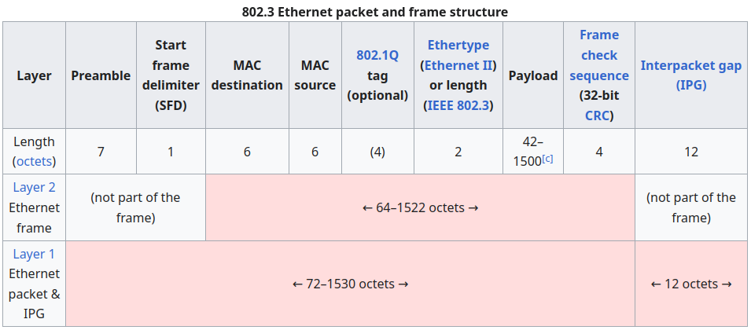
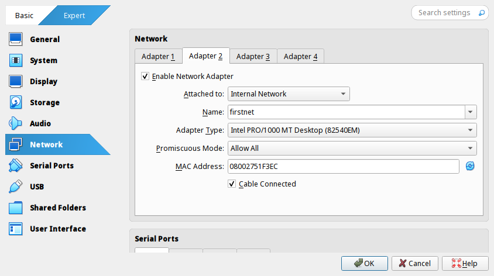

На интерфейсном уровне относительно много доступных *пользователю* (под пользователем здесь подразумевается не человек, использующий какой-то высокоуровневый интерфейс какого-то приложения, до этого нам пока далеко, а компьютер, выступающий вообще узлом сети передачи данных, подключённый к среде передачи данных с физического уровня) возможностей настройки и управления передачей данных.


# Общие характеристики интерфейсного уровня

Для начала повторим, какие главные задачи решаются на интерфейсном уровне. Вообще, его название говорит само за себя: к уже имеющемуся и настроенному носителю данных происходит подключение нескольких (логично, от двух) устройств, и для этих устройств определятся интерфейс взаимодействия с носителем. \
`Bottom-half` задача решает вопрос подключения к среде и определения данных (всё также стоит задача разделения данных и шума в среде), в зависимости от настроек носителя будут определяться дополнительные требования к подключаемым устройствам (например, при передаче пакетов необходимо уметь обрабатывать заголовки и другую метаинформацию, и также самому устройству уметь эту метаинформацию для сообщений генерировать).  Если визуализировать физический уровень неким проводом, заполненным неким потоком данных, то решение данной задачи состоит в разделении всего потока на отдельные информационные блоки, для которых есть выделенный раздел самих данных и описывающая их служебная часть, между которыми находится шум. \
`Top-half` задача определяет не физическое, а логическое использование среды передачи данных. Вопрос приоритетов, контроля работоспособности среды, а также защиты даннных в среде и определения абонентов в ней решаются именно здесь. Впервые впрос шифрования данных также появляется на интерфейсном уровне и именно в `Top-half`-блоке, поскольку не для всех сред возможно обеспечить контроль физического доступа (например, в случае `Ethernet` мы можем просто вытащить провод из компьютера, а для `Wi-Fi` так сделать не получится), следовательно отсутствие доступа к данных должно быть обеспечено не невозможностью эти данные получить, а невозможностью с этими данными работать.

Уже между физическим и интерфейсным уровнем появляется некая инкапсуляция. Например, маркеры начала и конца фрейма, а также разные избыточные и контролирующие целостность данных кодировки не видны на интерфейсном уровне, однако добавляются на физическом для работы с данными при передаче. 



Пример такой инкапсуляции хорошо виден в [структуре фрейма Ethernet](https://en.wikipedia.org/wiki/Ethernet_frame#Structure). Фрейм занимает до 1530 октетов (так в сетевой культуре называют восьмибитные блоки, поскольку под "байтами" изначально подразумевали меньшие связные битовые последовательности), первые восемь из которых имеют строго определённый формат и определяют **преамбулу** и **начало фрейма**. После фрейма всегда идёт 12 октетов шума, лишь после этого теоретически может начинаться следующий фрейм (вообще говоря, замыкающих октетов плавающее количество, так как [Interpacket gap](https://en.wikipedia.org/wiki/Interpacket_gap) считается в наносекундах, поскольку при передаче данных не так важно, что это за данные, их не нужно определять). Все эти ограничивающие данные маркеры не передаются на интерфейсный уровень, а лишь задают формат при передаче данных в среде.

По большей части, наш разговор будет вестись про `Ethernet`. Среди существующих протоколов он (при всей своей сложности) самый простой для понимания и исследования (и, в нашем случае, обучения). Принципиально другим протоколом интерфейсного уровня можно описать бесследно пропавший [Token Ring](https://en.wikipedia.org/wiki/Token_Ring). Топология сети представляет из себя кольцо абонентов, между которыми перемещается заголовочный блок - **токен**, возглавляющий последовательность пакетов в сети. При достижении токеном некоторого абонента он отцепляет пакеты для этого пользователя, прицепляет отправленные им и переходит дальше по кольцу. В остальное время доступа к передаче данных абонент не имеет.

## Фрейм пакетов интерфейсного уровня

Окончательно в дальнейшем повествовании будет описываться разбиение данных на фреймы в рамках **сети с разделением пакетов** (другие виды передачи данных и, соответсвенно, другой подход к разделению данных на фреймы предоставляется для собственного изучения).

При инкапсуляции передаваемой информации во фрейм необходимо указать несколько важных информационных блоков этого фрейма. Первоочерёдно необходимо указать **метаинформацию**: идентификаторы отправителя и получателя (особенно для сетей с более чем двумя пользователями), сведения о перемещении в сети, другая информация _о данных_. Далее идёт блок **самих данных**, остающихся после декапсуляции. После добавляется **проверочный блок**, например, контрольная сумма для проверки корректности данных. В конце добавляется блок **авторизации и шифрования** (номер этого фрейма в последовательности шифра и другое). 

Разберёмся, как эти блоки устроены в [`Ethernet`](https://ru.wikipedia.org/wiki/Ethernet#.2BBCQEPgRABDwEMARC_.2BBDoEMAQ0BEAEMA-). Так как `Ethernet` задумывался, как многопользовательский протокол, для него было необходимостью создание уникальных идентификаторов пользователей. Таким стал [MAC-адрес](https://ru.wikipedia.org/wiki/MAC-%D0%B0%D0%B4%D1%80%D0%B5%D1%81) (`Media Control Access` - контроль доступа к среде), при этом такой способ идентификации действительно стал уникальным - номер каждого Ethernet-устройства отличается от всех других. Адрес состоит из шести октетов, первые три из которых определяют компанию-производителя устройства, а вторые три описывают номер устройства внутри компании. При работе в сети компьютер определяет, соответсвует ли `MAC`-адрес получателя фрейма его `MAC`-адресу, в случае совпадения запускаются вышестоящие системы работы с данными, иначе фрейм игнорируется. Однако такая схема работает в случае, если для нас известны **все** идентификаторы сети (особенно это важно, когда узел является промежуточным при передаче данных - `MAC`-адрес его самого не является получателем, однако пакет должен быть им принят для последующей переотправки дальше в среде). Для реальной работы в `Ethernet` существуют отдельные протоколы, призванные опрашивать абонентов и собирать информацию о подключённых в сети устройствах для их взаимодействия. Для таких исследовательских запросов используется специальный широковещательный адрес, по которому пакет принимается абонентом с любым `MAC`-адресом. Помимо этого сетевые интерфейсы могут работать в "неразборчивом" режиме, при котором сетевая карта принимает вообще все пакеты без проверки `MAC`-адреса. Это свойство на практике помогает определять заражённые компьютеры, в которых внешним воздействием к каналу подключаются сетевые сканеры. Из-за перегрузки канала принимаемыми пакетами они выходят из строя и легко обнаруживаются.

Непосредственно при передаче фреймов в сети необходимо решать три задачи:
 + При подключении кабеля нужно уметь определять непосредственной наличие сети (несущей частоты передачи в канале);
 + Необходимо определять занятость канала во избежание коллизий данных;
 + При коллизии нужно обеспечить повторную отправку с задачей избежания повторной коллизии.

Для решения этих задач в `Ethernet` существует специальный [алгоритм неодновременного доступа](https://ru.wikipedia.org/wiki/CSMA/CD), который приблизительно работает так:
 + Перед отправкой устройство включает детектор канала, при отсутствии передачи в нём начинает собственную;
 + При наступлении коллизии и её детекции обоими (или большим количеством, если в коллизии больше двух участников) устройствами производится _случайная_ задержка (что почти гарантирует отсутствие коллизии, по крайней мере, с тем же пользователем), после чего они повторно отправляют данные;
 + При повторных коллизиях время задержки постепенно увеличивается (в \~2 раза при каждой переотправке) до наступления тайм-аута, при котором абоненты сообщают о недоступности сети в данный момент;

Именно из-за случайности коллизий и случайности их обработки уже на интерфейсном уровне в протоколе `Ethernet` нет гарантированного времени доставки данных и, следовательно, нет гарантированной пропускной способности.


# Работа с интерфейсным уровнем в `Linux`

На интерфейсом уровне для `Linux` доступно довольно много систем, позволяющих оперировать передаваемыми данными и работать с ними. Исследование работоспособности в рамках курса производится на `VirtualBox`, поэтому рассмотрим основные параметры приложения, позволяющие работать с интерфейсным уровнем.



В `VirtualBox` для эмуляции сетевых интерфейсов используются 4 адаптера. Первый настроен на некую сеть типа `NAT`, о которой разговор пройдёт позднее, другие три порта включены, но не настроены. Для создания локальной сети необходимо задать её на портах виртуальных машин (наличие упоминания сети в `VirtualBox` автоматически создаёт сеть), выбрав пункт "`Internal Network`" и задав имя сети. Тот же эффект можно получить через командную строку с помощью модификации виртуальной машины:

```console
VBoxManage modifyvm srv --uartmode1 tcpserver 2026 --nic2 intnet --intnet2 firstnet --cableconnected2  
on
```
Параметры `--nic2`, `--intnet2`, `--cableconnected2` отвечают за настройку сети.

При указании у разных виртуальных машин одной и той же сети они автоматически соединяются  и могут взаимодействовать в рамках этой сети.

---

Для работы с разного рода сетевыми настройками необходимо использовать утилиту [`iproute2`](https://ru.wikipedia.org/wiki/Iproute2)(утилита предустановлена в образе виртуальной машины).

Создадим две виртуальных машины, `srv` и `second`, и с помощью утилитной команды `ip link` посмотрим на первой машине все сетевые соединения:
```srv
[root@srv ~]# ip link  
1: lo: <LOOPBACK,UP,LOWER_UP> mtu 65536 qdisc noqueue state UNKNOWN mode DEFAULT group default qlen 100  
0  
   link/loopback 00:00:00:00:00:00 brd 00:00:00:00:00:00  
2: eth0: <BROADCAST,MULTICAST> mtu 1500 qdisc noop state DOWN mode DEFAULT group default qlen 1000  
   link/ether 08:00:27:06:7e:3e brd ff:ff:ff:ff:ff:ff  
   altname enp0s3  
3: eth1: <BROADCAST,MULTICAST> mtu 1500 qdisc noop state DOWN mode DEFAULT group default qlen 1000  
   link/ether 08:00:27:6a:68:46 brd ff:ff:ff:ff:ff:ff  
   altname enp0s8  
4: eth2: <BROADCAST,MULTICAST> mtu 1500 qdisc noop state DOWN mode DEFAULT group default qlen 1000  
   link/ether 08:00:27:a5:e5:59 brd ff:ff:ff:ff:ff:ff  
   altname enp0s9  
5: eth3: <BROADCAST,MULTICAST> mtu 1500 qdisc noop state DOWN mode DEFAULT group default qlen 1000  
   link/ether 08:00:27:f4:63:45 brd ff:ff:ff:ff:ff:ff  
   altname enp0s10  
[root@srv ~]#
```

Система показывает 5 интерфейсов (4 "реальных" и один логический `loopback`, для которого отправка в него вызывает приём данных из него же). Интересующий нас `eth1` сейчас в отключённом состоянии (`state DOWN`). Сделано это для того, чтобы ядро даже не реагировало на что-либо происходящее в сети, если мы ею сейчас не пользуемся.

Активируем на обоих машинах интерфейс `eth1`(в случае операций на обеих машинах в консольных вставках будет чередоваться обращение к разным машинам. Для описания действий на конкретной машине консольная встаква будет соответствовать этой машине, а также в тексте будет явно указано, над которой из машин проводится действие):
```second
[root@second ~]# ip link set eth1 up  
[root@second ~]# ip link  
1: lo: <LOOPBACK,UP,LOWER_UP> mtu 65536 qdisc noqueue state UNKNOWN mode DEFAULT group default qlen 100  
0  
   link/loopback 00:00:00:00:00:00 brd 00:00:00:00:00:00  
2: eth0: <BROADCAST,MULTICAST> mtu 1500 qdisc noop state DOWN mode DEFAULT group default qlen 1000  
   link/ether 08:00:27:7b:c1:d0 brd ff:ff:ff:ff:ff:ff  
   altname enp0s3  
3: eth1: <BROADCAST,MULTICAST,UP,LOWER_UP> mtu 1500 qdisc fq_codel state UP mode DEFAULT group default  
qlen 1000  
   link/ether 08:00:27:a1:e6:ba brd ff:ff:ff:ff:ff:ff  
   altname enp0s8  
4: eth2: <BROADCAST,MULTICAST> mtu 1500 qdisc noop state DOWN mode DEFAULT group default qlen 1000  
   link/ether 08:00:27:63:ac:73 brd ff:ff:ff:ff:ff:ff  
   altname enp0s9  
5: eth3: <BROADCAST,MULTICAST> mtu 1500 qdisc noop state DOWN mode DEFAULT group default qlen 1000  
   link/ether 08:00:27:2c:af:96 brd ff:ff:ff:ff:ff:ff  
   altname enp0s10  
[root@second ~]#
```

Соединения включены, теперь если настроить `ip`-адреса для обеих машин, они смогут передавать данные (например, `ping`-оваться). Однако `IP` находится уровнем выше, сейчас принципиальным стоит вопрос передачи взаимодействия не выше интерфейсного уровня. Задача это непростая, поскольку в стеке протоколов `TCP/IP` `MAC`-адрес играет роль исключительно идентификатора устройства и не более.

Для анализа сети не выше интерфейсного уровня нам понадобится утилита [`tcpdump`](https://ru.wikipedia.org/wiki/tcpdump), которая вытягивает с порта все данные всех уровней, и `Ethernet` тоже.

На одной машине (`srv`) запустим утилиту, причём явно укажем ей **не декапсулировать** `Ethernet`-фреймы (`-XXe`):

`srv`
```srv
[root@srv ~]# tcpdump -XXe -i eth1  
tcpdump: verbose output suppressed, use -v[v]... for full protocol decode  
listening on eth1, link-type EN10MB (Ethernet), snapshot length 262144 bytes


```

Машина встала на прослушивание соединения. Теперь на `second` присоединимся к этому же интерфейсу и опишем туда данные, соответствующие виду `Ethernet`-фрейма. На помощь придёт утилита `socat` (`socket cat`):

`second`
```second
[root@second ~]# echo "08:00:27:ab:cd:ef 08:00:27:fe:dc:ba 8102 48 69" | xxd -r -p | socat - INTERFACE:  
eth1  
[root@second ~]#
```

Текст, содержащий `MAC`-адреса отправителя и получателя, указание типа данных (8102 - "развёрнутый" нами `IP`-пакет), и сообщение ("48 69" - "Hi") преобразовываем в 16-ричный вид с помощью втсроенной в `Linux` утилиты `xxd` и с помощью `socat` отправляем на `eth1`.

При этом сообщение на `srv` было получено:

`srv`
```srv
[root@srv ~]# tcpdump -XXe -i eth1  
tcpdump: verbose output suppressed, use -v[v]... for full protocol decode  
listening on eth1, link-type EN10MB (Ethernet), snapshot length 262144 bytes  
01:20:23.512468 08:00:27:fe:dc:ba (oui Unknown) > 08:00:27:ab:cd:ef (oui Unknown), ethertype Unknown (0  
x8102), length 60:    
       0x0000:  0800 27ab cdef 0800 27fe dcba 8102 4869  ..'.....'.....Hi  
       0x0010:  0000 0000 0000 0000 0000 0000 0000 0000  ................  
       0x0020:  0000 0000 0000 0000 0000 0000 0000 0000  ................  
       0x0030:  0000 0000 0000 0000 0000 0000            ............
```

При этом `srv` принял фрейм, потому что прослушивание соединения автоматически включается на "неразборчивом" режиме. При включении проверки `MAC`-адреса (ключ `-p`) все неадресованные фреймы будут игнорироваться:

`srv`
```srv
[root@srv ~]# tcpdump -p -XXe -i eth1  
tcpdump: verbose output suppressed, use -v[v]... for full protocol decode  
listening on eth1, link-type EN10MB (Ethernet), snapshot length 262144 bytes


```

`second`
```second
[root@second ~]# echo "08:00:27:ab:cd:ef 08:00:27:fe:dc:ba 8102 48 48 48" | xxd -r -p | socat - INTERFACE:eth1 # HHH  
[root@second ~]# echo "08:00:27:6a:68:46 08:00:27:fe:dc:ba 8102 69 69 69" | xxd -r -p | socat - INTERFACE:eth1 # iii
[root@second ~]#
```

`srv`
```srv
[root@srv ~]# tcpdump -p -XXe -i eth1  
tcpdump: verbose output suppressed, use -v[v]... for full protocol decode  
listening on eth1, link-type EN10MB (Ethernet), snapshot length 262144 bytes  
01:32:09.110315 08:00:27:fe:dc:ba (oui Unknown) > 08:00:27:6a:68:46 (oui Unknown), ethertype Unknown (0  
x8102), length 60:    
       0x0000:  0800 276a 6846 0800 27fe dcba 8102 6969  ..'jhF..'.....ii  
       0x0010:  6900 0000 0000 0000 0000 0000 0000 0000  i...............  
       0x0020:  0000 0000 0000 0000 0000 0000 0000 0000  ................  
       0x0030:  0000 0000 0000 0000 0000 0000            ............
```

---

В рамках одной машины также можно организовать передачу на интерфейсном уровне. Для этого необходимо создать специальное виртуальное (виртуальное уже в логике виртуальной машины) соединение `TUN/TAP`. Логическое устройство  `/dev/net/tun` может работать и на более высоких уровнях стека протоколов, для интерфейсного уровня используется тип туннелирования `tap`. Далее для настройки соединения необходимо передать ему специальные параметры через системный вызов настройки `ioctl`, после чего можно будет передавать данные.

В рамках одной машины сделаем два рабочих окна с `Shell` (для этого воспользуемся утилитой [`tmux`](https://github.com/tmux/tmux/wiki), предустановнеллой в образ ВМ) и запустим `TUN` на одной из них:

`srv_1`
```srv_1
[root@srv ~]# socat TUN,up,tun-type=tap - | hexdump -C


```

В системе появился новый интерфейс:

`srv_2`
```srv_2
[root@srv ~]# ip link
<...>
6: tap0: <BROADCAST,MULTICAST,UP,LOWER_UP> mtu 1500 qdisc fq_codel state UNKNOWN mode DEFAULT group def  
ault qlen 1000  
   link/ether 9a:4b:33:d3:26:cc brd ff:ff:ff:ff:ff:ff
```

Отправим на него информацию и получим её на "слушаюшем" окне:

`srv_2`
```srv_2
[root@srv ~]# cal | socat - INTERFACE:tap0  
[root@srv ~]#
```

`srv_1`
```srv_1
[root@srv ~]# socat TUN,up,tun-type=tap - | hexdump -C
00000000  00 00 20 32 20 20 20 20  46 65 62 72 75 61 72 79  |.. 2    February|
00000010  20 32 30 32 35 20 20 20  0a 53 75 20 4d 6f 20 54  | 2025   .Su Mo T|
00000020  75 20 57 65 20 54 68 20  46 72 20 53 61 0a 20 20  |u We Th Fr Sa.  |
00000030  20 20 20 20 20 20 20 20  20 20 20 20 20 20 20 20  |                |
00000040  20 31 0a 20 32 20 20 33  20 20 34 20 20 35 20 20  | 1. 2  3  4  5  |
00000050  36 20 20 37 20 20 38 0a  20 39 20 31 30 20 31 31  |6  7  8. 9 10 11|
00000060  20 31 32 20 31 33 20 31  34 20 31 35 0a 31 36 20  | 12 13 14 15.16 |
00000070  31 37 20 31 38 20 31 39  20 32 30 20 32 31 20 32  |17 18 19 20 21 2|
00000080  32 0a 32 33 20 32 34 20  32 35 20 32 36 20 32 37  |2.23 24 25 26 27|
00000090  20 32 38 20 20 20 0a 20  20 20 20 20 20 20 20 20  | 28   .         |
```

# Домашнее задание

Воспроизвести пример из лекции с двумя виртуалками, объединёнными внутренней сетью

1. Настроить в самом `virtualbox` общую виртуальную сеть
2. Сделать два клона (`base` и `second`) и настроить на обеих машинах «Адаптер 2» как подключённый к некоторой одинаковой сети
3. Отчёты:
	 + На базовой машине (`report 2 base`)
		 + Поднять сетевой интерфейс, к которому подключена виртуальная сеть
		 + Запустить `tcpdump -p -XX -c 2` на этот интерфейс; дождаться окончания
	 + На дублёре (`report 2 second`)
		 + Поднять сетевой интерфейс, к которому подключена виртуальная сеть
		 + _Трижды_ сгенерировать и отправить фрейм с помощью `xxd + socat` по примеру из лекции (`payload` может быть любым не длиннее 40 символов)
	        1. `MAC` отправителя и `MAC` получателя должны совпадать с актуальными
            2. `MAC` получателя должен **не** совпадать с актуальным    
            3. `MAC` получателя должен _совпадать_ с актуальным, а `MAC` отправителя — нет
4. Оба отчёта (`report.02.base` и `report.02.second`) именно с такими названиями переслать одним письмом в качестве приложений на [uneexlectures@cs.msu.ru](mailto:uneexlectures@cs.msu.ru)
	 + В теме письма **должно** встречаться слово `LinuxNetwork2025`