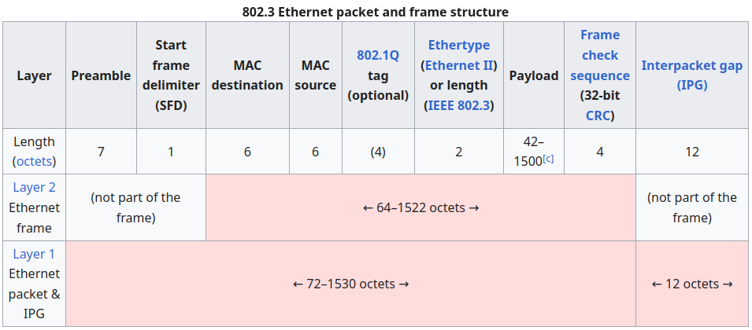
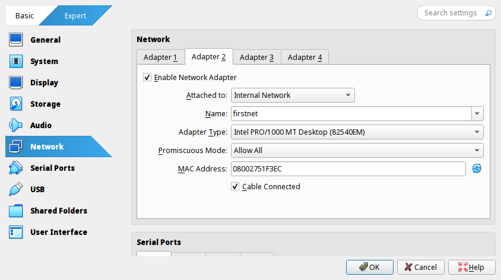

Интерфейсный уровень позволяет устройству настраивать сильно больше, чем можно на физическом.

# Общие характеристики интерфейсного уровня

Для начала повторим, какие задачи решаются на интерфейсном уровне. Название говорит само за себя: к уже имеющемуся и настроенному носителю данных происходит подключение нескольких (логично, от двух) устройств, и для этих устройств необходимо определить правила взаимодействия с носителем.

Для унификации необходимо определить правила _подключения к среде и выявления данных_ (то есть отделения их от шума). В зависимости носителя могут определяться дополнительные требования к подключаемым устройствам. Например, при передаче пакетов необходимо уметь обрабатывать и самостоятельно генерировать заголовки и метаинформацию для передачи.

Если представить физический уровень неким проводом, заполненным потоком данных, унификация будет заключаться в разделении всего потока на отдельные информационные блоки, между которыми находится шум. Сами блоки разделяются на данные и служебную часть, необходимую для передачи.

Задача систематизации уровня это определение _логического использования среды_, то есть дисциплины и правил передачи в ней сообщений. Вопросы приоритетов, контроля работоспособности среды, а также защиты данных в среде и определения абонентов решаются именно здесь.

Вопрос шифрования данных также возникает на интерфейсном уровне в рамках систематизации, поскольку не для всех сред передачи данных возможно обеспечить контроль физического доступа. Например, в случае Ethernet мы можем просто вытащить провод из компьютера, а для Wi-Fi так сделать не получится. Следовательно, отсутствие доступа к данным должно быть обеспечено не невозможностью их получить, а невозможностью с ними работать.

Между физическим и интерфейсным уровнем уже появляется некая инкапсуляция. Например, маркеры начала и конца фрейма, различные кодировки, контролирующие целостность данных. Они не видны на интерфейсном уровне, однако добавляются на физическом для работы с данными при передаче.



Пример инкапсуляции хорошо виден в [структуре фрейма Ethernet](https://en.wikipedia.org/wiki/Ethernet_frame#Structure). Фрейм занимает до 1530 октетов (так в сетевой культуре называют восьмибитные блоки, поскольку под "байтами" изначально подразумевали связные битовые последовательности не обязательно длины 8), первые восемь из которых имеют строго определённый формат — задают _преамбулу_ и _начало фрейма_. После конца фрейма всегда идёт 12 октетов шума, лишь после этого теоретически может начинаться следующий фрейм. Вообще говоря, замыкающих октетов плавающее количество, так как [Interpacket gap](https://en.wikipedia.org/wiki/Interpacket_gap) считается в наносекундах. Сделано так, поскольку при передаче данных не важна структура шума, его не нужно определять. Все эти ограничивающие маркеры не передаются на интерфейсный уровень. Они только задают формат при передаче данных в среде.

По большей части, наш разговор будет вестись про Ethernet. Среди существующих протоколов он (при всей своей сложности) самый простой для понимания и исследования (и, в нашем случае, обучения). Принципиально другим протоколом интерфейсного уровня можно описать бесследно пропавший [Token Ring](https://en.wikipedia.org/wiki/Token_Ring). Топология сети для его работы была строго фиксированной: кольцо абонентов, между которыми перемещается заголовочный блок — _токен_ —, возглавляющий последовательность пакетов в сети. При достижении токеном некоторого абонента он отцепляет пакеты для этого пользователя, прицепляет отправленные им и переходит дальше по кольцу. В остальное время доступа к передаче данных абонент не имеет.

## Фрейм — пакет интерфейсного уровня

Окончательно в дальнейшем повествовании будет описываться разбиение данных на фреймы в рамках _сети с разделением пакетов_. Другие виды передачи данных и, соответсвенно, другой подход к разделению данных на фреймы предоставляется для собственного изучения.

При инкапсуляции передаваемой информации во фрейм создаётся несколько важных информационных блоков этого фрейма. Первоочерёдно необходимо указать _метаинформацию_: идентификаторы отправителя и получателя (особенно для сетей с более чем двумя пользователями), сведения о перемещении в сети, другая информация об абонентах и/или данных. Далее идёт блок _самих данных_, которые будут оставаться после декапсуляции. После добавляется _проверочный блок_, например, контрольная сумма для проверки корректности данных. В конце добавляется блок _авторизации и шифрования_ (номер этого фрейма в последовательности шифра и другое).

Разберёмся, как эти блоки устроены в [Ethernet](https://ru.wikipedia.org/wiki/Ethernet#.2BBCQEPgRABDwEMARC_.2BBDoEMAQ0BEAEMA-). Так как Ethernet задумывался, как сеть с множественным доступом, в протокол потребовалось ввести уникальный идентификатор абонента — т. н. [MAC-адрес](https://ru.wikipedia.org/wiki/MAC-%D0%B0%D0%B4%D1%80%D0%B5%D1%81) (_Media Control Access_ - контроль доступа к среде). В случае Ethernet такой способ идентификации действительно уникален — номер любого производимого в мире Ethernet-устройства должен отличаться от всех других.

Адрес состоит из шести октетов, первые три из которых определяют компанию-производителя устройства, а вторые три описывают номер устройства внутри компании. Сетевой интерфейс как устройство видит все фреймы в локальной сети и для каждого проверяет, надо ли его получить — например, соответствует ли _MAC_-адрес получателя фрейма _MAC_-адресу самого интерфейса. В случае совпадения запускаются вышестоящие системы работы с данными, иначе фрейм игнорируется.

Однако такая схема работает в случае, если для нас известны все идентификаторы сети. Особенно это важно, когда узел является промежуточным при передаче данных. MAC-адрес его самого не является получателем, однако пакет должен быть им принят для последующей переотправки дальше в среде.

Для реальной работы в Ethernet существуют отдельные протоколы, призванные опрашивать абонентов и собирать информацию о подключённых в сети устройствах для их взаимодействия. Для таких исследовательских запросов используется специальный широковещательный адрес, по которому пакет принимается абонентом с любым MAC-адресом.

Помимо этого сетевые интерфейсы могут работать в «неразборчивом» режиме, при котором сетевая карта принимает вообще все пакеты без проверки MAC-адреса. Это свойство на практике помогает определять компьютеры, на которых запущены сетевые сканеры (например, с целью подглядеть в «не своём» трафике какие-нибудь учётные данные). Если направить в сеть множество фреймов в адрес несуществующего абонента, программное обеспечение сканеров начнёт потреблять очень много ресурсов и сильно понизит отзывчивость сетевого стека операционной системы, а то и выведет его из строя.

При передаче фреймов в сети необходимо решать три задачи:
 + при подключении кабеля нужно уметь определять непосредственное наличие сети (несущей частоты передачи в канале);
 + необходимо определять занятость канала во избежание коллизий данных;
 + при коллизии нужно обеспечить повторную отправку в надежде избежать повторной коллизии.

Для решения этих задач в Ethernet существует специальный [алгоритм неодновременного доступа](https://ru.wikipedia.org/wiki/CSMA/CD), который приблизительно работает так:
 + для начала устройство определяет наличие несущей частоты в канале; если её нет — среда считается недоступной / испорченной;
 + перед отправкой устройство включает детектор канала, при отсутствии передачи в нём начинает собственную;
 + коллизию обнаруживают все абоненты, которые пытались одновременно передавать данные, в этом случае происходит _случайная_ задержка (что почти гарантирует отсутствие коллизии, по крайней мере, с тем же абонентом), после чего каждый повторно отправляет данные;
 + при повторных коллизиях время задержки постепенно увеличивается (в \~2 раза при каждой переотправке) до наступления тайм-аута, после чего абоненты сообщают о недоступности сети в данный момент.

Именно из-за случайности коллизий и случайности их обработки уже на интерфейсном уровне в протоколе Ethernet нет гарантированного времени доставки данных и, следовательно, _теоретически_ нет гарантированной пропускной способности.

Более того, если время, в течение которого среда занята, приближается к трети всего времени работы, Ethernet-сеть начинает существенно терять производительность, и к 50% загрузке становится практически неработоспособной. С этим явлением можно бороться, вводя _на некоторых средах передачи данных_ дополнительную логику работы: например, в топологии «звезда» центральное сетевое устройство может хранить динамическую таблицу — за каким интерфейсом находится абонент с конкретным MAC-адресом — и при прохождении соответствующего фрейма не распространять его по все среде передачи, а перенаправлять только на нужный интерфейс. Но окончательно избавиться от проблемы нельзя.

# Работа с интерфейсным уровнем в Linux

На интерфейсом уровне для Linux доступно довольно много систем, позволяющих оперировать передаваемыми данными и работать с ними. Исследование работоспособности в рамках курса производится на VirtualBox, поэтому рассмотрим основные параметры приложения, позволяющие работать с интерфейсным уровнем.



## Создание соединения на интерфейсном уровне

В VirtualBox для эмуляции сетевых интерфейсов используются 4 адаптера. Первый настроен на некую сеть типа NAT, о которой разговор пройдёт позднее, другие три порта включены, но не настроены. Для создания локальной сети необходимо задать её на портах виртуальных машин (наличие упоминания сети в VirtualBox автоматически создаёт сеть), выбрав пункт "Internal Network" и задав имя сети. Тот же эффект можно получить через командную строку с помощью модификации виртуальной машины:
**TODO** Не «В VirtualBox», а в нашем образе!

```console
VBoxManage modifyvm srv --uartmode1 tcpserver 2026 --nic2 intnet --intnet2 firstnet --cableconnected2  
on
```
Параметры `--nic2`, `--intnet2`, `--cableconnected2` отвечают за настройку сети.

**TODO** При чём тут `--uartmode1 tcpserver 2026`?

При указании у разных виртуальных машин одной и той же сети типа «Internal Network» они автоматически соединяются  и могут взаимодействовать в рамках этой сети.

## Работа с сетевыми интерфейсами

Для работы с разного рода сетевыми настройками необходимо использовать утилиту [iproute2](https://ru.wikipedia.org/wiki/Iproute2)(утилита предустановлена в образе виртуальной машины).

Создадим две виртуальных машины, srv и second, и с помощью команды `ip link` посмотрим на первой машине все сетевые соединения:

`srv`
```console
[root@srv ~]# ip link  
1: lo: <LOOPBACK,UP,LOWER_UP> mtu 65536 qdisc noqueue state UNKNOWN mode DEFAULT group default qlen 100  
0  
   link/loopback 00:00:00:00:00:00 brd 00:00:00:00:00:00
2: eth0: <BROADCAST,MULTICAST> mtu 1500 qdisc noop state DOWN mode DEFAULT group default qlen 1000  
   link/ether 08:00:27:06:7e:3e brd ff:ff:ff:ff:ff:ff
   altname enp0s3
3: eth1: <BROADCAST,MULTICAST> mtu 1500 qdisc noop state DOWN mode DEFAULT group default qlen 1000  
   link/ether 08:00:27:6a:68:46 brd ff:ff:ff:ff:ff:ff
   altname enp0s8
4: eth2: <BROADCAST,MULTICAST> mtu 1500 qdisc noop state DOWN mode DEFAULT group default qlen 1000  
   link/ether 08:00:27:a5:e5:59 brd ff:ff:ff:ff:ff:ff
   altname enp0s9
5: eth3: <BROADCAST,MULTICAST> mtu 1500 qdisc noop state DOWN mode DEFAULT group default qlen 1000  
   link/ether 08:00:27:f4:63:45 brd ff:ff:ff:ff:ff:ff
   altname enp0s10
[root@srv ~]#
```

Система показывает 5 интерфейсов (4 "реальных" и виртуальный `loopback`, для которого отправка в него вызывает приём данных из него же). Интересующий нас `eth1` сейчас в отключённом состоянии (`state DOWN`). Сделано это для того, чтобы ядро даже не реагировало на что-либо происходящее в сети, если мы ею сейчас не пользуемся.

Активируем на обоих машинах интерфейс eth1 (в случае операций на обеих машинах в консольных вставках будет чередоваться обращение к разным машинам. Для описания действий на конкретной машине подпись над консольной вставкой будет соответствовать этой машине, а также в тексте будет явно указано, над которой из машин проводится действие):

`second`
```console
[root@second ~]# ip link set eth1 up  
[root@second ~]# ip link  
1: lo: <LOOPBACK,UP,LOWER_UP> mtu 65536 qdisc noqueue state UNKNOWN mode DEFAULT group default qlen 100  
0  
   link/loopback 00:00:00:00:00:00 brd 00:00:00:00:00:00
2: eth0: <BROADCAST,MULTICAST> mtu 1500 qdisc noop state DOWN mode DEFAULT group default qlen 1000  
   link/ether 08:00:27:7b:c1:d0 brd ff:ff:ff:ff:ff:ff
   altname enp0s3
3: eth1: <BROADCAST,MULTICAST,UP,LOWER_UP> mtu 1500 qdisc fq_codel state UP mode DEFAULT group default  
qlen 1000  
   link/ether 08:00:27:a1:e6:ba brd ff:ff:ff:ff:ff:ff
   altname enp0s8
4: eth2: <BROADCAST,MULTICAST> mtu 1500 qdisc noop state DOWN mode DEFAULT group default qlen 1000  
   link/ether 08:00:27:63:ac:73 brd ff:ff:ff:ff:ff:ff
   altname enp0s9
5: eth3: <BROADCAST,MULTICAST> mtu 1500 qdisc noop state DOWN mode DEFAULT group default qlen 1000  
   link/ether 08:00:27:2c:af:96 brd ff:ff:ff:ff:ff:ff
   altname enp0s10
[root@second ~]#
```

Соединения включены, теперь организуем взаимодействие абонентов. Принципиальным сейчас стоит вопрос передачи взаимодействия не выше интерфейсного уровня, разговор про IPv6 требует отдельного внимания. Задача L2-взаимодействия непростая, поскольку в стеке протоколов TCP/IP MAC-адрес играет роль исключительно идентификатора устройства и не более.

Для анализа сети не выше интерфейсного уровня нам понадобится утилита [tcpdump](https://ru.wikipedia.org/wiki/tcpdump), которая вытягивает с порта все данные всех уровней.

На srv запустим утилиту, причём явно укажем ей _не декапсулировать_ Ethernet-фреймы (`-XXe`):

`srv`
```console
[root@srv ~]# tcpdump -XXe -i eth1  
tcpdump: verbose output suppressed, use -v[v]... for full protocol decode  
listening on eth1, link-type EN10MB (Ethernet), snapshot length 262144 bytes


```

Утилита `tcpdump` прослушивает _весь_ проходящий трафик, установив тот самый неразборчивый режим работы сетевого интерфейса.  Теперь на second присоединимся к интерфейсу, который подключён к той же сети, и запишем туда данные, соответствующие виду Ethernet-фрейма. На помощь придёт утилита socat (`socket cat`, это достаточно сложная утилита, позволяющая вести передачу с любого уровня стека):

`second`
```console
[root@second ~]# echo "08:00:27:ab:cd:ef 08:00:27:fe:dc:ba 8102 48 69" | xxd -r -p | socat - INTERFACE:  
eth1  
[root@second ~]#
```

Текст, содержащий MAC-адреса отправителя и получателя, указание типа данных (8102 - "развёрнутый" нами IP-пакет), и сообщение ("48 69" - "Hi") преобразовываем в шестнадцатеричный вид с помощью встроенной в Linux утилиты `xxd` и с помощью `socat` отправляем на eth1.

При этом сообщение на srv было получено:

`srv`
```console
[root@srv ~]# tcpdump -XXe -i eth1  
tcpdump: verbose output suppressed, use -v[v]... for full protocol decode  
listening on eth1, link-type EN10MB (Ethernet), snapshot length 262144 bytes  
01:20:23.512468 08:00:27:fe:dc:ba (oui Unknown) > 08:00:27:ab:cd:ef (oui Unknown), ethertype Unknown (0  
x8102), length 60:
       0x0000:  0800 27ab cdef 0800 27fe dcba 8102 4869  ..'.....'.....Hi
       0x0010:  0000 0000 0000 0000 0000 0000 0000 0000  ................
       0x0020:  0000 0000 0000 0000 0000 0000 0000 0000  ................
       0x0030:  0000 0000 0000 0000 0000 0000            ............
```

srv принял фрейм, потому что прослушивание соединения автоматически включается на «неразборчивом» режиме. При включении проверки MAC-адреса (ключ `-p`) все неадресованные фреймы будут игнорироваться:

`srv`
```console
[root@srv ~]# tcpdump -p -XXe -i eth1  
tcpdump: verbose output suppressed, use -v[v]... for full protocol decode  
listening on eth1, link-type EN10MB (Ethernet), snapshot length 262144 bytes


```

`second`
```console
[root@second ~]# echo "08:00:27:ab:cd:ef 08:00:27:fe:dc:ba 8102 48 48 48" | xxd -r -p | socat - INTERFACE:eth1 # HHH  
[root@second ~]# echo "08:00:27:6a:68:46 08:00:27:fe:dc:ba 8102 69 69 69" | xxd -r -p | socat - INTERFACE:eth1 # iii
[root@second ~]#
```

`srv`
```console
[root@srv ~]# tcpdump -p -XXe -i eth1  
tcpdump: verbose output suppressed, use -v[v]... for full protocol decode  
listening on eth1, link-type EN10MB (Ethernet), snapshot length 262144 bytes  
01:32:09.110315 08:00:27:fe:dc:ba (oui Unknown) > 08:00:27:6a:68:46 (oui Unknown), ethertype Unknown (0  
x8102), length 60:
       0x0000:  0800 276a 6846 0800 27fe dcba 8102 6969  ..'jhF..'.....ii
       0x0010:  6900 0000 0000 0000 0000 0000 0000 0000  i...............
       0x0020:  0000 0000 0000 0000 0000 0000 0000 0000  ................
       0x0030:  0000 0000 0000 0000 0000 0000            ............
```

## Передача данных на интерфейсном уровне в рамках одной машины

В рамках одной машины также можно организовать передачу на интерфейсном уровне. Для этого необходимо создать специальное виртуальное устройство типа TUN/TAP. Если обращаться к TUN/TAP программно, надо открыть устройство `/dev/net/tun`, с помощью специального системного вызова `ioctl()` — `TUNSETIFF` — «объяснить» ядру Linux, какого именно типа туннель нам нужен (нам нужен TAP, имитирующий сетевой интерфейс вплоть до задания собственного MAC-адреса), и дальше заниматься обычным вводом-выводом данных, оформленных как Ethernet-фреймы. Будет создан специальный виртуальный сетевой интерфейс — `tap0` — в котором весь этот ввод=-вывод превратится в сетевой трафик.

Делать всего этого сами мы не будем — за нас будет работать всё та же утилита `socat`, которая и создавать TUN/TAP туннели тоже умеет.

В рамках одной машины сделаем два рабочих окна с Shell (для этого воспользуемся утилитой [tmux](https://github.com/tmux/tmux/wiki), предустановленной в образ ВМ) и запустим TUN на одной из них:

`srv_1`
```console
[root@srv ~]# socat TUN,up,tun-type=tap - | hexdump -C


```

В системе появился новый интерфейс:

`srv_2`
```console
[root@srv ~]# ip link
<...>
6: tap0: <BROADCAST,MULTICAST,UP,LOWER_UP> mtu 1500 qdisc fq_codel state UNKNOWN mode DEFAULT group def  
ault qlen 1000  
   link/ether 9a:4b:33:d3:26:cc brd ff:ff:ff:ff:ff:ff
```

Отправим на него информацию и получим её на "слушающем" окне:

`srv_2`
```console
[root@srv ~]# cal | socat - INTERFACE:tap0  
[root@srv ~]#
```

`srv_1`
```console
[root@srv ~]# socat TUN,up,tun-type=tap - | hexdump -C
00000000  00 00 20 32 20 20 20 20  46 65 62 72 75 61 72 79  |.. 2    February|
00000010  20 32 30 32 35 20 20 20  0a 53 75 20 4d 6f 20 54  | 2025   .Su Mo T|
00000020  75 20 57 65 20 54 68 20  46 72 20 53 61 0a 20 20  |u We Th Fr Sa.  |
00000030  20 20 20 20 20 20 20 20  20 20 20 20 20 20 20 20  |                |
00000040  20 31 0a 20 32 20 20 33  20 20 34 20 20 35 20 20  | 1. 2  3  4  5  |
00000050  36 20 20 37 20 20 38 0a  20 39 20 31 30 20 31 31  |6  7  8. 9 10 11|
00000060  20 31 32 20 31 33 20 31  34 20 31 35 0a 31 36 20  | 12 13 14 15.16 |
00000070  31 37 20 31 38 20 31 39  20 32 30 20 32 31 20 32  |17 18 19 20 21 2|
00000080  32 0a 32 33 20 32 34 20  32 35 20 32 36 20 32 37  |2.23 24 25 26 27|
00000090  20 32 38 20 20 20 0a 20  20 20 20 20 20 20 20 20  | 28   .         |
```

# Домашнее задание

Воспроизвести пример из лекции с двумя виртуалками, объединёнными внутренней сетью

1. Настроить в самом `virtualbox` общую виртуальную сеть
2. Сделать два клона (`base` и `second`) и настроить на обеих машинах «Адаптер 2» как подключённый к некоторой одинаковой сети
3. Отчёты:
	 + На базовой машине (`report 2 base`)
		 + Поднять сетевой интерфейс, к которому подключена виртуальная сеть
		 + Запустить `tcpdump -p -XX -c 2` на этот интерфейс; дождаться окончания
	 + На дублёре (`report 2 second`)
		 + Поднять сетевой интерфейс, к которому подключена виртуальная сеть
		 + _Трижды_ сгенерировать и отправить фрейм с помощью `xxd + socat` по примеру из лекции (`payload` может быть любым не длиннее 40 символов)
	        1. `MAC` отправителя и `MAC` получателя должны совпадать с актуальными
            2. `MAC` получателя должен **не** совпадать с актуальным    
            3. `MAC` получателя должен _совпадать_ с актуальным, а `MAC` отправителя — нет
4. Оба отчёта (`report.02.base` и `report.02.second`) именно с такими названиями переслать одним письмом в качестве приложений на [uneexlectures@cs.msu.ru](mailto:uneexlectures%40cs.msu.ru)
	 + В теме письма **должно** встречаться слово `LinuxNetwork2027`
