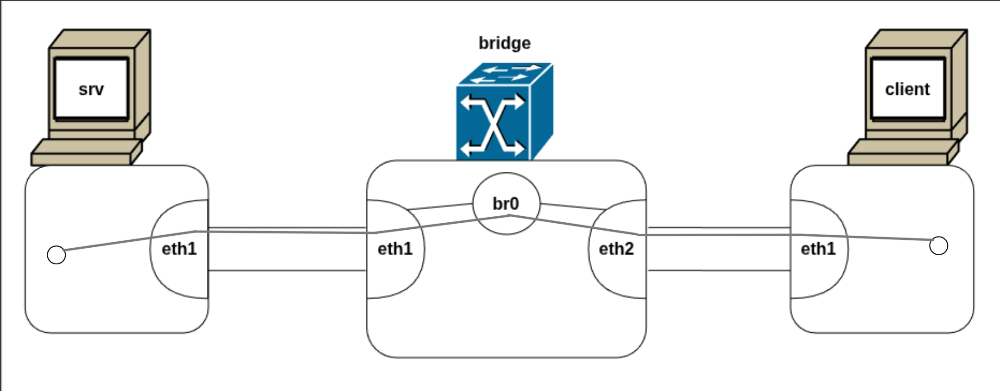
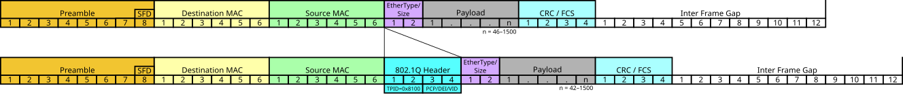
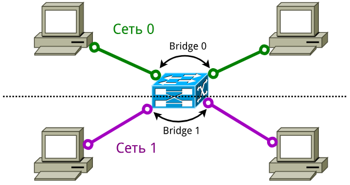
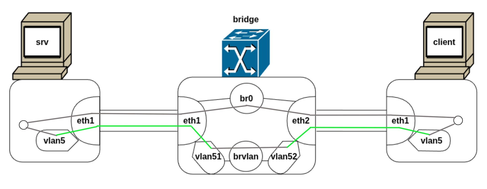
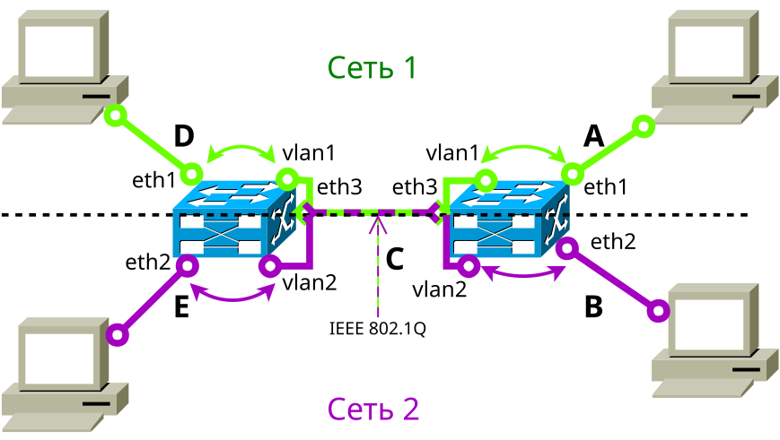
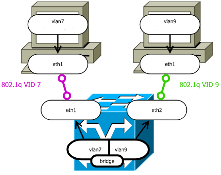

# Среды передачи данных из нескольких носителей

Прежде чем переходить к задаче объединения всех сетей в единый интернет, необходимо разобраться с более простой задачей. Пусть имеется несколько сред передач данных с одним и тем же носителем, однако физически представляющих из себя раздельные взаимодействующие множества абонентов. Необходимо обеспечить на интерфейсном уровне единую среду, работающую поверх носителя, в которой физически разные сети воспринимались бы устройcтвами в виде единой локальной сети. Логичным продолжением этой задачи является объединение множества сред на разных носителях, однако решение от этого никак не поменяется за исключением преобразования самих данных для передачи в зависимости от особенностей физического уровня.

Решение задачи объединения сред - настройка маршрутизации пакетов - обычно ложится на транспортный уровень: при получении нового пакета промежуточный узел сети, **маршрутизатор** (вообще говоря, маршрутизатором может выступать и какой-то абонент; более подробно этот вопрос будет обсуждён в следующей главе), декапсулирует его до транспортного уровня, проверяет `IP`-адрес получателя, после чего инкапсулирует пакет обратно и перенаправляет его дальше по сети в сторону целевого абонента. Цель данной главы - показать способы передачи данных между разными средами **не выше интерфейсного уровня**. Для этого необходимо использовать специальные устройства (вернее, специальные настройки устройств, поскольку в качестве таких промежуточных узлов сети могут выступать и целевые абоненты) - ***Мост*** и ***Хаб***.  

[Хаб](https://ru.wikipedia.org/wiki/%D0%A1%D0%B5%D1%82%D0%B5%D0%B2%D0%BE%D0%B9_%D0%BA%D0%BE%D0%BD%D1%86%D0%B5%D0%BD%D1%82%D1%80%D0%B0%D1%82%D0%BE%D1%80), он же _сетевой концентратор_, представляет из себя устройство, занимающееся постоянной ретрансляцией всех приходящих в него пакетов. Для настройки `Linux`-машины в хаб необходимо всего лишь подключить постоянный _неразборчивый режим_ и пересылать все приходящие данные на все порты кроме, быть может, порта-источника. Вследствие такого режима работы хаб организовывает работу сети с топологией общей шины со всеми вытекающими из этого проблемами.

Более универсальным решением является [сетевой мост](https://ru.wikipedia.org/wiki/%D0%A1%D0%B5%D1%82%D0%B5%D0%B2%D0%BE%D0%B9_%D0%BC%D0%BE%D1%81%D1%82). Кроме неразборчивого режима работы в нём присутствует динамически обновляемая таблица соответствия `MAC`-адресов сетевым портам, поключённым к нему (в случае **не** `Ethernet` соответствия подключённых физических каналов и идентификаторов могут быть другими, но схема работы остаётся той же самой). С помощью такой _таблицы абонентов_ мост занимается целевой ретрансляцией фреймов между интерфейсами. К сожалению, избежать полной ретрансляции не представляется возможным. Как минимум, необходимо производить её в случае широковещательных фреймов. Кроме того, полная ретрансляция проводится для фреймов с неизвестным получателем, (например, при включении моста, когда таблица абонентов ещё не заполнена данными), что потенциально можно использовать при сетевой атаке.

Для работы множества мостов в рамках одной локальной сети разработан специальный протокол [`STP`](https://ru.wikipedia.org/wiki/STP) - `Spanning Tree Protocol`. Он необходим для решения проблемы зацикливания пакетов между мостами, технически он отсекает доступ к некоторым портам у мостов, оставляя только полносвязное дерево абонентов. \
Также для работы мостов разработаны разные `antispoof`- алгоритмы, позволяющие вычислять сетевые атаки на таблицы абонентов и блокировать источникам атаки доступ к сети. Например, такую защиту обеспечивает [`firewall L2`](https://wiki.nftables.org/wiki-nftables/index.php/Bridge_filtering) в высокоуровневой утилите [`nftables`](https://wiki.nftables.org/), которая на интерфейсном уровне устанавливает специальный фильтр фреймов, основанный на `MAC`-адресации (но по причине возможности смены `MAC`-адресов у большинства устройств данный способ не обеспечивает полной защиты от атак).

## Создание моста

На виртуальных машинах настроим взаимодействие двух абонентов через мост. Для этого создадим три устройства: `srv` с сетью `net1`, `client` с сетью `net2` и `bridge`, подключённый к обеим этим сетям:

```console
~/papillon_rouge: vbsnap protocols-jeos-20250223a-x86_64 srv net1
~/papillon_rouge: vbsnap protocols-jeos-20250223a-x86_64 client net2
~/papillon_rouge: vbsnap protocols-jeos-20250223a-x86_64 bridge net1 net2
```

С помощью сценария `vbintnets` можно посмотреть текущие подключения устройств:
```console
~/papillon_rouge: vbintnets
srv:  
       eth1: net1  
client:  
       eth1: net2  
bridge:  
       eth1: net1  
       eth2: net2
~/papillon_rouge: 
```

Запустим наши машины. После запуска запустим сетевые интерфейсы на машинах srv и client. 

`srv`
```console
[root@srv ~]# ip link set eth1 up  
[root@srv ~]#
```

`client`
```console
[root@client ~]# ip link set eth1 up  
[root@client ~]#  
```

Проверим связность сети между нашими абонентами. Для этого необходимо организовать между ними передачу трафика. В прошлой главе мы уже говорили о возможностях socat для передачи данных не выше иинтерфейсного уровня. Однако данный способ далеко не самый удобный. В будущем вне зависимости от уровня, на котором мы работаем, мы будем использовать более высокоуровневые способы определения связности.

При активации сетевых интерфейсов при поддержке в системе протокола IPv6 устройство автоматически запускает цикл настройки IPv6-адреса на базе MAC. Сам механизм настройки будет обсуждён нами в будущих главах, сейчас для нас достаточно знать, что после включения сетевого интерфейса на нём автоматически генерируется IPv6-адрес, по которому мы можем проверять связность устройства.

`srv`
```console
[root@333-srv ~]# ip addr show eth1                
3: eth1: <BROADCAST,MULTICAST,UP,LOWER_UP> mtu 1500 qdisc fq_codel state UP group default qlen 1000  
   link/ether 08:00:27:05:4a:9e brd ff:ff:ff:ff:ff:ff  
   altname enp0s8  
   altname enx080027054a9e  
   inet6 fe80::a00:27ff:fe05:4a9e/64 scope link proto kernel_ll    
      valid_lft forever preferred_lft forever  

[root@333-srv ~]# ip addr show eth1 | grep inet6  
   inet6 fe80::a00:27ff:fe05:4a9e/64 scope link proto kernel_ll    
[root@333-srv ~]#
```

`client`
```console
[root@333-client ~]# ip addr show eth1 | grep inet6  
   inet6 fe80::a00:27ff:fea0:ff92/64 scope link proto kernel_ll    
[root@333-client ~]#
```

Для проверки связности будем использовать утилиту traceroute. Чтобы не отправлять избыточное количество пакетов (что для проверки связности абонентов не требуется), установим специальные флаги: `-q2` для отправки пакетов парами по значению TTL и `-N1` для отключения параллельной отправки пакетов.

Ещё одна особенность при работе с IPv6 — другой формат отслеживания адресов для маршрутизации. В частности, для нас сейчас это означает необходимость явного указания, через какой интерфейс необходимо вести передачу.

`srv`
```console
[root@333-srv ~]# traceroute -q2 -N1 fe80::a00:27ff:fea0:ff92%eth1    
traceroute to fe80::a00:27ff:fea0:ff92%eth1 (fe80::a00:27ff:fea0:ff92%eth1), 30 hops max, 80 byte packe  
ts  
1  srv (fe80::a00:27ff:fe05:4a9e%eth1)  3104.244 ms !H  3064.288 ms !H  
[root@333-srv ~]#
```

Логично было ожидать, что связности нет (метка `!H` обозначает сброс по тайм-ауту и, соответственно, отсутствие ответа), поскольку устройства находятся в разных сетях. Теперь с помощью моста объединим их в единую сеть. Для специальных команд, связанных с работой моста, необходимо использовать ключевое слово `bridge`.



Первоначально необходимо создать логический интерфейс типа `bridge`. После создания он отобразится со всеми интерфейсами:

`bridge`
```console
[root@bridge ~]# ip link add dev br0 type bridge  
[root@bridge ~]# ip link show br0
6: br0: <BROADCAST,MULTICAST> mtu 1500 qdisc noop state DOWN mode DEFAULT group default qlen 1000  
   link/ether da:12:01:0e:cb:3c brd ff:ff:ff:ff:ff:ff  
   inet6 fe80::a00:27ff:fe0e:cb3c/64 scope link proto kernel_ll    
      valid_lft forever preferred_lft forever  
[root@bridge ~]# 
```

Теперь включим все интерфейсы (два сетевых и созданный мост), и установим для `eth1` и `eth2` мастер-интерфейс моста:

`bridge`
```bridge
[root@bridge ~]# ip link set eth1 up  
[root@bridge ~]# ip link set eth2 up  
[root@bridge ~]# ip link set br0 up  
[root@bridge ~]# ip link set eth1 master br0  
[root@bridge ~]# ip link set eth2 master br0  
```

Заметим, что никаких настроек относительно маршрутизации пакетов на bridge не описано. Вся передача управляется им не выше интерфейсного уровня. 

`bridge`
```console
[root@bridge ~]# bridge link  
3: eth1: <BROADCAST,MULTICAST,UP,LOWER_UP> mtu 1500 master br0 state forwarding priority 32 cost 5    
4: eth2: <BROADCAST,MULTICAST,UP,LOWER_UP> mtu 1500 master br0 state forwarding priority 32 cost 5    
```

Теперь попробуем передать данные между сервером и клиентом. За время настройки мост уже заполнил часть динамической таблицы известными ему данными, но в них пока нет информации об абонентах.

`bridge`
```bridge
[root@bridge ~]# bridge fdb  
08:00:27:6f:93:4f dev eth1 vlan 1 master br0 permanent  
08:00:27:6f:93:4f dev eth1 master br0 permanent  
01:00:5e:00:00:01 dev eth1 self permanent  
08:00:27:85:f5:da dev eth2 vlan 1 master br0 permanent  
08:00:27:85:f5:da dev eth2 master br0 permanent  
01:00:5e:00:00:01 dev eth2 self permanent  
01:00:5e:00:00:6a dev br0 self permanent  
01:00:5e:00:00:01 dev br0 self permanent  
```

Перед отправкой данных с сервера включим отслеживание таблицы моста (команда `bridge monitor`):

`bridge`
```bridge
[root@bridge ~]# bridge monitor  

```

Проверим связность сети через traceroute: 

`srv`
```srv
[root@333-srv ~]# traceroute -q2 -N1 fe80::a00:27ff:fea0:ff92%eth1  
traceroute to fe80::a00:27ff:fea0:ff92%eth1 (fe80::a00:27ff:fea0:ff92%eth1), 30 hops max, 80 byte packe  
ts  
1  fe80::a00:27ff:fea0:ff92%eth1 (fe80::a00:27ff:fea0:ff92%eth1)  3.627 ms  1.101 ms  
[root@333-srv ~]#
```

Связность между абонентами появилась (нет метки в логах данных). При этом мост внёс в таблицу новые `MAC`-адреса и соответствующие им сетевые интерфейсы (а по истечении некоторого времени в отсутствие передачи данных удаляет записи из таблицы по причине их (возможной) неактуальности)
`bridge`
```bridge
[root@bridge ~]# bridge monitor  
08:00:27:05:4a:9e dev eth1 master br0    
08:00:27:a0:ff:92 dev eth2 master br0
<...* minutes later...>
Deleted 08:00:27:a0:ff:92 dev eth2 master br0 stale  
Deleted 08:00:27:05:4a:9e dev eth1 master br0 stale

```

Убедиться в том, что пакеты, действительно проходят через мост, можно путём мониторинга интерфейса br0:

`bridge`
```console
[root@333-bridge ~]# tcpdump -XXei br0 udp  
tcpdump: verbose output suppressed, use -v[v]... for full protocol decode  
listening on br0, link-type EN10MB (Ethernet), snapshot length 262144 bytes  

```

`srv`
```console
[root@333-srv ~]# traceroute -q2 -N1 fe80::a00:27ff:fea0:ff92%eth1  
traceroute to fe80::a00:27ff:fea0:ff92%eth1 (fe80::a00:27ff:fea0:ff92%eth1), 30 hops max, 80 byte packe  
ts  
1  fe80::a00:27ff:fea0:ff92%eth1 (fe80::a00:27ff:fea0:ff92%eth1)  1.382 ms  0.895 ms  
[root@333-srv ~]#
```

`bridge`
```console
[root@333-bridge ~]# tcpdump -XXei br0 udp  
tcpdump: verbose output suppressed, use -v[v]... for full protocol decode  
listening on br0, link-type EN10MB (Ethernet), snapshot length 262144 bytes  
14:30:10.104426 08:00:27:05:4a:9e (oui Unknown) > 08:00:27:a0:ff:92 (oui Unknown), ethertype IPv6 (0x86  
dd), length 94: fe80::a00:27ff:fe05:4a9e.55682 > fe80::a00:27ff:fea0:ff92.traceroute: UDP, length 32  
       0x0000:  0800 27a0 ff92 0800 2705 4a9e 86dd 6001  ..'.....'.J...`.  
       0x0010:  3deb 0028 1101 fe80 0000 0000 0000 0a00  =..(............  
       0x0020:  27ff fe05 4a9e fe80 0000 0000 0000 0a00  '...J...........  
       0x0030:  27ff fea0 ff92 d982 829a 0028 06a4 4041  '..........(..@A  
       0x0040:  4243 4445 4647 4849 4a4b 4c4d 4e4f 5051  BCDEFGHIJKLMNOPQ  
       0x0050:  5253 5455 5657 5859 5a5b 5c5d 5e5f       RSTUVWXYZ[\]^_  
14:30:10.112607 08:00:27:05:4a:9e (oui Unknown) > 08:00:27:a0:ff:92 (oui Unknown), ethertype IPv6 (0x86  
dd), length 94: fe80::a00:27ff:fe05:4a9e.54984 > fe80::a00:27ff:fea0:ff92.33435: UDP, length 32  
       0x0000:  0800 27a0 ff92 0800 2705 4a9e 86dd 600e  ..'.....'.J...`.  
       0x0010:  e930 0028 1101 fe80 0000 0000 0000 0a00  .0.(............  
       0x0020:  27ff fe05 4a9e fe80 0000 0000 0000 0a00  '...J...........  
       0x0030:  27ff fea0 ff92 d6c8 829b 0028 095d 4041  '..........(.]@A  
       0x0040:  4243 4445 4647 4849 4a4b 4c4d 4e4f 5051  BCDEFGHIJKLMNOPQ  
       0x0050:  5253 5455 5657 5859 5a5b 5c5d 5e5f       RSTUVWXYZ[\]^_  
^C  
2 packets captured  
2 packets received by filter  
0 packets dropped by kernel  
[root@333-bridge ~]#
```

# `VLAN` - Virtual Local Area Network


При обсуждении `VLAN` выделяются два определения этого термина. "Инженерный" термин `VLAN` означает группу интерфейсов, объединённых в единую среду передачи данных, которая изолирована от других групп интерфейсов. "Теоретический" термин же означает поддержку данной сетью семейства протоколов [IEEE_802.1Q](https://en.wikipedia.org/wiki/IEEE_802.1Q), согласно которым фреймы снабжаются дополнительным идентификатором виртуальной сети (тегом `VID`), с помощью которого производится дополнительная фильтрация и сортировка фреймов на интерфейсном уровне.



На текущий момент технологию `IEEE_802.1Q`  поддерживают все сетевые карты, более того, модификации протокола способны обработать фреймы с двумя тегами подряд и другими надстройками `VLAN`.

В большинстве литературы, описывающей `VLAN` имеется в виду "инженерное" понимание термина, вследствие чего в тексте возникают описания "тегированного" `VLAN`-а (т.е. фрейма с поддержкой протокола и заголовком и тегом `VID`) и "нетегированного" `VLAN`-а (соответственно, просто фрейма без заголовка протокола). В дальнейшем в этой и будущих главах для обозначения наличия заголовка и тега будет использоваться фраза "фрейм из `VLAN` такой-то" и "просто фрейм" для обозначения отсутствия оных. 

На практике использование `IEEE_802.1Q`-протокола удобно при создании независимых сетей (из нескольких сред передач данных каждая), работающих на одном физическом оборудовании. Пример организации двух `VLAN` на одном физическом мосту продемонстрирован на картинке:



## Добавление VLAN

Вернёмся к топологии с сетевым мостом и добавим в неё поддержку 802.1Q-фреймов через другой мост на bridge.



Для начала на каждом из абонентов необходимо настроить виртуальные интерфейсы, через которые будут прозодить фреймы с соответствующим тегом. При передаче данных в них фреймы будут тегироваться и выходить в канал уже с тегом, при получении все тегированные фреймы будут направляться в эти интерфейсы, где с них будет сниматься тег.

`srv`
```console
[root@333-srv ~]# ip link add link eth1 name vlan5 type vlan id 5  
[root@333-srv ~]# ip link set vlan5 up  
[root@333-srv ~]#
```

`client`
```console
[root@333-client ~]# ip link add link eth1 name vlan5 type vlan id 5  
[root@333-client ~]# ip link set vlan5 up  
[root@333-client ~]#
```

На bridge также сделаем такие виртуальные интерфейсы, чтобы отдельно проводить трафик VLAN по устройству (понятно, что между этими интерфейсами внутри bridge фреймы передаются без тега — он снимается при выходе с одного интерфейса и вновь надевается при входе в другой. Потому общий трафик не будет отличим от «тегированного», и для этого разделения и делается отдельный мост, а не в тот же мост связываются новые интерфейсы).

`bridge`
```console
[root@333-bridge ~]# ip link add link eth1 name vlan51 type vlan id 5  
[root@333-bridge ~]# ip link add link eth2 name vlan52 type vlan id 5  
[root@333-bridge ~]#   
[root@333-bridge ~]# ip link add dev brvlan type bridge  
[root@333-bridge ~]# ip link set vlan51 master brvlan  
[root@333-bridge ~]# ip link set vlan52 master brvlan  
[root@333-bridge ~]#
[root@333-bridge ~]# ip link set vlan51 up  
[root@333-bridge ~]# ip link set vlan52 up  
[root@333-bridge ~]# ip link set brvlan up  
[root@333-bridge ~]#
```

Теперь запустим на bridge мониторинг трафика на eth1 (через него точно пройдут все фреймы, поскольку он является основным для vlan51, который будет вытягивать 802.1Q-фреймы из него. Отслеживание трафика здесь позволит увидеть и тегированный, и не тегированный трафик).

`bridge`
```console
[root@333-bridge ~]# tcpdump -XXei eth1 udp  
tcpdump: verbose output suppressed, use -v[v]... for full protocol decode  
listening on eth1, link-type EN10MB (Ethernet), snapshot length 262144 bytes

```

Вновь запустим трафик между srv и client. Для начала сделаем это по уже привычному маршруту — через eth1. Поскольку трафик изначально не тегируется, он пройдёт по нижнему пути на картинке.

`srv`
```console
[root@333-srv ~]# traceroute -q2 -N1 fe80::a00:27ff:fea0:ff92%eth1  
traceroute to fe80::a00:27ff:fea0:ff92%eth1 (fe80::a00:27ff:fea0:ff92%eth1), 30 hops max, 80 byte packe  
ts  
1  fe80::a00:27ff:fea0:ff92%eth1 (fe80::a00:27ff:fea0:ff92%eth1)  2.322 ms  1.609 ms  
[root@333-srv ~]#
```

bridge обнаружит этот трафик, в описании данных явно указано, что они не имеют тега.

`bridge`
```console
[root@333-bridge ~]# tcpdump -XXei eth1 udp  
tcpdump: verbose output suppressed, use -v[v]... for full protocol decode  
listening on eth1, link-type EN10MB (Ethernet), snapshot length 262144 bytes  
14:38:14.923344 08:00:27:05:4a:9e (oui Unknown) > 08:00:27:a0:ff:92 (oui Unknown), ethertype IPv6 (0x86  
dd), length 94: fe80::a00:27ff:fe05:4a9e.57532 > fe80::a00:27ff:fea0:ff92.traceroute: UDP, length 32  
       0x0000:  0800 27a0 ff92 0800 2705 4a9e 86dd 600d  ..'.....'.J...`.  
       0x0010:  7255 0028 1101 fe80 0000 0000 0000 0a00  rU.(............  
       0x0020:  27ff fe05 4a9e fe80 0000 0000 0000 0a00  '...J...........  
       0x0030:  27ff fea0 ff92 e0bc 829a 0028 ff69 4041  '..........(.i@A  
       0x0040:  4243 4445 4647 4849 4a4b 4c4d 4e4f 5051  BCDEFGHIJKLMNOPQ  
       0x0050:  5253 5455 5657 5859 5a5b 5c5d 5e5f       RSTUVWXYZ[\]^_  
14:38:14.934286 08:00:27:05:4a:9e (oui Unknown) > 08:00:27:a0:ff:92 (oui Unknown), ethertype IPv6 (0x86  
dd), length 94: fe80::a00:27ff:fe05:4a9e.57401 > fe80::a00:27ff:fea0:ff92.33435: UDP, length 32  
       0x0000:  0800 27a0 ff92 0800 2705 4a9e 86dd 600c  ..'.....'.J...`.  
       0x0010:  3259 0028 1101 fe80 0000 0000 0000 0a00  2Y.(............  
       0x0020:  27ff fe05 4a9e fe80 0000 0000 0000 0a00  '...J...........  
       0x0030:  27ff fea0 ff92 e039 829b 0028 ffeb 4041  '......9...(..@A  
       0x0040:  4243 4445 4647 4849 4a4b 4c4d 4e4f 5051  BCDEFGHIJKLMNOPQ  
       0x0050:  5253 5455 5657 5859 5a5b 5c5d 5e5f       RSTUVWXYZ[\]^_
```

Теперь запустим трафик через VLAN-интерфейс. Он пройдёт по верхнему пути на картинке.

`srv`
```console
[root@333-srv ~]# traceroute -q2 -N1 fe80::a00:27ff:fea0:ff92%vlan5  
traceroute to fe80::a00:27ff:fea0:ff92%vlan5 (fe80::a00:27ff:fea0:ff92%vlan5), 30 hops max, 80 byte pac  
kets  
1  fe80::a00:27ff:fea0:ff92%vlan5 (fe80::a00:27ff:fea0:ff92%vlan5)  5.853 ms  13.855 ms  
[root@333-srv ~]#
```

В мониторе bridge явно будет описано наличие метки в передаваемых данных.

`bridge`
```console
<…>

14:38:40.187157 08:00:27:05:4a:9e (oui Unknown) > 08:00:27:a0:ff:92 (oui Unknown), ethertype 802.1Q (0x  
8100), length 98: vlan 5, p 0, ethertype IPv6 (0x86dd), fe80::a00:27ff:fe05:4a9e.44815 > fe80::a00:27ff  
:fea0:ff92.traceroute: UDP, length 32  
       0x0000:  0800 27a0 ff92 0800 2705 4a9e 8100 0005  ..'.....'.J.....  
       0x0010:  86dd 600f ef02 0028 1101 fe80 0000 0000  ..`....(........  
       0x0020:  0000 0a00 27ff fe05 4a9e fe80 0000 0000  ....'...J.......  
       0x0030:  0000 0a00 27ff fea0 ff92 af0f 829a 0028  ....'..........(  
       0x0040:  3117 4041 4243 4445 4647 4849 4a4b 4c4d  1.@ABCDEFGHIJKLM  
       0x0050:  4e4f 5051 5253 5455 5657 5859 5a5b 5c5d  NOPQRSTUVWXYZ[\]  
       0x0060:  5e5f                                     ^_  
14:38:40.200765 08:00:27:05:4a:9e (oui Unknown) > 08:00:27:a0:ff:92 (oui Unknown), ethertype 802.1Q (0x  
8100), length 98: vlan 5, p 0, ethertype IPv6 (0x86dd), fe80::a00:27ff:fe05:4a9e.55741 > fe80::a00:27ff  
:fea0:ff92.33435: UDP, length 32  
       0x0000:  0800 27a0 ff92 0800 2705 4a9e 8100 0005  ..'.....'.J.....  
       0x0010:  86dd 6006 a5aa 0028 1101 fe80 0000 0000  ..`....(........  
       0x0020:  0000 0a00 27ff fe05 4a9e fe80 0000 0000  ....'...J.......  
       0x0030:  0000 0a00 27ff fea0 ff92 d9bd 829b 0028  ....'..........(  
       0x0040:  0668 4041 4243 4445 4647 4849 4a4b 4c4d  .h@ABCDEFGHIJKLM  
       0x0050:  4e4f 5051 5253 5455 5657 5859 5a5b 5c5d  NOPQRSTUVWXYZ[\]  
       0x0060:  5e5f                                     ^_  
^C  
4 packets captured  
4 packets received by filter  
0 packets dropped by kernel  
[root@333-bridge ~]#
```


## Работа с `VLAN` (Не редактировалось)

Реализуем достаточно сложную сетевую структуру с использование `VLAN`:



В сети будет настроено два `VLAN`-a, причём между мостами, соединяющими абонентов из разных `VLAN` будет передача фреймов с тегами для отделения абонентов разных `VLAN` друг от друга. Получится, что физически устройства из разных `VLAN` достижимы, однако на программном уровне доступа друг к другу у них нет.

Создадим все устройства для топологии:
```console
~/papillon_rouge: vbsnap protocols-jeos-20250223a-x86_64 hostA netA
~/papillon_rouge: vbsnap protocols-jeos-20250223a-x86_64 hostB netB
~/papillon_rouge: vbsnap protocols-jeos-20250223a-x86_64 hostD netD
~/papillon_rouge: vbsnap protocols-jeos-20250223a-x86_64 hostE netE
~/papillon_rouge: vbsnap protocols-jeos-20250223a-x86_64 bright netA netB netC
~/papillon_rouge: vbsnap protocols-jeos-20250223a-x86_64 bright netD netE netC

~/papillon_rouge: vbintnets
hostA:  
       eth1: netA  
hostB:  
       eth1: netB  
hostD:  
       eth1: netD  
hostE:  
       eth1: netE  
bright:  
       eth1: netA  
       eth2: netB  
       eth3: netC  
bleft:  
       eth1: netD  
       eth2: netE  
       eth3: netC
```

Выдадим всем абонентам `IP`-адреса (поскольку все они находятся в разных сетях, никакой связи сейчас, естественно между ними не будет):

`hostA`
```hostA
[root@hostA ~]# ip link set eth1 up  
[root@hostA ~]# ip addr add dev eth1 10.0.0.1/24  
[root@hostA ~]#
```

`hostB`
```hostB
[root@hostB ~]# ip link set eth1 up  
[root@hostB ~]# ip addr add dev eth1 10.0.0.2/24  
[root@hostB ~]#
```

`hostD`
```hostD
[root@hostD ~]# ip link set eth1 up  
[root@hostD ~]# ip addr add dev eth1 10.0.0.3/24  
[root@hostD ~]#
```

`hostE`
```hostE
[root@hostE ~]# ip link set eth1 up  
[root@hostE ~]# ip addr add dev eth1 10.0.0.4/24  
[root@hostE ~]#
```


Для мостов первоначально разберёмся с центральным каналом передачи. На нём (для **обеих** машин) надо настроить виртуальный интерфейс, который из `eth3` будет вытягивать фреймы с соответствующим тегом:

`bleft`
```bleft
[root@bleft ~]# ip link add link eth3 name vlan5 type vlan id 5  
[root@bleft ~]ip link add link eth3 name vlan7 type vlan id 7  
```

`bright`
```bright
[root@bright ~]# ip link add link eth3 name vlan5 type vlan id 5  
[root@bright ~]ip link add link eth3 name vlan7 type vlan id 7  
```

В настройках интерфейсов можно отдельно обратиться с информационным запросом к `VLAN`-интерфейсам:

`bleft`
```bleft
[root@bleft ~]# ip -d link show vlan5  
6: vlan5@eth3: <BROADCAST,MULTICAST,M-DOWN> mtu 1500 qdisc noop state DOWN mode DEFAULT group default q  
len 1000  
   link/ether 08:00:27:6f:87:85 brd ff:ff:ff:ff:ff:ff promiscuity 0 allmulti 0 minmtu 0 maxmtu 65535    
   vlan protocol 802.1Q id 5 <REORDER_HDR> numtxqueues 1 numrxqueues 1 gso_max_size 65536 gso_max_segs  
65535 tso_max_size 65536 tso_max_segs 65535 gro_max_size 65536 gso_ipv4_max_size 65536 gro_ipv4_max_si  
ze 65536    
[root@bleft ~]
```

Теперь необходимо сложить соответствующие интерфейсы в единый мост: `vlan5` соединить с `netA` и `netD`,  `vlan7` - с `netB` и `netE`. Делаться это будет аналогично прошлому примеру - создаётся виртуальный интерфейс типа `bridge` и к нему подключаются соответствующие интерфейсы:

`bleft`
```bleft
[root@bleft ~]# ip link add dev br5 type bridge  
[root@bleft ~]# ip link set vlan5 master br5  
[root@bleft ~]# ip link set eth1 master br5  
[root@bleft ~]# ip link add dev br7 type bridge  
[root@bleft ~]# ip link set vlan7 master br7  
[root@bleft ~]# ip link set eth2 master br7  
[root@bleft ~]#
```

`bright`
```bright
[root@bright ~]# ip link add dev br5 type bridge  
[root@bright ~]# ip link set vlan5 master br5  
[root@bright ~]# ip link set eth1 master br5  
[root@bright ~]# ip link add dev br7 type bridge  
[root@bright ~]# ip link set vlan7 master br7  
[root@bright ~]# ip link set eth2 master br7  
[root@bright ~]#
```

Теперь необходимо поднять все интерфейсы. Можно перебрать их руками, а можно воспользоваться циклом языка склейки, встроенном в интерпретатор `shell`:

`bright`
```bright
[root@bright ~]# ip a | grep UP | wc  
     1      13      92  # Поднят только LoopBack (по умолчанию)
[root@bright ~]# ls /sys/class/net  # Названия всех интерфейсов в системе
br5  br7  eth0  eth1  eth2  eth3  lo  vlan5  vlan7  
[root@bright ~]# for I in `ls /sys/class/net`; do ip link set $I up; done  
[root@bright ~]# ip a | grep UP | wc  
     9     125     947  # Все интерфейсы подняты (даже потенциально лишние бы поднялись)
[root@bright ~]#
```

`bleft`
```bleft
[root@bleft ~]# for I in `ls /sys/class/net`; do ip link set $I up; done  
[root@bleft ~]#
```


Проверим работоспобность сети: `hostA` должен достигать `hostD`, `hostB` должен достигать `hostE` и больше никто никого достигать не должен:

`hostA`
```hostA
[root@hostA ~]# ping 10.0.0.3 -c 5  
PING 10.0.0.3 (10.0.0.3) 56(84) bytes of data.  
64 bytes from 10.0.0.3: icmp_seq=1 ttl=64 time=0.891 ms  
64 bytes from 10.0.0.3: icmp_seq=2 ttl=64 time=0.960 ms  
64 bytes from 10.0.0.3: icmp_seq=3 ttl=64 time=1.05 ms  
64 bytes from 10.0.0.3: icmp_seq=4 ttl=64 time=1.02 ms  
64 bytes from 10.0.0.3: icmp_seq=5 ttl=64 time=1.07 ms  
  
--- 10.0.0.3 ping statistics ---  
5 packets transmitted, 5 received, 0% packet loss, time 4005ms  
rtt min/avg/max/mdev = 0.891/0.997/1.068/0.064 ms  
[root@hostA ~]# ping 10.0.0.2 -c 5  
PING 10.0.0.2 (10.0.0.2) 56(84) bytes of data.  
From 10.0.0.1 icmp_seq=1 Destination Host Unreachable  
From 10.0.0.1 icmp_seq=2 Destination Host Unreachable  
From 10.0.0.1 icmp_seq=3 Destination Host Unreachable  
From 10.0.0.1 icmp_seq=4 Destination Host Unreachable  
From 10.0.0.1 icmp_seq=5 Destination Host Unreachable  
  
--- 10.0.0.2 ping statistics ---  
5 packets transmitted, 0 received, +5 errors, 100% packet loss, time 4091ms  
pipe 3  
[root@hostA ~]# ping 10.0.0.4 -c 5  
PING 10.0.0.4 (10.0.0.4) 56(84) bytes of data.  
From 10.0.0.1 icmp_seq=1 Destination Host Unreachable  
From 10.0.0.1 icmp_seq=2 Destination Host Unreachable  
From 10.0.0.1 icmp_seq=3 Destination Host Unreachable  
From 10.0.0.1 icmp_seq=4 Destination Host Unreachable  
From 10.0.0.1 icmp_seq=5 Destination Host Unreachable  
  
--- 10.0.0.4 ping statistics ---  
5 packets transmitted, 0 received, +5 errors, 100% packet loss, time 4086ms  
pipe 3  
[root@hostA ~]#
```

`hostB`
```hostB
[root@hostB ~]# ping 10.0.0.4 -c 5  
PING 10.0.0.4 (10.0.0.4) 56(84) bytes of data.  
64 bytes from 10.0.0.4: icmp_seq=1 ttl=64 time=1.75 ms  
64 bytes from 10.0.0.4: icmp_seq=2 ttl=64 time=0.868 ms  
64 bytes from 10.0.0.4: icmp_seq=3 ttl=64 time=0.935 ms  
64 bytes from 10.0.0.4: icmp_seq=4 ttl=64 time=0.894 ms  
64 bytes from 10.0.0.4: icmp_seq=5 ttl=64 time=0.950 ms  
  
--- 10.0.0.4 ping statistics ---  
5 packets transmitted, 5 received, 0% packet loss, time 4005ms  
rtt min/avg/max/mdev = 0.868/1.079/1.749/0.336 ms  
[root@hostB ~]# ping 10.0.0.1 -c 5  
PING 10.0.0.1 (10.0.0.1) 56(84) bytes of data.  
From 10.0.0.2 icmp_seq=1 Destination Host Unreachable  
ping: sendmsg: No route to host  
From 10.0.0.2 icmp_seq=2 Destination Host Unreachable  
From 10.0.0.2 icmp_seq=3 Destination Host Unreachable  
From 10.0.0.2 icmp_seq=5 Destination Host Unreachable  
  
--- 10.0.0.1 ping statistics ---  
5 packets transmitted, 0 received, +4 errors, 100% packet loss, time 4116ms  
pipe 3  
[root@hostB ~]# ping 10.0.0.3 -c 5  
PING 10.0.0.3 (10.0.0.3) 56(84) bytes of data.  
From 10.0.0.2 icmp_seq=1 Destination Host Unreachable  
From 10.0.0.2 icmp_seq=2 Destination Host Unreachable  
From 10.0.0.2 icmp_seq=3 Destination Host Unreachable  
From 10.0.0.2 icmp_seq=4 Destination Host Unreachable  
From 10.0.0.2 icmp_seq=5 Destination Host Unreachable  
  
--- 10.0.0.3 ping statistics ---  
5 packets transmitted, 0 received, +5 errors, 100% packet loss, time 4106ms  
pipe 3  
[root@hostB ~]#
```

При этом соответствующие интерфейсы на мостах отлавливают только свои и ничьи другие фреймы:

`bright`
```bright
[root@bright ~]# tcpdump -Xe -i br5  
tcpdump: verbose output suppressed, use -v[v]... for full protocol decode  
listening on br5, link-type EN10MB (Ethernet), snapshot length 262144 bytes  
16:33:50.776584 08:00:27:e5:08:61 (oui Unknown) > 08:00:27:2a:4a:b4 (oui Unknown), ethertype IPv4 (0x08  
00), length 98: 10.0.0.3 > 10.0.0.1: ICMP echo request, id 1, seq 1, length 64  
       0x0000:  4500 0054 d3f1 4000 4001 52b4 0a00 0003  E..T..@.@.R.....  
       0x0010:  0a00 0001 0800 bbde 0001 0001 efc2 cd67  ...............g  
       0x0020:  0000 0000 bd21 0300 0000 0000 1011 1213  .....!..........  
       0x0030:  1415 1617 1819 1a1b 1c1d 1e1f 2021 2223  .............!"#  
       0x0040:  2425 2627 2829 2a2b 2c2d 2e2f 3031 3233  $%&'()*+,-./0123  
       0x0050:  3435 3637                                4567  
16:33:50.776828 08:00:27:2a:4a:b4 (oui Unknown) > 08:00:27:e5:08:61 (oui Unknown), ethertype IPv4 (0x08  
00), length 98: 10.0.0.1 > 10.0.0.3: ICMP echo reply, id 1, seq 1, length 64  
       0x0000:  4500 0054 5245 0000 4001 1461 0a00 0001  E..TRE..@..a....  
       0x0010:  0a00 0003 0000 c3de 0001 0001 efc2 cd67  ...............g  
       0x0020:  0000 0000 bd21 0300 0000 0000 1011 1213  .....!..........  
       0x0030:  1415 1617 1819 1a1b 1c1d 1e1f 2021 2223  .............!"#  
       0x0040:  2425 2627 2829 2a2b 2c2d 2e2f 3031 3233  $%&'()*+,-./0123  
       0x0050:  3435 3637                                4567  
16:33:51.775832 08:00:27:e5:08:61 (oui Unknown) > 08:00:27:2a:4a:b4 (oui Unknown), ethertype IPv4 (0x08  
00), length 98: 10.0.0.3 > 10.0.0.1: ICMP echo request, id 1, seq 2, length 64  
       0x0000:  4500 0054 d7bf 4000 4001 4ee6 0a00 0003  E..T..@.@.N.....  
       0x0010:  0a00 0001 0800 e0da 0001 0002 f0c2 cd67  ...............g  
       0x0020:  0000 0000 9724 0300 0000 0000 1011 1213  .....$..........  
       0x0030:  1415 1617 1819 1a1b 1c1d 1e1f 2021 2223  .............!"#  
       0x0040:  2425 2627 2829 2a2b 2c2d 2e2f 3031 3233  $%&'()*+,-./0123  
       0x0050:  3435 3637                                4567  
16:33:51.776025 08:00:27:2a:4a:b4 (oui Unknown) > 08:00:27:e5:08:61 (oui Unknown), ethertype IPv4 (0x08  
00), length 98: 10.0.0.1 > 10.0.0.3: ICMP echo reply, id 1, seq 2, length 64  
       0x0000:  4500 0054 52b5 0000 4001 13f1 0a00 0001  E..TR...@.......  
       0x0010:  0a00 0003 0000 e8da 0001 0002 f0c2 cd67  ...............g  
       0x0020:  0000 0000 9724 0300 0000 0000 1011 1213  .....$..........  
       0x0030:  1415 1617 1819 1a1b 1c1d 1e1f 2021 2223  .............!"#  
       0x0040:  2425 2627 2829 2a2b 2c2d 2e2f 3031 3233  $%&'()*+,-./0123  
       0x0050:  3435 3637                                4567
```

## Фильтрация тегов на уровне моста

Во всех наших примерах мы использовали интерфейс bridge исключительно для связывания интерфейсов. Сама фильтрация VLAN осуществляется при проходе пакета через соответствующий интерфейс. Вообще говоря, сетевой мост — довольно сложное устройство. Одна только поддержка STP требует внутреннего отслеживания и обработки пакетов для поддержания корректного остовного дерева. Поэтому неудивительно, что сам bridge-интерфейс умеет отслеживать VLAN-метки. Пример такой настройки и управления 802.1Q-фреймами представлен в лабораторных работах на эту тему (на [Github](https://github.com/UsamG1t/Nets_ASVK_Labs/blob/master/04_VLAN/%D0%9D%D0%B0%D1%81%D1%82%D1%80%D0%BE%D0%B9%D0%BA%D0%B0%20VLAN.md) или в [документации](https://docs.altlinux.org/ru-RU/labwork/0.1/html/nets-laboratories/VLAN.html) «Базальт СПО»).


# Домашнее задание:

+ Площадка:
    1. Базовая машина:
        + Интерфейс `eth1` подключён к сети-1
    2. Клон:
        + Интерфейс `eth1` подключён к сети-2
    3. Мост:
        + Интерфейс `eth1` подключён к сети-1
        + Интерфейс `eth2` подключён к сети-2
+ Отчёт:
    1. Мост (`report 3 bridge`)
        + Задать линк, достающий из сети-1 фреймы `802.1Q` с `VID 7`
        + Задать линк, достающий из сети-2 фреймы `802.1Q` с `VID 9`
        + Объединить оба линка бриджем
        + Поднять все интерфейсы
    2. Базовая машина (`report 3 base`)
        + Задать линк, достающий из сети-1 фреймы `802.1Q` с `VID 7`
        + Настроить `ip`-адрес этого интерфейс-линка (да, `ip` должен быть именно на `vlan7@eth1`)
        + Поднять все интерфейсы
        + Запустить `tcpdump -c 8` на этом интерфейс-линке
    3. Клон (`report 3 clone`)
        + Задать линк, достающий из сети-2 фреймы `802.1Q` с `VID 9`
        + Настроить `ip`-адрес этого интерфейс-линка (да, `ip` должен быть именно на `vlan9@eth1`)
        + Поднять все интерфейсы
        + Запустить `ping -c 8` адрес_базовой_машины (должен проходить)



+ Три отчёта (`report.03.base`, `report.03.bridge` и `report.03.clone`) именно с такими названиями переслать одним письмом в качестве приложений на [uneexlectures@cs.msu.ru](mailto:uneexlectures@cs.msu.ru)
	+ В теме письма **должно** встречаться слово `LinuxNetwork2026`
