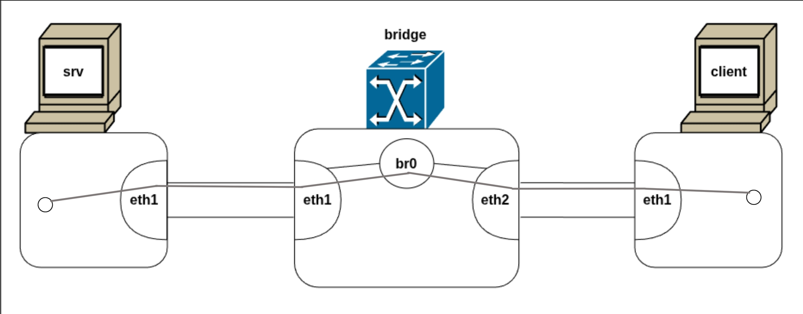
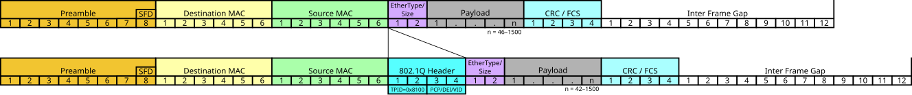
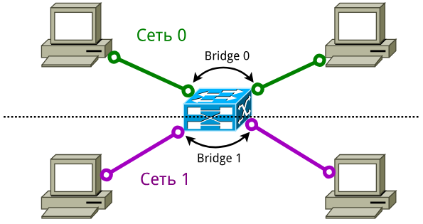
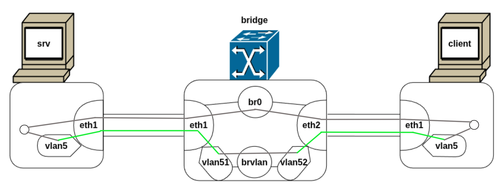
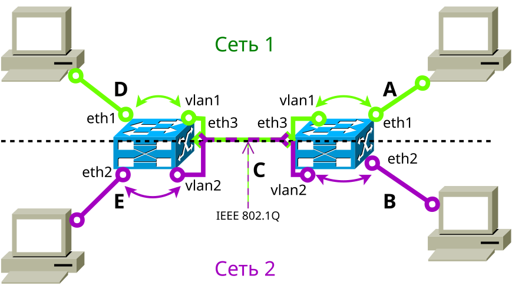
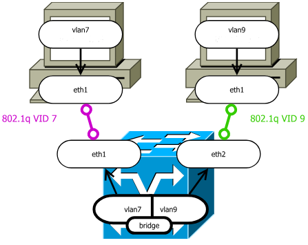

# Среды передачи данных из нескольких носителей

Мы всё ближе подходим к задаче объединения всех абонентов в единый интернет. Однако для начала рассмотрим более простую задачу.

Пусть имеется несколько сред передачи данных с одним и тем же видом носителя. Физически это отдельные взаимодействующие множества абонентов. Задача будет следующая: обеспечить на интерфейсном уровне единую среду, работающую поверх носителя, в которой физически разные сети воспринимаются устройcтвами в виде единой локальной сети.

Логичное продолжение — объединение множества сред на _разных_ носителях. Но… на поверку это оказывается задачей совершенно другого уровня: если интерфейсные протоколы значимо отличаются, нет смысла изобретать преобразователь любого формата фреймов в любой, который вдобавок пытается сохранить уникальность идентификаторов. Гораздо логичнее поднять решение вопрос на уровень выше — туда, где решается задача уникальной идентификации всех абонентов неоднородной сети. Об этом бы поговорим в следующей главе.

# Коммутация фреймов

Перейдём к решению. Обычно настройка маршрутизации пакетов (а именно она требуется для объединения нескольких сред в единую сеть) ложится на сетевой уровень. При получении нового пакета промежуточный узел сети, _маршрутизатор_ , декапсулирует его до сетевого уровня, проверяет IP-адрес получателя, после чего инкапсулирует всё обратно и перенаправляет дальше по сети в сторону целевого абонента.
**TODO** Не надо ссылаться на то, что мы ещё не проходили. Зачем вообще этот абзац?

Цель данной главы — показать, каким образом задача объединения нескольких сред может быть решена непосредственно на интерфейсном уровне, и какие важные ограничения могут при этом возникнуть. Перенаправление пакета между абонентами сети называется _маршрутизацией_ как в общем случае, независимо от уровня протокола, так и конкретно на сетевом уровне, который мы пока не рассматриваем. Поэтому перенаправление пакетов интерфейснного уровня — фреймов — мы назовём _коммутацией_, а устройства, которые решают такую задачу — _коммутаторами_.

Для настройки коммутации пакетов необходимо использовать специальные устройства  — _хаб_ и _мост_. Это могут быть как специализированные устройства, предназначенные исключительно для коммутации, так и многофункциональные абоненты сети, вплоть до компьютеров общего назначения под управлением Linux. Более правильно будет сказать, что коммутатор — это _роль_, которую данный абонент сети играет.

## Хаб и сетевой мост

[Хаб](https://ru.wikipedia.org/wiki/%D0%A1%D0%B5%D1%82%D0%B5%D0%B2%D0%BE%D0%B9_%D0%BA%D0%BE%D0%BD%D1%86%D0%B5%D0%BD%D1%82%D1%80%D0%B0%D1%82%D0%BE%D1%80), он же _сетевой концентратор_ — это устройство, которое, получив пакет на один интерфейс, ретранслирует его во все остальные.

Для настройки хаба на Linux-машине необходимо всего лишь подключить постоянный _неразборчивый режим_ и пересылать все приходящие данные на все порты кроме, быть может, порта-источника. Такой режим работы хаба идентичен работе общей шины между устройствами. И, как и общая шина, хаб приносит достаточное количество трудностей передачи: именно для него верно правило «50% загруженности по времени — неработающая сеть».

Более универсальным решением является [сетевой мост](https://ru.wikipedia.org/wiki/%D0%A1%D0%B5%D1%82%D0%B5%D0%B2%D0%BE%D0%B9_%D0%BC%D0%BE%D1%81%D1%82). Он также поддерживает неразборчивый режим работы, однако не строит работу только на нем.

Сетевой мост поддерживает _таблицу абонентов_. Это динамически обновляемая таблица соответствия между MAC-адресами и сетевыми интерфейсами, за которыми находятся абоненты с этими MAC-адресами. В случае **не** Ethernet таблица может описывать соответствия других идентификаторов и интерфейсов, но схема работы останется идентичной.

Если мост получает широковещательный фрейм, или фрейм, предназначенный неизвестному получателю, он вынужден работать как хаб — ретранслировать фрейм во все интерфейсы. Однако каждая такая ретрансляция запоминает, за каким интерфейсом находился _отправитель_ и заполняет (или обновляет) строчку в таблице абонентов. Пока абонент не удалился из таблицы, ретрансляция пакета ему _как получателю_ будет идти только по одному интерфейсу. 

При включении моста, когда таблица абонентов ещё не заполнена данными, первые фреймы будут рассылаться широковещательно. Потенциально эту особенность работы можно использовать при сетевой атаке.

## Контроль работы коммутаторов

При работе множества коммутаторов в одной локальной сети могут возникать различные проблемы передачи.

Самая простая из них — зацикливание пакетов между мостами. Для её решения разработан специальный протокол [`STP`](https://ru.wikipedia.org/wiki/STP) - `Spanning Tree Protocol`. Технически он отсекает доступ к некоторым интерфейсам у мостов, оставляя только полносвязное дерево абонентов.

Для предотвращения сетевых атак на таблицы абонентов разработаны различные antispoof-алгоритмы, позволяющие вычислять и блокировать источники атаки, закрывая им доступ к сети. Например, такую защиту обеспечивает [`firewall L2`](https://wiki.nftables.org/wiki-nftables/index.php/Bridge_filtering) в высокоуровневой утилите [`nftables`](https://wiki.nftables.org/). На интерфейсном уровне устанавливается специальный фильтр фреймов, основанный на MAC-адресации. К сожалению, из-за возможности смены MAC-адресов у большинства устройств данный способ не обеспечивает полной защиты от атак.

## Создание моста

На виртуальных машинах настроим взаимодействие двух абонентов через мост. Для этого создадим три устройства со следующими соединениями:

```console
srv:
        eth1: net1
client:
        eth1: net2
bridge:
        eth1: net1
        eth2: net2
```

Запустим наши машины. После запуска «поднимем» сетевые интерфейсы на машинах srv и client. 

`srv`
```console
[root@srv ~]# ip link set eth1 up  
[root@srv ~]#
```

`client`
```console
[root@client ~]# ip link set eth1 up  
[root@client ~]#  
```

Проверим связность сети между нашими абонентами. Для этого необходимо организовать между ними передачу трафика. В прошлой главе мы говорили о возможностях `socat` для передачи данных не выше интерфейсного уровня. Однако данный способ далеко не самый удобный. В будущем вне зависимости от уровня, на котором мы работаем, мы будем использовать более высокоуровневые способы определения связности.

Наши виртуальные машины поддерживают работу протокола IPv6. Благодаря этому при активации сетевых интерфейсов устройство автоматически запускает цикл настройки IPv6-адреса на базе MAC-адреса. Сам механизм настройки мы обсудим в будущих главах, сейчас достаточно знать, что после включения сетевого интерфейса на нём автоматически генерируется IPv6-адрес, по которому можно проверять связность устройства.

`srv`
```console
[root@srv ~]# ip addr show eth1
3: eth1: <BROADCAST,MULTICAST,UP,LOWER_UP> mtu 1500 qdisc fq_codel state UP group default qlen 1000  
   link/ether 08:00:27:05:4a:9e brd ff:ff:ff:ff:ff:ff
   altname enp0s8
   altname enx080027054a9e
   inet6 fe80::a00:27ff:fe05:4a9e/64 scope link proto kernel_ll
      valid_lft forever preferred_lft forever

[root@srv ~]# ip addr show eth1 | grep inet6  
   inet6 fe80::a00:27ff:fe05:4a9e/64 scope link proto kernel_ll
[root@srv ~]#
```

`client`
```console
[root@client ~]# ip addr show eth1 | grep inet6  
   inet6 fe80::a00:27ff:fea0:ff92/64 scope link proto kernel_ll
[root@client ~]#
```

Для проверки связности будем использовать утилиту `traceroute`. Чтобы не отправлять избыточное количество пакетов (что для проверки связности абонентов не требуется), установим специальные флаги:
 + `-q2` для отправки пакетов парами по значению TTL;
 + `-N1` для отключения параллельной отправки пакетов.
**TODO** Зачем `-q2`, а не `-q1`? И почему нет `-m1`? Без `-m1` мы можем получить ложноположительное срабатывание — доступность по маршруту вместо коммутации (правда, не на fe80, но всё же)

Ещё одна особенность при работе с IPv6 — другой формат отслеживания адресов для маршрутизации. Сейчас это означает необходимость _явного_ указания, через какой интерфейс необходимо вести передачу.

`srv`
```console
[root@srv ~]# traceroute -q2 -N1 fe80::a00:27ff:fea0:ff92%eth1
traceroute to fe80::a00:27ff:fea0:ff92%eth1 (fe80::a00:27ff:fea0:ff92%eth1), 30 hops max, 80 byte packe  
ts  
1  srv (fe80::a00:27ff:fe05:4a9e%eth1)  3104.244 ms !H  3064.288 ms !H
[root@srv ~]#
```

Логично было ожидать, что связности нет: метка `!H` ставится, когда абонент не может понять, кому предназначен пакет — в нашем случае это означает, что устройства находятся в разных сетях. Теперь с помощью моста объединим их в единую сеть. Для специальных команд, связанных с работой моста, необходимо использовать ключевое слово `bridge`.



Для начала необходимо создать логический интерфейс типа `bridge`. После создания он отобразится со всеми интерфейсами:

`bridge`
```console
[root@bridge ~]# ip link add dev br0 type bridge  
[root@bridge ~]# ip link show br0
6: br0: <BROADCAST,MULTICAST> mtu 1500 qdisc noop state DOWN mode DEFAULT group default qlen 1000  
   link/ether da:12:01:0e:cb:3c brd ff:ff:ff:ff:ff:ff
   inet6 fe80::a00:27ff:fe0e:cb3c/64 scope link proto kernel_ll
      valid_lft forever preferred_lft forever
[root@bridge ~]# 
```

Теперь включим все интерфейсы (два сетевых и созданный мост), и установим для eth1 и eth2 мастер-интерфейс моста:

`bridge`
```console
[root@bridge ~]# ip link set eth1 up  
[root@bridge ~]# ip link set eth2 up  
[root@bridge ~]# ip link set br0 up  
[root@bridge ~]# ip link set eth1 master br0  
[root@bridge ~]# ip link set eth2 master br0  
```

Заметим, что никаких настроек относительно маршрутизации пакетов на bridge не описано. «Под капотом» виртуального интерфейса типа `bridge` работает протокол [`STP`](https://ru.wikipedia.org/wiki/STP), который призван обеспечить связность абонентов, так что правила пересылки фреймов из интерфейса в интерфейс сообразно STP появляются по умолчанию:

`bridge`
```console
[root@bridge ~]# bridge link  
3: eth1: <BROADCAST,MULTICAST,UP,LOWER_UP> mtu 1500 master br0 state forwarding priority 32 cost 5
4: eth2: <BROADCAST,MULTICAST,UP,LOWER_UP> mtu 1500 master br0 state forwarding priority 32 cost 5
```

Теперь попробуем передать данные между сервером и клиентом. За время настройки мост уже заполнил часть динамической таблицы известными ему данными, но в них пока нет информации об абонентах.

`bridge`
```console
[root@bridge ~]# bridge fdb  
08:00:27:6f:93:4f dev eth1 vlan 1 master br0 permanent  
08:00:27:6f:93:4f dev eth1 master br0 permanent  
01:00:5e:00:00:01 dev eth1 self permanent  
08:00:27:85:f5:da dev eth2 vlan 1 master br0 permanent  
08:00:27:85:f5:da dev eth2 master br0 permanent  
01:00:5e:00:00:01 dev eth2 self permanent  
01:00:5e:00:00:6a dev br0 self permanent  
01:00:5e:00:00:01 dev br0 self permanent  
```

Перед отправкой данных с сервера включим отслеживание таблицы моста (команда `bridge monitor`):

`bridge`
```console
[root@bridge ~]# bridge monitor  

```

Проверим связность сети через `traceroute`:

`srv`
```console
[root@srv ~]# traceroute -q2 -N1 fe80::a00:27ff:fea0:ff92%eth1  
traceroute to fe80::a00:27ff:fea0:ff92%eth1 (fe80::a00:27ff:fea0:ff92%eth1), 30 hops max, 80 byte packe  
ts  
1  fe80::a00:27ff:fea0:ff92%eth1 (fe80::a00:27ff:fea0:ff92%eth1)  3.627 ms  1.101 ms
[root@srv ~]#
```

Связность между абонентами появилась (нет метки в логах данных, есть время передачи фрейма). При этом мост внёс в таблицу новые MAC-адреса и соответствующие им сетевые интерфейсы. По истечении тайм-аута в отсутствие передачи данных мост удаляет записи из таблицы по причине их (возможной) неактуальности.

`bridge`
```console
[root@bridge ~]# bridge monitor  
08:00:27:05:4a:9e dev eth1 master br0
08:00:27:a0:ff:92 dev eth2 master br0
<...* minutes later...>
Deleted 08:00:27:a0:ff:92 dev eth2 master br0 stale  
Deleted 08:00:27:05:4a:9e dev eth1 master br0 stale

```

Убедиться в том, что пакеты, действительно проходят через мост, можно путём мониторинга интерфейса br0:

`bridge`
```console
[root@bridge ~]# tcpdump -XXei br0 udp  
tcpdump: verbose output suppressed, use -v[v]... for full protocol decode  
listening on br0, link-type EN10MB (Ethernet), snapshot length 262144 bytes  

```

`srv`
```console
[root@srv ~]# traceroute -q2 -N1 fe80::a00:27ff:fea0:ff92%eth1  
traceroute to fe80::a00:27ff:fea0:ff92%eth1 (fe80::a00:27ff:fea0:ff92%eth1), 30 hops max, 80 byte packe  
ts  
1  fe80::a00:27ff:fea0:ff92%eth1 (fe80::a00:27ff:fea0:ff92%eth1)  1.382 ms  0.895 ms
[root@srv ~]#
```

`bridge`
```console
[root@bridge ~]# tcpdump -XXei br0 udp  
tcpdump: verbose output suppressed, use -v[v]... for full protocol decode  
listening on br0, link-type EN10MB (Ethernet), snapshot length 262144 bytes  
14:30:10.104426 08:00:27:05:4a:9e (oui Unknown) > 08:00:27:a0:ff:92 (oui Unknown), ethertype IPv6 (0x86  
dd), length 94: fe80::a00:27ff:fe05:4a9e.55682 > fe80::a00:27ff:fea0:ff92.traceroute: UDP, length 32  
       0x0000:  0800 27a0 ff92 0800 2705 4a9e 86dd 6001  ..'.....'.J...`.
       0x0010:  3deb 0028 1101 fe80 0000 0000 0000 0a00  =..(............
       0x0020:  27ff fe05 4a9e fe80 0000 0000 0000 0a00  '...J...........
       0x0030:  27ff fea0 ff92 d982 829a 0028 06a4 4041  '..........(..@A
       0x0040:  4243 4445 4647 4849 4a4b 4c4d 4e4f 5051  BCDEFGHIJKLMNOPQ
       0x0050:  5253 5455 5657 5859 5a5b 5c5d 5e5f       RSTUVWXYZ[\]^_
14:30:10.112607 08:00:27:05:4a:9e (oui Unknown) > 08:00:27:a0:ff:92 (oui Unknown), ethertype IPv6 (0x86  
dd), length 94: fe80::a00:27ff:fe05:4a9e.54984 > fe80::a00:27ff:fea0:ff92.33435: UDP, length 32  
       0x0000:  0800 27a0 ff92 0800 2705 4a9e 86dd 600e  ..'.....'.J...`.
       0x0010:  e930 0028 1101 fe80 0000 0000 0000 0a00  .0.(............
       0x0020:  27ff fe05 4a9e fe80 0000 0000 0000 0a00  '...J...........
       0x0030:  27ff fea0 ff92 d6c8 829b 0028 095d 4041  '..........(.]@A
       0x0040:  4243 4445 4647 4849 4a4b 4c4d 4e4f 5051  BCDEFGHIJKLMNOPQ
       0x0050:  5253 5455 5657 5859 5a5b 5c5d 5e5f       RSTUVWXYZ[\]^_
^C  
2 packets captured  
2 packets received by filter  
0 packets dropped by kernel  
[root@bridge ~]#
```

В более сложных топологиях можно проверить и другие свойства STP:
- если закоммутировать три сетевых интерфейса, будет видно, что целевые (не широковещательные) фреймы между двумя абонентами не попадают в третий интерфейс;
- если соединить три (или больше) коммутатора по принципу «каждый с каждым», в течение некоторого времени коммутаторы будут обмениваться служебными фреймами, выясняя, как превратить циклический граф в дерево, а когда превратят, связность появится.

# VLAN - Virtual Local Area Network


При обсуждении VLAN стоит различать два определения этого термина. «Инженерный» термин VLAN означает группу интерфейсов, объединённых в единую среду передачи данных, которая изолирована от других групп интерфейсов. Реализовать такое поведение коммутаторов можно по-разному. Например, создание таких групп может быть просто выведено в интерфейс управления коммутатором. 

Другой вариант реализации — снабдить каждый фрейм дополнительным полем, в котором явно указывать такую изолированную группу, и принимать решение о коммутации на основании этого поля. Такую задачу решает семейство протоколов [IEEE_802.1Q](https://en.wikipedia.org/wiki/IEEE_802.1Q). Использование в сети таких модифицированных 802.1Q-фреймов — это другое определение термина VLAN,  «теоретическое».



На текущий момент технологию IEEE_802.1Q поддерживают все сетевые карты. Более того, модификации протокола способны обработать фреймы с двумя тегами подряд и другими надстройками VLAN.

Большая часть текстов про VLAN — это методички по настройке разнообразных топологий на разнообразном «железе», так что в них используется «инженерное» понимание термина. Как следствие, возникают понятия «тегированного» VLAN-а (т. е. канала с поддержкой протокола 802.1Q и определённым VID в теге фрейма) и «нетегированного» VLAN-а (канала «простыми» фреймами без тега 802.1Q, объединение и разделение которых диктуется исключительно ПО на коммутаторе). Мы будем придерживаться «теоретической» терминологии: фраза «фрейм из VLAN-а такого-то» означает 802.1Q-фрейм с определённым VID, а просто «фрейм» — просто фрейм.

На практике использование IEEE_802.1Q-протокола удобно при создании независимых сетей из нескольких сред передач данных каждая, работающих на одном физическом оборудовании. Пример организации двух VLAN на одном физическом мосту продемонстрирован на картинке:



## Добавление VLAN

Вернёмся к топологии с сетевым мостом и добавим в неё поддержку 802.1Q-фреймов через другой мост на bridge.



Для начала на каждом из абонентов необходимо настроить виртуальные интерфейсы, через которые будут проходить фреймы с соответствующим тегом. При отправке данных фреймы, проходящие через VLAN-интерфейс, будут получать заголовок и выходить в канал уже с тегом. При получении данных все фреймы с соответствующим VLAN-тегом будут направляться в эти интерфейсы, где с них будет сниматься тег.

`srv`
```console
[root@srv ~]# ip link add link eth1 name vlan5 type vlan id 5  
[root@srv ~]# ip link set vlan5 up  
[root@srv ~]#
```

`client`
```console
[root@client ~]# ip link add link eth1 name vlan5 type vlan id 5  
[root@client ~]# ip link set vlan5 up  
[root@client ~]#
```

На bridge также сделаем VLAN-интерфейсы, чтобы отдельно проводить трафик VLAN по устройству. Между этими интерфейсами внутри bridge фреймы передаются без тега — он снимается при выходе с одного интерфейса и вновь надевается при входе в другой. Общий трафик в устройстве не будет отличим от трафика с тегами. Для их разделения и делается отдельный мост, хотя формально новые интерфейсы можно было привязать и к старому.

`bridge`
```console
[root@bridge ~]# ip link add link eth1 name vlan51 type vlan id 5  
[root@bridge ~]# ip link add link eth2 name vlan52 type vlan id 5  
[root@bridge ~]#   
[root@bridge ~]# ip link add dev brvlan type bridge  
[root@bridge ~]# ip link set vlan51 master brvlan  
[root@bridge ~]# ip link set vlan52 master brvlan  
[root@bridge ~]#
[root@bridge ~]# ip link set vlan51 up  
[root@bridge ~]# ip link set vlan52 up  
[root@bridge ~]# ip link set brvlan up  
[root@bridge ~]#
```

Теперь запустим на bridge мониторинг трафика на eth1. Через него точно пройдут все фреймы, поскольку он является основным для vlan51, который будет вытягивать 802.1Q-фреймы из него. Отслеживание трафика здесь позволит увидеть оба вида трафика.

`bridge`
```console
[root@bridge ~]# tcpdump -XXei eth1 udp  
tcpdump: verbose output suppressed, use -v[v]... for full protocol decode  
listening on eth1, link-type EN10MB (Ethernet), snapshot length 262144 bytes

```

Запустим трафик между srv и client. Для начала сделаем это по уже привычному маршруту — через eth1. Поскольку трафик изначально не тегируется, он пройдёт по верхнему пути на картинке.

`srv`
```console
[root@srv ~]# traceroute -q2 -N1 fe80::a00:27ff:fea0:ff92%eth1  
traceroute to fe80::a00:27ff:fea0:ff92%eth1 (fe80::a00:27ff:fea0:ff92%eth1), 30 hops max, 80 byte packe  
ts  
1  fe80::a00:27ff:fea0:ff92%eth1 (fe80::a00:27ff:fea0:ff92%eth1)  2.322 ms  1.609 ms
[root@srv ~]#
```

bridge обнаружит этот трафик, в описании данных явно указано, что они не имеют тега.

`bridge`
```console
[root@bridge ~]# tcpdump -XXei eth1 udp  
tcpdump: verbose output suppressed, use -v[v]... for full protocol decode  
listening on eth1, link-type EN10MB (Ethernet), snapshot length 262144 bytes  
14:38:14.923344 08:00:27:05:4a:9e (oui Unknown) > 08:00:27:a0:ff:92 (oui Unknown), ethertype IPv6 (0x86  
dd), length 94: fe80::a00:27ff:fe05:4a9e.57532 > fe80::a00:27ff:fea0:ff92.traceroute: UDP, length 32  
       0x0000:  0800 27a0 ff92 0800 2705 4a9e 86dd 600d  ..'.....'.J...`.
       0x0010:  7255 0028 1101 fe80 0000 0000 0000 0a00  rU.(............
       0x0020:  27ff fe05 4a9e fe80 0000 0000 0000 0a00  '...J...........
       0x0030:  27ff fea0 ff92 e0bc 829a 0028 ff69 4041  '..........(.i@A
       0x0040:  4243 4445 4647 4849 4a4b 4c4d 4e4f 5051  BCDEFGHIJKLMNOPQ
       0x0050:  5253 5455 5657 5859 5a5b 5c5d 5e5f       RSTUVWXYZ[\]^_
14:38:14.934286 08:00:27:05:4a:9e (oui Unknown) > 08:00:27:a0:ff:92 (oui Unknown), ethertype IPv6 (0x86  
dd), length 94: fe80::a00:27ff:fe05:4a9e.57401 > fe80::a00:27ff:fea0:ff92.33435: UDP, length 32  
       0x0000:  0800 27a0 ff92 0800 2705 4a9e 86dd 600c  ..'.....'.J...`.
       0x0010:  3259 0028 1101 fe80 0000 0000 0000 0a00  2Y.(............
       0x0020:  27ff fe05 4a9e fe80 0000 0000 0000 0a00  '...J...........
       0x0030:  27ff fea0 ff92 e039 829b 0028 ffeb 4041  '......9...(..@A
       0x0040:  4243 4445 4647 4849 4a4b 4c4d 4e4f 5051  BCDEFGHIJKLMNOPQ
       0x0050:  5253 5455 5657 5859 5a5b 5c5d 5e5f       RSTUVWXYZ[\]^_
```

Теперь запустим трафик через VLAN-интерфейс. Он пройдёт по нижнему пути на картинке.

`srv`
```console
[root@srv ~]# traceroute -q2 -N1 fe80::a00:27ff:fea0:ff92%vlan5  
traceroute to fe80::a00:27ff:fea0:ff92%vlan5 (fe80::a00:27ff:fea0:ff92%vlan5), 30 hops max, 80 byte pac  
kets  
1  fe80::a00:27ff:fea0:ff92%vlan5 (fe80::a00:27ff:fea0:ff92%vlan5)  5.853 ms  13.855 ms
[root@srv ~]#
```

Заметим, что время передачи кратно выросло. Это связано с дополнительными затратами на снятие и надевание тега. В мониторе bridge явно будет описано наличие метки в передаваемых данных.

`bridge`
```console
<…>

14:38:40.187157 08:00:27:05:4a:9e (oui Unknown) > 08:00:27:a0:ff:92 (oui Unknown), ethertype 802.1Q (0x  
8100), length 98: vlan 5, p 0, ethertype IPv6 (0x86dd), fe80::a00:27ff:fe05:4a9e.44815 > fe80::a00:27ff  
:fea0:ff92.traceroute: UDP, length 32  
       0x0000:  0800 27a0 ff92 0800 2705 4a9e 8100 0005  ..'.....'.J.....
       0x0010:  86dd 600f ef02 0028 1101 fe80 0000 0000  ..`....(........
       0x0020:  0000 0a00 27ff fe05 4a9e fe80 0000 0000  ....'...J.......
       0x0030:  0000 0a00 27ff fea0 ff92 af0f 829a 0028  ....'..........(
       0x0040:  3117 4041 4243 4445 4647 4849 4a4b 4c4d  1.@ABCDEFGHIJKLM
       0x0050:  4e4f 5051 5253 5455 5657 5859 5a5b 5c5d  NOPQRSTUVWXYZ[\]
       0x0060:  5e5f                                     ^_
14:38:40.200765 08:00:27:05:4a:9e (oui Unknown) > 08:00:27:a0:ff:92 (oui Unknown), ethertype 802.1Q (0x  
8100), length 98: vlan 5, p 0, ethertype IPv6 (0x86dd), fe80::a00:27ff:fe05:4a9e.55741 > fe80::a00:27ff  
:fea0:ff92.33435: UDP, length 32  
       0x0000:  0800 27a0 ff92 0800 2705 4a9e 8100 0005  ..'.....'.J.....
       0x0010:  86dd 6006 a5aa 0028 1101 fe80 0000 0000  ..`....(........
       0x0020:  0000 0a00 27ff fe05 4a9e fe80 0000 0000  ....'...J.......
       0x0030:  0000 0a00 27ff fea0 ff92 d9bd 829b 0028  ....'..........(
       0x0040:  0668 4041 4243 4445 4647 4849 4a4b 4c4d  .h@ABCDEFGHIJKLM
       0x0050:  4e4f 5051 5253 5455 5657 5859 5a5b 5c5d  NOPQRSTUVWXYZ[\]
       0x0060:  5e5f                                     ^_
^C  
4 packets captured  
4 packets received by filter  
0 packets dropped by kernel  
[root@bridge ~]#
```

## Работа с VLAN

Теперь реализуем более сложную сетевую структуру с использование VLAN:



В сети будет настроено два VLAN-a. Между мостами, соединяющими абонентов из разных VLAN будет передача фреймов с тегами для отделения абонентов разных VLAN друг от друга. Получится, что физически устройства из разных VLAN достижимы, однако на программном уровне доступа друг к другу у них нет. Канал (и интерфейс, к нему присоединённый), по которому передаются фреймы разных VLAN-ов, на «инженерном» языке имеет отдельное название —  «транк» (trunk), т. к. под инженерное определение VLAN не подходит.

Создадим все устройства для топологии:
```console
hostA:
        eth1: netA
hostB:
        eth1: netB
hostD:
        eth1: netD
hostE:
        eth1: netE
bright:
        eth1: netA
        eth2: netB
        eth3: netC
bleft:
        eth1: netD
        eth2: netE
        eth3: netC
```

Включим все сетевые интерфейсы абонентов, таким образом получив на них IPv6-адреса. Поскольку все они находятся в разных сетях, никакой связи сейчас, естественно, между ними не будет.

`hostA`
```console
[root@hostA ~]# ip link set eth1 up  
[root@hostA ~]# ip a show eth1  
3: eth1: <BROADCAST,MULTICAST,UP,LOWER_UP> mtu 1500 qdisc fq_codel state UP group default qlen 1000  
   link/ether 08:00:27:2c:45:4f brd ff:ff:ff:ff:ff:ff
   altname enp0s8
   altname enx0800272c454f
   inet6 fe80::a00:27ff:fe2c:454f/64 scope link proto kernel_ll
      valid_lft forever preferred_lft forever
[root@hostA ~]#
```

`hostB`
```console
[root@hostB ~]# ip link set eth1 up  
[root@hostB ~]# ip a show eth1  
3: eth1: <BROADCAST,MULTICAST,UP,LOWER_UP> mtu 1500 qdisc fq_codel state UP group default qlen 1000  
   link/ether 08:00:27:25:da:18 brd ff:ff:ff:ff:ff:ff
   altname enp0s8
   altname enx08002725da18
   inet6 fe80::a00:27ff:fe25:da18/64 scope link proto kernel_ll
      valid_lft forever preferred_lft forever
[root@hostB ~]#
```

`hostD`
```console
[root@hostD ~]# ip link set eth1 up  
[root@hostD ~]# ip a show eth1  
3: eth1: <BROADCAST,MULTICAST,UP,LOWER_UP> mtu 1500 qdisc fq_codel state UP group default qlen 1000  
   link/ether 08:00:27:04:8c:e1 brd ff:ff:ff:ff:ff:ff
   altname enp0s8
   altname enx080027048ce1
   inet6 fe80::a00:27ff:fe04:8ce1/64 scope link proto kernel_ll
      valid_lft forever preferred_lft forever
[root@hostD ~]#
```

`hostE`
```console
[root@hostE ~]# ip link set eth1 up  
[root@hostE ~]# ip a show eth1  
3: eth1: <BROADCAST,MULTICAST,UP,LOWER_UP> mtu 1500 qdisc fq_codel state UP group default qlen 1000  
   link/ether 08:00:27:f4:40:8a brd ff:ff:ff:ff:ff:ff
   altname enp0s8
   altname enx080027f4408a
   inet6 fe80::a00:27ff:fef4:408a/64 scope link proto kernel_ll
      valid_lft forever preferred_lft forever
[root@hostE ~]#
```

Для мостов первоначально разберёмся с центральным каналом передачи. На нём (для _обеих_ машин) надо настроить виртуальный интерфейс, который из eth3 будет вытягивать фреймы с соответствующим тегом:

`bleft`
```console
[root@bleft ~]# ip link add link eth3 name vlan5 type vlan id 5  
[root@bleft ~]ip link add link eth3 name vlan7 type vlan id 7  
```

`bright`
```console
[root@bright ~]# ip link add link eth3 name vlan5 type vlan id 5  
[root@bright ~]ip link add link eth3 name vlan7 type vlan id 7  
```

В настройках интерфейсов можно отдельно обратиться с информационным запросом к VLAN-интерфейсам:

`bleft`
```console
[root@bleft ~]# ip -d link show vlan5  
6: vlan5@eth3: <BROADCAST,MULTICAST,M-DOWN> mtu 1500 qdisc noop state DOWN mode DEFAULT group default q  
len 1000  
   link/ether 08:00:27:e2:cb:22 brd ff:ff:ff:ff:ff:ff promiscuity 0 allmulti 0 minmtu 0 maxmtu 65535
   vlan protocol 802.1Q id 5 <REORDER_HDR> addrgenmode eui64 numtxqueues 1 numrxqueues 1 gso_max_size
65536 gso_max_segs 65535 tso_max_size 65536 tso_max_segs 65535 gro_max_size 65536 gso_ipv4_max_size 655  
36 gro_ipv4_max_size 65536
[root@bleft ~]#
```

Теперь необходимо сложить соответствующие интерфейсы в единый мост:
 + vlan5 соединить с netA и netD;
 + vlan7 соединить с netB и netE.

Делаться это будет аналогично прошлому примеру — создаётся виртуальный интерфейс типа bridge и к нему подключаются соответствующие интерфейсы:

`bleft`
```console
[root@bleft ~]# ip link add dev br5 type bridge  
[root@bleft ~]# ip link set vlan5 master br5  
[root@bleft ~]# ip link set eth1 master br5  
[root@bleft ~]# ip link add dev br7 type bridge  
[root@bleft ~]# ip link set vlan7 master br7  
[root@bleft ~]# ip link set eth2 master br7  
[root@bleft ~]#
```

`bright`
```console
[root@bright ~]# ip link add dev br5 type bridge  
[root@bright ~]# ip link set vlan5 master br5  
[root@bright ~]# ip link set eth1 master br5  
[root@bright ~]# ip link add dev br7 type bridge  
[root@bright ~]# ip link set vlan7 master br7  
[root@bright ~]# ip link set eth2 master br7  
[root@bright ~]#
```

Теперь необходимо поднять все интерфейсы. Можно перебрать их руками, а можно воспользоваться циклом языка склейки, встроенном в интерпретатор shell:

`bright`
```console
[root@bright ~]# ip a | grep UP | wc  
     1      13      92  # Поднят только LoopBack (по умолчанию)
[root@bright ~]# ls /sys/class/net  # Названия всех интерфейсов в системе
br5  br7  eth0  eth1  eth2  eth3  lo  vlan5  vlan7
[root@bright ~]# for I in `ls /sys/class/net`; do ip link set $I up; done  
[root@bright ~]# ip a | grep UP | wc  
     9     125     947  # Все интерфейсы подняты (даже потенциально лишние бы поднялись)
[root@bright ~]#
```

`bleft`
```console
[root@bleft ~]# for I in `ls /sys/class/net`; do ip link set $I up; done  
[root@bleft ~]#
```

Заметим, что, вообще говоря, на мостах после поднятия интерфейсов создалось по 6 IPv6-адресов, по одному на каждом интерфейсе.

`bright`
```console
[root@bright ~]# ip a  
1: lo: <LOOPBACK,UP,LOWER_UP> mtu 65536 qdisc noqueue state UNKNOWN group default qlen 1000  
   link/loopback 00:00:00:00:00:00 brd 00:00:00:00:00:00
   inet 127.0.0.1/8 scope host lo
      valid_lft forever preferred_lft forever
   inet6 ::1/128 scope host noprefixroute
      valid_lft forever preferred_lft forever
2: eth0: <BROADCAST,MULTICAST,UP,LOWER_UP> mtu 1500 qdisc fq_codel state UNKNOWN group default qlen 100  
0  
   link/ether 08:00:27:a3:a7:1a brd ff:ff:ff:ff:ff:ff
   altname enp0s3
   altname enx080027a3a71a
   inet6 fd17:625c:f037:2:a00:27ff:fea3:a71a/64 scope global dynamic mngtmpaddr proto kernel_ra
      valid_lft 86388sec preferred_lft 14388sec
   inet6 fe80::a00:27ff:fea3:a71a/64 scope link proto kernel_ll
      valid_lft forever preferred_lft forever
3: eth1: <BROADCAST,MULTICAST,UP,LOWER_UP> mtu 1500 qdisc fq_codel master br5 state UP group default ql  
en 1000  
   link/ether 08:00:27:53:24:b8 brd ff:ff:ff:ff:ff:ff
   altname enp0s8
   altname enx0800275324b8
   inet6 fe80::a00:27ff:fe53:24b8/64 scope link proto kernel_ll
      valid_lft forever preferred_lft forever
4: eth2: <BROADCAST,MULTICAST,UP,LOWER_UP> mtu 1500 qdisc fq_codel master br7 state UP group default ql  
en 1000  
   link/ether 08:00:27:92:ea:8d brd ff:ff:ff:ff:ff:ff
   altname enp0s9
   altname enx08002792ea8d
   inet6 fe80::a00:27ff:fe92:ea8d/64 scope link proto kernel_ll
      valid_lft forever preferred_lft forever
5: eth3: <BROADCAST,MULTICAST,UP,LOWER_UP> mtu 1500 qdisc fq_codel state UP group default qlen 1000  
   link/ether 08:00:27:b9:eb:35 brd ff:ff:ff:ff:ff:ff
   altname enp0s10
   altname enx080027b9eb35
   inet6 fe80::a00:27ff:feb9:eb35/64 scope link proto kernel_ll
      valid_lft forever preferred_lft forever
6: vlan5@eth3: <BROADCAST,MULTICAST,UP,LOWER_UP> mtu 1500 qdisc noqueue master br5 state UP group defau  
lt qlen 1000  
   link/ether 08:00:27:b9:eb:35 brd ff:ff:ff:ff:ff:ff
   inet6 fe80::a00:27ff:feb9:eb35/64 scope link proto kernel_ll
      valid_lft forever preferred_lft forever
7: vlan7@eth3: <BROADCAST,MULTICAST,UP,LOWER_UP> mtu 1500 qdisc noqueue master br7 state UP group defau  
lt qlen 1000  
   link/ether 08:00:27:b9:eb:35 brd ff:ff:ff:ff:ff:ff
   inet6 fe80::a00:27ff:feb9:eb35/64 scope link proto kernel_ll
      valid_lft forever preferred_lft forever
8: br5: <BROADCAST,MULTICAST,UP,LOWER_UP> mtu 1500 qdisc noqueue state UP group default qlen 1000  
   link/ether 08:00:27:53:24:b8 brd ff:ff:ff:ff:ff:ff
   inet6 fe80::a00:27ff:fe53:24b8/64 scope link proto kernel_ll
      valid_lft forever preferred_lft forever
9: br7: <BROADCAST,MULTICAST,UP,LOWER_UP> mtu 1500 qdisc noqueue state UP group default qlen 1000  
   link/ether 08:00:27:92:ea:8d brd ff:ff:ff:ff:ff:ff
   inet6 fe80::a00:27ff:fe92:ea8d/64 scope link proto kernel_ll
      valid_lft forever preferred_lft forever
[root@bright ~]#
```

Проверим работоспобность сети: hostA должен достигать hostD, hostB должен достигать hostE и больше никто никого достигать не должен:

`hostA`
```console
[root@hostA ~]# traceroute -q2 -N1 fe80::a00:27ff:fe04:8ce1%eth1  
traceroute to fe80::a00:27ff:fe04:8ce1%eth1 (fe80::a00:27ff:fe04:8ce1%eth1), 30 hops max, 80 byte packe  
ts  
1  fe80::a00:27ff:fe04:8ce1%eth1 (fe80::a00:27ff:fe04:8ce1%eth1)  1.379 ms  0.688 ms
[root@hostA ~]# traceroute -q2 -N1 fe80::a00:27ff:fe25:da18%eth1  
traceroute to fe80::a00:27ff:fe25:da18%eth1 (fe80::a00:27ff:fe25:da18%eth1), 30 hops max, 80 byte packe  
ts  
1  hostA (fe80::a00:27ff:fe2c:454f%eth1)  3077.218 ms !H  3062.699 ms !H
[root@hostA ~]# traceroute -q2 -N1 fe80::a00:27ff:fef4:408a%eth1  
traceroute to fe80::a00:27ff:fef4:408a%eth1 (fe80::a00:27ff:fef4:408a%eth1), 30 hops max, 80 byte packe  
ts  
1  hostA (fe80::a00:27ff:fe2c:454f%eth1)  3109.389 ms !H  3070.359 ms !H
[root@hostA ~]#
```

`hostB`
```console
[root@hostB ~]# traceroute -q2 -N1 fe80::a00:27ff:fef4:408a%eth1  
traceroute to fe80::a00:27ff:fef4:408a%eth1 (fe80::a00:27ff:fef4:408a%eth1), 30 hops max, 80 byte packe  
ts  
1  fe80::a00:27ff:fef4:408a%eth1 (fe80::a00:27ff:fef4:408a%eth1)  1.663 ms  0.770 ms
[root@hostB ~]# traceroute -q2 -N1 fe80::a00:27ff:fe04:8ce1%eth1  
traceroute to fe80::a00:27ff:fe04:8ce1%eth1 (fe80::a00:27ff:fe04:8ce1%eth1), 30 hops max, 80 byte packe  
ts  
1  hostB (fe80::a00:27ff:fe25:da18%eth1)  3106.539 ms !H  3067.297 ms !H
[root@hostB ~]# traceroute -q2 -N1 fe80::a00:27ff:fe2c:454f%eth1  
traceroute to fe80::a00:27ff:fe2c:454f%eth1 (fe80::a00:27ff:fe2c:454f%eth1), 30 hops max, 80 byte packe  
ts  
1  hostB (fe80::a00:27ff:fe25:da18%eth1)  3101.267 ms !H  3070.027 ms !H
[root@hostB ~]#
```

При этом соответствующие интерфейсы на мостах отлавливают только свои и ничьи другие фреймы:

`bright`
```console
[root@bright ~]# tcpdump -XXei br5 udp  
tcpdump: verbose output suppressed, use -v[v]... for full protocol decode  
listening on br5, link-type EN10MB (Ethernet), snapshot length 262144 bytes  
10:25:34.767335 08:00:27:2c:45:4f (oui Unknown) > 08:00:27:04:8c:e1 (oui Unknown), ethertype IPv6 (0x86  
dd), length 94: fe80::a00:27ff:fe2c:454f.39517 > fe80::a00:27ff:fe04:8ce1.traceroute: UDP, length 32  
       0x0000:  0800 2704 8ce1 0800 272c 454f 86dd 6007  ..'.....',EO..`.
       0x0010:  0487 0028 1101 fe80 0000 0000 0000 0a00  ...(............
       0x0020:  27ff fe2c 454f fe80 0000 0000 0000 0a00  '..,EO..........
       0x0030:  27ff fe04 8ce1 9a5d 829a 0028 be3e 4041  '......]...(.>@A
       0x0040:  4243 4445 4647 4849 4a4b 4c4d 4e4f 5051  BCDEFGHIJKLMNOPQ
       0x0050:  5253 5455 5657 5859 5a5b 5c5d 5e5f       RSTUVWXYZ[\]^_
10:25:34.769414 08:00:27:2c:45:4f (oui Unknown) > 08:00:27:04:8c:e1 (oui Unknown), ethertype IPv6 (0x86  
dd), length 94: fe80::a00:27ff:fe2c:454f.39518 > fe80::a00:27ff:fe04:8ce1.33435: UDP, length 32  
       0x0000:  0800 2704 8ce1 0800 272c 454f 86dd 6001  ..'.....',EO..`.
       0x0010:  56cf 0028 1101 fe80 0000 0000 0000 0a00  V..(............
       0x0020:  27ff fe2c 454f fe80 0000 0000 0000 0a00  '..,EO..........
       0x0030:  27ff fe04 8ce1 9a5e 829b 0028 be3c 4041  '......^...(.<@A
       0x0040:  4243 4445 4647 4849 4a4b 4c4d 4e4f 5051  BCDEFGHIJKLMNOPQ
       0x0050:  5253 5455 5657 5859 5a5b 5c5d 5e5f       RSTUVWXYZ[\]^_
```

`bleft`
```console
[root@bleft ~]# tcpdump -XXei eth3 udp  
tcpdump: verbose output suppressed, use -v[v]... for full protocol decode  
listening on eth3, link-type EN10MB (Ethernet), snapshot length 262144 bytes  
10:25:33.288444 08:00:27:2c:45:4f (oui Unknown) > 08:00:27:04:8c:e1 (oui Unknown), ethertype 802.1Q (0x  
8100), length 98: vlan 5, p 0, ethertype IPv6 (0x86dd), fe80::a00:27ff:fe2c:454f.39517 > fe80::a00:27ff  
:fe04:8ce1.traceroute: UDP, length 32  
       0x0000:  0800 2704 8ce1 0800 272c 454f 8100 0005  ..'.....',EO....
       0x0010:  86dd 6007 0487 0028 1101 fe80 0000 0000  ..`....(........
       0x0020:  0000 0a00 27ff fe2c 454f fe80 0000 0000  ....'..,EO......
       0x0030:  0000 0a00 27ff fe04 8ce1 9a5d 829a 0028  ....'......]...(
       0x0040:  be3e 4041 4243 4445 4647 4849 4a4b 4c4d  .>@ABCDEFGHIJKLM
       0x0050:  4e4f 5051 5253 5455 5657 5859 5a5b 5c5d  NOPQRSTUVWXYZ[\]
       0x0060:  5e5f                                     ^_
10:25:33.290515 08:00:27:2c:45:4f (oui Unknown) > 08:00:27:04:8c:e1 (oui Unknown), ethertype 802.1Q (0x  
8100), length 98: vlan 5, p 0, ethertype IPv6 (0x86dd), fe80::a00:27ff:fe2c:454f.39518 > fe80::a00:27ff  
:fe04:8ce1.33435: UDP, length 32  
       0x0000:  0800 2704 8ce1 0800 272c 454f 8100 0005  ..'.....',EO....
       0x0010:  86dd 6001 56cf 0028 1101 fe80 0000 0000  ..`.V..(........
       0x0020:  0000 0a00 27ff fe2c 454f fe80 0000 0000  ....'..,EO......
       0x0030:  0000 0a00 27ff fe04 8ce1 9a5e 829b 0028  ....'......^...(
       0x0040:  be3c 4041 4243 4445 4647 4849 4a4b 4c4d  .<@ABCDEFGHIJKLM
       0x0050:  4e4f 5051 5253 5455 5657 5859 5a5b 5c5d  NOPQRSTUVWXYZ[\]
       0x0060:  5e5f                                     ^_
```

# Фильтрация тегов на уровне моста

Во всех наших примерах мы использовали интерфейс bridge исключительно для связывания интерфейсов. Сама фильтрация VLAN осуществляется при проходе пакета через соответствующий интерфейс.

Сам сетевой мост — это достаточно ёмкое по технологиям устройство. Одна только поддержка STP требует внутреннего отслеживания и обработки пакетов для поддержания корректного остовного дерева. Поэтому неудивительно, что сам bridge-интерфейс умеет отслеживать VLAN-метки. Пример такой настройки и управления 802.1Q-фреймами представлен в лабораторных работах на эту тему (на [Usamg1t.Github.io](https://usamg1t.github.io/Nets_ASVK_Labs/04_VLAN/%D0%9D%D0%B0%D1%81%D1%82%D1%80%D0%BE%D0%B9%D0%BA%D0%B0%20VLAN.html) или в [документации](https://docs.altlinux.org/ru-RU/labwork/0.1/html/nets-laboratories/VLAN.html) «Базальт СПО»).


# Домашнее задание:

+ Площадка:
    1. Базовая машина:
        + Интерфейс `eth1` подключён к сети-1
    2. Клон:
        + Интерфейс `eth1` подключён к сети-2
    3. Мост:
        + Интерфейс `eth1` подключён к сети-1
        + Интерфейс `eth2` подключён к сети-2
+ Отчёт:
    1. Мост (`report 3 bridge`)
        + Задать линк, достающий из сети-1 фреймы `802.1Q` с `VID 7`
        + Задать линк, достающий из сети-2 фреймы `802.1Q` с `VID 9`
        + Объединить оба линка бриджем
        + Поднять все интерфейсы
    2. Базовая машина (`report 3 base`)
        + Задать линк, достающий из сети-1 фреймы `802.1Q` с `VID 7`
        + Настроить `ip`-адрес этого интерфейс-линка (да, `ip` должен быть именно на `vlan7@eth1`)
        + Поднять все интерфейсы
        + Запустить `tcpdump -c 8` на этом интерфейс-линке
    3. Клон (`report 3 clone`)
        + Задать линк, достающий из сети-2 фреймы `802.1Q` с `VID 9`
        + Настроить `ip`-адрес этого интерфейс-линка (да, `ip` должен быть именно на `vlan9@eth1`)
        + Поднять все интерфейсы
        + Запустить `ping -c 8` адрес_базовой_машины (должен проходить)



+ Три отчёта (`report.03.base`, `report.03.bridge` и `report.03.clone`) именно с такими названиями переслать одним письмом в качестве приложений на [uneexlectures@cs.msu.ru](mailto:uneexlectures%40cs.msu.ru)
	+ В теме письма **должно** встречаться слово `LinuxNetwork2027`
