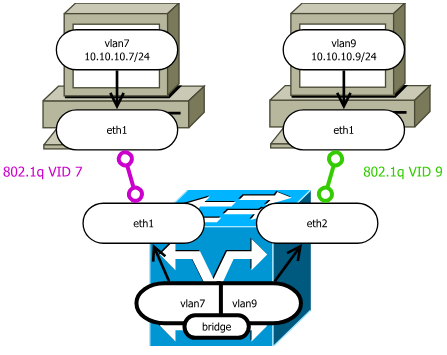

# Взгляд в будущее: проверка работоспособности сети

Для проверки работоспособности сети очевидным тестом является отправка сообщений между пользователями. В прошлой главе был продемонстрирован ресурсозатратный, но действенный способ передачи пакетов не выше интерфейсного уровня. На практике гораздо проще использовать протоколы транспортного уровня. Отслеживание и их обработка на интерфейсном уровне всё также, очевидно, будут доступны, на настройку сети на интерфейсном уровне это никак не повлияет, при этом проверка сети будет сильно упрощена. А механизмы и особенности транспортного уровня будут рассмотрены уже в следующей главе.

Для того, чтобы настроить передачу с помощью протоколов транспортного уровня (нас интересует `IP` - `Internet Protocol`), при создании виртуальных машин также необходимо задать для них общую виртуальную сеть (все примеры написаны с помощью [сценариев Георгия](https://github.com/FrBrGeorge/vbsnap)).

```console
~/papillon_rouge: vbsnap protocols-jeos-20250223a-x86_64 srv net1
~/papillon_rouge: vbsnap protocols-jeos-20250223a-x86_64 srv2 net1
```

На виртуальных машинах необходимо поднять сетевой интерфейс (по умолчанию сценария сетью занимается интерфейс `eth1`), а также задать `IP`-адрес и маску сети:

`srv`
```srv
[root@srv ~]# ip link set eth1 up  
[root@srv ~]# ip addr add dev eth1 10.0.0.1/24
```

`srv2`
```srv2
[root@srv2 ~]# ip link set eth1 up
[root@srv2 ~]# ip addr add dev eth1 10.0.0.2/24
```

В информационном сообщении о настройках сети (его можно получить с помощью команды `ip addr` или её сокращения `ip a`) будет отображаться установленный `ip`, и с помощью, например, команды `ping` можно будет проверить связь со вторым абонентом.

`srv`
```srv
[root@srv ~]# ip a  
1: lo: <LOOPBACK,UP,LOWER_UP> mtu 65536 qdisc noqueue state UNKNOWN group default qlen 1000  
   link/loopback 00:00:00:00:00:00 brd 00:00:00:00:00:00  
   inet 127.0.0.1/8 scope host lo  
      valid_lft forever preferred_lft forever  
2: eth0: <BROADCAST,MULTICAST> mtu 1500 qdisc noop state DOWN group default qlen 1000  
   link/ether 08:00:27:e2:ca:03 brd ff:ff:ff:ff:ff:ff  
   altname enp0s3  
3: eth1: <BROADCAST,MULTICAST,UP,LOWER_UP> mtu 1500 qdisc fq_codel state UP group default qlen 1000  
   link/ether 08:00:27:53:3f:51 brd ff:ff:ff:ff:ff:ff  
   altname enp0s8  
   inet 10.0.0.1/24 scope global eth1  
      valid_lft forever preferred_lft forever  
4: eth2: <BROADCAST,MULTICAST> mtu 1500 qdisc noop state DOWN group default qlen 1000  
   link/ether 08:00:27:f0:d8:cc brd ff:ff:ff:ff:ff:ff  
   altname enp0s9  
5: eth3: <BROADCAST,MULTICAST> mtu 1500 qdisc noop state DOWN group default qlen 1000  
   link/ether 08:00:27:a2:f4:15 brd ff:ff:ff:ff:ff:ff  
   altname enp0s10  
[root@srv ~]#
```

`srv2`
```srv2
[root@srv2 ~]# ping 10.0.0.1  
PING 10.0.0.1 (10.0.0.1) 56(84) bytes of data.  
64 bytes from 10.0.0.1: icmp_seq=1 ttl=64 time=0.670 ms  
64 bytes from 10.0.0.1: icmp_seq=2 ttl=64 time=0.516 ms  
64 bytes from 10.0.0.1: icmp_seq=3 ttl=64 time=1.12 ms  
64 bytes from 10.0.0.1: icmp_seq=4 ttl=64 time=0.440 ms  
  
--- 10.0.0.1 ping statistics ---  
4 packets transmitted, 4 received, 0% packet loss, time 3074ms  
rtt min/avg/max/mdev = 0.440/0.687/1.123/0.264 ms  
[root@srv2 ~]#
```

---
# Среды передачи данных из нескольких носителей

Прежде чем переходить к задаче объединения всех сетей в единый интернет, необходимо разобраться с более простой задачей. Пусть имеется несколько сред передач данных с одним и тем же носителем, однако физически представляющих из себя раздельные взаимодействующие множества абонентов. Необходимо обеспечить на интерфейсном уровне единую среду, работающую поверх носителя, в которой физически разные сети воспринимались бы устройcтвами в виде единой локальной сети. Логичным продолжением этой задачи является объединение множества сред на разных носителях, однако решение от этого никак не поменяется за исключением преобразования самих данных для передачи в зависимости от особенностей физического уровня.

Решение задачи объединения сред - настройка маршрутизации пакетов - обычно ложится на транспортный уровень: при получении нового пакета промежуточный узел сети, **маршрутизатор** (вообще говоря, маршрутизатором может выступать и какой-то абонент; более подробно этот вопрос будет обсуждён в следующей главе), декапсулирует его до транспортного уровня, проверяет `IP`-адрес получателя, после чего инкапсулирует пакет обратно и перенаправляет его дальше по сети в сторону целевого абонента. Цель данной главы - показать способы передачи данных между разными средами **не выше интерфейсного уровня**. Для этого необходимо использовать специальные устройства (вернее, специальные настройки устройств, поскольку в качестве таких промежуточных узлов сети могут выступать и целевые абоненты) - ***Мост*** и ***Хаб***.  

[Хаб](https://ru.wikipedia.org/wiki/%D0%A1%D0%B5%D1%82%D0%B5%D0%B2%D0%BE%D0%B9_%D0%BA%D0%BE%D0%BD%D1%86%D0%B5%D0%BD%D1%82%D1%80%D0%B0%D1%82%D0%BE%D1%80), он же _сетевой концентратор_, представляет из себя устройство, занимающееся постоянной ретрансляцией всех приходящих в него пакетов. Для настройки `Linux`-машины в хаб необходимо всего лишь подключить постоянный _неразборчивый режим_ и пересылать все приходящие данные на все порты кроме, быть может, порта-источника. Вследствие такого режима работы хаб организовывает работу сети с топологией общей шины со всеми вытекающими из этого проблемами.

Более универсальным решением является [сетевой мост](https://ru.wikipedia.org/wiki/%D0%A1%D0%B5%D1%82%D0%B5%D0%B2%D0%BE%D0%B9_%D0%BC%D0%BE%D1%81%D1%82). Кроме неразборчивого режима работы в нём присутствует динамически обновляемая таблица соответствия `MAC`-адресов сетевым портам, поключённым к нему (в случае **не** `Ethernet` соответствия подключённых физических каналов и идентификаторов могут быть другими, но схема работы остаётся той же самой). С помощью такой _таблицы абонентов_ мост занимается целевой ретрансляцией фреймов между интерфейсами. К сожалению, избежать полной ретрансляции не представляется возможным. Как минимум, необходимо производить её в случае широковещательных фреймов. Кроме того, полная ретрансляция проводится для фреймов с неизвестным получателем, (например, при включении моста, когда таблица абонентов ещё не заполнена данными), что потенциально можно использовать при сетевой атаке.

Для работы множества мостов в рамках одной локальной сети разработан специальный протокол [`STP`](https://ru.wikipedia.org/wiki/STP) - `Spanning Tree Protocol`. Он необходим для решения проблемы зацикливания пакетов между мостами, технически он отсекает доступ к некоторым портам у мостов, оставляя только полносвязное дерево абонентов. \
Также для работы мостов разработаны разные `antispoof`- алгоритмы, позволяющие вычислять сетевые атаки на таблицы абонентов и блокировать источникам атаки доступ к сети. Например, такую защиту обеспечивает [`firewall L2`](https://wiki.nftables.org/wiki-nftables/index.php/Bridge_filtering) в высокоуровневой утилите [`nftables`](https://wiki.nftables.org/), которая на интерфейсном уровне устанавливает специальный фильтр фреймов, основанный на `MAC`-адресации (но по причине возможности смены `MAC`-адресов у большинства устройств данный способ не обеспечивает полной защиты от атак).

## Создание моста

На виртуальных машинах настроим взаимодействие двух абонентов через мост. Для этого создадим три устройства: `srv` с сетью `net1`, `client` с сетью `net2` и `bridge`, подключённый к обеим этим сетям:

```console
~/papillon_rouge: vbsnap protocols-jeos-20250223a-x86_64 srv net1
~/papillon_rouge: vbsnap protocols-jeos-20250223a-x86_64 client net2
~/papillon_rouge: vbsnap protocols-jeos-20250223a-x86_64 bridge net1 net2
```

С помощью сценария `vbintnets` можно посмотреть текущие подключения устройств:
```console
~/papillon_rouge: vbintnets
srv:  
       eth1: net1  
client:  
       eth1: net2  
bridge:  
       eth1: net1  
       eth2: net2
~/papillon_rouge: 
```

Попробуем без объединения настроить сетевые интерфейсы и передать пакеты между клиентом и сервером:

`srv`
```srv
[root@srv ~]# ip link set eth1 up  
[root@srv ~]# ip addr add dev eth1 10.0.0.1/24  
[root@srv ~]#
```

`client`
```client
[root@client ~]# ip link set eth1 up  
[root@client ~]# ip addr add dev eth1 10.0.0.2/24  
[root@client ~]# ping 10.0.0.1  
PING 10.0.0.1 (10.0.0.1) 56(84) bytes of data.  
  
--- 10.0.0.1 ping statistics ---  
3 packets transmitted, 0 received, 100% packet loss, time 2045ms  
  
[root@client ~]#
```

Логично, ничего не передалось, поскольку устройства находятся в разных сетях. Теперь с помощью моста объединим их в единую сеть. Для специальных команд, связанных с работой моста, необходимо использовать ключевое слово `bridge`

Первоначально необходимо создать логический интерфейс типа `bridge`. После создания он отобразится со всеми интерфейсами:

`bridge`
```bridge
[root@bridge ~]# ip link add dev br0 type bridge  
[root@bridge ~]# ip l  
1: lo: <LOOPBACK,UP,LOWER_UP> mtu 65536 qdisc noqueue state UNKNOWN mode DEFAULT group default qlen 100  
0  
   link/loopback 00:00:00:00:00:00 brd 00:00:00:00:00:00  
2: eth0: <BROADCAST,MULTICAST> mtu 1500 qdisc noop state DOWN mode DEFAULT group default qlen 1000  
   link/ether 08:00:27:9f:6e:0f brd ff:ff:ff:ff:ff:ff  
   altname enp0s3  
3: eth1: <BROADCAST,MULTICAST> mtu 1500 qdisc noop state DOWN mode DEFAULT group default qlen 1000  
   link/ether 08:00:27:6f:93:4f brd ff:ff:ff:ff:ff:ff  
   altname enp0s8  
4: eth2: <BROADCAST,MULTICAST> mtu 1500 qdisc noop state DOWN mode DEFAULT group default qlen 1000  
   link/ether 08:00:27:85:f5:da brd ff:ff:ff:ff:ff:ff  
   altname enp0s9  
5: eth3: <BROADCAST,MULTICAST> mtu 1500 qdisc noop state DOWN mode DEFAULT group default qlen 1000  
   link/ether 08:00:27:20:05:6b brd ff:ff:ff:ff:ff:ff  
   altname enp0s10  
6: br0: <BROADCAST,MULTICAST> mtu 1500 qdisc noop state DOWN mode DEFAULT group default qlen 1000  
   link/ether da:12:01:0e:cb:3c brd ff:ff:ff:ff:ff:ff  
```

Теперь включим все интерфейсы (два сетевых и созданный мост), и установим для `eht1` и `eth2` мастер-интерфейс моста:

`bridge`
```bridge
[root@bridge ~]# ip link set eth1 up  
[root@bridge ~]# ip link set eth2 up  
[root@bridge ~]# ip link set br0 up  
[root@bridge ~]# ip link set eth1 master br0  
[root@bridge ~]# ip link set eth2 master br0  
```

Заметим, что на транспортном уровне у моста не настроено ничего, вся обработка будет вестить не выше интерфейсного уровня:

`bridge`
```bridge
[root@bridge ~]# ip a  
1: lo: <LOOPBACK,UP,LOWER_UP> mtu 65536 qdisc noqueue state UNKNOWN group default qlen 1000  
   link/loopback 00:00:00:00:00:00 brd 00:00:00:00:00:00  
   inet 127.0.0.1/8 scope host lo  
      valid_lft forever preferred_lft forever  
2: eth0: <BROADCAST,MULTICAST> mtu 1500 qdisc noop state DOWN group default qlen 1000  
   link/ether 08:00:27:9f:6e:0f brd ff:ff:ff:ff:ff:ff  
   altname enp0s3  
3: eth1: <BROADCAST,MULTICAST,UP,LOWER_UP> mtu 1500 qdisc fq_codel master br0 state UP group default ql  
en 1000  
   link/ether 08:00:27:6f:93:4f brd ff:ff:ff:ff:ff:ff  
   altname enp0s8  
4: eth2: <BROADCAST,MULTICAST,UP,LOWER_UP> mtu 1500 qdisc fq_codel master br0 state UP group default ql  
en 1000  
   link/ether 08:00:27:85:f5:da brd ff:ff:ff:ff:ff:ff  
   altname enp0s9  
5: eth3: <BROADCAST,MULTICAST> mtu 1500 qdisc noop state DOWN group default qlen 1000  
   link/ether 08:00:27:20:05:6b brd ff:ff:ff:ff:ff:ff  
   altname enp0s10  
6: br0: <BROADCAST,MULTICAST,UP,LOWER_UP> mtu 1500 qdisc noqueue state UP group default qlen 1000  
   link/ether 08:00:27:6f:93:4f brd ff:ff:ff:ff:ff:ff  
[root@bridge ~]# bridge link  
3: eth1: <BROADCAST,MULTICAST,UP,LOWER_UP> mtu 1500 master br0 state forwarding priority 32 cost 5    
4: eth2: <BROADCAST,MULTICAST,UP,LOWER_UP> mtu 1500 master br0 state forwarding priority 32 cost 5    
```

Теперь попробуем передать данные между сервером и клиентом. За время настройки мост уже заполнил часть динамической таблицы известными ему данными, но в них пока нет информации об абонентах.

`bridge`
```bridge
[root@bridge ~]# bridge fdb  
08:00:27:6f:93:4f dev eth1 vlan 1 master br0 permanent  
08:00:27:6f:93:4f dev eth1 master br0 permanent  
01:00:5e:00:00:01 dev eth1 self permanent  
08:00:27:85:f5:da dev eth2 vlan 1 master br0 permanent  
08:00:27:85:f5:da dev eth2 master br0 permanent  
01:00:5e:00:00:01 dev eth2 self permanent  
01:00:5e:00:00:6a dev br0 self permanent  
01:00:5e:00:00:01 dev br0 self permanent  
```

Перед отправкой данных с сервера включим отслеживание таблицы моста (команда `bridge monitor`) и отслеживание приходящих пакетов на клиенте (команда `tcpdump -i eth1`):

`bridge`
```bridge
[root@bridge ~]# bridge monitor  

```

`client`
```client
[root@client ~]# tcpdump -i eth1  
tcpdump: verbose output suppressed, use -v[v]... for full protocol decode  
listening on eth1, link-type EN10MB (Ethernet), snapshot length 262144 bytes

```


Отправим 5 пакетов с помощью `ping`: 

`srv`
```srv
[root@srv ~]# ping 10.0.0.2 -c 5  
PING 10.0.0.2 (10.0.0.2) 56(84) bytes of data.  
64 bytes from 10.0.0.2: icmp_seq=1 ttl=64 time=0.926 ms  
64 bytes from 10.0.0.2: icmp_seq=2 ttl=64 time=0.881 ms  
64 bytes from 10.0.0.2: icmp_seq=3 ttl=64 time=0.856 ms  
64 bytes from 10.0.0.2: icmp_seq=4 ttl=64 time=0.981 ms  
64 bytes from 10.0.0.2: icmp_seq=5 ttl=64 time=0.781 ms  
  
--- 10.0.0.2 ping statistics ---  
5 packets transmitted, 5 received, 0% packet loss, time 4004ms  
rtt min/avg/max/mdev = 0.781/0.885/0.981/0.067 ms  
[root@srv ~]#
```

Клиент успешно ответил на все полученные пакеты:

`client`
```client
[root@client ~]# tcpdump -i eth1  
tcpdump: verbose output suppressed, use -v[v]... for full protocol decode  
listening on eth1, link-type EN10MB (Ethernet), snapshot length 262144 bytes  
14:50:48.747052 IP 10.0.0.1 > client: ICMP echo request, id 2, seq 1, length 64  
14:50:48.747098 IP client > 10.0.0.1: ICMP echo reply, id 2, seq 1, length 64  
14:50:49.747876 IP 10.0.0.1 > client: ICMP echo request, id 2, seq 2, length 64  
14:50:49.747905 IP client > 10.0.0.1: ICMP echo reply, id 2, seq 2, length 64  
14:50:50.748818 IP 10.0.0.1 > client: ICMP echo request, id 2, seq 3, length 64  
14:50:50.748851 IP client > 10.0.0.1: ICMP echo reply, id 2, seq 3, length 64  
14:50:51.749795 IP 10.0.0.1 > client: ICMP echo request, id 2, seq 4, length 64  
14:50:51.749832 IP client > 10.0.0.1: ICMP echo reply, id 2, seq 4, length 64  
14:50:52.750756 IP 10.0.0.1 > client: ICMP echo request, id 2, seq 5, length 64  
14:50:52.750785 IP client > 10.0.0.1: ICMP echo reply, id 2, seq 5, length 64  
14:50:54.087432 ARP, Request who-has client tell 10.0.0.1, length 46  
14:50:54.087450 ARP, Reply client is-at 08:00:27:24:a4:c8 (oui Unknown), length 28  
14:50:54.201669 ARP, Request who-has 10.0.0.1 tell client, length 28  
14:50:54.202357 ARP, Reply 10.0.0.1 is-at 08:00:27:65:a9:83 (oui Unknown), length 46

```

При этом мост внёс в таблицу новые `MAC`-адреса и соответствующие им сетевые интерфейсы (а по истечении некоторого времени в отсутствие передачи данных удаляет записи из таблицы по причине их (возможной) неактуальности)
`bridge`
```bridge
[root@bridge ~]# bridge monitor  
08:00:27:65:a9:83 dev eth1 master br0    
08:00:27:24:a4:c8 dev eth2 master br0
<...* minutes later...>
Deleted 08:00:27:24:a4:c8 dev eth2 master br0 stale  
Deleted 08:00:27:65:a9:83 dev eth1 master br0 stale

```


# `VLAN` - Virtual Local Area Network


При обсуждении `VLAN` выделяются два определения этого термина. "Инженерный" термин `VLAN` означает группу интерфейсов, объединённых в единую среду передачи данных, которая изолирована от других групп интерфейсов. "Теоретический" термин же означает поддержку данной сетью семейства протоколов [IEEE_802.1Q](https://en.wikipedia.org/wiki/IEEE_802.1Q), согласно которым фреймы снабжаются дополнительным идентификатором виртуальной сети (тегом `VID`), с помощью которого производится дополнительная фильтрация и сортировка фреймов на интерфейсном уровне.


На текущий момент технологию `IEEE_802.1Q`  поддерживают все сетевые карты, более того, модификации протокола способны обработать фреймы с двумя тегами подряд и другими надстройками `VLAN`.

В большинстве литературы, описывающей `VLAN` имеется в виду "инженерное" понимание термина, вследствие чего в тексте возникают описания "тегированного" `VLAN`-а (т.е. фрейма с поддержкой протокола и заголовком и тегом `VID`) и "нетегированного" `VLAN`-а (соответственно, просто фрейма без заголовка протокола). В дальнейшем в этой и будущих главах для обозначения наличия заголовка и тега будет использоваться фраза "фрейм из `VLAN` такой-то" и "просто фрейм" для обозначения отсутствия оных. 

На практике использование `IEEE_802.1Q`-протокола удобно при создании независимых сетей (из нескольких сред передач данных каждая), работающих на одном физическом оборудовании. Пример организации двух `VLAN` на одном физическом мосту продемонстрирован на картинке:


## Работа с `VLAN`


Реализуем достаточно сложную сетевую структуру с использование `VLAN`:


В сети будет настроено два `VLAN`-a, причём между мостами, соединяющими абонентов из разных `VLAN` будет передача фреймов с тегами для отделения абонентов разных `VLAN` друг от друга. Получится, что физически устройства из разных `VLAN` достижимы, однако на программном уровне доступа друг к другу у них нет.

Создадим все устройства для топологии:
```console
~/papillon_rouge: vbsnap protocols-jeos-20250223a-x86_64 hostA netA
~/papillon_rouge: vbsnap protocols-jeos-20250223a-x86_64 hostB netB
~/papillon_rouge: vbsnap protocols-jeos-20250223a-x86_64 hostD netD
~/papillon_rouge: vbsnap protocols-jeos-20250223a-x86_64 hostE netE
~/papillon_rouge: vbsnap protocols-jeos-20250223a-x86_64 bright netA netB netC
~/papillon_rouge: vbsnap protocols-jeos-20250223a-x86_64 bright netD netE netC

~/papillon_rouge: vbintnets
hostA:  
       eth1: netA  
hostB:  
       eth1: netB  
hostD:  
       eth1: netD  
hostE:  
       eth1: netE  
bright:  
       eth1: netA  
       eth2: netB  
       eth3: netC  
bleft:  
       eth1: netD  
       eth2: netE  
       eth3: netC
```

Выдадим всем абонентам `IP`-адреса (поскольку все они находятся в разных сетях, никакой связи сейчас, естественно между ними не будет):

`hostA`
```hostA
[root@hostA ~]# ip link set eth1 up  
[root@hostA ~]# ip addr add dev eth1 10.0.0.1/24  
[root@hostA ~]#
```

`hostB`
```hostB
[root@hostB ~]# ip link set eth1 up  
[root@hostB ~]# ip addr add dev eth1 10.0.0.2/24  
[root@hostB ~]#
```

`hostD`
```hostD
[root@hostD ~]# ip link set eth1 up  
[root@hostD ~]# ip addr add dev eth1 10.0.0.3/24  
[root@hostD ~]#
```

`hostE`
```hostE
[root@hostE ~]# ip link set eth1 up  
[root@hostE ~]# ip addr add dev eth1 10.0.0.4/24  
[root@hostE ~]#
```


Для мостов первоначально разберёмся с центральным каналом передачи. На нём (для **обеих** машин) надо настроить виртуальный интерфейс, который из `eth3` будет вытягивать фреймы с соответствующим тегом:

`bleft`
```bleft
[root@bleft ~]# ip link add link eth3 name vlan5 type vlan id 5  
[root@bleft ~]ip link add link eth3 name vlan7 type vlan id 7  
```

`bright`
```bright
[root@bright ~]# ip link add link eth3 name vlan5 type vlan id 5  
[root@bright ~]ip link add link eth3 name vlan7 type vlan id 7  
```

В настройках интерфейсов можно отдельно обратиться с информационным запросом к `VLAN`-интерфейсам:

`bleft`
```bleft
[root@bleft ~]# ip -d link show vlan5  
6: vlan5@eth3: <BROADCAST,MULTICAST,M-DOWN> mtu 1500 qdisc noop state DOWN mode DEFAULT group default q  
len 1000  
   link/ether 08:00:27:6f:87:85 brd ff:ff:ff:ff:ff:ff promiscuity 0 allmulti 0 minmtu 0 maxmtu 65535    
   vlan protocol 802.1Q id 5 <REORDER_HDR> numtxqueues 1 numrxqueues 1 gso_max_size 65536 gso_max_segs  
65535 tso_max_size 65536 tso_max_segs 65535 gro_max_size 65536 gso_ipv4_max_size 65536 gro_ipv4_max_si  
ze 65536    
[root@bleft ~]
```

Теперь необходимо сложить соответствующие интерфейсы в единый мост: `vlan5` соединить с `netA` и `netD`,  `vlan7` - с `netB` и `netE`. Делаться это будет аналогично прошлому примеру - создаётся виртуальный интерфейс типа `bridge` и к нему подключаются соответствующие интерфейсы:

`bleft`
```bleft
[root@bleft ~]# ip link add dev br5 type bridge  
[root@bleft ~]# ip link set vlan5 master br5  
[root@bleft ~]# ip link set eth1 master br5  
[root@bleft ~]# ip link add dev br7 type bridge  
[root@bleft ~]# ip link set vlan7 master br7  
[root@bleft ~]# ip link set eth2 master br7  
[root@bleft ~]#
```

`bright`
```bright
[root@bright ~]# ip link add dev br5 type bridge  
[root@bright ~]# ip link set vlan5 master br5  
[root@bright ~]# ip link set eth1 master br5  
[root@bright ~]# ip link add dev br7 type bridge  
[root@bright ~]# ip link set vlan7 master br7  
[root@bright ~]# ip link set eth2 master br7  
[root@bright ~]#
```

Теперь необходимо поднять все интерфейсы. Можно перебрать их руками, а можно воспользоваться циклом языка склейки, встроенном в интерпретатор `shell`:

`bright`
```bright
[root@bright ~]# ip a | grep UP | wc  
     1      13      92  # Поднят только LoopBack (по умолчанию)
[root@bright ~]# ls /sys/class/net  # Названия всех интерфейсов в системе
br5  br7  eth0  eth1  eth2  eth3  lo  vlan5  vlan7  
[root@bright ~]# for I in `ls /sys/class/net`; do ip link set $I up; done  
[root@bright ~]# ip a | grep UP | wc  
     9     125     947  # Все интерфейсы подняты (даже потенциально лишние бы поднялись)
[root@bright ~]#
```

`bleft`
```bleft
[root@bleft ~]# for I in `ls /sys/class/net`; do ip link set $I up; done  
[root@bleft ~]#
```


Проверим работоспобность сети: `hostA` должен достигать `hostD`, `hostB` должен достигать `hostE` и больше никто никого достигать не должен:

`hostA`
```hostA
[root@hostA ~]# ping 10.0.0.3 -c 5  
PING 10.0.0.3 (10.0.0.3) 56(84) bytes of data.  
64 bytes from 10.0.0.3: icmp_seq=1 ttl=64 time=0.891 ms  
64 bytes from 10.0.0.3: icmp_seq=2 ttl=64 time=0.960 ms  
64 bytes from 10.0.0.3: icmp_seq=3 ttl=64 time=1.05 ms  
64 bytes from 10.0.0.3: icmp_seq=4 ttl=64 time=1.02 ms  
64 bytes from 10.0.0.3: icmp_seq=5 ttl=64 time=1.07 ms  
  
--- 10.0.0.3 ping statistics ---  
5 packets transmitted, 5 received, 0% packet loss, time 4005ms  
rtt min/avg/max/mdev = 0.891/0.997/1.068/0.064 ms  
[root@hostA ~]# ping 10.0.0.2 -c 5  
PING 10.0.0.2 (10.0.0.2) 56(84) bytes of data.  
From 10.0.0.1 icmp_seq=1 Destination Host Unreachable  
From 10.0.0.1 icmp_seq=2 Destination Host Unreachable  
From 10.0.0.1 icmp_seq=3 Destination Host Unreachable  
From 10.0.0.1 icmp_seq=4 Destination Host Unreachable  
From 10.0.0.1 icmp_seq=5 Destination Host Unreachable  
  
--- 10.0.0.2 ping statistics ---  
5 packets transmitted, 0 received, +5 errors, 100% packet loss, time 4091ms  
pipe 3  
[root@hostA ~]# ping 10.0.0.4 -c 5  
PING 10.0.0.4 (10.0.0.4) 56(84) bytes of data.  
From 10.0.0.1 icmp_seq=1 Destination Host Unreachable  
From 10.0.0.1 icmp_seq=2 Destination Host Unreachable  
From 10.0.0.1 icmp_seq=3 Destination Host Unreachable  
From 10.0.0.1 icmp_seq=4 Destination Host Unreachable  
From 10.0.0.1 icmp_seq=5 Destination Host Unreachable  
  
--- 10.0.0.4 ping statistics ---  
5 packets transmitted, 0 received, +5 errors, 100% packet loss, time 4086ms  
pipe 3  
[root@hostA ~]#
```

`hostB`
```hostB
[root@hostB ~]# ping 10.0.0.4 -c 5  
PING 10.0.0.4 (10.0.0.4) 56(84) bytes of data.  
64 bytes from 10.0.0.4: icmp_seq=1 ttl=64 time=1.75 ms  
64 bytes from 10.0.0.4: icmp_seq=2 ttl=64 time=0.868 ms  
64 bytes from 10.0.0.4: icmp_seq=3 ttl=64 time=0.935 ms  
64 bytes from 10.0.0.4: icmp_seq=4 ttl=64 time=0.894 ms  
64 bytes from 10.0.0.4: icmp_seq=5 ttl=64 time=0.950 ms  
  
--- 10.0.0.4 ping statistics ---  
5 packets transmitted, 5 received, 0% packet loss, time 4005ms  
rtt min/avg/max/mdev = 0.868/1.079/1.749/0.336 ms  
[root@hostB ~]# ping 10.0.0.1 -c 5  
PING 10.0.0.1 (10.0.0.1) 56(84) bytes of data.  
From 10.0.0.2 icmp_seq=1 Destination Host Unreachable  
ping: sendmsg: No route to host  
From 10.0.0.2 icmp_seq=2 Destination Host Unreachable  
From 10.0.0.2 icmp_seq=3 Destination Host Unreachable  
From 10.0.0.2 icmp_seq=5 Destination Host Unreachable  
  
--- 10.0.0.1 ping statistics ---  
5 packets transmitted, 0 received, +4 errors, 100% packet loss, time 4116ms  
pipe 3  
[root@hostB ~]# ping 10.0.0.3 -c 5  
PING 10.0.0.3 (10.0.0.3) 56(84) bytes of data.  
From 10.0.0.2 icmp_seq=1 Destination Host Unreachable  
From 10.0.0.2 icmp_seq=2 Destination Host Unreachable  
From 10.0.0.2 icmp_seq=3 Destination Host Unreachable  
From 10.0.0.2 icmp_seq=4 Destination Host Unreachable  
From 10.0.0.2 icmp_seq=5 Destination Host Unreachable  
  
--- 10.0.0.3 ping statistics ---  
5 packets transmitted, 0 received, +5 errors, 100% packet loss, time 4106ms  
pipe 3  
[root@hostB ~]#
```

При этом соответствующие интерфейсы на мостах отлавливают только свои и ничьи другие фреймы:

`bright`
```bright
[root@bright ~]# tcpdump -Xe -i br5  
tcpdump: verbose output suppressed, use -v[v]... for full protocol decode  
listening on br5, link-type EN10MB (Ethernet), snapshot length 262144 bytes  
16:33:50.776584 08:00:27:e5:08:61 (oui Unknown) > 08:00:27:2a:4a:b4 (oui Unknown), ethertype IPv4 (0x08  
00), length 98: 10.0.0.3 > 10.0.0.1: ICMP echo request, id 1, seq 1, length 64  
       0x0000:  4500 0054 d3f1 4000 4001 52b4 0a00 0003  E..T..@.@.R.....  
       0x0010:  0a00 0001 0800 bbde 0001 0001 efc2 cd67  ...............g  
       0x0020:  0000 0000 bd21 0300 0000 0000 1011 1213  .....!..........  
       0x0030:  1415 1617 1819 1a1b 1c1d 1e1f 2021 2223  .............!"#  
       0x0040:  2425 2627 2829 2a2b 2c2d 2e2f 3031 3233  $%&'()*+,-./0123  
       0x0050:  3435 3637                                4567  
16:33:50.776828 08:00:27:2a:4a:b4 (oui Unknown) > 08:00:27:e5:08:61 (oui Unknown), ethertype IPv4 (0x08  
00), length 98: 10.0.0.1 > 10.0.0.3: ICMP echo reply, id 1, seq 1, length 64  
       0x0000:  4500 0054 5245 0000 4001 1461 0a00 0001  E..TRE..@..a....  
       0x0010:  0a00 0003 0000 c3de 0001 0001 efc2 cd67  ...............g  
       0x0020:  0000 0000 bd21 0300 0000 0000 1011 1213  .....!..........  
       0x0030:  1415 1617 1819 1a1b 1c1d 1e1f 2021 2223  .............!"#  
       0x0040:  2425 2627 2829 2a2b 2c2d 2e2f 3031 3233  $%&'()*+,-./0123  
       0x0050:  3435 3637                                4567  
16:33:51.775832 08:00:27:e5:08:61 (oui Unknown) > 08:00:27:2a:4a:b4 (oui Unknown), ethertype IPv4 (0x08  
00), length 98: 10.0.0.3 > 10.0.0.1: ICMP echo request, id 1, seq 2, length 64  
       0x0000:  4500 0054 d7bf 4000 4001 4ee6 0a00 0003  E..T..@.@.N.....  
       0x0010:  0a00 0001 0800 e0da 0001 0002 f0c2 cd67  ...............g  
       0x0020:  0000 0000 9724 0300 0000 0000 1011 1213  .....$..........  
       0x0030:  1415 1617 1819 1a1b 1c1d 1e1f 2021 2223  .............!"#  
       0x0040:  2425 2627 2829 2a2b 2c2d 2e2f 3031 3233  $%&'()*+,-./0123  
       0x0050:  3435 3637                                4567  
16:33:51.776025 08:00:27:2a:4a:b4 (oui Unknown) > 08:00:27:e5:08:61 (oui Unknown), ethertype IPv4 (0x08  
00), length 98: 10.0.0.1 > 10.0.0.3: ICMP echo reply, id 1, seq 2, length 64  
       0x0000:  4500 0054 52b5 0000 4001 13f1 0a00 0001  E..TR...@.......  
       0x0010:  0a00 0003 0000 e8da 0001 0002 f0c2 cd67  ...............g  
       0x0020:  0000 0000 9724 0300 0000 0000 1011 1213  .....$..........  
       0x0030:  1415 1617 1819 1a1b 1c1d 1e1f 2021 2223  .............!"#  
       0x0040:  2425 2627 2829 2a2b 2c2d 2e2f 3031 3233  $%&'()*+,-./0123  
       0x0050:  3435 3637                                4567
```


# Домашнее задание:

+ Площадка:
    1. Базовая машина:
        + Интерфейс `eth1` подключён к сети-1
    2. Клон:
        + Интерфейс `eth1` подключён к сети-2
    3. Мост:
        + Интерфейс `eth1` подключён к сети-1
        + Интерфейс `eth2` подключён к сети-2
+ Отчёт:
    1. Мост (`report 3 bridge`)
        + Задать линк, достающий из сети-1 фреймы `802.1Q` с `VID 7`
        + Задать линк, достающий из сети-2 фреймы `802.1Q` с `VID 9`
        + Объединить оба линка бриджем
        + Поднять все интерфейсы
    2. Базовая машина (`report 3 base`)
        + Задать линк, достающий из сети-1 фреймы `802.1Q` с `VID 7`
        + Настроить `ip`-адрес этого интерфейс-линка (да, `ip` должен быть именно на `vlan7@eth1`)
        + Поднять все интерфейсы
        + Запустить `tcpdump -c 8` на этом интерфейс-линке
    3. Клон (`report 3 clone`)
        + Задать линк, достающий из сети-2 фреймы `802.1Q` с `VID 9`
        + Настроить `ip`-адрес этого интерфейс-линка (да, `ip` должен быть именно на `vlan9@eth1`)
        + Поднять все интерфейсы
        + Запустить `ping -c 8` адрес_базовой_машины (должен проходить)



+ Три отчёта (`report.03.base`, `report.03.bridge` и `report.03.clone`) именно с такими названиями переслать одним письмом в качестве приложений на [uneexlectures@cs.msu.ru](mailto:uneexlectures@cs.msu.ru)
	+ В теме письма **должно** встречаться слово `LinuxNetwork2025`