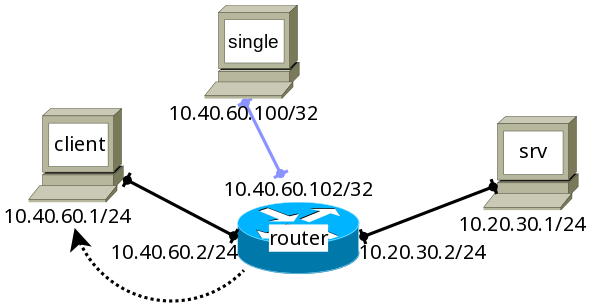

Сетевой уровень - основной уровень адресации и маршрутизации данных в сети.

В прошлой главе был рассмотрен способ маршрутизации сети не выше интерфейсного уровня. Собственно говоря, в реальной сетевой практике существуют решения, позволяющие поверх интерфейсного уровня сразу реализовывать прикладной. Из-за этого, например, термином "локальная сеть" могут обозначать не просто отдельные самостоятельные сети передачи данных, а именно сети реализованные **без** сетевого уровня стека протоколов. Однако в такой реализации возникает множество собственных проблем - большая связь с физическим уровнем, отдельные протоколы для поддержания избыточной сети без зацикливания и коллизий пакетов (например, упомянутый в прошлой главе `STP`) и др. 

Сетевой уровень позволяет достаточно унифицированным способом, не привязывающимся к реальной топологии и низлежащим уровням, объединить среды передачи данных в глобальную сеть.

`Bottom-half` задача сетевого уровня - ***обеспечение глобальной идентификации***. На этом уровне определяется структура адреса, а также механизм раздачи адресов абонентам сети. В отличие от интерфейсного уровня идентификаторы сетевого уровня не привязаны к конкретным устройствам, что добавляет гибкости в работе системы, например, даёт возможность трансляции адресов (о ней более подробно будет рассказано в будущих главах).\
`Top-half` задача сетевого уровня - ***маршрутизация***. Глобальная сеть имеет множество связей, путей между абонентами. Каждое ребро сетевого графа работает с собственными настройками, может оказаться перегруженным данными, отключиться и т.д. На сетевом уровне ведётся отслеживание связности сети, строится карта достижимости абонентов. Для крупных сетей строятся маршруты по умолчанию.

Поскольку объёмы данных, описывающие все маршруты и абонентов, огромны, обе задачи сетевого уровня в общем случае _динамические_.

`IPv4`
---

В рамках курса будет рассматриваться протокол `IPv4` стандарта [`rfc791`](https://tools.ietf.org/html/rfc791). Кратко напомним основные структурные особенности протокола:
 + Адрес `IPv4` состоит из четырёх октетов (32 бита), разделяющихся на две части (необязательно равные) - **номер сети** и **номер хоста (абонента)**;
 + Для разделения частей адреса используется адрес специального вида - маска сети (вид: $1^k\ 0^{32-k}$);
 + Для каждой сети зафиксированы два спец.адреса - **адрес сети** (номер сети \<k bit\> + $0^{32-k}$) и **широковещательный адрес** (номер сети \<k bit\> + $1^{32-k}$);
 + До появления переменной длины номера сети (и, соответственно, маски сети) существовали отдельные классы сети (названия и их структуру можно посмотреть [здесь](https://github.com/UsamG1t/jaffar_torrent/blob/master/Taskology/%D0%9F%D0%BE%D0%B4%D1%81%D0%BA%D0%B0%D0%B7%D0%BA%D0%B8%20%D0%B8%20%D0%B3%D0%B0%D0%B9%D0%B4%D1%8B%20%D0%BA%20%D0%B7%D0%B0%D0%B4%D0%B0%D1%87%D0%BD%D0%B8%D0%BA%D1%83.md#%D0%B7%D0%B0%D0%B4%D0%B0%D1%87%D0%B0-3)), явно задающие максимально возможное количество абонентов, а также объединяющие абонентов в единые группы рассылки сообщений.

Настройка `IPv4` в `Linux` уже была упомянута в главах ранее. Всё, что необходимо сделать для идентификации устройства в сети, - выдать ему `IP`-адрес вручную или с помощью специальных автонастройщиков (о таких механизмах речь пойдёт в будущих главах).

`srv`
```srv
[root@srv ~]# ip a  
1: lo: <LOOPBACK,UP,LOWER_UP> mtu 65536 qdisc noqueue state UNKNOWN group default qlen 1000  
   link/loopback 00:00:00:00:00:00 brd 00:00:00:00:00:00  
   inet 127.0.0.1/8 scope host lo  
      valid_lft forever preferred_lft forever  
2: eth0: <BROADCAST,MULTICAST> mtu 1500 qdisc noop state DOWN group default qlen 1000  
   link/ether 08:00:27:f0:fc:9f brd ff:ff:ff:ff:ff:ff  
   altname enp0s3  
3: eth1: <BROADCAST,MULTICAST> mtu 1500 qdisc noop state DOWN group default qlen 1000  
   link/ether 08:00:27:fd:37:1e brd ff:ff:ff:ff:ff:ff  
   altname enp0s8  
4: eth2: <BROADCAST,MULTICAST> mtu 1500 qdisc noop state DOWN group default qlen 1000  
   link/ether 08:00:27:07:f7:2c brd ff:ff:ff:ff:ff:ff  
   altname enp0s9  
5: eth3: <BROADCAST,MULTICAST> mtu 1500 qdisc noop state DOWN group default qlen 1000  
   link/ether 08:00:27:49:18:c3 brd ff:ff:ff:ff:ff:ff  
   altname enp0s10  

[root@srv ~]# ip link set eth1 up  
[root@srv ~]# ip addr add dev eth1 10.1.2.3/24  

[root@srv ~]# ip a  
1: lo: <LOOPBACK,UP,LOWER_UP> mtu 65536 qdisc noqueue state UNKNOWN group default qlen 1000  
   link/loopback 00:00:00:00:00:00 brd 00:00:00:00:00:00  
   inet 127.0.0.1/8 scope host lo  
      valid_lft forever preferred_lft forever  
2: eth0: <BROADCAST,MULTICAST> mtu 1500 qdisc noop state DOWN group default qlen 1000  
   link/ether 08:00:27:f0:fc:9f brd ff:ff:ff:ff:ff:ff  
   altname enp0s3  
3: eth1: <BROADCAST,MULTICAST,UP,LOWER_UP> mtu 1500 qdisc fq_codel state UP group default qlen 1000  
   link/ether 08:00:27:fd:37:1e brd ff:ff:ff:ff:ff:ff  
   altname enp0s8  
   inet 10.1.2.3/24 scope global eth1  
      valid_lft forever preferred_lft forever  
4: eth2: <BROADCAST,MULTICAST> mtu 1500 qdisc noop state DOWN group default qlen 1000  
   link/ether 08:00:27:07:f7:2c brd ff:ff:ff:ff:ff:ff  
   altname enp0s9  
5: eth3: <BROADCAST,MULTICAST> mtu 1500 qdisc noop state DOWN group default qlen 1000  
   link/ether 08:00:27:49:18:c3 brd ff:ff:ff:ff:ff:ff  
   altname enp0s10  
[root@srv ~]#
```

Единственное, что необходимо помнить при выдаче адресов - [специальные сети](https://datatracker.ietf.org/doc/html/rfc5735), выделенные для определённых задач - автоматической локальной настройки сетей, тестирования работы сети, `P2P`-адресации. Среди выделенных сетей есть `Private-Use` сети, доступ с помощью которых в глобальную сеть без дополнительной обработки принудительно заблокирован.

---

Более сложной задачей является маршрутизация пакетов. Как и на интерфейсном уровне, для неё используются динамические маршрутные таблицы, при этом данные в них можно вносить вручную, часть правил передачи автоматически добавляется в процессе работы, а часть появляется ещё в момент добавления сети. 

`srv`
```srv
[root@srv ~]# ip route  
10.1.2.0/24 dev eth1 proto kernel scope link src 10.1.2.3    

[root@srv ~]# ip route list table local  
local 10.1.2.3 dev eth1 proto kernel scope host src 10.1.2.3    
broadcast 10.1.2.255 dev eth1 proto kernel scope link src 10.1.2.3    
local 127.0.0.0/8 dev lo proto kernel scope host src 127.0.0.1    
local 127.0.0.1 dev lo proto kernel scope host src 127.0.0.1    
broadcast 127.255.255.255 dev lo proto kernel scope link src 127.0.0.1
```

Как видно в примере, создание сети на интерфейсе `eth1` автоматически добавило в таблицу маршрутизации правило передачи пакетов от источника 10.1.2.3 для устройств той же сети за тем же интерфейсом. Аналогичным образом в локальную таблицу маршрутизации внесены правила широковещательной рассылки и таргетированной отправки пакета на свой же адрес. Для интерфейса `loopback` также автоматически добавлены правила маршрутизации. Заметим, что пока системе неизвестны никакие другие `IP`-адреса и вообще другие абоненты, поэтому никаких дополнительных правил в таблицах нет.


Протоколы сетевого и сетевого/интерфейсного уровня
---

В задаче маршрутизации возникает множество проблем, с которыми необходимо программно справляться. 

Самая простая задача - **противодействие зацикливанию передачи пакетов**. Множество протоколов (например, [OSPF](https://ru.wikipedia.org/wiki/OSPF)) одним из своих действий имеют вычисление и отключение циклических связей в сети. Сами пакеты также имеют механизм защиты от зацикливания - специальное `Time-To-Live` поле заголовка фрейма, уменьшающееся при каждой передаче пакета. При достижении нулевого значения пакет сбрасывается, а отправителю согласно протоколу [`ICMP`](https://ru.wikipedia.org/wiki/ICMP) приходит сообщение о том, что пакет не был доставлен получателю. При помощи технологии протокола `ICMP` можно также отследить путь до некоторого `IP`-адреса - утилита `traceroute` будет отправлять на него пакеты с возрастающим `TTL`, начиная от единицы, таким образом сбрасывающиеся на каждом следующем в цепочке маршрутизаторе пакеты путём `ICMP`-сообщений соберут полный путь до получателя.

`srv`
```srv
[root@srv ~]# traceroute www.cs.msu.ru  
traceroute to www.cs.msu.ru (188.44.50.110), 30 hops max, 60 byte packets  
1  _gateway (10.0.2.2)  1.264 ms  1.207 ms  1.228 ms  
2  192.168.0.1 (192.168.0.1)  24.530 ms  24.219 ms  24.160 ms  
3  10.10.0.1 (10.10.0.1)  24.111 ms  23.971 ms  23.916 ms  
4  10.254.254.254 (10.254.254.254)  23.824 ms  23.790 ms  23.761 ms  
5  laguna-2-vl557.rmix.umos.ru (195.178.192.153)  23.666 ms  23.634 ms  23.555 ms  
6  * * *  
7  93.180.0.191 (93.180.0.191)  24.905 ms  4.692 ms  4.007 ms  
8  188.44.50.110 (188.44.50.110)  4.606 ms  4.506 ms  4.468 ms  
[root@srv ~]#
```

Важно понимать, что так как "маршрут" собирается итеративно, за время работы `traceroute` он мог поменяться (и часто так и происходит), поэтому правильнее воспринимать его, не как реальную цепочку маршрутизаторов, а как множество абонентов разной степени удалённости от источника, через которых потенциально может идти пакет к получателю.

---

Следующая важная задача - **начальная маршрутизация данных**. Поскольку таблицы маршрутизации динамические, при обращении к другим абонентам неизвестны все данные об их устройствах. В частности, для инкапсуляции `IP`-пакета во фрейм необходимо указывать `MAC`-адрес устройства-получателя.

Для получения соответствия `IP`-адресу `MAC`-адреса устройства существует специальный [`Address Resolution Protocol`](https://tools.ietf.org/html/rfc826) ([`ARP`](https://ru.wikipedia.org/wiki/ARP)). Этот широковещательный протокол делает запрос в сеть на получение `MAC`-адреса по `IP`, владелец адреса обратным сообщением присылает свой `MAC`, после чего производится передача данных.

Рассмотрим работу `ARP` на примере взаимодействия двух машин - `srv` и `router` - в одной сети:

На `srv` `IP`-адрес уже настроен:
`srv`
```srv
[root@srv ~]# ip a  
1: lo: <LOOPBACK,UP,LOWER_UP> mtu 65536 qdisc noqueue state UNKNOWN group default qlen 1000  
   link/loopback 00:00:00:00:00:00 brd 00:00:00:00:00:00  
   inet 127.0.0.1/8 scope host lo  
      valid_lft forever preferred_lft forever  
2: eth0: <BROADCAST,MULTICAST,UP,LOWER_UP> mtu 1500 qdisc fq_codel state UNKNOWN group default qlen 100  
0  
   link/ether 08:00:27:f0:fc:9f brd ff:ff:ff:ff:ff:ff  
   altname enp0s3  
   inet 10.0.2.15/24 brd 10.0.2.255 scope global dynamic noprefixroute eth0  
      valid_lft 83482sec preferred_lft 72682sec  
3: eth1: <BROADCAST,MULTICAST,UP,LOWER_UP> mtu 1500 qdisc fq_codel state UP group default qlen 1000  
   link/ether 08:00:27:fd:37:1e brd ff:ff:ff:ff:ff:ff  
   altname enp0s8  
   inet 10.1.2.3/24 scope global eth1  
      valid_lft forever preferred_lft forever  
4: eth2: <BROADCAST,MULTICAST> mtu 1500 qdisc noop state DOWN group default qlen 1000  
   link/ether 08:00:27:07:f7:2c brd ff:ff:ff:ff:ff:ff  
   altname enp0s9  
5: eth3: <BROADCAST,MULTICAST> mtu 1500 qdisc noop state DOWN group default qlen 1000  
   link/ether 08:00:27:49:18:c3 brd ff:ff:ff:ff:ff:ff  
   altname enp0s10  
```

Включим отслеживание приходящих фреймов:

`srv`
```srv
[root@srv ~]# tcpdump -eXni eth1
tcpdump: verbose output suppressed, use -v[v]... for full protocol decode  
listening on eth1, link-type EN10MB (Ethernet), snapshot length 262144 bytes

```

На `router` настроим свой `IP`-адрес и сделаем единичный `ping`-запрос на `srv`:

`router`
```router
[root@router ~]# ip link set eth1 up  
[root@router ~]# ip addr add dev eth1 10.1.2.4/24  

[root@router ~]# ip a  
1: lo: <LOOPBACK,UP,LOWER_UP> mtu 65536 qdisc noqueue state UNKNOWN group default qlen 1000  
   link/loopback 00:00:00:00:00:00 brd 00:00:00:00:00:00  
   inet 127.0.0.1/8 scope host lo  
      valid_lft forever preferred_lft forever  
2: eth0: <BROADCAST,MULTICAST> mtu 1500 qdisc noop state DOWN group default qlen 1000  
   link/ether 08:00:27:37:1a:d4 brd ff:ff:ff:ff:ff:ff  
   altname enp0s3  
3: eth1: <BROADCAST,MULTICAST,UP,LOWER_UP> mtu 1500 qdisc fq_codel state UP group default qlen 1000  
   link/ether 08:00:27:b3:77:82 brd ff:ff:ff:ff:ff:ff  
   altname enp0s8  
   inet 10.1.2.4/24 scope global eth1  
      valid_lft forever preferred_lft forever  
4: eth2: <BROADCAST,MULTICAST> mtu 1500 qdisc noop state DOWN group default qlen 1000  
   link/ether 08:00:27:8c:6f:9e brd ff:ff:ff:ff:ff:ff  
   altname enp0s9  
5: eth3: <BROADCAST,MULTICAST> mtu 1500 qdisc noop state DOWN group default qlen 1000  
   link/ether 08:00:27:01:a0:4d brd ff:ff:ff:ff:ff:ff  
   altname enp0s10  

[root@router ~]# ping -c1 10.1.2.3  
PING 10.1.2.3 (10.1.2.3) 56(84) bytes of data.  
64 bytes from 10.1.2.3: icmp_seq=1 ttl=64 time=0.904 ms  
  
--- 10.1.2.3 ping statistics ---  
1 packets transmitted, 1 received, 0% packet loss, time 0ms  
rtt min/avg/max/mdev = 0.904/0.904/0.904/0.000 ms  
[root@router ~]#
```

Логичным будет ожидать два пакета - приходящий `ping`-запрос и уходящий `ping`-ответ. В реальности же мы отслеживаем 6 пакетов:

`srv`
```srv
[root@srv ~]# tcpdump -eXni eth1  
tcpdump: verbose output suppressed, use -v[v]... for full protocol decode  
listening on eth1, link-type EN10MB (Ethernet), snapshot length 262144 bytes  
09:47:32.279662 08:00:27:b3:77:82 > Broadcast, ethertype ARP (0x0806), length 60: Request who-has 10.1.  
2.3 tell 10.1.2.4, length 46  
       0x0000:  0001 0800 0604 0001 0800 27b3 7782 0a01  ..........'.w...  
       0x0010:  0204 0000 0000 0000 0a01 0203 0000 0000  ................  
       0x0020:  0000 0000 0000 0000 0000 0000 0000       ..............  
09:47:32.279705 08:00:27:fd:37:1e > 08:00:27:b3:77:82, ethertype ARP (0x0806), length 42: Reply 10.1.2.  
3 is-at 08:00:27:fd:37:1e, length 28  
       0x0000:  0001 0800 0604 0002 0800 27fd 371e 0a01  ..........'.7...  
       0x0010:  0203 0800 27b3 7782 0a01 0204            ....'.w.....  

09:47:32.280095 08:00:27:b3:77:82 > 08:00:27:fd:37:1e, ethertype IPv4 (0x0800), length 98: 10.1.2.4 > 1  
0.1.2.3: ICMP echo request, id 1, seq 1, length 64  
       0x0000:  4500 0054 78d8 4000 4001 a9c8 0a01 0204  E..Tx.@.@.......  
       0x0010:  0a01 0203 0800 8de8 0001 0001 e176 d567  .............v.g  
       0x0020:  0000 0000 f163 0300 0000 0000 1011 1213  .....c..........  
       0x0030:  1415 1617 1819 1a1b 1c1d 1e1f 2021 2223  .............!"#  
       0x0040:  2425 2627 2829 2a2b 2c2d 2e2f 3031 3233  $%&'()*+,-./0123  
       0x0050:  3435 3637                                4567  
09:47:32.280120 08:00:27:fd:37:1e > 08:00:27:b3:77:82, ethertype IPv4 (0x0800), length 98: 10.1.2.3 > 1  
0.1.2.4: ICMP echo reply, id 1, seq 1, length 64  
       0x0000:  4500 0054 57b3 0000 4001 0aee 0a01 0203  E..TW...@.......  
       0x0010:  0a01 0204 0000 95e8 0001 0001 e176 d567  .............v.g  
       0x0020:  0000 0000 f163 0300 0000 0000 1011 1213  .....c..........  
       0x0030:  1415 1617 1819 1a1b 1c1d 1e1f 2021 2223  .............!"#  
       0x0040:  2425 2627 2829 2a2b 2c2d 2e2f 3031 3233  $%&'()*+,-./0123  
       0x0050:  3435 3637                                4567  

09:47:37.763217 08:00:27:fd:37:1e > 08:00:27:b3:77:82, ethertype ARP (0x0806), length 42: Request who-h  
as 10.1.2.4 tell 10.1.2.3, length 28  
       0x0000:  0001 0800 0604 0001 0800 27fd 371e 0a01  ..........'.7...  
       0x0010:  0203 0000 0000 0000 0a01 0204            ............  
09:47:37.764516 08:00:27:b3:77:82 > 08:00:27:fd:37:1e, ethertype ARP (0x0806), length 60: Reply 10.1.2.  
4 is-at 08:00:27:b3:77:82, length 46  
       0x0000:  0001 0800 0604 0002 0800 27b3 7782 0a01  ..........'.w...  
       0x0010:  0204 0800 27fd 371e 0a01 0203 0000 0000  ....'.7.........  
       0x0020:  0000 0000 0000 0000 0000 0000 0000       ..............
```

Первые два - `ARP`-запрос и `ARP`-ответ от `router` к `srv`, следующие два - `ping`-запрос и `ping`-ответ, последующие - `ARP`-запрос и `ARP`-ответ от `srv` к `router`.

`ARP`-таблица соответствия `IP` и `MAC` адресов так же динамическая, её записи в зависимости от давности нахождения в таблице отмечаются ключевыми словами REACHABLE -> DELAY -> STALE -> $\varnothing$ 

`srv`
```srv
[root@srv ~]# ip neighbour  
10.1.2.4 dev eth1 lladdr 08:00:27:b3:77:82 REACHABLE    
<...few seconds later...>
[root@srv ~]# ip neighbour  
10.1.2.4 dev eth1 lladdr 08:00:27:b3:77:82 STALE    
[root@srv ~]#
```

Говоря о сетевых протоколах, их существует [огромное множество](https://en.wikipedia.org/wiki/Data%20link%20layer) для решения различных задач (маршрутизация, борьба с фрагментацией, трансляция адресов и т.д.)

---

Для рассмотрения утилиты `traceroute` настройка интерфейса `eth0`, который в `VirtualBox` по умолчанию направлен на выход в глобальную сеть, производилась с помощью команды `dhcpcd eth0`. Рассмотрим эту настройку детально: для выхода в сеть небходимо знать её номер (сеть на выходе из `VirtualBox` имеет вид 10.0.2.0/24), а также задать **маршрут по умолчанию**.

`srv`
```srv
[root@srv ~]# ip link set eth0 up  
[root@srv ~]# ip addr add dev eth0 10.0.2.15/24  
[root@srv ~]# ip route add default via 10.0.2.2  
[root@srv ~]#
```

Маршрут по умолчанию определяется подстановкой адреса в сеть 0.0.0.0/0 и читается буквально "пакеты для получателей из сети 0.0.0.0/0 направлять на 10.0.2.2" (10.0.2.2 - адрес виртуального маршрутизатора на выходе из `VirtualBox`). Поскольку выбор маршрута выбирается с приоритетом на длину номера сети (чем больше номер сети и, соответственно, меньше её размер (допустимое количество абонентов в ней), тем больший приоритет при выборе маршрута она будет иметь), при задании целевых направлений пакетов они будут переданы по ним, а не по маршруту по умолчанию.

В данной конфигурации мы можем обращаться в глобальную сеть, однако определение `IP`-адреса по доменному имени пока не доступен:

`srv`
```srv
[root@srv ~]# ping 8.8.8.8    
PING 8.8.8.8 (8.8.8.8) 56(84) bytes of data.  
64 bytes from 8.8.8.8: icmp_seq=1 ttl=255 time=17.0 ms  
64 bytes from 8.8.8.8: icmp_seq=2 ttl=255 time=22.0 ms  
64 bytes from 8.8.8.8: icmp_seq=3 ttl=255 time=14.0 ms  
  
--- 8.8.8.8 ping statistics ---  
3 packets transmitted, 3 received, 0% packet loss, time 2002ms  
rtt min/avg/max/mdev = 13.954/17.636/21.970/3.304 ms  
[root@srv ~]# ping google.com  
ping: google.com: Temporary failure in name resolution  
[root@srv ~]#
```

Для настройки разрешения доменных имён необходимо указать [DNS](https://ru.wikipedia.org/wiki/DNS)-сервер (Domain Name System). Что конкретно представляет из себя `DNS`, будет рассмотрено в будущих главах. Сейчас достаточно понимания, что с его помощью можно получать `IP`-адреса по сетевым именам:

`srv`
```srv
[root@srv ~]# cat > /etc/resolv.conf  
nameserver 8.8.8.8  
[root@srv ~]# ping google.com  
PING google.com (142.250.74.174) 56(84) bytes of data.  
64 bytes from arn11s12-in-f14.1e100.net (142.250.74.174): icmp_seq=1 ttl=255 time=25.9 ms  
64 bytes from arn11s12-in-f14.1e100.net (142.250.74.174): icmp_seq=2 ttl=255 time=20.5 ms  
64 bytes from arn11s12-in-f14.1e100.net (142.250.74.174): icmp_seq=3 ttl=255 time=22.0 ms  w
--- google.com ping statistics ---  
3 packets transmitted, 3 received, 0% packet loss, time 2002ms  
rtt min/avg/max/mdev = 20.507/22.787/25.877/2.265 ms  
[root@srv ~]#
```


Маршрутизация между двумя сетями
---

Построим топологию следующего вида:
```console
~/papillon_rouge: vbintnets
srv:
        eth1: intnet
router:
        eth1: intnet
        eth2: deepnet
client:
        eth1: deepnet
~/papillon_rouge: 
```

И на сетевом уровне организуем маршрутизацию между двумя сетями.

При простой настройке `IP` устройства будут видеть только абонентов той же сети:

`srv`
```srv
[root@srv ~]# ip link set eth1 up  
[root@srv ~]# ip addr add dev eth1 10.1.2.3/24
```

`router`
```router
[root@router ~]# ip link set eth1 up  
[root@router ~]# ip addr add dev eth1 10.1.2.4/24  
[root@router ~]# ip link set eth2 up  
[root@router ~]# ip addr add dev eth2 10.10.10.1/24  
```

`client`
```client
[root@client ~]# ip link set eth1 up
[root@client ~]# ip addr add dev eth1 10.10.10.2/24
```

`srv`
```srv
[root@srv ~]# ping 10.1.2.4  
PING 10.1.2.4 (10.1.2.4) 56(84) bytes of data.  
64 bytes from 10.1.2.4: icmp_seq=1 ttl=64 time=0.832 ms  
64 bytes from 10.1.2.4: icmp_seq=2 ttl=64 time=0.430 ms  
  
--- 10.1.2.4 ping statistics ---  
2 packets transmitted, 2 received, 0% packet loss, time 1001ms  
rtt min/avg/max/mdev = 0.430/0.631/0.832/0.201 ms  
[root@srv ~]# ping 10.10.10.2  
ping: connect: Network is unreachable  
[root@srv ~]#
```

`client`
```client
[root@client ~]# ping 10.10.10.1  
PING 10.10.10.1 (10.10.10.1) 56(84) bytes of data.  
64 bytes from 10.10.10.1: icmp_seq=1 ttl=64 time=0.786 ms  
64 bytes from 10.10.10.1: icmp_seq=2 ttl=64 time=0.348 ms  
  
--- 10.10.10.1 ping statistics ---  
2 packets transmitted, 2 received, 0% packet loss, time 1046ms  
rtt min/avg/max/mdev = 0.348/0.567/0.786/0.219 ms  
[root@client ~]# ping 10.1.2.4  
ping: connect: Network is unreachable  
[root@client ~]# ping 10.1.2.3  
ping: connect: Network is unreachable  
[root@client ~]#
```

Попробуем настроить доступность `srv` и `client`. Сейчас у `client` нет информации, куда перенаправлять пакеты с неизвестным `IP`, можно явно задать для него правило маршрута по умолчанию:

`client`
```client
[root@client ~]# ip route get 10.1.2.3  
RTNETLINK answers: Network is unreachable  
[root@client ~]# ip route add default via 10.10.10.1  
[root@client ~]# ip route get 10.1.2.3  
10.1.2.3 via 10.10.10.1 dev eth1 src 10.10.10.2 uid 0    
   cache    
[root@client ~]# ping -c3 10.1.2.3  
PING 10.1.2.3 (10.1.2.3) 56(84) bytes of data.  
  
--- 10.1.2.3 ping statistics ---  
3 packets transmitted, 0 received, 100% packet loss, time 2062ms  
  
[root@client ~]#
```

Адрес получателя уже не считается недостижимым, `ping`-запрос уходит, но ответа `client` не получает.

У этого есть две причины. Первая - отсутствие информации, куда пересылать ответные пакеты, у `srv`, для него необходимо точно так же указать маршрут по умолчанию или таргетированный маршрут:

`srv`
```srv
[root@srv ~]# ip route add 10.10.10.0/24 via 10.1.2.4  
[root@srv ~]# ip route get 10.10.10.2  
10.10.10.2 via 10.1.2.4 dev eth1 src 10.1.2.3 uid 0    
   cache    
[root@srv ~]#
```

Вторая причина - изначальная настройка `Linux`-машины не предполагает маршрутизацию между интерфейсами. Необходимо либо сделать на интерфейсном уровне мост, либо на сетевом уровне разрешить пробрасывание пакетов между интерфейсами - `IP-forwarding`:

`router`
```router
[root@router ~]# cat /proc/sys/net/ipv4/ip_forward  
0  
[root@router ~]# sysctl net.ipv4.ip_forward=1  
[root@router ~]# sysctl net.ipv4.ip_forward     
net.ipv4.ip_forward = 1  
[root@router ~]#
```

После этих действий доступность машин будет налажена:

`client`
```client
[root@client ~]# ping -c3 10.1.2.3  
PING 10.1.2.3 (10.1.2.3) 56(84) bytes of data.  
64 bytes from 10.1.2.3: icmp_seq=1 ttl=63 time=1.07 ms  
64 bytes from 10.1.2.3: icmp_seq=2 ttl=63 time=1.02 ms  
64 bytes from 10.1.2.3: icmp_seq=3 ttl=63 time=0.745 ms  
  
--- 10.1.2.3 ping statistics ---  
3 packets transmitted, 3 received, 0% packet loss, time 2002ms  
rtt min/avg/max/mdev = 0.745/0.945/1.074/0.143 ms  
[root@client ~]#
```


Proxy ARP
---

Рассмотрим теперь способ настройки топологии, в которой в разных сетях используются адреса из одного диапазона.

Добавим ещё одного абонента в новой сетью:

```console
~/papillon_rouge: vbintnets
srv:  
       eth1: intnet  
client:  
       eth1: deepnet  
router:  
       eth1: intnet  
       eth2: deepnet  
       eth3: single  
one:  
       eth1: single
~/papillon_rouge: 
```

Настроим `IP`-адреса в соответствии с картинкой:


`srv`
```srv
[root@srv ~]# ip link set eth1 up  
[root@srv ~]# ip addr add dev eth1 10.20.30.1/24  
[root@srv ~]# ip route add default via 10.20.30.2
[root@srv ~]#
```

`client`
```client
[root@client ~]# ip link set eth1 up  
[root@client ~]# ip addr add dev eth1 10.40.60.1/24  
[root@client ~]# ip route add default via 10.40.60.2
[root@client ~]#
```

`one`
```one
[root@one ~]# ip link set eth1 up  
[root@one ~]# ip addr add dev eth1 10.40.60.100/32  
[root@one ~]#
```

`router`
```router
[root@router ~]# ip link set eth1 up  
[root@router ~]# ip link set eth2 up  
[root@router ~]# ip link set eth3 up  
[root@router ~]# ip addr add dev eth1 10.20.30.2/24  
[root@router ~]# ip addr add dev eth2 10.40.60.2/24  
[root@router ~]# ip addr add dev eth3 10.40.60.102/32  
[root@router ~]# sysctl net.ipv4.ip_forward=1  
[root@router ~]#
```

Проверим доступность абонентов в сети:

`srv`
```srv
[root@srv ~]# ping -c1 10.20.30.1  
PING 10.20.30.1 (10.20.30.1) 56(84) bytes of data.  
64 bytes from 10.20.30.1: icmp_seq=1 ttl=64 time=0.053 ms  
  
--- 10.20.30.1 ping statistics ---  
1 packets transmitted, 1 received, 0% packet loss, time 0ms  
rtt min/avg/max/mdev = 0.053/0.053/0.053/0.000 ms  
[root@srv ~]#
```

`client`
```client
[root@client ~]# ping -c1 10.40.60.1  
PING 10.40.60.1 (10.40.60.1) 56(84) bytes of data.  
64 bytes from 10.40.60.1: icmp_seq=1 ttl=64 time=0.054 ms  
  
--- 10.40.60.1 ping statistics ---  
1 packets transmitted, 1 received, 0% packet loss, time 0ms  
rtt min/avg/max/mdev = 0.054/0.054/0.054/0.000 ms  
[root@client ~]#
```

`router`
```router
[root@router ~]# ping -c1 10.20.30.1  
PING 10.20.30.1 (10.20.30.1) 56(84) bytes of data.  
64 bytes from 10.20.30.1: icmp_seq=1 ttl=64 time=0.924 ms  
  
--- 10.20.30.1 ping statistics ---  
1 packets transmitted, 1 received, 0% packet loss, time 0ms  
rtt min/avg/max/mdev = 0.924/0.924/0.924/0.000 ms  

[root@router ~]# ping -c1 10.40.60.1  
PING 10.40.60.1 (10.40.60.1) 56(84) bytes of data.  
64 bytes from 10.40.60.1: icmp_seq=1 ttl=64 time=0.662 ms  
  
--- 10.40.60.1 ping statistics ---  
1 packets transmitted, 1 received, 0% packet loss, time 0ms  
rtt min/avg/max/mdev = 0.662/0.662/0.662/0.000 ms  

[root@router ~]# ping -c1 10.40.60.100  
PING 10.40.60.100 (10.40.60.100) 56(84) bytes of data.  
From 10.40.60.2 icmp_seq=1 Destination Host Unreachable  
  
--- 10.40.60.100 ping statistics ---  
1 packets transmitted, 0 received, +1 errors, 100% packet loss, time 0ms  
  
[root@router ~]#
```

Подробнее рассмотрим взаимодействие `router` и `one`. Поскольку адреса в сети `single` имеют маску `/32`, автоматической маршрутизации не происходит (поскольку сети в привычном понимании нет как таковой: весь `IP`-адрес описывает лишь её номер). 

`router`
```router
[root@router ~]# ip route  
10.20.30.0/24 dev eth1 proto kernel scope link src 10.20.30.2    
10.40.60.0/24 dev eth2 proto kernel scope link src 10.40.60.2    
[root@router ~]#
```

Для взаимодействия `router` и `one` необходимо описать явный маршрут для абонента и маршрутизатора:

`router`
```router
[root@router ~]# ip route add 10.40.60.100/32 dev eth3
[root@router ~]# ip route
10.20.30.0/24 dev eth1 proto kernel scope link src 10.20.30.2 
10.40.60.0/24 dev eth2 proto kernel scope link src 10.40.60.2 
10.40.60.100 dev eth3 scope link 
[root@router ~]# 
```

`one`
```one
[root@one ~]# ip route add 10.40.60.102/32 dev eth1  
[root@one ~]# ping -c1 10.40.60.102  
PING 10.40.60.102 (10.40.60.102) 56(84) bytes of data.  
64 bytes from 10.40.60.102: icmp_seq=1 ttl=64 time=0.778 ms  
  
--- 10.40.60.102 ping statistics ---  
1 packets transmitted, 1 received, 0% packet loss, time 0ms  
rtt min/avg/max/mdev = 0.778/0.778/0.778/0.000 ms  
[root@one ~]#
```

Для достижения с `one` других абонентов необходимо также прописать ему маршрут по умолчанию:

`one`
```one
[root@one ~]# ping 10.20.30.1  
ping: connect: Network is unreachable  

[root@one ~]# ip route add default via 10.40.60.102  
[root@one ~]# ping -c1 10.20.30.1  
PING 10.20.30.1 (10.20.30.1) 56(84) bytes of data.  
64 bytes from 10.20.30.1: icmp_seq=1 ttl=63 time=0.730 ms  
  
--- 10.20.30.1 ping statistics ---  
1 packets transmitted, 1 received, 0% packet loss, time 0ms  
rtt min/avg/max/mdev = 0.730/0.730/0.730/0.000 ms
```

`srv`
```srv
[root@srv ~]# ping -c1 10.40.60.100  
PING 10.40.60.100 (10.40.60.100) 56(84) bytes of data.  
64 bytes from 10.40.60.100: icmp_seq=1 ttl=63 time=0.818 ms  
  
--- 10.40.60.100 ping statistics ---  
1 packets transmitted, 1 received, 0% packet loss, time 0ms  
rtt min/avg/max/mdev = 0.818/0.818/0.818/0.000 ms  
[root@srv ~]#
```

Соединение с `srv` произошло без проблем, однако с `client` возникает проблема:

`one`
```one
[root@one ~]# ping -c1 10.40.60.1
PING 10.40.60.1 (10.40.60.1) 56(84) bytes of data.

--- 10.40.60.1 ping statistics ---
1 packets transmitted, 0 received, 100% packet loss, time 0ms

[root@one ~]# 
```

Пакет успешно доставляется от `one` до `client`, но не доходит обратно. Происходит это из-за того, что `ARP`-запрос от `client` не разрешается в рамках того же интерфейса, где находится сеть 10.40.60.0/24, а поскольку автоматической маршрутизации нет, пакет от `client` не выходит за рамки `deepnet` и запрос остаётся неразрешённым, а в `ARP`-таблицах `client` и `router` появляются неразрешённые позиции:

`client`
```client
[root@client ~]# ip n  
10.40.60.100 dev eth1 FAILED    
10.40.60.2 dev eth1 lladdr 08:00:27:d7:9e:a6 STALE    
[root@client ~]#
```

`router`
```router
[root@router ~]# ip n
10.40.60.100 dev eth3 lladdr 08:00:27:77:c4:03 STALE 
10.20.30.1 dev eth1 lladdr 08:00:27:38:f8:2e STALE 
10.40.60.100 dev eth2 FAILED 
10.40.60.1 dev eth2 lladdr 08:00:27:eb:df:5c STALE 
[root@router ~]# 
```

Для решения данной проблемы и используется `Proxy ARP`. Он задаёт правила подмены ответа на `ARP`-запрос, выдавая `MAC`-адрес маршрутизатора за `MAC`-адрес абонента (`proxy` с англ. "доверенность", производится буквально доверенность к разрешению `ARP`-запроса другим устройством):

`router`
```router
[root@router ~]# ip neighbour add proxy 10.40.60.100 dev eth2
[root@router ~]# ip n show proxy
10.40.60.100 dev eth2 proxy 
[root@router ~]# 
```

`one`
```one
[root@one ~]# ping -c1 10.40.60.1  
PING 10.40.60.1 (10.40.60.1) 56(84) bytes of data.  
64 bytes from 10.40.60.1: icmp_seq=1 ttl=63 time=72.4 ms  
  
--- 10.40.60.1 ping statistics ---  
1 packets transmitted, 1 received, 0% packet loss, time 0ms  
rtt min/avg/max/mdev = 72.392/72.392/72.392/0.000 ms  
[root@one ~]#
```

`client`
```client
[root@client ~]# ip n  
10.40.60.100 dev eth1 lladdr 08:00:27:d7:9e:a6 REACHABLE    
10.40.60.2 dev eth1 lladdr 08:00:27:d7:9e:a6 STALE    
[root@client ~]#
```

Заметим, что `MAC`-адрес, соответствующий 10.40.60.100, совпадает с `MAC`-адресом `router`. Для `client` это воспринимается, будто у одного устройства используется два `IP`-адреса, а на деле `router` перенаправляет чужие пакеты дальше по маршруту.


Домашнее задание
---

 + Суть: объединить четыре компьютера тремя сетями по простой линейной схеме:
    + `clone` ←сеть3→ `router2` ←сеть2→ `router1` ←сеть1→ `base`
    + На машинах `clone` и `base` — по одному интерфейсу
    + На машинах `router2` и `router1` — два, там настроить маршрутизацию
    + Обеспечить доступность между `clone` и `base`
 + Отчёт (выполнятся с нуля на ненастроенных машинах):
    1. `report 4 clone`
         + Настройка/поднятие интерфейса
         + Дополнительные настройки маршрутизации (если нужны)
         + `tcpdump -c4` (должен показать пинги)
    2. `report 4 router2`
         + Настройка/поднятие двух интерфейсов
         + Дополнительные настройки маршрутизации (если нужны)
    3. `report 4 router1`
         + Настройка/поднятие двух интерфейсов
         + Дополнительные настройки маршрутизации (если нужны)
    4. `report 4 base` (выполняется последним)
         + Настройка/поднятие интерфейса
         + Дополнительные настройки маршрутизации (если нужны)
         + `ping -c4 адрес_clone` (должен проходить)
 + Четыре отчёта (`report.04.base`, `report.04.router1`, `report.04.router2` и `report.04.clone`) именно с такими названиями переслать одним письмом в качестве приложений на [uneexlectures@cs.msu.ru](mailto:uneexlectures@cs.msu.ru)
     + В теме письма **должно** встречаться слово `LinuxNetwork2025`