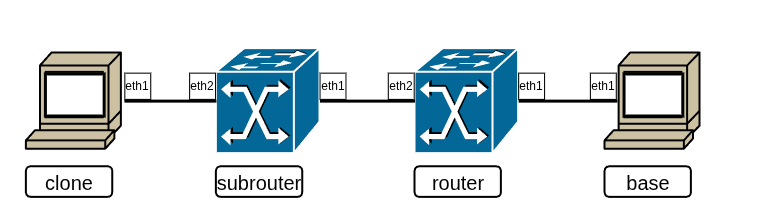

Сетевой уровень - основной уровень адресации и маршрутизации данных в сети.

В прошлой главе был рассмотрен способ маршрутизации сети не выше интерфейсного уровня. Собственно говоря, в реальной сетевой практике существуют решения, позволяющие поверх интерфейсного уровня сразу реализовывать прикладной. Из-за этого, например, термином "локальная сеть" могут обозначать не просто отдельные самостоятельные сети передачи данных, а именно сети, реализованные **без** сетевого уровня стека протоколов. Однако в такой реализации возникает множество собственных проблем - большая связь с физическим уровнем, отдельные протоколы для поддержания избыточной сети без зацикливания и коллизий пакетов (например, упомянутый в прошлой главе `STP`) и др.

Сетевой уровень позволяет достаточно унифицированным способом, не привязывающимся к реальной топологии и низлежащим уровням, объединить среды передачи данных в глобальную сеть.

`Bottom-half` задача сетевого уровня - ***обеспечение глобальной идентификации***. На этом уровне определяется структура адреса, а также механизм раздачи адресов абонентам сети. В отличие от интерфейсного уровня идентификаторы сетевого уровня не привязаны к конкретным устройствам, что добавляет гибкости в работе системы, например, даёт возможность трансляции адресов (о ней более подробно будет рассказано в будущих главах).\
`Top-half` задача сетевого уровня - ***маршрутизация***. Глобальная сеть имеет множество связей, путей между абонентами. Каждое ребро сетевого графа работает с собственными настройками, может оказаться перегруженным данными, отключиться и т.д. На сетевом уровне ведётся отслеживание связности сети, строится карта достижимости абонентов. Для крупных сетей строятся маршруты по умолчанию.

Поскольку объёмы данных, описывающие все маршруты и абонентов, огромны и активно меняются во времени (каждый час тысячи абонентов появляются и пропадают, постоянно изменяя топологию), обе задачи сетевого уровня в общем случае _динамические_.


# IPv6

В рамках курса, как уже аннонсировалось, будет рассматриваться протокол `IPv6` стандарта [`rfc8200`](https://datatracker.ietf.org/doc/html/rfc8200). Протокол был предложен в декабре 1995 года и своей структурой требовал масштабного изменения структуры сети. Поскольку осуществление настолько массовой перестройки было, мягко говоря, затруднительной задачей, протокол не получил должного внимания в то время. При этом протокол самостоятельно решал множество проблем современной сетевой инфраструктуры.

Достаточно ясно и подробно про IPv6 представлено в [докладе Jen "Furry" Linkova](https://www.openwall.com/presentations/IPv6/), мы постараемся в этой главе пройти по всем основным разделам доклада, описав все преимущества и особенности данного протокола

## Структура адреса

Для начала поговорим о том, как выглядит сам [IPv6-адрес](https://en.wikipedia.org/wiki/IPv6_address). Очевидным недостатком IPv4 было малое количество адресов. Из-за этого вместе с протоколом нужно было отдельно изобретать трансляцию адресов, ограничивать диапазоны и так далее. IPv6 за счёт структуры в 128 бит вместо 32 позволяет в самом адресе описывать множество дополнительных параметров, да и просто иметь многократно большее количество допустимых адресов.

Как и для IPv4, адреса IPv6 назначаются на интерфейсы, причём адреса не уникальны для интерфейсов — несколько адресов может быть установлено сразу на один интерфейс. Адреса записываются в формате _гексетов_ (шестнадцатибитных блоков, обычно в формате двух 16-CC байт), разделённых `:`. Поскольку адрес получается достаточно длинным, были введены стандарты сокращения адресов:
 + Незначимые нули гексетов могут опускаться;
 + Если в адресе есть несколько подряд идущих нулевых гексетов, они могут замещаться сокращением `::`. Замещение может проводиться только один раз на самом большом диапазоне подряд идущих гексетов. Множественное сокращение невозможно.

Например, записи `2001:0db8:85a3:0000:0000:0370:008e:7334` и ` 2001:db8:85a3::370:8e:7334` описывают один и тот же адрес.

Маска сети также описывает разделение сети на части, однако в IPv6 работа с ними более строгая. Вообще говоря, IPv4-протокол не обязывал маску иметь единицы исключительно на первых битах адреса. Это могли быть любые биты, позиции которых фиксировали значения в адресе и определяли подсеть, которой принадлежит адрес. И исключительно из удобства расчётов, разделения сети на подсети и работы с адресами повсеместно используются маски с первыми единичными битами.

В протоколе IPv6 маска обязана задавать разделение на две части из последовательно идущих бит. И здесь для фиксации этого факта мы будем использовать новую терминологию. Первую часть адреса мы будем называть «префикс». Префиксы задают диапазоны адресов с одинаковыми N старшими битами. Очевидно, что длина префикса определяется количеством старших бит. Также очевидно, что длина префикса обратно пропорциональна количеству адресов в данном префиксе. Младшие биты будем называть «\[интерфейсными\] идентификаторами». Термин «подсети» по понятным сообращениям покрывается термином префикса, поскольку второй выступает идентификатором подсети, как некоторого множества адресов.

## Категории и области действия адресов

Адреса можно разделить на несколько категорий:

 + Неопределённый адрес — `::`, 128 нулей — может интерпретироваться в правилах маршрутизации, как любой адрес;
 + Обычные адреса;
 + Специальные адреса (Это адреса с префиксом ff00::/8).

В большинстве литературы обычные адреса называют Unicast-адресами, специальные — Multicast-адресами. Это не совсем корректное название (в частности, для unicast), поскольку unicast и multicast — это типы доставки пакетов. Но поскольку тип доставки определяется IP-адресом, мы будем называть адреса обоими вариантами (обычные/специальные и unicast/multicast).

Основное взаимодействие между абонентами происходит по обычным адресам. Говоря про них, можно выделить три области действия обычного адреса:

 + Loopback-адрес `::1` (127 нулей и 1 единица) — используется для обращения внутри одной машины к себе самой. В отличие от IPv4, IPv6 LoopBack-адрес всего один;
 + Link-Local адреса (адреса с префиксом fe80::/10, то есть с первыми битами `1111 1110 10`) — используются для работы строго в рамках одного сегмента связи. Особенности их настройки и работы с такими адресами заслуживают подробного рассмотрения;
 + Global Unicast — обычные адреса, которые могут участвовать в глобальной маршрутизации.

Про глобальную связность мы поговорим отдельно, а сейчас разберём именно Link-Local адреса и их особенности

### LLA: внутриинтерфейсные адреса

Link-Local адреса (далее LLA) — особый вид адресов с уникальным свойством: они **принципиально немаршрутизируемы**. Эти адреса уникальны и актуальны только в рамках одного сегмента сети, доступны напрямую в локальной среде (то есть информация об узле с адресом из `fe80::/10` в нашей таблице маршрутизации гарантирует нам, что этот абонент — прямой сосед). Поскольку адреса уникальны только в рамках своего канала связи, без самого канала он не имеет смысла (потому что, в общем случае, машины на разных каналах с один и тем же адресом — разные машины). Поэтому при работе с LLA адрес должен снабжаться пометкой об интерфейсе, на котором он находится (например, `fe80::3a%17` для обращения к абоненту на интерфейсе №17 с адресом `fe80::3a`; при этом `fe80::3a%15` — вообще говоря, другой абонент).

На каждом поднимаемом на устройстве интерфейсе LLA генерируется автоматически, для этого существует специальный механизм [SLAAC](https://datatracker.ietf.org/doc/html/rfc4862#section-5.3). По нему узел генерирует себе интерфейсный идентификатор (например, на базе MAC-адреса), после чего назначает себе адрес в префиксе `fe80::/64` с младшими сгенерированными битами. Получается примерно такой адрес: `fe80::1c80:9aa4:528e:bb85`. Поскольку на заданном участке сети адрес должен быть уникальным, после его создания запускается процедура `DAD` — [Duplicate Address Detection](https://datatracker.ietf.org/doc/html/rfc4862#section-5.4). DAD является частью целого отдельного протокола Neighbour Discovery (NDP), решающего задачу определения соседей. Работу протокола мы обсудим ниже, сейчас просто зафиксируем, что сгенерированный адрес проходит некоторую верификацию своей уникальности, при необходимости редактируется, после чего закрепляется.

LLA можно назначить и вручную, главное, сгенерировать его в префиксе `fe80::/10`. Например, использование 54 бит после префикса гарантирует несовпадение со всеми автогенерируемыми адресами.

Используются LLA-адреса, в основном, для служебных целей: для обнаружения соседей в локальной среде, для общения по динамическим протоколам (например, OSPF), для nexthop-ов маршрутов. Запрета для другого использования на них нет, поэтому для удобства можно пользоваться ими и для простого прикладного трафика.

### Multicast: адреса групп узлов

В протоколе IPv6 особое внимание уделено Multicast-адресам. С их помощью возможно обеспечить взаимодействие между множеством абонентов, обладающих определёнными свойствами. Причём количество бит в IPv6-адресе позволяет задавать целые правила широковещания.

Мультикаст-группы также, как и юникаст, разделяются по областям действия адресов (по параметру scope):

```console
| 1111 1111 xxxx xxxx rrrr rrrr .... ....   .............   gggg gggg gggg gggg gggg gggg gggg gggg |
| ^^^^ ^^^^      ^^^^ ^         ^                ^^         ^^^^^^^^^^^^^^^^^^^^^^^^^^^^^^^^^^^^^^^ |
| multicast     scope reserved  prefixlen      64-bit                      group ID                 |
|           ^^^^                            network prefix                                          |
|           flags               <--- (if P-flag is 1) ---->                                         |
|                                                                                                   |
| [8 bits]  [4+4bits] [8 bits]  [8 bits]      [64 bits]                    [32 bits]                |
```

 + scope = 1 (`ff01::/16`) — interface-local;
 + scope = 2 (`ff02::/16`) — link-local;
 + scope = 5 (`ff05::/16`) — site-local;
 + scope = e (`ff0e::/16`) — global;

Вот некоторые примеры адресов:

 + `ff02::1%eth1` — все узлы в локальной среде за eth1 (фактически это широковещание);
 + `ff02::2%eth1` — все маршрутизаторы в локальной среде за eth1;
 + `ff02::101%eth1` — все NTP-серверы в локальной среде за eth1;
 + `ff02::1:ff3a:d876%eth1` —  все узлы в локальной среде за eth1, что имеют адрес, заканчивающийся на 24 бита `::3a:d876`;

### Доставка пакета

Параметры передачи пакетов в протоколе осуществляются на основе данных [заголовка пакета](https://ru.wikipedia.org/wiki/%D0%9F%D0%B0%D0%BA%D0%B5%D1%82_IPv6). Кроме обычных полей с адресами получателя и отправителя, значением hop limit (для противодействия зацикливанию на сетевом уровне) и размера данных выделяется поле Next Header. В обычном случае там указывается тип заголовка транспортного уровня, однако в IPv6 существует поддержка _расширенных заголовков_ (Extension headers), позволяющих задавать дополнительные параметры для обработки пакета на сетевом уровне.

Одним из расширенных заголовков решается задача _фрагментации_. Сегменты, приходящие с транспортного уровня, имеют больший разрешённый размер, чем пакеты на сетевом уровне. Вследствие этого для передачи сегменты, не укладывающиеся по размеру, предварительно фрагментируются на несколько пакетов, передаются независимо друг от друга, после чего объединяются на конечном хосте получателя. При передаче дакого трафика в каналах без гарантий передачи возникает множество проблем:
 + При фрагментации заголовок транспортного уровня **не** дублируется; сегмент просто разделяется на несколько частей без опознавательных знаков. При искажении заголовка сетевого уровня с информацией о сегментации восстановить порядок данных корректно не представляется возможным;
 + Поскольку передача происходит независимо, каждый пакет с некоторой вероятностью может быть потерян, искажён и др. В итоге у получателя не будет возможности восстановить весь транспортный сегмент, а при повторной передаче передаваться будет снова всё множество пакетов. Таким образом кратно увеличивается нагрузка на сеть;
 + Поскольку допустимый размер канала может быть разным на разных участках сети, уже сфрагментированные пакеты могут дополнительно фрагментироваться на ещё более мелкие части.

Для уменьшения промежуточной фрагментации используется механизм фрагментации на стороне отправителя: при установке соединения между абонентами передаётя информация о значении самого «узкого» канала, и вся фрагментация сразу проводится под полученный размер. Для того, чтобы вообще избежать фрагментации, получаемое при соединении значение передаётся уровням выше в качестве рекомендации максимального размера пакетов.

Для доставки пакета могут использоваться разные способы (собственно, _типы доставки_):
 + Unicast — Пакет направляется одному получателю во адресу его назначения. На Unicast строится простая передача данных между отдельными пользователями;
 + Anycast — Пакет направляется по некоторому общему адресу группе получателей, принять его должен любой из них, например, ближайший. На такой схеме строится, например, обращение к распределённым серверам, которые дублируют друг друга, отвечать будет тот, до которого лучше маршрут (менее нагруженный, более короткий и т.д.);
 + Multicast — Пакет отправляется всем получателям в группе по некоторму адресу группы. На нём строится широковещательная рассылка и уже упоминаемые нами сервисные протоколы.

Принятие решения о маршрутизации пакетов строится каждым маршрутизатором независимо на базе его таблицы маршрутизации. При получении пакета производится поиск сети получателя в таблице. Для P2P-сред результатом поиска является интерфейс передачи, для многоабонентной среды — интерфейс и адрес следующего узла (конечного или промежуточного).

Благодаря расширенным заголовкам IPv6 без дополнительных протоколов можно задавать маршруты передачи пакетов. Для этого используется заголовок типа [Routing](https://en.wikipedia.org/wiki/IPv6_packet#Routing). Самым актуальным подходом на сегодня является технология [SRv6](https://ru.ruwiki.ru/wiki/SRv6). В ней каждый маршрут представлен последовательностью сегментов, каждый из которых указывает на определённый сетевой узел или функцию. На отправляющем узле создаётся список сегментов, включающий узлы и функции, через которые должен пройти пакет. Эти сегменты добавляются в Routing-расширение заголовка и передаются в сеть. На каждом узле, поддерживающем SRv6, пакет извлекает текущий сегмент из расширения и выполняет действие, соответствующее этому сегменту. Если сегмент указывает на сетевую функцию (например, изменение заголовка или фильтрацию пакетов), она выполняется. Если сегмент указывает на следующий узел маршрута, пакет пересылается на этот узел.

Заполнение маршрутных таблиц может быть организовано множеством способов. Очевидным является _статическое заполнение_ маршрутов. Linux позволяет не просто задавать интерфейсы и next-hop адреса, но и описывать правила маршрутизации, инкапсулировать пакеты с дополнительными заголовками. Маршруты в таблицу могут добавляться _автоматически при добавлении сети_ на интерфейсе. В IPv6 существует специальный протокол _объявления сети от маршрутизатора_ (RAdv, его мы рассмотрим в будущих главах). _Динамическая маршрутизация_ позволяет абонентам самостоятельно обмениваться доступными сетями и строить маршруты между узлами.

### Специальные адреса и сети

Как и в IPv4, в IPv6 есть отдельно выделенные подсети, адреса в которых связаны со специальными типами трафика, протоколами, описанием и др. Актуальную таблицу таких сетей можно найти на [сайте IANA](https://www.iana.org/assignments/iana-ipv6-special-registry/iana-ipv6-special-registry.xhtml). Кроме уже описанных нами из неё хочется выделить диапазон IPv4-mapped адресов (`::ffff:0:0/96`), отвечающих за кодировку IPv4-адресов для работы сокетов.

# ICMP

Перед тем, как на практике рассмотреть работу протокола IPv6 и протокола Neighbour Discovery, рассмотрим протокол [ICMP](https://tools.ietf.org/html/rfc4443), с помощью которого мы будем получать всю информацию о наших сетевых соединениях.

ICMP — Internet Control Message Protocol — в его версии для IPv6 представляет из себя не просто протокол информационных сообщений, а универсальный протокол общения между IPv6-абонентами. На базе именно этого протокола передаются данные о соседях в NDP, разрешается задача определения доступного MTU передаваемого фрейма (т.н. [Path MTU Discovery](https://tools.ietf.org/html/rfc4821)).

Используемый нами в прошлой главе `traceroute` также построен на передаче ICMP-сообщений. От отправителя к получателю последовательно отправляются пакеты с увеличивающимся от 1 значением TTL. После каждой пересылки значение TTL в пакете уменьшается, по достижении нуля получателю возвращается ICMP-сообщение формата: "Ваше сообщение A не дошло до адресата B, закончился TTL на абоненте C". Из такого списка адресантов ICMP-сообщений утилита строит «маршрут» передаваемых пакетов. В действительности, маршрутом это называть нельзя: передача каждого отдельного пакета происходит независимо, и, вообще говоря, пути их следования не обязаны быть одинаковыми. Поэтому результат traceroute следует трактовать не более как набор промежуточных узлов между отправителем и получателем с указанным расстоянием до отправителя.

# Neighbour Discovery Protocol

Теперь разберём один из важнейших протоколов стека IPv6. Допустим, мы знаем IP адресата, знаем, что он находится в локальной сети, теперь нужно инкапсулироват пакет во фрейм, но нам неизвестен MAC-адрес получателя. Для решения, в первую очередь, этой задачи разработан протокол. Кроме этого с его помощью можно также определять, является ли соседний абонент маршрутизатором или конечным хостом (Router Discovery, о нем в следующей главе), и проверять допустимость собственного локального IP-адреса (DAD).

Протокол построен на принципе локального широковещания с запросом и ожидания ответа от конкретной группы абонентов. В случае с определением уникального адреса — "Есть ли кто-то с таким адресом в сети?". Для обнаружения маршрутизаторов — "Отвечают только маршрутизаторы: есть ли кто-то в сети?". Получая обратно ICMPv6-сообщения устройства самостоятельно строят таблицы связности с соседями, разбирают их по видам и др.

Для рассмотрения этого механизма на примере построим простую сеть их двух абонентов:

```console
(.pysnap) [papillon_rouge@BaseALT-Papillon ~]$ vbintnets vms
IPv6_Base:
athena:
        eth1: intnet
router:
        eth1: intnet
(.pysnap) [papillon_rouge@BaseALT-Papillon ~]$
```

Запустим на router отслеживание icmp6-трафика:

`router`
```console
[root@router ~]# tcpdump -xx -n -v icmp6
tcpdump: listening on any, link-type LINUX_SLL2 (Linux cooked v2), snapshot length 262144 bytes

```

И поднимем на athena интерфейс в сторону router

`athena`
```console
[root@athena ~]# ip link set eth1 up
[root@athena ~]#
```

При поднятии интерфейса на нём сгенерировался LLA. Для проверки уникальности этого адреса athena посылает в соответсвующий интерфейс сообщение, которое называется Neighbour Solicitation. Если быть более точным, это сообщение правильнее называть _DAD-запрос_:

```console
18:19:02.431267 08:00:27:9a:a6:5e > 33:33:ff:9a:a6:5e, ethertype IPv6 (0x86dd), length 86: (hlim 255, next-header ICMPv6 (58) payload length: 32) :: > ff02::1:ff9a:a65e: [icmp6 sum ok] ICMP6, neighbor solicitation, length 32, who has fe80::a00:27ff:fe9a:a65e
          nonce option (14), length 8 (1): 4c 03 0c 40 93 ab
        0x0000:  3333 ff9a a65e 0800 279a a65e 86dd 6000  33...^..'..^..`.
        0x0010:  0000 0020 3aff 0000 0000 0000 0000 0000  ....:...........
        0x0020:  0000 0000 0000 ff02 0000 0000 0000 0000  ................
        0x0030:  0001 ff9a a65e 8700 043e 0000 0000 fe80  .....^...>......
        0x0040:  0000 0000 0000 0a00 27ff fe9a a65e 0e01  ........'....^..
        0x0050:  4c03 0c40 93ab                           L..@..
```

Запрос на поиск аналогичного адреса делается на широковещательный адрес `ff02::1:ffMM:MMMM`, где последние 24 бита совпадают с указанными в построенном адресе. Для MAC-адреса получателя также используется широковещание, Multicast Ethernet адрес на первые 24 бита MAC-адреса ставит специальное значение, последние 24 бита описывают сам MAC-адрес отправителя (поскольку если абонент с таким LLA существует, то он его получил таким же сгенерированным способом из собственного такого же MAC-адреса). Исходящий IP ставится `::`, поскольку своего адреса на данный момент у абонента нет.

После отправки DAD-запроса абонент ожидает в течение таймаута (по умолчанию 1.5 секунды). Если за это время ему приходит ответ, значит такой LLA уже существует на данном сегменте сети. Полученный LLA перегенерируется и запрос отправляется снова уже на новый диапазон. Это продолжается до момента получения устойчивого уникального IPv6 LLA.

Поднимем на router интерфейс, на нём также сгенерируется LLA.

`router`
```console
[root@router ~]# ip -br a
lo               UNKNOWN        127.0.0.1/8 ::1/128
eth0             DOWN
eth1             UP             fe80::a00:27ff:fec8:ae33/64
eth2             DOWN
eth3             DOWN
[root@router ~]#
```

Попробуем пустить трафик между абонентами (предварительно снова включив tcpdump на router):

`athena`
```console
[root@athena ~]# ping -c2 fe80::a00:27ff:fec8:ae33%eth1
[root@athena ~]#
```

tcpdump поймает следующее:

`router`
```console
18:24:35.388779 08:00:27:9a:a6:5e > 33:33:ff:c8:ae:33, ethertype IPv6 (0x86dd), length 86: (hlim 255, next-header ICMPv6 (58) payload length: 32) fe80::a00:27ff:fe9a:a65e > ff02::1:ffc8:ae33: [icmp6 sum ok] ICMP6, neighbor solicitation, length 32, who has fe80::a00:27ff:fec8:ae33
          source link-address option (1), length 8 (1): 08:00:27:9a:a6:5e
        0x0000:  3333 ffc8 ae33 0800 279a a65e 86dd 6000  33...3..'..^..`.
        0x0010:  0000 0020 3aff fe80 0000 0000 0000 0a00  .....:..........
        0x0020:  27ff fe9a a65e ff02 0000 0000 0000 0000  '....^..........
        0x0030:  0001 ffc8 ae33 8700 41b4 0000 0000 fe80  .....3..A.......
        0x0040:  0000 0000 0000 0a00 27ff fec8 ae33 0101  ........'....3..
        0x0050:  0800 279a a65e                           ..'..^
18:24:35.388827 08:00:27:c8:ae:33 > 08:00:27:9a:a6:5e, ethertype IPv6 (0x86dd), length 86: (hlim 255, next-header ICMPv6 (58) payload length: 32) fe80::a00:27ff:fec8:ae33 > fe80::a00:27ff:fe9a:a65e: [icmp6 sum ok] ICMP6, neighbor advertisement, length 32, tgt is fe80::a00:27ff:fec8:ae33, Flags [router, solicited, override]
          destination link-address option (2), length 8 (1): 08:00:27:c8:ae:33
        0x0000:  0800 279a a65e 0800 27c8 ae33 86dd 6000  ..'..^..'..3..`.
        0x0010:  0000 0020 3aff fe80 0000 0000 0000 0a00  ....:...........
        0x0020:  27ff fec8 ae33 fe80 0000 0000 0000 0a00  '....3..........
        0x0030:  27ff fe9a a65e 8800 2734 e000 0000 fe80  '....^..'4......
        0x0040:  0000 0000 0000 0a00 27ff fec8 ae33 0201  ........'....3..
        0x0050:  0800 27c8 ae33                           ..'..3
```

Запрос:
 + Оригинальное Neighbour Soсilitation также отправляется на Multicast Ethernet (байты 0x0000-0x0005) и Multicast IPv6 (0x0026-0x0035);
 + Этот фрейм содержит ICMPv6-пакет (байт 0x0014 равен `3a`) типа NS (байт 0x0036 равен `87`) с запросом "Какой MAC у заданного IPv6?" (конкретный IPv6 в 0x003e-0x004d).

Ответ:
 + Ответ описывается в виде Neighbour Advertisement (байт 0x0036 равен `88`) — объявлении об абоненте;
 + Посылается уже на конкретный MAC-адрес и IPv6-адрес запрашивающего с конкретными параметрами своих идентификаторов.

В каждом из пришедших пакетов узел проверяет значение hop limit (оно должно оставаться 255).

По итогу у запрашивающего появится запись в таблице маршрутизации об Link-Local абоненте. Аналогичная запись появится и у ответчика, только другого статуса — STALE против REACHABLE у отправителя. Для того чтобы у получателя адрес отправителя был также "верифицирован и доступен для передачи трафика", он должен проделать процедуру ND со своей стороны самостоятельно.

После обмена информацией абоненты смогут передавать трафик:

`router`
```console
18:24:35.389214 08:00:27:9a:a6:5e > 08:00:27:c8:ae:33, ethertype IPv6 (0x86dd), length 118: (flowlabel 0x03500, hlim 64, next-header ICMPv6 (58) payload length: 64) fe80::a00:27ff:fe9a:a65e > fe80::a00:27ff:fec8:ae33: [icmp6 sum ok] ICMP6, echo request, id 1, seq 1
        0x0000:  0800 27c8 ae33 0800 279a a65e 86dd 6000  ..'..3..'..^..`.
        0x0010:  3500 0040 3a40 fe80 0000 0000 0000 0a00  5..@:@..........
        0x0020:  27ff fe9a a65e fe80 0000 0000 0000 0a00  '....^..........
        0x0030:  27ff fec8 ae33 8000 d793 0001 0001 7326  '....3........s&
              :                 ^^             ^^^^
              :            type (echo)         seqn
        0x0040:  b669 0000 0000 0796 0500 0000 0000 1011  .i..............
        0x0050:  1213 1415 1617 1819 1a1b 1c1d 1e1f 2021  ...............!
        0x0060:  2223 2425 2627 2829 2a2b 2c2d 2e2f 3031  "#$%&'()*+,-./01
        0x0070:  3233 3435 3637                           234567
18:24:35.389245 08:00:27:c8:ae:33 > 08:00:27:9a:a6:5e, ethertype IPv6 (0x86dd), length 118: (flowlabel 0x4cb7a, hlim 64, next-header ICMPv6 (58) payload length: 64) fe80::a00:27ff:fec8:ae33 > fe80::a00:27ff:fe9a:a65e: [icmp6 sum ok] ICMP6, echo reply, id 1, seq 1
        0x0000:  0800 279a a65e 0800 27c8 ae33 86dd 6004  ..'..^..'..3..`.
        0x0010:  cb7a 0040 3a40 fe80 0000 0000 0000 0a00  .z.@:@..........
        0x0020:  27ff fec8 ae33 fe80 0000 0000 0000 0a00  '....3..........
        0x0030:  27ff fe9a a65e 8100 d693 0001 0001 7326  '....^........s&
              :                 ^^             ^^^^
              :            type (echo-reply)   seqn
        0x0040:  b669 0000 0000 0796 0500 0000 0000 1011  .i..............
        0x0050:  1213 1415 1617 1819 1a1b 1c1d 1e1f 2021  ...............!
        0x0060:  2223 2425 2627 2829 2a2b 2c2d 2e2f 3031  "#$%&'()*+,-./01
        0x0070:  3233 3435 3637                           234567
18:24:36.389426 08:00:27:9a:a6:5e > 08:00:27:c8:ae:33, ethertype IPv6 (0x86dd), length 118: (flowlabel 0x03500, hlim 64, next-header ICMPv6 (58) payload length: 64) fe80::a00:27ff:fe9a:a65e > fe80::a00:27ff:fec8:ae33: [icmp6 sum ok] ICMP6, echo request, id 1, seq 2
        0x0000:  0800 27c8 ae33 0800 279a a65e 86dd 6000  ..'..3..'..^..`.
        0x0010:  3500 0040 3a40 fe80 0000 0000 0000 0a00  5..@:@..........
        0x0020:  27ff fe9a a65e fe80 0000 0000 0000 0a00  '....^..........
        0x0030:  27ff fec8 ae33 8000 3891 0001 0002 7426  '....3..8.....t&
              :                 ^^             ^^^^
              :            type (echo)         seqn
        0x0040:  b669 0000 0000 a597 0500 0000 0000 1011  .i..............
        0x0050:  1213 1415 1617 1819 1a1b 1c1d 1e1f 2021  ...............!
        0x0060:  2223 2425 2627 2829 2a2b 2c2d 2e2f 3031  "#$%&'()*+,-./01
        0x0070:  3233 3435 3637                           234567
18:24:36.389474 08:00:27:c8:ae:33 > 08:00:27:9a:a6:5e, ethertype IPv6 (0x86dd), length 118: (flowlabel 0x4cb7a, hlim 64, next-header ICMPv6 (58) payload length: 64) fe80::a00:27ff:fec8:ae33 > fe80::a00:27ff:fe9a:a65e: [icmp6 sum ok] ICMP6, echo reply, id 1, seq 2
        0x0000:  0800 279a a65e 0800 27c8 ae33 86dd 6004  ..'..^..'..3..`.
        0x0010:  cb7a 0040 3a40 fe80 0000 0000 0000 0a00  .z.@:@..........
        0x0020:  27ff fec8 ae33 fe80 0000 0000 0000 0a00  '....3..........
        0x0030:  27ff fe9a a65e 8100 3791 0001 0002 7426  '....^..7.....t&
              :                 ^^             ^^^^
              :            type (echo-reply)   seqn
        0x0040:  b669 0000 0000 a597 0500 0000 0000 1011  .i..............
        0x0050:  1213 1415 1617 1819 1a1b 1c1d 1e1f 2021  ...............!
        0x0060:  2223 2425 2627 2829 2a2b 2c2d 2e2f 3031  "#$%&'()*+,-./01
        0x0070:  3233 3435 3637                           234567
```

# Табличная маршрутизация

Для соседних абонентов и LLA схема обмена и настройки понятна. Теперь переходим непосредственно к маршрутизации.

```console
~/papillon_rouge: vbintnets
srv:
        eth1: intnet
router:
        eth1: intnet
        eth2: deepnet
client:
        eth1: deepnet
~/papillon_rouge:
```

По умолчанию используется destination-based маршрутизация: маршрут определяется по адресу получателя, а вернее, по префиксу сети, к которой он принадлежит.

Длина префикса часто записывается в виде числа после символа слеша (/48), реже — как последовательность 1 в двоичном виде.

```shell
# sipcalc 2001:db8:ab::3:4:56a/64
-[ipv6 : 2001:db8:ab::3:4:56a/64] - 0

[IPV6 INFO]
Expanded Address        - 2001:0db8:00ab:0000:0000:0003:0004:056a
Compressed address      - 2001:db8:ab::3:4:56a
Subnet prefix (masked)  - 2001:db8:ab:0:0:0:0:0/64
Address ID (masked)     - 0:0:0:0:0:3:4:56a/64
Prefix address          - ffff:ffff:ffff:ffff:0:0:0:0
Prefix length           - 64
Address type            - Aggregatable Global Unicast Addresses
Network range           - 2001:0db8:00ab:0000:0000:0000:0000:0000 -
                          2001:0db8:00ab:0000:ffff:ffff:ffff:ffff
```

В спецификации протокола IPv6 описана модель работы узла, в которой на интерфейс назначается префикс с длиной, в котором узел берёт себе ноль или более адресов. Linux на эту модель не опирается; даёт возможность назначить на сетевом интерфейсе адрес с длиной префикса.

При ручной настройке IP+префикса на сетевом интерфейсе Linux по умолчанию вносит в таблицу маршрутизации запись вида: «такая-то IP-подсеть находится непосредственно за этим сетевым интерфейсом», предполагая, что адреса в этом префиксе доступны напрямую по локальной среде.

`srv`
```console
[root@srv ~]# ip link set dev eth1 up
[root@srv ~]# ip addr add dev eth1 2001:db8:0:a::56a/64
[root@srv ~]# ip -6 r
2001:db8:0:a::/64 dev eth1 proto kernel metric 256 pref medium
[root@srv ~]# ping 2001:db8:0:a::56b
PING 2001:db8:0:a::56b (2001:db8:0:a::56b) 56 data bytes
^C
1 packets transmitted, 0 received, 100% packet loss, time 0ms
[root@srv ~]# ip -6 n
2001:db8:0:a::56b dev eth1 INCOMPLETE
[root@srv ~]# ping 2001:db8:0:b::400
ping: connect: Network is unreachable
```

Неявное правило из таблицы маршрутизации гласит, что с абонентом мы связаны единой средой передачи данных, и сетевая подсистема вправе ожидать появления MAC-адреса этого 2001:db8:0:a::56b в таблице соседей, построенной по NDP.

При обращении к 2001:db8:0:b::400 мы видим, что он ни с чем не совпадает, а других записей в таблице маршрутизации у нас нет — как следствие, сообщение о недостижимости.

Попробуем на router явно задать нужный префикс, не задавая в нём адрес. Его наличие в таблице маршрутизации обеспечивает связь с абонентами из этой сети. Ответные сообщения будут без проблем доходить по LLA и, соответственно, сети fe80::/64, потому что она просто доступна (и информация о ней есть всегда, потому что LLA есть у всех, и такие подсети на сегментах есть всегда).

`router`
```console
[root@router ~]# ip link set dev eth1 up
[root@router ~]# ip addr add dev eth1 fe80::2/64
[root@router ~]# ping -c 1 2001:db8:0:a::56a
ping: connect: Network is unreachable
[root@router ~]# ip r add 2001:db8:0:a::/64 dev eth1
[root@router ~]# ping -c 1 2001:db8:0:a::56a
PING 2001:db8:0:a::56a(2001:db8:0:a::56a) 56 data bytes
64 bytes from 2001:db8:0:a::56a: icmp_seq=1 ttl=64 time=1.84 ms
[root@router ~]#
```

При наличие нескольких адресов на одном узле (даже на разных интерфейсах) необходимо дополнительно решать задачу выбора адреса отправителя. Для этого используется специальный протокол [Source Address Selection](https://tools.ietf.org/html/rfc6724). работает он просто: попарное сравнение адресов с поиском максимального по нескольким критериям. Сравнение идёт последовательно от самого важного критерия к наименее значимому.

 + Наименьший scope, но не меньше, чем у D (Link-Local < Global);
 + Адрес с preferred lifetime > 0 круче, чем с истекшим;
 + Адрес, назначенный на интерфейсе, за которым next-hop, круче, чем адрес на другом интерфейсе;
 + Временный адрес круче не-временного;
 + Из двух адресов круче тот, чей префикс имеет больше общих старших бит c D.


Теперь настроим связь с client. Для начала зададим второй адрес на маршрутизаторе. Поскольку LLA уникальны только в пределах среды за интерфейсом, мы можем взять такой же — fe80::2/64.

`router`
```console
[root@router ~]# ip link set dev eth2 up
[root@router ~]# ip addr add dev eth2 fe80::2/64
[root@router ~]#
```

Теперь добавим адрес из другой глобальной сети на client. Здесь нам уже принципиальны именно глобальные адреса, поскольку необходимо будет их маршрутизировать. Также нужно добавить само правило маршрутизации. На client будем использовать маршрутизацию по умолчанию — в правило вместо конкретной подсети получателя пишется ключевое слово `default`. Это такая сеть с нулевой сетевой маской ::/0 — т. е. весь Интернет. Такой записи соответствует вообще любой пакет.

`client`
```console
[root@client ~]# ip link set dev eth1 up
[root@client ~]# ip addr add dev eth1 2001:db8:0:b::400/64
[root@client ~]# ping -c1 fe80::2%eth1
PING fe80::2%eth1(fe80::2%eth1) 56 data bytes.
64 bytes from fe80::2%eth1: icmp_seq=1 ttl=64 time=0.864 ms
[root@client ~]# ping 2001:db8:0:a::56a
ping: connect: Network is unreachable
[root@client ~]# ip -6 route add default via fe80::2 dev eth1
[root@client ~]# ip -6 r
default via fe80::2 dev eth1
fe80::/64 dev eth1 proto kernel metric 256 pref medium
```

На srv также настраиваем маршрут, только уже на конкретный префикс:

`srv`
```console
[root@srv ~]# ip -6 route add 2001:db8:0:b::/64 via fe80::2 dev eth1
[root@srv ~]# ip -6 r
2001:db8:0:a::/64 dev eth1 proto kernel metric 256 pref medium
2001:db8:0:b::/64 via fe80::2 dev eth1 metric 1024 pref medium
fe80::/64 dev eth1 proto kernel metric 256 pref medium
[root@srv ~]#
```

Вторая запись в таблице означает: нам известно, что для посылки пакетов в сеть 2001:db8:0:b::/64 их надо направлять на интерфейс eth1 к fe80::2 (это маршрутизатор, он разберётся).

Адрес получателя уже не считается недостижимым, `ping`-запрос уходит, но ответа `client` не получает.

Дело в том, что изначальная настройка `Linux`-машины не предполагает маршрутизацию между интерфейсами. Необходимо либо сделать на интерфейсном уровне мост, либо на сетевом уровне разрешить пробрасывание пакетов между интерфейсами - `IP-forwarding`.

Для включения маршрутизации между интерфейсами необходимо изменить [параметры настройки пробрасывания пакетов](https://www.kernel.org/doc/Documentation/networking/ip-sysctl.txt). Пробрасывание пакетов можно установить на конкретном интерфейсе (тогда приходящие **на него** пакеты будут пробрасываться, а другие - нет) или на все интерфейсы сразу. Для настройки всех интерфейсов можно использовать специальный конфигурационный файл. Также можно воспользоваться утилитой `sysctl`, с помощью которой доступна настройка как всех, так и отдельных интерфейсов.

`router`
```console
[root@router ~]# cat /proc/sys/net/ipv6/ip_forward
0
[root@router ~]# sysctl net.ipv6.conf.eth1.forwarding  
net.ipv6.conf.eth1.forwarding = 0
[root@router ~]# sysctl net.ipv6.conf.eth2.forwarding  
net.ipv6.conf.eth2.forwarding = 0

[root@router ~]# sysctl net.ipv6.conf.eth1.forwarding=1

[root@router ~]# cat /proc/sys/net/ipv6/ip_forward
0
[root@router ~]# sysctl net.ipv6.conf.eth1.forwarding  
net.ipv6.conf.eth1.forwarding = 1
[root@router ~]# sysctl net.ipv6.conf.eth2.forwarding  
net.ipv6.conf.eth2.forwarding = 0

[root@router ~]# sysctl net.ipv6.conf.all.forwarding=1  

[root@router ~]# cat /proc/sys/net/ipv6/ip_forward
1
[root@router ~]# sysctl net.ipv6.conf.eth1.forwarding  
net.ipv6.conf.eth1.forwarding = 1
[root@router ~]# sysctl net.ipv6.conf.eth2.forwarding  
net.ipv6.conf.eth2.forwarding = 1
[root@router ~]#
```

Мы будем управлять исключительно параметром для всех интерфейсов сразу.

`router`
```console
[root@router ~]# sysctl net.ipv6.conf.all.forwarding=1
```

Все упомянутые параметры тонко взаимодействуют друг с другом и неявно переключают друг друга неочевидным образом; останавливаться на этом в главе подробно не представляется возможным.

По итогу всех действий получается простая рабочая табличная маршрутизация:

1. Получаем пакет
2. Просматриваем все записи в таблице, из них выбираем те, в префиксе которых лежит адрес получателя пакета (применяем к нему соответствующую маску и сравниваем префикс маршрута с результатом)
	 + Если настроен маршрут по умолчанию (с сетевой маской длины 0), он всегда подходит
3. Среди подходящих записей выбирается та, что имеет самый длинный префикс (т. е. в которой меньше абонентов)
4. Если это запись вида «сеть dev интерфейс», обращаемся за адресом к ND-таблице соседей, если «сеть via адрес» — используем этот адрес
5. Пересылаем пакет на найденный адрес


# Домашнее задание

 + Суть: объединить четыре компьютера тремя сетями по простой линейной схеме:
    + `clone` ←сеть3→ `subrouter` ←сеть2→ `router` ←сеть1→ `base`

    

    + На машинах `clone` и `base` — по одному интерфейсу
    + На машинах `subrouter` и `router` — два, там настроить маршрутизацию
    + Обеспечить доступность между `clone` и `base`
 + Отчёт (выполнятся с нуля на ненастроенных машинах):
    1. `report 4 clone`
         + Настройка/поднятие интерфейса
         + Дополнительные настройки маршрутизации (если нужны)
         + tcpdump -c4 -i интерфейс udp (должен показать пинги)
		 + traceroute -q4 -m3 адрес_base (должен проходить)
    2. `report 4 subrouter`
         + Настройка/поднятие двух интерфейсов
         + Дополнительные настройки маршрутизации (если нужны)
    3. `report 4 router`
         + Настройка/поднятие двух интерфейсов
         + Дополнительные настройки маршрутизации (если нужны)
    4. `report 4 base` (выполняется последним)
         + Настройка/поднятие интерфейса
         + Дополнительные настройки маршрутизации (если нужны)
         + traceroute -q4 -m3 адрес_clone (должен проходить)
         + tcpdump -c4 -i интерфейс udp (должен показать пинги с машины clone)
 + Четыре отчёта (`report.04.base`, `report.04.subrouter`, `report.04.router` и `report.04.clone`) именно с такими названиями переслать одним письмом в качестве приложений на [uneexlectures@cs.msu.ru](mailto:uneexlectures@cs.msu.ru)
     + В теме письма **должно** встречаться слово `LinuxNetwork2027`
