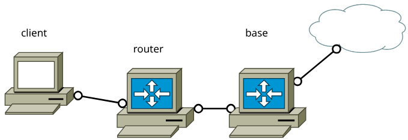
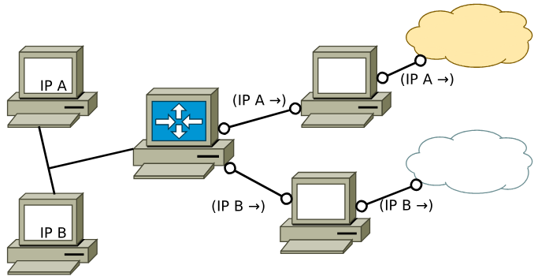

# Отступление от темы: настройка выхода в интернет для ВМ

^25b069

Перед погружением в разбор новых задач и вопросов сетевого уровня окончательно доведём до конца настройку выхода в интернет для виртуальных машин, которая понадобится для проверки сетей.

При настройке выхода в интернет с машины напрямую достаточно использовать автонастройку соответствующего интерфейса (`eth0` по умолчанию) через `dhcpcd`. Это автоматически добавляет настройку разрешения доменных имён (`DNS`-сервер), маршрутизацию по умолчанию и т.д.

`base`
```base
[root@base ~]# dhcpcd eth0  
dhcpcd-10.2.2 starting  
eth0: waiting for carrier  
eth0: carrier acquired  
eth0: soliciting a DHCP lease  
eth0: offered 10.0.2.15 from 10.0.2.2  
eth0: leased 10.0.2.15 for 86400 seconds  
eth0: adding route to 10.0.2.0/24  
eth0: adding default route via 10.0.2.2  

[root@base ~]# cat /etc/resolv.conf  
# Generated by dhcpcd from eth0.dhcp  
# /etc/resolv.conf.head can replace this line  
nameserver 10.0.2.3  
# /etc/resolv.conf.tail can replace this line  

[root@base ~]# ping -c1 www.ru  
PING www.ru (31.177.76.70) 56(84) bytes of data.  
64 bytes from shop.parking.nic.ru (31.177.76.70): icmp_seq=1 ttl=255 time=5.40 ms  
  
--- www.ru ping statistics ---  
1 packets transmitted, 1 received, 0% packet loss, time 0ms  
rtt min/avg/max/mdev = 5.395/5.395/5.395/0.000 ms
```

Однако для настройки доступа в интернет не напрямую, а через промежуточную машину, необходимо провести дополнительные настройки. Во-первых, организовать проброс пакетов через включение `ip_forward`. Во-вторых, настроить **трансляцию адресов** других машин. Обсудим чуть подробнее второй пункт.

Как видно из настроек `dhcpcd`, адреса машин описаны в диапазоне приватных сетей. В прошлой главе обсуждалось, что пакеты из такого диапазона не могут попадать в глобальную сеть, и на самом деле при настройке `dhcpcd` для **конкретного** устройства выводящим (логическим, на границе ВМ `VirtualBox` и реальной сетью) маршрутизатором производится целевая трансляция его адресов в адреса из допустимых диапазонов. Более конкретно технология `NAT` (`Network Address Translation`) будет обсуждаться в будущих главах, сейчас важным фактором является именно точечная подмена адреса именно для пакетов с настраиваемой машины. При получении пробрасываемых пакетов с других машин этот маршрутизатор будет просто перенаправлять их в интернет, где, естественно, они будут сброшены. Поэтому данную трансляцию необходимо поручить настраиваемой машине. Для этого сейчас будет использоваться специальная команда из `iptables`.

`base`
```base
[root@base ~]# sysctl net.ipv4.ip_forward=1  
[root@base ~]# iptables -t nat -A POSTROUTING -o eth0 -j MASQUERADE
```

Для проверки работы настроим второе устройство `router`, которое через `base` будет "дотягиваться" до интернета.

---
Здесь необходимо рассказать о специальном лайфхаке, работающем **только** на виртуальных машинах и **только** в рамках данного курса. При использовании [сценария Георгия](https://github.com/FrBrGeorge/vbsnap) `vbsnap` для настройки виртуальной машины в специальное поле `BIOS` `"SKU Number"` вписывается информационная строка, описывающая порт, за которым развёрнута виртуальная машина, и имена всех указанных в ней сетей.

`base`
```base
[root@base ~]# dmidecode | grep SKU  
       SKU Number: port2326.intnet
```

`router`
```router
[root@router ~]# dmidecode | grep SKU  
       SKU Number: port2327.intnet.deepnet
```

На основе этой строки встроенный в виртуальную машину сценарий `autonet` автоматически развёртывает сеть (включает `ip-forwarding`, задаёт `IP`-адреса, включает соответсвующие интерфейсы) на данном устройстве.

`router`
```router
[root@router ~]# ip a  
1: lo: <LOOPBACK,UP,LOWER_UP> mtu 65536 qdisc noqueue state UNKNOWN group default qlen 1000  
   link/loopback 00:00:00:00:00:00 brd 00:00:00:00:00:00  
   inet 127.0.0.1/8 scope host lo  
      valid_lft forever preferred_lft forever  
2: eth0: <BROADCAST,MULTICAST> mtu 1500 qdisc noop state DOWN group default qlen 1000  
   link/ether 08:00:27:fc:14:27 brd ff:ff:ff:ff:ff:ff  
   altname enp0s3  
3: eth1: <BROADCAST,MULTICAST> mtu 1500 qdisc noop state DOWN group default qlen 1000  
   link/ether 08:00:27:aa:ca:33 brd ff:ff:ff:ff:ff:ff  
   altname enp0s8  
4: eth2: <BROADCAST,MULTICAST> mtu 1500 qdisc noop state DOWN group default qlen 1000  
   link/ether 08:00:27:68:a0:0c brd ff:ff:ff:ff:ff:ff  
   altname enp0s9  
5: eth3: <BROADCAST,MULTICAST> mtu 1500 qdisc noop state DOWN group default qlen 1000  
   link/ether 08:00:27:12:7b:43 brd ff:ff:ff:ff:ff:ff  
   altname enp0s10  

[root@router ~]# autonet  

[root@router ~]# ip a  
1: lo: <LOOPBACK,UP,LOWER_UP> mtu 65536 qdisc noqueue state UNKNOWN group default qlen 1000  
   link/loopback 00:00:00:00:00:00 brd 00:00:00:00:00:00  
   inet 127.0.0.1/8 scope host lo  
      valid_lft forever preferred_lft forever  
2: eth0: <BROADCAST,MULTICAST> mtu 1500 qdisc noop state DOWN group default qlen 1000  
   link/ether 08:00:27:fc:14:27 brd ff:ff:ff:ff:ff:ff  
   altname enp0s3  
3: eth1: <BROADCAST,MULTICAST,UP,LOWER_UP> mtu 1500 qdisc fq_codel state UP group default qlen 1000  
   link/ether 08:00:27:aa:ca:33 brd ff:ff:ff:ff:ff:ff  
   altname enp0s8  
   inet 10.9.0.27/24 scope global eth1  
      valid_lft forever preferred_lft forever  
4: eth2: <BROADCAST,MULTICAST,UP,LOWER_UP> mtu 1500 qdisc fq_codel state UP group default qlen 1000  
   link/ether 08:00:27:68:a0:0c brd ff:ff:ff:ff:ff:ff  
   altname enp0s9  
   inet 10.4.0.27/24 scope global eth2  
      valid_lft forever preferred_lft forever  
5: eth3: <BROADCAST,MULTICAST> mtu 1500 qdisc noop state DOWN group default qlen 1000  
   link/ether 08:00:27:12:7b:43 brd ff:ff:ff:ff:ff:ff  
   altname enp0s10  
[root@router ~]#
```

Номер сети определяется по первой букве названия сети, номер хоста - по номеру порта данной виртуальной машины.

---

После настройки сетей на машинах необходимо указать для `router` маршрутизацию по умолчанию, а также вручную добавить `DNS`-сервер, после чего (с учётом настроек `base`) ему будет доступен выход в интернет:

`router`
```router
[root@router ~]# ip route add default via 10.9.0.26  
[root@router ~]# cat > /etc/resolv.conf  
nameserver 10.0.2.3  

[root@router ~]# ping -c1 www.ru  
PING www.ru (31.177.76.70) 56(84) bytes of data.  
64 bytes from shop.parking.nic.ru (31.177.76.70): icmp_seq=1 ttl=254 time=5.46 ms  
  
--- www.ru ping statistics ---  
1 packets transmitted, 1 received, 0% packet loss, time 0ms  
rtt min/avg/max/mdev = 5.464/5.464/5.464/0.000 ms  
[root@router ~]#
```

# Автоматизация сети

В прошлой главе относительно маршрутизации был разобран, вообще говоря, достаточно небольшой её блок, а именно базовая настройка путём **ручного** составления и обновления статических таблиц маршрутизации. Напомним, что по описанным в них правилам маршрутизация осуществляется на основании **только** идентификаторов пользователей: интерфейсного (`MAC`-адрес) и сетевого (`IP`-адрес).

В реальности же существует ряд задач, связанный с улучшением и автоматизацией маршрутизации. Во-первых, это решение **вопроса динамического обновления топологии сети**. При работе с глобальной сетью ручное распространение информации о, например, добавлении нового абонента унигда физически не представляется возможным. Следовательно, необходимо предусмотреть механизм, который будет автоматически корректировать и поддерживать актуальными таблицы маршрутизации всех устройств в системе (Для беспроводных сетей этот вопрос стоит ещё большим приоритетом, поскольку количество и местонахождение (и, следовательно, подключение к ближайшему маршрутизатору, например, `Wi-Fi`-роутеру) абонентов в них вообще не фиксированы. Но поскольку для упрощения понимания сути сетевых протоколов в курсе основной средой передачи данных рассматривается `Ethernet`, вопрос про топологию возник лишь сейчас). Во-вторых, встаёт вопрос **маршрутизации на основе данных пакета**. Использование **только** идентификаторов для управления передачей сообщений покрывает очень узкий спектр задач. При этом в большинстве случаев условия требуемой маршрутизации не должны быть связаны с идентификаторами в принципе. Например, необходимо разделить множество пользователей на две группы и распределять исходящий от них трафик по разным маршрутизаторам. При этом перечислить все идентификаторы каждой группы для явной статической маршрутизации не представляется возможным. В таком случае необходимо производить маршрутизацию по каким-то другим параметрам.

# Динамическое распространение таблиц маршрутизации

Протоколов решения вопроса динамического обновления топологии и распространения таблиц маршрутизации довольно много. Самым простым таким протоколом был [`RIP`](https://ru.wikipedia.org/wiki/RIP_(%D1%81%D0%B5%D1%82%D0%B5%D0%B2%D0%BE%D0%B9_%D0%BF%D1%80%D0%BE%D1%82%D0%BE%D0%BA%D0%BE%D0%BB)), который, по сути, раз в некоторый период времени производил широковещание таблиц маршрутизации между соседними абонентами, благодаря чему они обновляли и / или заменяли свои маршруты на другие допустимые при необходимости. Однако на данный момент протокол уже нигде не используется в виду невероятной нагрузки с его стороны на сеть.

Более сложные протоколы используют алгоритмы вычисления достижения абонентов в сети. Самым популярным из открытых протоколов выступает [`OSPF`](https://ru.wikipedia.org/wiki/OSPF). Его название (`Open Shortest Path First`) показывает, что кроме маршрутизации протокол также проводит вычисление минимальных путей достижения абонентов. Без вникания в сложную схему работы протокола, его действия можно описать так: `OSPF` строит граф связности сети, на основе некоторых внутренних параметров делает его взвешенным, вычисляет в нём с помощью алгоритма Дейкстры минимальные пути до абонентов, а после транслирует их в правила для маршрутизации пакетов.

Рассмотрим работу протокола на данном стенде:



Быструю настройку адресов и выхода в интернет для `base` возьмём из описания [настройки выхода в интернет](#^25b069).

Для работы с протоколом `OSPF` понадобится специальный [демон](https://en.wikipedia.org/wiki/Daemon_(computing)), который будет управлять настройками протоколов, обеспечивать их связность и т.д. В рамках курса рассматривается демон [BIRD](https://bird.network.cz/).

Для начала зафиксируем конфигурацию стенда:

```console
~/papillon_rouge: vbintnets
base:  
       eth1: alpha  
router:  
       eth1: alpha  
       eth2: beta  
client:  
       eth1: beta
~/papillon_rouge: 
```

В начале настроим `base`. Как уже было упомянуто, настройка выхода в интернет на `eth0`, а также настройка `IP` на `eth1` производится аналогично описанному в первом разделе главы.

`base`
```base
[root@base ~]# dhcpcd eth0  
dhcpcd-10.2.2 starting  
eth0: waiting for carrier  
eth0: carrier acquired  
eth0: soliciting a DHCP lease  
eth0: offered 10.0.2.15 from 10.0.2.2  
eth0: leased 10.0.2.15 for 86400 seconds  
eth0: adding route to 10.0.2.0/24  
eth0: adding default route via 10.0.2.2  
[root@base ~]# autonet  
[root@base ~]#
```

Для работы с демоном необходимо описать его конфигурационный файл `/etc/bird/bird.conf` (в дальнейшем для краткости - просто `bird.conf`)

`base#bird.conf`
```
router id 10.1.0.26;
protocol kernel {
        learn;                  # Learn all alien routes from the kernel (gathered by dhcpcd)
        scan time 20;           # Scan kernel routing table every 20 seconds
        ipv4 { export all; };             # Default is export none
}
protocol device {
        scan time 10;           # Scan interfaces every 10 seconds
}
protocol ospf SIMPLE {
        ipv4 { export all; };
        area 0.0.0.0 {
                interface "eth1" {
                };
        };
}
```

Разберём отдельные блоки этого конфигурационного файла:
 + `protocol ospf` - описание действий, связанных с `OSPF`-протоколом:
	 + указание пробрасывания **всей** `OSPF`-информации о доступных маршрутах по `IPv4` (`ipv4 { export all; };`) абсолютно всем пользователям за интерфейсом `eth1` (`area 0.0.0.0`)
 + `protocol kernel` - описание действий, связанных с таблицами маршрутизации ядра системы: 
	 + изучение и использование приходящей информации из внешних неописанных в `bird` протоколов (например, `DHCP` от настройки `eth0`), которые должны отражаться в `bird` (`learn`)
	 + экспорт информации о маршрутах из таблицы ядра
	 + периодичность проверки таблиц ядра (`scan time`)
 + `protocol device`- описание действий самого устройства: 
	 + периодичность сканирования интерфейсов для получения информации от них.

Теперь можно включить `BIRD` и проверить, что он автоматически настраивает базовую маршрутизацию по известным ему адресам:

`base`
```base
[root@base ~]# bird  # Включение BIRD
[root@base ~]# birdc  # BIRD Controller
BIRD 3.0.1 ready.  
bird> show route  
Table master4:  
10.1.0.0/24          unicast [SIMPLE 10:24:06.137] * I (150/10) [10.1.0.26]  
       dev eth1  
0.0.0.0/0            unicast [kernel1 10:24:07.037] * (10)  
       via 10.0.2.2 on eth0  
10.0.2.0/24          unicast [kernel1 10:24:07.037] * (10)  
       dev eth0  
10.2.0.0/24          unicast [SIMPLE 10:26:57.137] * I (150/20) [10.2.0.27]  
       via 10.1.0.27 on eth1  
bird>    
[root@base ~]#
```

Теперь настроим `router`. Командой `autonet` аналогично настраиваем сеть, после пишем для него конфигурационный файл:

`router#bird.conf`
```
router id 10.2.0.27;  
protocol kernel {  
       scan time 20;  
       ipv4 { export all; };  
}  
protocol device {  
       scan time 10;  
}  
protocol ospf SIMPLE {  
       ipv4 { export all; };  
       area 0.0.0.0 {  
               interface "eth1" {  
               };  
               interface "eth2" {  
               };  
       };  
}
```

Поскольку `router` должен передавать информацию для двух интерфейсов, в описании действий `OSPF`-протокола они указаны оба.

Запустим `BIRD` на нём и посмотрим, как обновляются таблицы:

`router`
```router
[root@router ~]# bird  
[root@router ~]# birdc  
BIRD 3.0.1 ready.  
bird> show route  
Table master4:  
10.1.0.0/24          unicast [SIMPLE 13:26:55.644] * I (150/10) [10.1.0.27]  
       dev eth1  
10.2.0.0/24          unicast [SIMPLE 13:26:50.644] * I (150/10) [10.2.0.27]  
       dev eth2  

# some time later

bird> show route  
Table master4:  
10.1.0.0/24          unicast [SIMPLE 13:26:55.644] * I (150/10) [10.1.0.26]  
       dev eth1  
10.2.0.0/24          unicast [SIMPLE 13:26:50.644] * I (150/10) [10.2.0.27]  
       dev eth2  

# some time later

bird> show route  
Table master4:  
10.1.0.0/24          unicast [SIMPLE 13:26:55.644] * I (150/10) [10.1.0.26]  
       dev eth1  
10.2.0.0/24          unicast [SIMPLE 13:26:50.644] * I (150/10) [10.2.0.27]  
       dev eth2  
0.0.0.0/0            unicast [SIMPLE 13:27:00.645] * E2 (150/10/10000) [10.1.0.26]  
       via 10.1.0.26 on eth1  
10.0.2.0/24          unicast [SIMPLE 13:27:00.645] * E2 (150/10/10000) [10.1.0.26]  
       via 10.1.0.26 on eth1  
bird>    
[root@router ~]#
```

В первый момент `router` знал лишь о своих собственных подключениях и описал два интерфейса с двумя сетями, в которых существует только он (абонент-получатель \[в квадратных скобках\] - его `IP`). Спустя время он распознал абонента `base` и поменял получателя на интерфейсе `eth1`. А ещё спустя некоторый промежуток времени `router` получил информацию от `base` о сетях далее и описал маршруты по умолчанию для них. 

Аналогично настроим `client` (не забывая про `autonet`):

`client#bird.conf`
```
router id 10.2.0.28;
protocol kernel {
        scan time 20;
        ipv4 { export all; };
}
protocol device {
        scan time 10;
}
protocol ospf SIMPLE {
        area 0.0.0.0 {
                interface "eth1" {
                };
        };
}
```

Включаем `bird` , ждём обновления таблиц, и после этого с `client` даже будет возможно выйти в интернет (при настроенной трансляции адресов!):

`client`
```client
[root@client ~]# bird  
[root@client ~]# birdc  
BIRD 3.0.1 ready.  
bird> show route  
Table master4:  
10.2.0.0/24          unicast [SIMPLE 14:14:50.896] * I (150/10) [10.2.0.27]  
       dev eth1  
0.0.0.0/0            unicast [SIMPLE 14:14:55.895] * E2 (150/20/10000) [10.1.0.26]  
       via 10.2.0.27 on eth1  
10.1.0.0/24          unicast [SIMPLE 14:14:55.895] * I (150/20) [10.1.0.26]  
       via 10.2.0.27 on eth1  
10.0.2.0/24          unicast [SIMPLE 14:14:55.895] * E2 (150/20/10000) [10.1.0.26]  
       via 10.2.0.27 on eth1  
bird>    

[root@client ~]# cat > /etc/resolv.conf  
nameserver 8.8.8.8  

[root@client ~]# ping -c3 google.com  
PING google.com (173.194.221.113) 56(84) bytes of data.  
64 bytes from lm-in-f113.1e100.net (173.194.221.113): icmp_seq=1 ttl=253 time=173 ms  
64 bytes from lm-in-f113.1e100.net (173.194.221.113): icmp_seq=2 ttl=253 time=24.5 ms  
64 bytes from lm-in-f113.1e100.net (173.194.221.113): icmp_seq=3 ttl=253 time=36.4 ms  
  
--- google.com ping statistics ---  
3 packets transmitted, 3 received, 0% packet loss, time 2002ms  
rtt min/avg/max/mdev = 24.473/77.875/172.801/67.297 ms  
[root@client ~]#
```

# Теоретический блок: Обеспечение глобальной связности

В разговоре о сетевом уровне стека протоколов до этого момента ещё никак не была затронута задача **обеспечения связности сети**. Здесь имеется в виду не описание маршрутизации между абонентами в сети, а само обеспечение доступности этих абонентов. В этом вопросе в качестве абонентов выступают не локальные машины, а целый конгломераты с единым администрированием, которые называются [автономными системами](https://ru.wikipedia.org/wiki/%D0%90%D0%B2%D1%82%D0%BE%D0%BD%D0%BE%D0%BC%D0%BD%D0%B0%D1%8F_%D1%81%D0%B8%D1%81%D1%82%D0%B5%D0%BC%D0%B0_%28%D0%98%D0%BD%D1%82%D0%B5%D1%80%D0%BD%D0%B5%D1%82%29). На текущий момент в мире существует более миллиона автономных систем, для них существуют `Full View` таблицы, с которыми оперирует специализированная техника под управлением крупных сетевых операторов, основная задача которых заключается в обеспечении доступности систем. Для вычисления доступности, анонса собственной доступности и обеспечения связности такой "мета-сети" автономных систем используется специальный протокол [`BGP`](https://ru.wikipedia.org/wiki/BGP).  На практике обычного использования сетей с небольшим количеством абонентов протокол `BGP` не встретится.

# Целевая маршрутизация

Как уже упоминалось в начале этой главы, табличная маршрутизация основывается на идентификаторах абонентов. Если говорить точнее, она основывается именно на данных о получателе (`Destination-based`). При этом не все задачи легко решаются именно таким способом принципом распространения пакетов в сети.

Для маршрутизации, основанной на других параметрах пакета можно использовать `Firewall`-ы, которые по внутренним данным передаваемого пакета определяют действия над ним. Однако данный способ достаточно ресурсозатранен, и, кроме того, немалая часть задач решается путём описания правил, наложенных на информацию об отправителе (`Source-based` маршрутизация), что не требует дополнительных **сложных** настроек.

В `Linux`-системах для решения этой задачи на устройстве заводится несколько таблиц маршрутизации, и обработка пакетов производится по одной из них согласно его свойствам:
 + Адресу отправителя
 + Портам получателя или отправителя
 + Интерфейсу взаимодействия
 + Протоколу
 + ...

Справедливости ради, изначально `Linux` уже поддерживает работу со множеством таблиц. Изначально для него описаны таблицы локального (`local`) и общего взаимодействия (`main`), а также описаны правила выбора соответствующей таблицы. Изначально таблицы просто выставлены по приоритетам (меньший номер означает больший приоритет) без дополнительных условий:

`base`
```base
[root@base ~]# ip rule  
0:      from all lookup local  
32766:  from all lookup main  
32767:  from all lookup default  

[root@base ~]# ip route list  
default via 10.0.2.2 dev eth0 proto dhcp src 10.0.2.15 metric 1002    
10.0.2.0/24 dev eth0 proto dhcp scope link src 10.0.2.15 metric 1002    
10.1.0.0/24 dev eth1 proto kernel scope link src 10.1.0.26    
10.1.0.0/24 dev eth1 proto bird scope link metric 32    
10.2.0.0/24 via 10.1.0.27 dev eth1 proto bird metric 32    

[root@base ~]# ip route list table local  
local 10.0.2.15 dev eth0 proto kernel scope host src 10.0.2.15    
broadcast 10.0.2.255 dev eth0 proto kernel scope link src 10.0.2.15    
local 10.1.0.26 dev eth1 proto kernel scope host src 10.1.0.26    
broadcast 10.1.0.255 dev eth1 proto kernel scope link src 10.1.0.26    
local 127.0.0.0/8 dev lo proto kernel scope host src 127.0.0.1    
local 127.0.0.1 dev lo proto kernel scope host src 127.0.0.1    
broadcast 127.255.255.255 dev lo proto kernel scope link src 127.0.0.1    
[root@base ~]#
```

Для описания правил выбора таблицы используется команда `ip rule`.

---

Рассмотрим применение целевой маршрутизации с правилами на следующем стенде:



Конфигурация стенда:

```console
~/papillon_rouge: vbintnets
srvA:  
       eth1: anet  
srvB:  
       eth1: bnet  
router:  
       eth1: anet  
       eth2: bnet  
       eth3: clinet  
hostA:  
       eth1: clinet  
hostB:  
       eth1: clinet
~/papillon_rouge: 
```


1. ***source routing*** - перенаправление пакетов абонентов между выходными маршрутизаторами на основе адреса отправителя:

`srvA`
```srvA
[root@srvA ~]# autonet  
[root@srvA ~]# dhcpcd eth0  
dhcpcd-10.2.2 starting  
eth0: waiting for carrier  
eth0: carrier acquired  
eth0: soliciting a DHCP lease  
eth0: offered 10.0.2.15 from 10.0.2.2  
eth0: leased 10.0.2.15 for 86400 seconds  
eth0: adding route to 10.0.2.0/24  
eth0: adding default route via 10.0.2.2  
[root@srvA ~]# iptables -t nat -A POSTROUTING -o eth0 -j MASQUERADE  
[root@srvA ~]#
```

`srvB`
```srvB
[root@srvB ~]# autonet  
[root@srvB ~]# dhcpcd eth0  
dhcpcd-10.2.2 starting  
eth0: waiting for carrier  
eth0: carrier acquired  
eth0: soliciting a DHCP lease  
eth0: offered 10.0.2.15 from 10.0.2.2  
eth0: leased 10.0.2.15 for 86400 seconds  
eth0: adding route to 10.0.2.0/24  
eth0: adding default route via 10.0.2.2  
[root@srvB ~]# iptables -t nat -A POSTROUTING -o eth0 -j MASQUERADE  
[root@srvB ~]#
```

`router`
```router
[root@router ~]# autonet  
[root@router ~]#
```

`hostA`
```hostA
[root@hostA ~]# autonet  
[root@hostA ~]#
```

`hostB`
```hostB
[root@hostB ~]# autonet  
[root@hostB ~]#
```

Адреса устройств на соответсвующих интерфейсах (при условии порядка создания их `srvA` -> `srvB` -> `router` -> `hostA` -> `hostB`):
```console
srvA:  
       eth1: anet      10.1.0.26/24
srvB:  
       eth1: bnet      10.2.0.27/24
router:  
       eth1: anet      10.1.0.28/24
       eth2: bnet      10.2.0.28/24
       eth3: clinet    10.3.0.28/24
hostA:  
       eth1: clinet    10.3.0.29/24
hostB:  
       eth1: clinet    10.3.0.30/24
```

Перейдём к непосредственной настройке маршрутизации. При простом задании маршрутов на `router` пакеты обоих `host`-абонентов будут перенаправляться на один, указанный в таблице маршрутизации `router`, `srv`-абонент, например, на `srvA`:

`srvA` - настройка для маршрутизации возвратных пакетов
```srvA
[root@srvA ~]# ip route add 10.3.0.0/24 via 10.1.0.28
[root@srvA ~]#
```

`srvB` - настройка для маршрутизации возвратных пакетов
```srvB
[root@srvB ~]# ip route add 10.3.0.0/24 via 10.2.0.28
[root@srvB ~]#
```

`router` - передача всех пакетов только на `srvA`
```router
[root@router ~]# ip route add default via 10.1.0.26
[root@router ~]#
```

`hostA` - достижение цели через `srvA`
```hostA
[root@hostA ~]# ip route add default via 10.3.0.28  
[root@hostA ~]# ping -c1 8.8.8.8  
PING 8.8.8.8 (8.8.8.8) 56(84) bytes of data.  
64 bytes from 8.8.8.8: icmp_seq=1 ttl=253 time=27.4 ms  
  
--- 8.8.8.8 ping statistics ---  
1 packets transmitted, 1 received, 0% packet loss, time 0ms  
rtt min/avg/max/mdev = 27.443/27.443/27.443/0.000 ms  

[root@hostA ~]# traceroute 8.8.8.8  
traceroute to 8.8.8.8 (8.8.8.8), 30 hops max, 60 byte packets  
1  _gateway (10.3.0.28)  0.396 ms  0.324 ms  0.325 ms  
2  10.1.0.26 (10.1.0.26)  0.622 ms  0.574 ms  1.236 ms  
...
23  8.8.8.8 (8.8.8.8)  20.960 ms *  27.120 ms  
[root@hostA ~]#
```

`hostB` - достижение цели через `srvA`
```hostB
[root@hostB ~]# ip route add default via 10.3.0.28
[root@hostB ~]# ping -c1 8.8.8.8  
PING 8.8.8.8 (8.8.8.8) 56(84) bytes of data.  
64 bytes from 8.8.8.8: icmp_seq=1 ttl=253 time=25.5 ms  
  
--- 8.8.8.8 ping statistics ---  
1 packets transmitted, 1 received, 0% packet loss, time 0ms  
rtt min/avg/max/mdev = 25.475/25.475/25.475/0.000 ms  

[root@hostB ~]# traceroute 8.8.8.8  
traceroute to 8.8.8.8 (8.8.8.8), 30 hops max, 60 byte packets  
1  _gateway (10.3.0.28)  1.971 ms  1.947 ms  1.917 ms  
2  10.1.0.26 (10.1.0.26)  0.603 ms  0.649 ms  0.548 ms  
...
21  8.8.8.8 (8.8.8.8)  21.240 ms * *  
[root@hostB ~]#
```

Для разделения трафика необходимо создать отдельную таблицу в точке разделения, и задать правило обращения к ней:

`router`
```router
[root@router ~]# ip route add default via 10.2.0.27 table 5  
# Описание правилас указанием целевой таблицы автоматически создаёт такую талицу

[root@router ~]# ip rule add from 10.3.0.30 table 5  
# Правило выбора таблицы при условии на адрес отправителя

[root@router ~]# ip rule list  
0:      from all lookup local  
32765:  from 10.3.0.30 lookup 5  
32766:  from all lookup main  
32767:  from all lookup default  

[root@router ~]# ip route list table 5  
default via 10.2.0.27 dev eth2    

[root@router ~]# ip route list table main  
default via 10.1.0.26 dev eth1    
10.1.0.0/24 dev eth1 proto kernel scope link src 10.1.0.28    
10.2.0.0/24 dev eth2 proto kernel scope link src 10.2.0.28    
10.3.0.0/24 dev eth3 proto kernel scope link src 10.3.0.28    
# В основной таблице при этом никаких изменений нет 
[root@router ~]#
```

`hostB` - достижение цели через `srvB`
```hostB
[root@hostB ~]traceroute 8.8.8.8.8  
traceroute to 8.8.8.8 (8.8.8.8), 30 hops max, 60 byte packets  
1  _gateway (10.3.0.28)  1.446 ms  1.424 ms  1.317 ms  
2  10.2.0.27 (10.2.0.27)  0.800 ms  0.705 ms  0.963 ms  
...
21  * * 8.8.8.8 (8.8.8.8)  26.490 ms  
[root@hostB ~]#
```


2. ***port routing*** - перенаправление пакетов абонентов между выходными маршрутизаторами на основе порта:

Добавим правило, согласно которому оба абонента будут обращаться к `srvB` при передаче пакетов на порт получателя 80 (например, при описании `http`-запроса):

`router`
```router
[root@router ~]# ip route add default via 10.2.0.27 table 8  
[root@router ~]# ip rule add dport 80 table 8  
[root@router ~]# ip rule list  
0:      from all lookup local  
32764:  from all dport 80 lookup 8  
32765:  from 10.3.0.30 lookup 5  
32766:  from all lookup main  
32767:  from all lookup default  
[root@router ~]#
```

`srvA`
```srvA
[root@srvA ~]# tcpdump -i eth1  
tcpdump: verbose output suppressed, use -v[v]... for full protocol decode  
listening on eth1, link-type EN10MB (Ethernet), snapshot length 262144 bytes

```

`srvB`
```srvB
[root@srvB ~]# tcpdump -i eth1  
tcpdump: verbose output suppressed, use -v[v]... for full protocol decode  
listening on eth1, link-type EN10MB (Ethernet), snapshot length 262144 bytes

```

`hostA`
```hostA
[root@hostA ~]# wget http://8.8.8.8  
--2025-03-23 17:12:18--  http://8.8.8.8/  
Connecting to 8.8.8.8:80...
```

`srvA`
```srvA
[root@srvA ~]# tcpdump -i eth1  
tcpdump: verbose output suppressed, use -v[v]... for full protocol decode  
listening on eth1, link-type EN10MB (Ethernet), snapshot length 262144 bytes

```

`srvB`
```srvB
[root@srvB ~]# tcpdump -i eth1  
tcpdump: verbose output suppressed, use -v[v]... for full protocol decode  
listening on eth1, link-type EN10MB (Ethernet), snapshot length 262144 bytes  
14:12:19.964327 IP 10.3.0.29.38406 > dns.google.http: Flags [S], seq 1503547083, win 64240  
, options [mss 1460,sackOK,TS val 2579626649 ecr 0,nop,wscale 5], length 0  
14:12:21.020442 IP 10.3.0.29.38406 > dns.google.http: Flags [S], seq 1503547083, win 64240  
, options [mss 1460,sackOK,TS val 2579627705 ecr 0,nop,wscale 5], length 0  
14:12:22.043938 IP 10.3.0.29.38406 > dns.google.http: Flags [S], seq 1503547083, win 64240  
, options [mss 1460,sackOK,TS val 2579628729 ecr 0,nop,wscale 5], length 0  
14:12:23.068456 IP 10.3.0.29.38406 > dns.google.http: Flags [S], seq 1503547083, win 64240  
, options [mss 1460,sackOK,TS val 2579629753 ecr 0,nop,wscale 5], length 0
...
```


