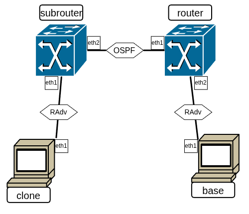

Продолжая говорить о сетевом уровне, хочется напомнить, что две основные задачи, решающиеся на этом уровне — это _глобальная идентификация_ пользователей и _маршрутизация_ в, вообще говоря, меняющейся топологии.

Касаемо идентификации мы рассмотрели структуру адреса, а также некоторые механизмы раздачи IPv6-адресов, однако схему глобальной идентификации мы пока не рассматривали.

## Автоматическая раздача адресов

При разговоре про LLA мы упоминали алгоритм SLAAC, позволяющий автоматически сгенерировать адрес на базе идентификатора интерфейсного уровня. Сгенерированный интерфейсный идентификатор используется для адреса в префиксе `fe80::/64`, после чего устройство проходит DAD-проверку на уникальность адреса и присваивает его себе.

Если задать в глобальном пространстве адресов некоторый префикс и выдать его группе абонентов, ничего не помешает им провести SLAAC, сделать адрес в заданном префиксе и использовать этот адрес как глобальный!

### ICMP Router Discovery

_ICMP RD_ это стандартный механизм динамической настройки конечных узлов. Он основан на протоколе ND и предназначен для передачи сообщений между маршрутизатор и его соседними узлами-абонентами (но никак не между маршрутизаторами). Эти сообщения, также как и другие ND-сообщения, не маршрутизируемы.

В рамках ICMP RD каждый конечный узел отправляет Multicast-запрос Router Solicitation (RS). Адрес передачи — `ff02::2` — описывает все доступные на данном сегменте связи (link-local) маршрутизаторы. То, является ли узел маршрутизатором, определяется по параметрам IP-forwarding-а. Со стороны маршрутизатора отправляется сообщение Router Advertisement (RA). Маршрутизатор может отправлять RA по запросу RS на точный адрес конечного узла или широковещательно на `ff02::1` с некоторым периодом. В случае, если сообщение RA приходит маршрутизатору, он просто его игнорирует. Вообще говоря, получая RA от маршрутизатора нельзя ничего сказать о его единственности.

В RA маршрутизатор передаёт информацию о себе и об известном ему окружении:
 + Параметры обрабатываемого им трафика;
 + Время жизни записи о default-маршруте до данного маршрутизатора (router lifetime);
 + Рекомендуемый hop limit;
 + MTU локальной среды;
 + …

Общая схема RA представлена здесь:

```
 0                   1                   2                   3
 0 1 2 3 4 5 6 7 8 9 0 1 2 3 4 5 6 7 8 9 0 1 2 3 4 5 6 7 8 9 0 1
+-+-+-+-+-+-+-+-+-+-+-+-+-+-+-+-+-+-+-+-+-+-+-+-+-+-+-+-+-+-+-+-+
|     Type      |     Code      |           Checksum            |
+-+-+-+-+-+-+-+-+-+-+-+-+-+-+-+-+-+-+-+-+-+-+-+-+-+-+-+-+-+-+-+-+
| Def Hop Limit |M|O| |Prf|     |        Router Lifetime        |
+-+-+-+-+-+-+-+-+-+-+-+-+-+-+-+-+-+-+-+-+-+-+-+-+-+-+-+-+-+-+-+-+
|                         Reachable Time                        |
+-+-+-+-+-+-+-+-+-+-+-+-+-+-+-+-+-+-+-+-+-+-+-+-+-+-+-+-+-+-+-+-+
|                        Retransmit Timer                       |
+-+-+-+-+-+-+-+-+-+-+-+-+-+-+-+-+-+-+-+-+-+-+-+-+-+-+-+-+-+-+-+-+
|   Type-Length-Value Options ...
+-+-+-+-+-+-+-+-+-+-+-+-+-+-+-+-+-+-+- . . .
```

Основные передаваемые секции:
 + Значение Hop Limit по умолчанию;
 + [Флаги](https://www.iana.org/assignments/icmpv6-parameters/icmpv6-parameters.xhtml#icmpv6-parameters-11);
 + Cрок действительности маршрута по умолчанию (сек); при 0 считается, что маршрута по умолчанию нет;
   + Все получаемые маршруты неявно первым hop-ом направляют строго на этот маршрутизатор;
 + Срок доступности любого соседа (мс) в этой локальной среде (сколько времени запись в ND-таблице пребывает в состоянии REACHABLE при отсутствии трафика с соседом); При 0 данное не определено;
 + Промежуток времени между повторными NS-запросами в этой локальной среде (мс); При 0 данное не определено;
 + [Опции](https://www.iana.org/assignments/icmpv6-parameters/icmpv6-parameters.xhtml#icmpv6-parameters-5) переменной длины в произвольном порядке:
   + Информация о префиксах
   + DNS-сервера
   + MTU
   + …

### Процесс автоматического назначения адресов с помощью ICMP RD

Для назначения адресов администратором на маршрутизатор изначально задаётся некоторый префикс для сегмента узлов. Маршрутизатор добавляет в RA-пакет опцию [Prefix information](https://datatracker.ietf.org/doc/html/rfc4861#section-4.6.2) (вообще говоря, может добавить сразу несколько таких опций за раз; опции в RA-пакете могут повторяться).

В опции указаны следующие параметры:
 + Префикс и его длина
 + Сроки действия (актуальности) префикса
 + Флаг **A**:
   + Если A==1, запускает механизм SLAAC по генерации адреса на основе интерфейсного идентификатора. В Linux при этом добавляет к адресу флаг _noprefixroute_. Он означает, что по заданному префиксу не будет никаких действий в таблице маршрутизации, инициированных этим адресом (от того, что адрес появился, запись в таблице про префикс не появится; от того, что адрес удалят, запись, если её добавят, не удалится)
 + Флаг **L**:
   + Если L==1, узел добавляет в таблицу маршрутизации on-link маршрут, считая, что адреса в этом префиксе принадлежат локальной сети;
   + Если L==0, узел не добавляет маршрут до префикса

Поскольку для IPv6 принципиальным является доступность абонентов на том же сегменте сети (on-link) или путем маршутизации (off-link), по тому, как определяется этот параметр адреса, есть целая выдержка в [RFC](https://tools.ietf.org/html/rfc4291):

```
On-link адресом (доступным на сегменте сети непосредственно за интерфейсом) считается адрес, если:
 — он принадлежит некоторому префиксу, про который получен on-link flag в Prefix Information;
 — соседний маршрутизатор является непосредственным получателем по этому адресу;
 — по данному адресу было получено Neighbour Advertisement сообщение;
 — От этого адреса пришло любое сообщение протоколов на базе Neighbour Discovery
```

В остальных случаях (и по умолчанию) адрес считается off-link — недоступным из данного сегмента без маршрутизации.

В Linux _при ручной настройке_ IP-адресов на интерфейсе сразу создаётся и маршрут к адресам из подсети (on-link). _При автоматической настройке_ IP на интерфейсе по объявлению от маршрутизатора (флаг A в RA-опции о префиксе) за добавление маршрута отвечает флаг L (1 — on-link, 0 — через маршрутизатор). Если префикс анонсируется с флагом L = 0, то отдельный маршрут вообще не назначается.Если префикс объявлен с L = 1 и узел генерирует себе в нём временные адреса (temporary), например, в рамках Privacy Extensions, то достаточно не более одной такой записи про весь префикс, а не для каждого адреса


### Настройка работы ICMP RD на маршрутизаторе

В ядре Linux реализована только клиентская часть ICMP RD (RS), а для рассылки RA требуется специальный [демон](https://en.wikipedia.org/wiki/Daemon_(computing)), который будет управлять настройками протоколов, обеспечивать их связность и т.д. В рамках курса рассматривается демон [BIRD](https://bird.network.cz/), хотя вариантов существует большое количество: [FRRouting](https://docs.frrouting.org/en/latest/ipv6.html), [radvd](https://radvd.litech.org/), подсистема Open vSwitch [OVN](https://ovn.org/), …

Рассмотрим топологию из двух устройств — абонента client и маршрутизатора srv.

```console
client:
        eth1: intnet
srv:
        eth1: intnet
```

На маршрутизаторе зададим настройки работы демона с протоколом. Все параметры BIRD пишутся в специальный конфигурационный файл /`etc/bird/bird.conf`.

`srv:/etc/bird/bird.conf`
```console
router id 0x100;

protocol device {
}
protocol radv NAME {
        interface "eth1" { };
}
```

Ключевые элементы здесь:
 + Идентификатор роутера; он не нужен, чтобы высылать RA-сообщения, но BIRD без него не работает. Он используется в других популярных протоколах маршрутизации для идентификации устройств в сети. Это 32-битное число, которое можно задавать в любом числовом формате, а также в формате четырёх октетов (так, как пишется IPv4-адрес), но так мы, конечно, делать не будем, дабы не путать его с откуда-то взявшимся IPv4-адресом;
 + Секция protocol device; она отвечает за сбор данных с интерфейсов: активность, назначенные адреса и др.
 + Секция protocol radv; секция именованная, поскольку BIRD позволяет описывать несколько секций одного протокола с разными именами, обращаться по этим именам;


 Теперь добавим на srv префикс для распространения. Для этого необходимо назначить на нужном интерфейсе адрес с соответствующим префиксом, чтобы BIRD «подхватил» его. Дополнительно префик можно указать в конфигурационном файле и добавить для него параметры опции Prefix Information.

`srv`
```console
[root@srv ~]# ip -6 addr add 2001:db8:1:cc::2/64 dev eth1
[root@srv ~]#
```

```console
…
protocol radv downstream {
        prefix 2001:db8:1:cc::/64 {
                valid lifetime 14400;
                preferred lifetime 10800;
                # etc.
        };
}
…
```

Теперь запустим на client монитор и последим, что будет происходить при настройке:

`client`
```console
[root@client ~]# ip -6 monitor label addr route

```

`srv`
```console
[root@srv ~]# bird
[root@srv ~]#
```

`client`
```console
[root@client ~]# ip -6 monitor label addr route
[ROUTE]default via fe80::a00:27ff:fe00:2f68 dev eth1 proto ra metric 1024 expires 1800sec pref medium
[ROUTE]2001:db8:1:cc::/64 dev eth1 proto kernel metric 256 expires 86400sec pref medium
[ADDR]3: eth1    inet6 2001:db8:1:cc:a00:27ff:fe0c:f4b/64 scope global dynamic mngtmpaddr proto kernel_ra
       valid_lft 86400sec preferred_lft 14400sec
[ROUTE]local 2001:db8:1:cc:a00:27ff:fe0c:f4b dev eth1 table local proto kernel metric 0 pref medium
```

Автоматически появился маршрут по умолчанию на LLA до srv (исключительно за счёт получения RA-сообщения от маршрутизатора), появился маршрут в указанную сеть, и в ней же client сгенерировал себе уникальный адрес.

Перезапустим BIRD, теперь предварительно включив на client tcpdump для просмотра самих RA-сообщений.

`client`
```console
[root@client ~]# tcpdump -i eth1 -xx -n -v icmp6
tcpdump: listening on eth1, link-type EN10MB (Ethernet), snapshot length 262144 bytes

```

`srv`
```console
[root@srv ~]# bird
[root@srv ~]#
```

При включении BIRD отправляется RA-сообщение с указанием префикса и параметров по умолчанию для него в опции Prefix Information.

`client`
```console
[root@client ~]# tcpdump -i eth1 -xx -n -v icmp6
tcpdump: listening on eth1, link-type EN10MB (Ethernet), snapshot length 262144 bytes

17:15:12.592434 IP6 (flowlabel 0x5dbd9, hlim 255, next-header ICMPv6 (58) payload length: 48) fe80::a00:27ff:fe00:2f68 > ff02::1: [icmp6 sum ok] ICMP6, router advertisement, length 48
        hop limit 64, Flags [none], pref medium, router lifetime 1800s, reachable time 0ms, retrans timer 0ms
          prefix info option (3), length 32 (4): 2001:db8:1:cc::/64, Flags [onlink, auto], valid time 86400s, pref. time 14400s
        0x0000:  3333 0000 0001 0800 2700 2f68 86dd 6005
        0x0010:  dbd9 0030 3aff fe80 0000 0000 0000 0a00
        0x0020:  27ff fe00 2f68 ff02 0000 0000 0000 0000
        0x0030:  0000 0000 0001 8600 d993 4000 0708 0000
        0x0040:  0000 0000 0000 0304 40c0 0001 5180 0000
        0x0050:  3840 0000 0000 2001 0db8 0001 00cc 0000
        0x0060:  0000 0000 0000

```


`srv`
```console
[root@srv ~]# birdc down
[root@srv ~]#
```

При отключении BIRD отправляется завершающее RA-сообщение, отзывающее информацию о default-маршруте (`router lifetime 0s`). При этом передаваемые данные по префиксам никак не изменились.

`client`
```console
[root@client ~]# tcpdump -i eth1 -xx -n -v icmp6
tcpdump: listening on eth1, link-type EN10MB (Ethernet), snapshot length 262144 bytes

17:15:12.592434 IP6 (flowlabel 0x5dbd9, hlim 255, next-header ICMPv6 (58) payload length: 48) fe80::a00:27ff:fe00:2f68 > ff02::1: [icmp6 sum ok] ICMP6, router advertisement, length 48
        hop limit 64, Flags [none], pref medium, router lifetime 1800s, reachable time 0ms, retrans timer 0ms
          prefix info option (3), length 32 (4): 2001:db8:1:cc::/64, Flags [onlink, auto], valid time 86400s, pref. time 14400s
        0x0000:  3333 0000 0001 0800 2700 2f68 86dd 6005
        0x0010:  dbd9 0030 3aff fe80 0000 0000 0000 0a00
        0x0020:  27ff fe00 2f68 ff02 0000 0000 0000 0000
        0x0030:  0000 0000 0001 8600 d993 4000 0708 0000
        0x0040:  0000 0000 0000 0304 40c0 0001 5180 0000
        0x0050:  3840 0000 0000 2001 0db8 0001 00cc 0000
        0x0060:  0000 0000 0000

17:15:22.780134 IP6 (flowlabel 0x5dbd9, hlim 255, next-header ICMPv6 (58) payload length: 48) fe80::a00:27ff:fe00:2f68 > ff02::1: [icmp6 sum ok] ICMP6, router advertisement, length 48
        hop limit 64, Flags [none], pref medium, router lifetime 0s, reachable time 0ms, retrans timer 0ms
          prefix info option (3), length 32 (4): 2001:db8:1:cc::/64, Flags [onlink, auto], valid time 86400s, pref. time 14400s
        0x0000:  3333 0000 0001 0800 2700 2f68 86dd 6005
        0x0010:  dbd9 0030 3aff fe80 0000 0000 0000 0a00
        0x0020:  27ff fe00 2f68 ff02 0000 0000 0000 0000
        0x0030:  0000 0000 0001 8600 e09b 4000 0000 0000
        0x0040:  0000 0000 0000 0304 40c0 0001 5180 0000
        0x0050:  3840 0000 0000 2001 0db8 0001 00cc 0000
        0x0060:  0000 0000 0000

2 packets captured
2 packets received by filter
0 packets dropped by kernel
```

## Динамическое распространение таблиц маршрутизации

Протоколов решения вопроса динамического обновления топологии и распространения таблиц маршрутизации довольно много. Предпосылками появления таких протоколов стала необходимость администрирования _реально_ большого количества абонентов в единой сети. Кроме самой настройки маршрутизации нужно было решать последствия больших сетей. Топология при большом количестве абонентов становилась очень сложной, кроме этого сеть всё больше становилась динамической — одни абоненты подключались, другие отключались, сами соединения могли быть нестабильны или перегружены. Необходимо было в автоматическом режиме решать все эти вопросы. ICMP RD для решения подобных задач совершенно не приспособен: между маршрутизаторами сообщения RA не передаются по требованию протокола (как раз чтобы не начать фиктивно представлять on-link сети там, где их нет), кроме этого протокол и так перегружен опциями и параметрами.

Среди всех протоколов динамической маршрутизации основную нишу заняли протоколы, которые используют алгоритмы вычисления достижения абонентов в сети. Самым популярным из открытых протоколов выступает [`OSPF`](https://ru.wikipedia.org/wiki/OSPF). Его название (`Open Shortest Path First`) показывает, что кроме маршрутизации протокол также проводит вычисление минимальных путей достижения абонентов. Без вникания в сложную схему работы протокола, его действия можно описать так: `OSPF` строит граф связности сети, на основе некоторых внутренних параметров делает его взвешенным, вычисляет в нём с помощью алгоритма Дейкстры минимальные пути до абонентов, а после транслирует их в правила для маршрутизации пакетов.

Работает протокол с помощью всё тех же демонов маршрутизации. В курсе рассматривается версия протокола OSPFv3, поскольку только с этой версии поддерживается работа с IPv6-маршрутами. При этом в OSPFv3 в качестве адресов отправителя и получателя используются только link-local адреса, что упрощает его внутреннюю логику и конфигурацию (не нужно самому заниматься IP-нумерацией промежуточных линков, на каждую машину их прописывать, следить за непересечением, порождать host routes про эти адреса).

Рассмотрим работу протокола на данном стенде:



```console
clone:
        eth1: intnet
subrouter:
        eth1: intnet
        eth2: deepnet
router:
        eth1: deepnet
        eth2: srvnet
base:
```

Для настройки адресов на абонентах будем использовать ICMP RD, а для передачи информации между маршрутизаторами — OSPF.

Настройки BIRD у router и subrouter схожи, важно не перепутать интерфейсы:

`clone`
```console
[root@clone ~]# ip link set eth1 up
[root@clone ~]#
```

`base`
```console
[root@base ~]# ip link set eth1 up
[root@base ~]#
```

`router`
```console
[root@router ~]# ip link set eth1 up
[root@router ~]# ip link set eth2 up
[root@router ~]# sysctl net.ipv6.conf.all.forwarding=1
[root@router ~]# cat /etc/bird/bird.conf
router id 0x200;

protocol device { }

protocol radv downstream {
        interface "eth2" { };
}

protocol direct { ipv6; }

protocol kernel {
        ipv6 { export all; };
}

protocol ospf v3 SIMPLE {
        ipv6 { export all; };
        area 0 {
                interface "eth1" { };
        };
}
[root@router ~]#
[root@router ~]# ip addr add dev eth2 2001:db8:0:aa::1/64
[root@router ~]#
[root@router ~]# bird
```

`subrouter`
```console
[root@subrouter ~]# ip link set eth1 up
[root@subrouter ~]# ip link set eth2 up
[root@subrouter ~]# sysctl net.ipv6.conf.all.forwarding=1
[root@subrouter ~]# cat /etc/bird/bird.conf
router id 0x201;

protocol device { }

protocol radv downstream {
        interface "eth1" { };
}

protocol direct { ipv6; }

protocol kernel {
        ipv6 { export all; };
}

protocol ospf v3 SIMPLE {
        ipv6 { export all; };
        area 0 {
                interface "eth2" { };
        };
}
[root@subrouter ~]#
[root@subrouter ~]# ip addr add dev eth1 2001:db8:0:dd::1/64
[root@subrouter ~]#
[root@subrouter ~]# bird
```

После запуска в течение некоторого времени маршрутизаторы обмениваются данными со всеми:
 + С абонентами относительно выдачи им адресов через ICMP RD
 + Друг с другом для обмена маршрутами

`router`
```console
[root@router ~]# birdc show ospf n
BIRD 3.2.0 ready.
SIMPLE:
Router ID       Pri          State      DTime   Interface  Router IP
0.0.2.1           1     2-Way/Other     39.758  eth1       fe80::a00:27ff:feaa:ff64
[root@router ~]# birdc show route
BIRD 3.2.0 ready.
Table master6:
2001:db8:0:aa::/64   unicast [direct1 02:20:57.268] * (240)
        dev eth2
[root@router ~]# birdc show ospf state
BIRD 3.2.0 ready.

area 0.0.0.0

        router 0.0.2.0
                distance 0
                network [0.0.2.1-4] metric 10
                external 2001:db8:0:aa::/64 metric2 10000

        router 0.0.2.1
                distance 10
                network [0.0.2.1-4] metric 10
                external 2001:db8:0:dd::/64 metric2 10000

        network [0.0.2.1-4]
                distance 10
                router 0.0.2.1
                router 0.0.2.0
[root@router ~]#
```

`subrouter`
```console
[root@subrouter ~]# birdc show route
BIRD 3.2.0 ready.
Table master6:
2001:db8:0:dd::/64   unicast [direct1 02:20:55.281] * (240)
        dev eth1
2001:db8:0:aa::/64   unicast [SIMPLE 02:21:46.379] * E2 (150/10/10000) [0.0.2.0]
        via fe80::a00:27ff:fe9e:ecc9 on eth2
[root@subrouter ~]#
```

`clone`
```console
[root@clone ~]# ip a show eth1
3: eth1: <BROADCAST,MULTICAST,UP,LOWER_UP> mtu 1500 qdisc fq_codel state UP group default qlen 1000
    link/ether 08:00:27:d7:c7:67 brd ff:ff:ff:ff:ff:ff
    altname enp0s8
    altname enx080027d7c767
    inet6 2001:db8:0:dd:a00:27ff:fed7:c767/64 scope global dynamic mngtmpaddr proto kernel_ra
       valid_lft 86205sec preferred_lft 14205sec
    inet6 fe80::a00:27ff:fed7:c767/64 scope link proto kernel_ll
       valid_lft forever preferred_lft forever
[root@clone ~]# ip -6 route
2001:db8:0:dd::/64 dev eth1 proto kernel metric 256 expires 86181sec pref medium
fe80::/64 dev eth1 proto kernel metric 256 pref medium
default via fe80::a00:27ff:fee5:5363 dev eth1 proto ra metric 1024 expires 1581sec hoplimit 64 pref medium
[root@clone ~]#
```

`base`
```console
[root@base ~]# ip a show eth1
3: eth1: <BROADCAST,MULTICAST,UP,LOWER_UP> mtu 1500 qdisc fq_codel state UP group default qlen 1000
    link/ether 08:00:27:6b:59:0a brd ff:ff:ff:ff:ff:ff
    altname enp0s8
    altname enx0800276b590a
    inet6 2001:db8:0:aa:a00:27ff:fe6b:590a/64 scope global dynamic mngtmpaddr proto kernel_ra
       valid_lft 86197sec preferred_lft 14197sec
    inet6 fe80::a00:27ff:fe6b:590a/64 scope link proto kernel_ll
       valid_lft forever preferred_lft forever
[root@base ~]# ip -6 route
2001:db8:0:aa::/64 dev eth1 proto kernel metric 256 expires 86189sec pref medium
fe80::/64 dev eth1 proto kernel metric 256 pref medium
default via fe80::a00:27ff:fe0f:12c dev eth1 proto ra metric 1024 expires 1589sec hoplimit 64 pref medium
[root@base ~]#
```

После обмена маршрутами между clone и srv устанавливается связь:

`base`
```console
[root@base ~]# traceroute -q2 -N1 2001:db8:0:dd:a00:27ff:fed7:c767
traceroute to 2001:db8:0:dd:a00:27ff:fed7:c767 (2001:db8:0:dd:a00:27ff:fed7:c767), 30 hops max, 80 byte packets
 1  2001:db8:0:aa::1 (2001:db8:0:aa::1)  0.780 ms  0.237 ms
 2  2001:db8:0:dd::1 (2001:db8:0:dd::1)  0.382 ms  0.333 ms
 3  2001:db8:0:dd:a00:27ff:fed7:c767 (2001:db8:0:dd:a00:27ff:fed7:c767)  0.711 ms  0.471 ms
[root@base ~]#
```

### Обеспечение глобальной связности

Если увеличивать сеть ещё больше, возникают новые проблемы. Даже при динамической маршрутизации объёмы покрываемых абонентов были бы настолько большими, что никаким образом не уместились бы в таблицы маршрутизации. Поэтому глобальная сеть разделяется на [_автономные системы_](https://ru.wikipedia.org/wiki/%D0%90%D0%B2%D1%82%D0%BE%D0%BD%D0%BE%D0%BC%D0%BD%D0%B0%D1%8F_%D1%81%D0%B8%D1%81%D1%82%D0%B5%D0%BC%D0%B0_%28%D0%98%D0%BD%D1%82%D0%B5%D1%80%D0%BD%D0%B5%D1%82%29). Это системы под единым администрированием, с единой политикой управления и маршрутизации. Внутри таких автономных систем развёртываются протоколы динамической маршрутизации, отлично решающие поставленные им задачи.

Право объединения множества устройств в одну автономную систему можно получить напрямую от [IANA](https://ru.wikipedia.org/wiki/IANA) или специальных региональных регистратур. Между автономными системами для маршрутизации используется протокол [BGP](https://ru.wikipedia.org/wiki/BGP). Во-первых, это протокол маршрутизации по вектору пути, тогда как большинство современных протоколов динамической маршрутизации в автономных системах (в частности, OSPF) — протоколы маршрутизации по состоянию канала. В BGP возможна настройка доступности автономной системы (например, запрет трафика недружественных государств через данную АС) и безпетельное вычисление путей между ними.

Для автономных систем вполне возможно построить полную таблицу маршрутов (систем всего [около 250000](https://bgp.potaroo.net/cgi-bin/plot6a?file=bgp-active.txt&descr=BGP+Entries+-+FIB&ylabel=BGP+Entries+-+FIB&range=--OR--&StartDate=2005-03-01&EndDate=now&yrange=Auto&ymin=&ymax=&Width=1&Height=1&with=Step&logscale=linear)), такой способ полезен, если вы управляете несколькими АС и хотите перенаправлять свой трафик через заранее вычисленные более выгодные пути.

## Домашнее задание

_Пригодится в задании_: на маршрутизаторе можно назначить глобальный адрес /128, не связанный с подсетями или реальными интерфейсами, прямо на lo.

```console
[root@router ~]# ip a add 2001:db8::200 dev lo
[root@subrouter ~]# ip a add 2001:db8::201 dev lo
```

Тогда, при наличии protocol direct, маршрут до него распределится в другие протоколы, и с этого глобального адреса можно будет отправлять ICMP-отлупы для traceroute.

---

**Топология**:


 + Маршрутизатор с default-маршрутом "в интернет": gw
 + Ещё два маршрутизатора, резервирующих друг друга: r1 и r2
   + у обоих: один интерфейс в сторону base, другой в общую среду с gw
   + r1, r2 и gw находятся в одном интнете
 + Маршрутизатор первого хопа: base. Подключен к 3 интнетам:
   + сеть с r1
   + сеть с r2
   + сеть с client
 + Клиент client — «просто работает»

**Предварительная настройка**

 + gw: OSPF в сторону r1 и r2
 + r1, r2: OSPF на обоих интерфейсах

 + base: рассылка RA в сторону client, на остальных интерфейсах OSPF-область
   + Выдать машине client глобальный IP-префикс
 + Там, где надо, включить net.ipv6.conf.all.forwarding
 + На маршрутизаторах назначить глобальные адреса: ip addr add 2001:db8::201 dev lo
   + они будут видны в выводе traceroute
 + На gw указать в BIRD статический маршрут до ::/0 через адрес fe80::2 на интерфейсе eth0 (по умолчанию VirtualBox включает на eth0 режим, в котором он там будет);

_Нужно достичь доступности между client и gw_

_Дополнительное условие_: никаких заранее заданных маршрутов в таблице маршрутизации ядра, маршруты приезжают по OSPF и ICMP RD

**Отчёт** (конфигурацию bird надо показывать, даже если вы его на данном хосте не использовали)

_client_
 + ip -6 addr
 + ip -6 route
 + grep "^[^#]" /etc/bird/bird.conf

_base_
 + ip -6 addr
 + ip -6 route
 + grep "^[^#]" /etc/bird/bird.conf
 + birdc show ospf n
 + birdc show ospf state

_r1, r2_
 + ip -6 addr
 + ip -6 route
 + grep "^[^#]" /etc/bird/bird.conf
 + birdc show ospf n
 + birdc show ospf state

_gw_
 + ip -6 addr
 + ip -6 route
 + grep "^[^#]" /etc/bird/bird.conf
 + birdc show ospf n
 + birdc show ospf state
 + ping -c3 <client>
   + <client> — IP-адрес клиента
 + printf '' | timeout 7 netcat <client> 22 (вывод будет непустым)

Далее, в том же отчёте: поморгать r1 и r2 во время хождения пингов.
 + на машине client: traceroute -n -m6 3fff::242
 + погасить оба интерфейса на r1; подождать 20-30 секунд сходимости
 + на машине client: traceroute -n -m6 3fff::242
 + погасить оба интерфейса на r2, поднять на r1; подождать 20-30 секунд сходимости
 + на машине client: traceroute -n -m6 3fff::242

Пять отчётов с названиями report.05.gw, report.05.r1, report.05.r2, report.05.base, report.05.client переслать одним письмом в качестве приложений на uneexlectures@cs.msu.ru. В теме письма должно встречаться слово LinuxNetwork2027