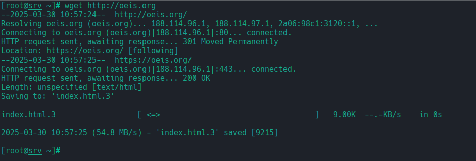
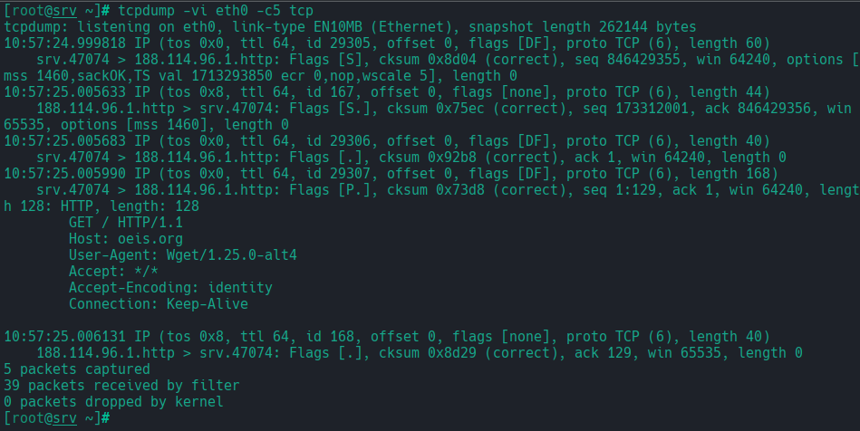

# Общая теория

В предыдущих главах были описаны уровни стека протоколов, обеспечивающие связность самой сети, доступность абонентов в ней и т.д. Транспортный уровень, которому посвящена данная глава, направлен непосредственно на контроль и управление передачей данных.

В рамках транспортного уровня `Bottom-half` целью является обеспечение **цельности передаваемых данных и надёжности передачи**. При работе с данными необходимо контролировать, что все **отправленные данные достигли получателя**. В случае множества пакетов необходимо также следить за их порядком. Для обеспечения надёжности передачи производится **управление контролем передачи**. Получатель и отправитель организовывают двустороннее соединение, проверяют доступность обеих сторон. При передаче данных в качестве обратной связи передаются данные о состоянии передаваемых пакетов (подтверждение доставки, ошибки, ...), а также о состоянии канала для корректировки скорости и / или интенсивности передачи.

Однако, из всего многообразия требований этой цели есть важное исключение: в случае работы не со _множеством связанных пакетов_, а с _одним пакетом_ (полностью описывающим всю передаваемую информацию) весь жёсткий контроль и управление передачей практически пропадают. Для одного пакета сама его доставка уже гарантирует целостность передачи. Управления контролем передачи также нет: отдельного соединения получателя и отправителя не требуется, относительно передачи сообщения и состоянии канала (а эти данные нужны для корректировки последующей передачи) вопрос даже не поднимается по причине отсутствия последующей передачи как таковой.

В связи с этим весь пласт передаваемых данных разбивается на две группы: **поток данных** (логически связанное множество пакетов, для которых важны полная (вообще говоря, для некоторых прикладных приложений допустимы потери, но общей логики этого низлежащего уровня это не меняет) и последовательная передача) и **датаграмма** (отдельно существующий и полностью описывающий передаваемые данные единичный пакет).

`Top-half` целью уровня стоит **различие потоков и управление ими**. В рамках этой задачи необходимо идентифицировать не просто абонентов в сети, а также раздельные потоки (или датаграммы) с одного устройства, поскольку они могут быть логически связаны с разными прикладными протоколами верхнего уровня. Для этого кроме привычных идентификаторов - адреса отправителя и адреса получателя - к соответствующих передаваемых объектам (потокам или датаграммам) добавляется ещё два: **порт отправителя и порт получателя**. Это позволяет отслеживать параллельно транслирующиеся в сеть данные от разных приложений с одного устройства.

При работе с транспортными протоколами заметна их ассиметричная природа, в связи с чем возникают понятия "клиента" и "сервера". В случае работы с потоком данных передача, как уже было отмечено, вообще говоря, двунаправленная. Тем не менее, для обозначения взаимодействующих абонентов принято "клиентом" называть инициирующую передачу данных сторону, а "сервером" - принимающую эти данные сторону.

В данной главе будут рассмотрены два основных протокола передачи данных транспортного уровня: `TCP` для потока данных и `UDP` для датаграмм. Основные различия этих протоколов в описанных выше требованиях указаны в таблице:


| TCP       | vs.                           | UDP  |
| --------- | ----------------------------- | ---- |
| Да        | Подключение                   | Нет  |
| Да        | Подтверждения                 | Нет  |
| Да        | Отслеживание цельности потока | Нет  |
| Да        | Отслеживание качества потока  | Нет  |
| Несколько | Количество пакетов            | Один |

# `TCP`

[Transmission Control Protocol](https://en.wikipedia.org/wiki/Transmission_Control_Protocol) описывает правила работы с потоками данных. Его основными задачами являются:
 + Установление и поддержка (и завершение) **двунаправленного** соединения;
 + Подтверждение доставки каждого пакета;
 + Уведомление об ошибках передачи, а также повторная передача при отсутствии уведомлений;
 + Контроль перегрузок сети (за счёт технологии `Sliding Window`);
 + Поддержка целостности потока;

Для идентификации соединения используется выше описанный набор из двух адресов и двух портов взаимодействующих устройств. Некоторые порты явно закреплены за существующими сервисами, для `Linux` их описание есть в файле `/etc/services`

```console
~/papillon_rouge: cat /etc/services | grep -E ' ((80/)|(443/))'
http               80/tcp  
http               80/udp  
www                80/tcp  
www                80/udp  
www-http           80/tcp  
www-http           80/udp  
http               80/sctp  
https             443/tcp  
https             443/udp  
https             443/sctp
```

## Sequential number

При работе с потоком данных необходимо, во-первых, уметь в случае переупорядочивания передаваемых пакетов **восстановить их последовательность**, а, во-вторых, при потере или удвоении пакетов определять это (т.е. поддерживать **целостность даных**). Для этих задач в каждом пакете передаётся специальное число `Sequential Number`(`SEQN`), изначально случайно генерирующееся у клиента, и после увеличивающееся в каждом пакете на объём уже переданных данных. Таким образом, несоответствие объёму полученных данных и текущему `SEQN` (логично, за вычетом начального значения) определяет потерю данных при передаче, а нарушение последовательности `SEQN` (очевидно, возрастающей) говорит о необходимости переупорядочивания пакетов.

## Подключение

Для управления соединением в пакетах передаются служебные данные - **флаги**. При установлении двунаправленного соединения используется технология трёх рукопожатий (`3-way handshake`) (Сокращения далее: флаг `SYN` — запрос на подключение + передача начального `SEQN`, флаг `FIN` — запрос на отключение, флаг `ACK` — подтверждение получения пакета; `PAYLOAD` - информационная нагрузка пакета):

 + Client → ($\text{SYN}_1$) → Server
 + Client ← ($\text{ACK}_1+\text{SYN}_2$) ← Server
 + Client → ($\text{ACK}_2+\text{PAYLOAD}$) → Server
 + …
 + Кто-то первый → ($\text{FIN}_1$) → Кто-то второй
 + Кто-то первый ← ($\text{ACK}_1+\text{FIN}_2$) ← Кто-то второй
 + Кто-то первый → ($\text{ACK}_2$) → Кто-то второй

Сейчас данная простая структура обросла множеством технологий, оптимизирующих передачу. Однако её основа прослеживается везде.

Рассмотрим простой пример подключения, для этого создадим машину, настроим на ней выход в интернет (`dhcpcd eth0`) и проследим `TCP`-запрос.

	Для отслеживания потока на одной машине пользуемся `tmux`: 
	 - Ctrl+b % (зажали пару клавиш, отпустили, нажали процент): Вертикальное деление окна
	 - Ctrl+b ": Горизонтальное деление окна
	 - Ctrl+b o: Переключение между окнами





В `tcpdump` в квадратных скобках пакету указываются управляющие флаги. Точкой обозначается подтверждение получения пакета (дополнительно `ack` прописывается далее в описании пакета). **Три рукопожатия** и дальнейшее подтверждение получения пакетов явно считывается.

## Обеспечение надёжности соединения. `Sliding window protocol`

В рамках работы с `TCP` обязательным является подтверждение каждого передаваемого пакета. Следовательно, без оптимизации этого процесса передача данных увеличивается, минимум, вдвое (без учёта потери пакетов, переотправок и т.д.). Для ускорения процесса передачи используется технология ["скользящего окна"](https://en.wikipedia.org/wiki/Sliding%20window%20protocol), позволяющая передавать какое-то количество пакетов без подтверждения. Подробнее разберём данный протокол.

---

**Окном** называется это последовательная группа пакетов из потока, которую можно передавать или получать без подтверждения каждого. 

При получении очередного пакета окно «сдвигается» на следующий ещё не полученный. Если пакеты идут с разной скоростью или пропадают, в окне получателя образуется «недопринятая» область:

 + Непрерывное начало потока уже получено целиком
 + Окно приёма из N пакетов
	 + Первый пакет в окне ещё не получен (сразу после получения начало окна сдвигается)
	 + Далее — какие-то пакеты в окне получены (вне очереди), какие-то — нет
 + Остальные пакеты потока пока только предполагаются

При отправлении `TCP` дожидается, пока каждому отправленному пакету придёт подтверждение (годится и подтверждение о приёме одного из _следующих_ пакетов, поскольку согласно протоколу это **гарантирует** подтверждение всех предыдущих пакетов). Если некоторые подтверждения по тем или иным причинам не пришли, образуется «недопереданная» область.

 + Непрерывное начало потока уже передано.
 + Окно передачи из N пакетов
	 + Первый пакет в окне отправлен, но ещё не подтверждён (как только подтверждение пришло, начало окна сдвигается)
	 + Далее — какие-то пакеты в окне уже отправлены, какие-то — ещё нет, но подтверждённых среди них нет (подтверждение пакета M автоматически означает, что пакеты M-k тоже уже получены)
 + Остальные пакеты потока пока только предполагаются

На логике работы окна построены алгоритмы действий для получателя и отправителя. В действительности, окно может быть не только фиксированного размера, но и масштабироваться в зависимости от нагрузки сети, способностей абонентов обрабатывать поток и т.д. Для более подробного изучения протокола, а также самостоятельного тестирования его работы рекомендуется прочитать [статью на Хабре](https://habr.com/ru/articles/336780/), попробовать исследовать [тестовое приложение](https://www.tkn.tu-berlin.de/teaching/rn/animations/gbn_sr/), изучить [видеоматериал](https://www.youtube.com/watch?v=lk27yiITOvU) по работе алгоритмов. Для изучения действий получателя и отправителя можно обратиться к [конспектам Георгия](https://uneex.org/LecturesCMC/LinuxNetwork2025/06_TransportProtocols).

# `UDP`

[`User Datagram Protocol`](https://en.wikipedia.org/wiki/User_Datagram_Protocol) описывает правила работы с датаграммами. Поскольку передача в данном виде соединения ведётся в виде единичного пакета небольшого размера, не требуется установки соединения, а также отсутствует подтверждение о получении пакета. Если же оно необходимо для отправителя, то контроль его получения ложится на прикладной уровень протоколов. Такой способ организации соединения упрощает взаимодействие запрос-ответных сервисов, порождая не 7-9 пакетов в обе стороны, а ровно по одному от клиента и от сервера.

На `UDP` работает большинство прикладных протоколов, работающих на запросах, например, `DNS`, `DHCP`, `NTP`.

# Использование netcat и socat

Для работы с сетевым подключением через `TCP` и `UDP` можно воспользоваться утилитами `netcat`и  `socat`.

---

`netcat` - утилита для работы с текстовыми данными в сети. `netcat` может работать, как клиент, отправляя запросы, так и как сервер, получая некоторую информацию.

Разберём работу `netcat` на примере:
```console
~/papillon_rouge: vbintnets
srv:  
       eth1: intnet  10.9.0.26/24
relay:  
       eth1: intnet  10.9.0.27/24
       eth2: deepnet
```

На локальных машинах 22й порт закреплён за сервисом `SSH`

`srv`
```srv
[root@srv ~]# ss -ltnp  
State    Recv-Q   Send-Q     Local Address:Port     Peer Address:Port  Process                            
LISTEN   0        128              0.0.0.0:22            0.0.0.0:*      users:(("sshd",pid=733,fd=3))     
[root@srv ~]# 
```

Настроим сети на машинах (`autonet`, адреса машин указаны выше) и обратимся с `relay` на `srv`:

`srv`
```srv
[root@srv ~]# tcpdump -vvi eth1 tcp      
tcpdump: listening on eth1, link-type EN10MB (Ethernet), snapshot length 262144 bytes
```

`relay`
```relay
[root@relay ~]# netcat 10.9.0.26 22  
SSH-2.0-OpenSSH_9.6  
exit  
Invalid SSH identification string.  
[root@relay ~]#
```

`srv`
```srv
[root@srv ~]# tcpdump -vvi eth1 tcp      
tcpdump: listening on eth1, link-type EN10MB (Ethernet), snapshot length 262144 bytes  
20:14:19.614716 IP (tos 0x0, ttl 64, id 44886, offset 0, flags [DF], proto TCP (6), length 60)  
   10.9.0.27.48576 > srv.ssh: Flags [S], cksum 0x0c1e (correct), seq 2074221602, win 64240, options [m  
ss 1460,sackOK,TS val 3327529147 ecr 0,nop,wscale 5], length 0  
20:14:19.614773 IP (tos 0x0, ttl 64, id 0, offset 0, flags [DF], proto TCP (6), length 60)  
   srv.ssh > 10.9.0.27.48576: Flags [S.], cksum 0x1475 (incorrect -> 0xb37b), seq 1007052852, ack 2074  
221603, win 65160, options [mss 1460,sackOK,TS val 3758477496 ecr 3327529147,nop,wscale 5], length 0  
20:14:19.615935 IP (tos 0x0, ttl 64, id 44887, offset 0, flags [DF], proto TCP (6), length 52)  
   10.9.0.27.48576 > srv.ssh: Flags [.], cksum 0xd8f5 (correct), seq 1, ack 1, win 2008, options [nop,  
nop,TS val 3327529148 ecr 3758477496], length 0  
20:14:19.636503 IP (tos 0x0, ttl 64, id 64296, offset 0, flags [DF], proto TCP (6), length 73)  
   srv.ssh > 10.9.0.27.48576: Flags [P.], cksum 0x1482 (incorrect -> 0x10fd), seq 1:22, ack 1, win 203  
7, options [nop,nop,TS val 3758477518 ecr 3327529148], length 21: SSH: SSH-2.0-OpenSSH_9.6  
20:14:19.637078 IP (tos 0x0, ttl 64, id 44888, offset 0, flags [DF], proto TCP (6), length 52)  
   10.9.0.27.48576 > srv.ssh: Flags [.], cksum 0xd8b5 (correct), seq 1, ack 22, win 2008, options [nop  
,nop,TS val 3327529169 ecr 3758477518], length 0  
20:14:27.966125 IP (tos 0x0, ttl 64, id 44889, offset 0, flags [DF], proto TCP (6), length 57)  
   10.9.0.27.48576 > srv.ssh: Flags [P.], cksum 0xdf32 (correct), seq 1:6, ack 22, win 2008, options [  
nop,nop,TS val 3327537498 ecr 3758477518], length 5  
20:14:27.966213 IP (tos 0x0, ttl 64, id 64297, offset 0, flags [DF], proto TCP (6), length 52)  
   srv.ssh > 10.9.0.27.48576: Flags [.], cksum 0x146d (incorrect -> 0x9781), seq 22, ack 6, win 2037,  
options [nop,nop,TS val 3758485847 ecr 3327537498], length 0  
20:14:27.966490 IP (tos 0x0, ttl 64, id 64298, offset 0, flags [DF], proto TCP (6), length 86)  
   srv.ssh > 10.9.0.27.48576: Flags [P.], cksum 0x148f (incorrect -> 0x1528), seq 22:56, ack 6, win 20  
37, options [nop,nop,TS val 3758485848 ecr 3327537498], length 34  
20:14:27.966789 IP (tos 0x0, ttl 64, id 44890, offset 0, flags [DF], proto TCP (6), length 52)  
   10.9.0.27.48576 > srv.ssh: Flags [.], cksum 0x977b (correct), seq 6, ack 56, win 2007, options [nop  
,nop,TS val 3327537499 ecr 3758485848], length 0  
20:14:27.966801 IP (tos 0x0, ttl 64, id 64299, offset 0, flags [DF], proto TCP (6), length 54)  
   srv.ssh > 10.9.0.27.48576: Flags [P.], cksum 0x146f (incorrect -> 0x8a49), seq 56:58, ack 6, win 20  
37, options [nop,nop,TS val 3758485848 ecr 3327537499], length 2  
20:14:27.967131 IP (tos 0x0, ttl 64, id 44891, offset 0, flags [DF], proto TCP (6), length 52)  
   10.9.0.27.48576 > srv.ssh: Flags [.], cksum 0x9779 (correct), seq 6, ack 58, win 2007, options [nop  
,nop,TS val 3327537499 ecr 3758485848], length 0  
20:14:27.968027 IP (tos 0x0, ttl 64, id 64300, offset 0, flags [DF], proto TCP (6), length 52)  
   srv.ssh > 10.9.0.27.48576: Flags [F.], cksum 0x146d (incorrect -> 0x9759), seq 58, ack 6, win 2037,  
options [nop,nop,TS val 3758485849 ecr 3327537499], length 0  
20:14:27.968351 IP (tos 0x0, ttl 64, id 44892, offset 0, flags [DF], proto TCP (6), length 52)  
   10.9.0.27.48576 > srv.ssh: Flags [F.], cksum 0x9775 (correct), seq 6, ack 59, win 2007, options [no  
p,nop,TS val 3327537500 ecr 3758485849], length 0  
20:14:27.968365 IP (tos 0x0, ttl 64, id 64301, offset 0, flags [DF], proto TCP (6), length 52)  
   srv.ssh > 10.9.0.27.48576: Flags [.], cksum 0x146d (incorrect -> 0x9756), seq 59, ack 7, win 2037,  
options [nop,nop,TS val 3758485850 ecr 3327537500], length 0  
  
14 packets captured  
14 packets received by filter  
0 packets dropped by kernel  
[root@srv ~]#
```

Теперь попробуем воспользоваться `netcat`, как сервером: запустим прослушивание порта 1234:

`srv`
```srv
[root@srv ~]# netcat -l 1234
```

ПРи этом в `socket stat` (`ss`) будет отображаться информация о новом `слушающем` соединении

`srv`
```srv
[root@srv ~]#ss -lntp  
State    Recv-Q   Send-Q     Local Address:Port     Peer Address:Port  Process                            
LISTEN   0        128              0.0.0.0:22            0.0.0.0:*      users:(("sshd",pid=733,fd=3))
LISTEN   0        1                0.0.0.0:1234          0.0.0.0:*      users:(("netcat",pid=1037,fd=3))
[root@srv ~]#
```

Попробуем подключиться к порту и что-то в него написать:

`relay`
```relay
[root@relay ~]# netcat 10.9.0.26 1234  
Hello
```

`srv`
```srv
[root@srv ~]#netcat -l 1234  
Hello
```

Напишем ответ:

`srv`
```srv
[root@srv ~]#netcat -l 1234  
Hello
Bye bye
```

`relay`
```relay
[root@relay ~]# netcat 10.9.0.26 1234  
Hello
Bye bye
```

Для `netcat` можно сделать перенаправление вывода данных:

`srv`
```srv
[root@srv ~]#netcat -l 1234 > file

```

`relay`
```relay
[root@relay ~]#cal | netcat 10.9.0.26 1234 
[root@relay ~]#
```

`srv`
```srv
[root@srv ~]#netcat -l 1234 > file
[root@srv ~]#
[root@srv ~]# cat file  
    March 2025        
Su Mo Tu We Th Fr Sa  
                  1  
2  3  4  5  6  7  8  
9 10 11 12 13 14 15  
16 17 18 19 20 21 22  
23 24 25 26 27 28 29  
30 31                  
[root@srv ~]#
```


---

При работе с `UDP`-соединением не создаётся отдельное соединение.  Вследствие этого задача определения обратных адресов ложится на прикладные протоколы. Как правило, в качестве идентификатора для ответного сообщения указываются адрес отправителя и тот же самый порт, с которого был сделан запрос.

Протестируем работу с `UDP`-протоколом на примере `DNS`-запроса:

`srv#tmux_win2`
```srv
[root@srv ~]# tcpdump -nvi eth0 udp  
tcpdump: listening on eth0, link-type EN10MB (Ethernet), snapshot length 262144 bytes  

```

`srv#tmux_win1`
```srv
[root@srv ~]# dig ww.ru  
  
; <<>> DiG 9.18.34 <<>> ww.ru  
;; global options: +cmd  
;; Got answer:  
;; ->>HEADER<<- opcode: QUERY, status: NOERROR, id: 16655  
;; flags: qr rd ra; QUERY: 1, ANSWER: 2, AUTHORITY: 0, ADDITIONAL: 1  
  
;; OPT PSEUDOSECTION:  
; EDNS: version: 0, flags:; udp: 1232  
;; QUESTION SECTION:  
;ww.ru.                         IN      A  
  
;; ANSWER SECTION:  
ww.ru.                  30      IN      A       104.21.56.42  
ww.ru.                  30      IN      A       172.67.177.66  
  
;; Query time: 114 msec  
;; SERVER: 10.0.2.3#53(10.0.2.3) (UDP)  
;; WHEN: Sun Mar 30 21:00:50 UTC 2025  
;; MSG SIZE  rcvd: 66  
  
[root@srv ~]#
```

`srv#tmux_win2`
```srv
[root@srv ~]# tcpdump -nnvi eth0 udp  
tcpdump: listening on eth0, link-type EN10MB (Ethernet), snapshot length 262144 bytes  
20:53:59.325961 IP (tos 0x0, ttl 64, id 58418, offset 0, flags [none], proto UDP (17), length 74)  
   10.0.2.15.44825 > 10.0.2.3.53: 11283+ [1au] A? ww.ru. (46)  
20:53:59.385749 IP (tos 0x0, ttl 64, id 4, offset 0, flags [none], proto UDP (17), length 94)  
   10.0.2.3.53 > 10.0.2.15.44825: 11283 2/0/1 ww.ru. A 172.67.177.66, ww.ru. A 104.21.56.42 (66)

```

---

`socat` - аналогичная `netcat` утилита, позволяющая организовать сетевое соединение и передачу данных. Достоинство и одновременная сложность этой утилиты - необходимость описания параметров настраиваемого соединения. Это даёт большую гибкость подключения, однако обращение с утилитой затрудняется в сравнении с `netcat`.

Пример использования `socat` - подключение к виртуальной машине в сценарии `vbconnect`:
```console
socat -,cfmakeraw,echo=0,escape=15 TCP4:localhost:порт
```

Первая часть параметров описывает параметры принимающей (нашей) стороны (`control flow raw mode` терминала, отключение дублирования вводящихся символов, отключение от соединения через `Ctrl+o`), вторая - стороны подключения (По `TCP`, на локальный адрес и соответствующий порт)

Опишем клиент-серверное подключение на socat:

`srv`
```srv
[root@srv ~]# socat TCP4-LISTEN:1234,reuseaddr STDOUT

```

`relay`
```relay
[root@relay ~]# socat - TCP4:10.9.0.26:1234  
qwertyu  

```

`srv`
```srv
[root@srv ~]# socat TCP4-LISTEN:1234,reuseaddr STDOUT
qwertyu  

```

Вообще говоря, для `socat` нет разницы описания выходного и входного потоков. Поэтому даже с указанием `STDOUT` мы можем отправлять сообщения в обе стороны:

`srv`
```srv
[root@srv ~]# socat TCP4-LISTEN:1234,reuseaddr STDOUT
qwertyu  
asdfgh
```

`relay`
```relay
[root@relay ~]# socat - TCP4:10.9.0.26:1234  
qwertyu  
asdfgh
```

Важным параметром является `reuseaddr`. При закрытии соединения сокет, вообще говоря, не закрывается, а внеиспользуемом состоянии висит втечение тайм-аута. Для того, чтобы пересоздавать уже существующий сокет, используется данный параметр.

# Домашнее задание

 + Суть: Почитать документацию по [socat](http://www.dest-unreach.org/socat/) ([руководство](http://www.dest-unreach.org/socat/doc/socat.html), есть статьи попроще ☺) и организовать проброс `TCP`-соединения и `UDP`-датаграммы _без использования маршрутизации_.

 + Площадка: `Клиент-1 ← сеть1 → Клиент-2 ← Сеть-2 → Клиент-3`
      + **Настроить сеть на всех хостах заранее, в отчёт не входит**

 + Отчёт:
    1. (на Клиенте-1) `report 6 client1`
          + Запустить `socat` в режиме `listen` на каком-нибудь `TCP`-порту с перенаправлением вывода на стандартный вывод
    2. (на Клиенте-2) `report 6 client2`
          + Запустить `socat` в режиме `listen` на каком-нибудь `TCP`-порту и выводом на `TCP`-порт Клиента-1
    3. (на Клиенте-3) `report 6 client3`
          + Запустить `cal` и перенаправить с помощью `socat` вывод на `TCP`-порт Клиента-2
          + В результате этой команды на Клиенте-1 появится вывод `cal` и все `socat`-ы остановятся
    4. (снова на Клиенте-1, `report` не останавливаем)
          + Запустить `socat` в режиме `UDP-RECVFROM`: (см. документацию) на каком-нибудь `UDP`-порту с перенаправлением вывода на стандартный вывод
    5. (снова на Клиенте-2, `report` не останавливаем)
          + Запустить `socat` в режиме `UDP-RECVFROM`: на каком-нибудь `UDP`-порту с выводом на `UDP`-порт Клиента-1 (режим `UDP-SENDTO`:)
    6. (снова на Клиенте-3)
          + Запустить `cal` и перенаправить с помощью `socat` (режим `UDP-SENDTO`:) вывод на `UDP`-порт Клиента-2
          + В результате этой команды на Клиенте-1 появится вывод `cal` и все `socat`-ы остановятся
    7. Остановить все `report`-ы

 + Три отчёта (названия сохранить, должно быть: `report.06.client1`, `report.06.client2` и `report.06.client3`) переслать одним письмом в качестве приложений на [uneexlectures@cs.msu.ru](mailto:uneexlectures@cs.msu.ru)
	 + В теме письма **должно** встречаться слово `LinuxNetwork2025`