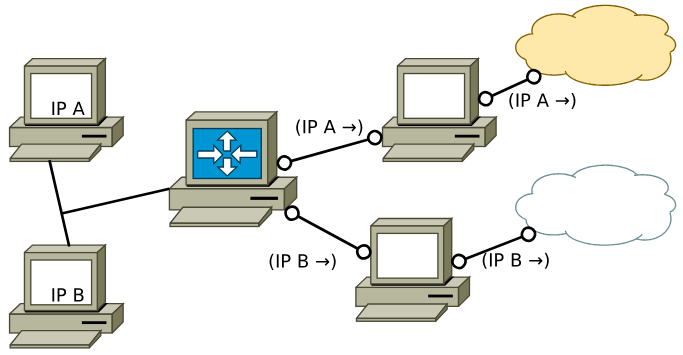
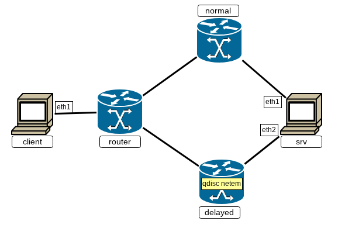

Заметим, что в этой лекции разговор идёт сразу о двух уровнях TCP/IP — сетевом и транспортном. В действительности нет больших проблем в том, чтобы, например, на уровне IP вполне можно заглянуть в TCP-сегмент и найти там порт, а на уровне TCP — выставить поле «класс трафика» (Traffic Class) в [IP пакетах](https://ru.wikipedia.org/wiki/%D0%9F%D0%B0%D0%BA%D0%B5%D1%82_IPv6) на уровне сознания сокета.

# Целевая маршрутизация

Из прошлой главы мы знаем, что табличная маршрутизация основывается на идентификаторах абонентов. Если говорить точнее, она основывается именно на данных о получателе (`Destination-based`). При этом не все задачи легко решаются именно таким принципом распространения пакетов в сети.

Для маршрутизации, основанной на других параметрах пакета можно использовать `Firewall`-ы, которые по внутренним данным передаваемого пакета определяют действия над ним. Однако данный способ достаточно ресурсозатранен, и, кроме того, немалая часть задач решается путём описания правил, наложенных на информацию об отправителе (`Source-based` маршрутизация), что не требует дополнительных **сложных** настроек.

В `Linux`-системах для решения этой задачи на устройстве заводится несколько таблиц маршрутизации, и обработка пакетов производится по одной из них согласно его свойствам:
 + Адресу отправителя
 + Портам получателя или отправителя
 + Интерфейсу взаимодействия
 + Протоколу
 + ...

Настройки и управление не `destination-based` маршрутами осуществляются с помощью утилиты [`ip -6 rule`](http://man7.org/linux/man-pages/man8/ip-rule.8.html). Ключ -6 обязателен, поскольку утилита изначально была IPv4-only.

Справедливости ради, изначально `Linux` уже поддерживает работу со множеством таблиц. Для него описаны таблицы локального (`local`) и общего взаимодействия (`main`), а также описаны правила выбора соответствующей таблицы. Сами таблицы просто выставлены по приоритетам (меньший номер означает больший приоритет) без дополнительных условий:

`athena`
```console
[root@athena ~]# ip link set eth1 up
[root@athena ~]# ip -6 rule
0:      from all lookup local
32766:  from all lookup main
[root@athena ~]# ip -6 route list
fe80::/64 dev eth1 proto kernel metric 256 pref medium
[root@athena ~]# ip -6 route list table local
local ::1 dev lo proto kernel metric 0 pref medium
local fe80::a00:27ff:fefb:1a62 dev eth1 proto kernel metric 0 pref medium
multicast ff00::/8 dev eth1 proto kernel metric 256 pref medium
[root@athena ~]#
```

Рассмотрим применение целевой маршрутизации с правилами на следующем стенде:



Конфигурация стенда:

```console
~/papillon_rouge: vbintnets vms
athena:
        eth1: intnet
boney:
        eth1: intnet
router:
        eth1: intnet
        eth2: Anet
        eth3: Bnet
athena-route:
        eth1: Anet
        eth2: Asrv
boney-route:
        eth1: Bnet
        eth2: Bsrv
srv:
        eth1: Asrv
        eth2: Bsrv
~/papillon_rouge:
```


1. ***source routing*** - перенаправление пакетов абонентов между выходными маршрутизаторами на основе адреса отправителя.

Для начальной настройки необходимо описать адреса абонентов и статические `destination-based` маршруты, где этого достаточно. В случае с athena и boney настройка минимальна:

`athena`
```console
[root@athena ~]# ip link set eth1 up
[root@athena ~]# ip addr add dev eth1 2001:db8:0:cc::a/64
[root@athena ~]# ip -6 route add default via 2001:db8:0:cc::1 dev eth1
[root@athena ~]#
```

`boney`
```console
[root@boney ~]# ip link set eth1 up
[root@boney ~]# ip addr add dev eth1 2001:db8:0:cc::b/64
[root@boney ~]# ip -6 route add default via 2001:db8:0:cc::1 dev eth1
[root@boney ~]#
```

Заметим, что «физический» канал у виртуальный машин общий, сеть — с одним и тем же префиксом.

Следующие настройки — у промежуточных маршрутизаторов athena-route и boney-route. Их задача — простой трансфер трафика, для настройки нужно только задать адреса и описать маршруты в подсеть отправителей и до получателя.

`athena-route`
```console
[root@athena-route ~]# ip link set eth1 up
[root@athena-route ~]# ip link set eth2 up
[root@athena-route ~]# ip addr add dev eth1 2001:db8:cc:a::a/64
[root@athena-route ~]# ip addr add dev eth2 2001:db8:a:dd::a/64
[root@athena-route ~]# sysctl net.ipv6.conf.all.forwarding=1
[root@athena-route ~]#
```

```console
[root@athena-route ~]# ip -6 route add 2001:db8:0:cc::/64 via 2001:db8:cc:a::2 dev eth1
[root@athena-route ~]# ip -6 route add 2001:db8:dd:dd::/64 via 2001:db8:a:dd::f dev eth2
[root@athena-route ~]#
[root@athena-route ~]# ip -6 route
2001:db8:0:cc::/64 via 2001:db8:cc:a::2 dev eth1 metric 1024 pref medium
2001:db8:a:dd::/64 dev eth2 proto kernel metric 256 pref medium
2001:db8:cc:a::/64 dev eth1 proto kernel metric 256 pref medium
2001:db8:dd:dd::/64 via 2001:db8:a:dd::f dev eth2 metric 1024 pref medium
fe80::/64 dev eth1 proto kernel metric 256 pref medium
fe80::/64 dev eth2 proto kernel metric 256 pref medium
[root@athena-route ~]#
```

`boney-route`
```console
[root@boney-route ~]# ip link set eth1 up
[root@boney-route ~]# ip link set eth2 up
[root@boney-route ~]# ip addr add dev eth1 2001:db8:cc:b::b/64
[root@boney-route ~]# ip addr add dev eth2 2001:db8:b:dd::b/64
[root@boney-route ~]# sysctl net.ipv6.conf.all.forwarding=1
[root@boney-route ~]#
```

```console
[root@boney-route ~]# ip -6 route add 2001:db8:0:cc::/64 via 2001:db8:cc:b::3 dev eth1
[root@boney-route ~]# ip -6 route add 2001:db8:dd:dd::/64 via 2001:db8:b:dd::f dev eth2
[root@boney-route ~]#
[root@boney-route ~]# ip -6 route
2001:db8:0:cc::/64 via 2001:db8:cc:b::3 dev eth1 metric 1024 pref medium
2001:db8:b:dd::/64 dev eth2 proto kernel metric 256 pref medium
2001:db8:cc:b::/64 dev eth1 proto kernel metric 256 pref medium
2001:db8:dd:dd::/64 via 2001:db8:b:dd::f dev eth2 metric 1024 pref medium
fe80::/64 dev eth1 proto kernel metric 256 pref medium
fe80::/64 dev eth2 proto kernel metric 256 pref medium
[root@boney-route ~]#
```

Получатель srv должен обладать сразу несколькими настройками. Во-первых, иметь некоторый общий адрес, к которому будут вестить обращения, иначе проверка системы будет нечестной.

`srv`
```console
[root@srv ~]# ip link set eth1 up
[root@srv ~]# ip link set eth2 up
[root@srv ~]# ip link set lo up
[root@srv ~]# ip addr add dev eth1 2001:db8:a:dd::f/64
[root@srv ~]# ip addr add dev eth2 2001:db8:b:dd::f/64
[root@srv ~]# ip addr add dev lo  2001:db8:dd:dd::1/64
[root@srv ~]#
[root@srv ~]# sysctl net.ipv6.conf.all.forwarding=1
[root@srv ~]#
```

Во-вторых, srv должен уметь отвечать каждому из абонентов по его каналу. Если бы отправители были в разных подсетях, можно было бы описать пути явно через `ip route` в обычной таблице. Однако мы применим ту же схему, что и для описания правил на router: распределение трафика по правилам. Вся не destination-based маршрутизация строится на создании отдельных таблиц маршрутизации и описания правил в них, в таблице `ip -6 rule` описываются правила перехода к данныим таблицам. В случае с srv необходимо описать разные правила для маршрутизации обратных пакетов и добавить правила перехода к таблицам:

```console
[root@srv ~]# ip -6 route add default via 2001:db8:a:dd::a dev eth1 table 5
[root@srv ~]# ip -6 route add default via 2001:db8:b:dd::b dev eth2 table 10
[root@srv ~]#
[root@srv ~]# ip -6 rule add from 2001:db8:0:cc::a table 5
[root@srv ~]# ip -6 rule add from 2001:db8:0:cc::b table 10
[root@srv ~]# ip -6 rule add to 2001:db8:0:cc::b table 10
[root@srv ~]# ip -6 rule add to 2001:db8:0:cc::a table 5
[root@srv ~]#
[root@srv ~]# ip -6 rule
0:      from all lookup local
32762:  from all to 2001:db8:0:cc::a lookup 5
32763:  from all to 2001:db8:0:cc::b lookup 10
32764:  from 2001:db8:0:cc::b lookup 10
32765:  from 2001:db8:0:cc::a lookup 5
32766:  from all lookup main
[root@srv ~]#
[root@srv ~]# ip -6 route list table 5
default via 2001:db8:a:dd::a dev eth1 metric 1024 pref medium
[root@srv ~]# ip -6 route list table 10
default via 2001:db8:b:dd::b dev eth2 metric 1024 pref medium
[root@srv ~]#
```

Router настраивается точно также: на заданных адресах описываются разные правила в разные маршутные таблицы, а в таблицу правил пишутся переходы к ним.

`router`
```console
[root@router ~]# ip link set eth1 up
[root@router ~]# ip link set eth2 up
[root@router ~]# ip link set eth3 up
[root@router ~]#
[root@router ~]# ip addr add dev eth1 2001:db8:0:cc::1/64
[root@router ~]# ip addr add dev eth2 2001:db8:cc:a::2/64
[root@router ~]# ip addr add dev eth3 2001:db8:cc:b::3/64
[root@router ~]#
[root@router ~]# sysctl net.ipv6.conf.all.forwarding=1
[root@router ~]#
```

```console
[root@router ~]# ip route add default via 2001:db8:cc:a::a dev eth2 table 5
[root@router ~]# ip route add default via 2001:db8:cc:b::b dev eth3 table 10
[root@router ~]# ip route
[root@router ~]# ip -6 rule add from 2001:db8:0:cc::a table 5
[root@router ~]# ip -6 rule add from 2001:db8:0:cc::b table 10
[root@router ~]#
[root@router ~]# ip -6 route list
2001:db8:0:cc::/64 dev eth1 proto kernel metric 256 pref medium
2001:db8:cc:a::/64 dev eth2 proto kernel metric 256 pref medium
2001:db8:cc:b::/64 dev eth3 proto kernel metric 256 pref medium
fe80::/64 dev eth1 proto kernel metric 256 pref medium
fe80::/64 dev eth2 proto kernel metric 256 pref medium
fe80::/64 dev eth3 proto kernel metric 256 pref medium
[root@router ~]# ip -6 route list table 5
default via 2001:db8:cc:a::a dev eth2 metric 1024 pref medium
[root@router ~]# ip -6 route list table 10
default via 2001:db8:cc:b::b dev eth3 metric 1024 pref medium
[root@router ~]# ip -6 rule
0:      from all lookup local
32764:  from 2001:db8:0:cc::b lookup 10
32765:  from 2001:db8:0:cc::a lookup 5
32766:  from all lookup main
[root@router ~]#
```

После описанных действий соединение абонентов корректно и идёт правильными маршрутами.

`athena`
```console
[root@athena ~]# ping 2001:db8:dd:dd::1
PING 2001:db8:dd:dd::1 (2001:db8:dd:dd::1) 56 data bytes
64 bytes from 2001:db8:dd:dd::1: icmp_seq=1 ttl=62 time=2.75 ms
64 bytes from 2001:db8:dd:dd::1: icmp_seq=2 ttl=62 time=1.05 ms
64 bytes from 2001:db8:dd:dd::1: icmp_seq=3 ttl=62 time=2.31 ms

--- 2001:db8:dd:dd::1 ping statistics ---
3 packets transmitted, 3 received, 0% packet loss, time 2003ms
rtt min/avg/max/mdev = 1.054/2.040/2.754/0.720 ms
[root@athena ~]# traceroute -q2 -N1 2001:db8:dd:dd::1
traceroute to 2001:db8:dd:dd::1 (2001:db8:dd:dd::1), 30 hops max, 80 byte packets
 1  _gateway (2001:db8:0:cc::1)  0.807 ms  0.734 ms
 2  2001:db8:cc:a::a (2001:db8:cc:a::a)  1.325 ms  1.519 ms
 3  2001:db8:dd:dd::1 (2001:db8:dd:dd::1)  1.995 ms  3.320 ms
[root@athena ~]#
```

`boney`
```console
[root@boney ~]# ping 2001:db8:dd:dd::1
PING 2001:db8:dd:dd::1 (2001:db8:dd:dd::1) 56 data bytes
64 bytes from 2001:db8:dd:dd::1: icmp_seq=1 ttl=62 time=2.19 ms
64 bytes from 2001:db8:dd:dd::1: icmp_seq=2 ttl=62 time=2.69 ms
64 bytes from 2001:db8:dd:dd::1: icmp_seq=3 ttl=62 time=2.37 ms

--- 2001:db8:dd:dd::1 ping statistics ---
3 packets transmitted, 3 received, 0% packet loss, time 2003ms
rtt min/avg/max/mdev = 2.187/2.415/2.694/0.209 ms
[root@boney ~]# traceroute -q2 -N1 2001:db8:dd:dd::1
traceroute to 2001:db8:dd:dd::1 (2001:db8:dd:dd::1), 30 hops max, 80 byte packets
 1  _gateway (2001:db8:0:cc::1)  0.422 ms  0.578 ms
 2  2001:db8:cc:b::b (2001:db8:cc:b::b)  0.809 ms  0.847 ms
 3  2001:db8:dd:dd::1 (2001:db8:dd:dd::1)  1.211 ms  1.157 ms
[root@boney ~]#
```

2. ***port routing*** - перенаправление пакетов абонентов между выходными маршрутизаторами на основе порта.

На эту же топологию добавим правило, согласно которому оба абонента будут обращаться к `srv` по пути через `boney-route` при передаче пакетов на порт получателя 80 (например, при описании `http`-запроса):

`router`
```console
[root@router ~]# ip -6 rule add dport 80 table 10
[root@router ~]# ip -6 rule
0:      from all lookup local
32763:  from all dport 80 lookup 10
32764:  from 2001:db8:0:cc::b lookup 10
32765:  from 2001:db8:0:cc::a lookup 5
32766:  from all lookup main
[root@router ~]#
```

`srv`
```console
[root@srv ~]# ip -6 rule add sport 80 table 10
[root@srv ~]# ip -6 rule
0:      from all lookup local
32761:  from all sport 80 lookup 10
32762:  from all to 2001:db8:0:cc::a lookup 5
32763:  from all to 2001:db8:0:cc::b lookup 10
32764:  from 2001:db8:0:cc::b lookup 10
32765:  from 2001:db8:0:cc::a lookup 5
32766:  from all lookup main
[root@srv ~]#
```

`athena-route`
```console
[root@athena-route ~]# tcpdump -i eth1
tcpdump: verbose output suppressed, use -v[v]... for full protocol decode
listening on eth1, link-type EN10MB (Ethernet), snapshot length 262144 bytes

```

`boney-route`
```console
[root@boney-route ~]# tcpdump -i eth1
tcpdump: verbose output suppressed, use -v[v]... for full protocol decode
listening on eth1, link-type EN10MB (Ethernet), snapshot length 262144 bytes

```

`athena`
```console
[root@athena ~]# wget http://[2001:db8:dd:dd::f]
--2026-07-20 12:02:23--  http://[2001:db8:dd:dd::f]/
Connecting to [2001:db8:dd:dd::f]:80... failed: No route to host.
[root@athena ~]#
```

`boney`
```console
[root@boney ~]# wget http://[2001:db8:dd:dd::f]
--2026-07-20 12:02:50--  http://[2001:db8:dd:dd::f]/
Connecting to [2001:db8:dd:dd::f]:80... failed: No route to host.
[root@boney ~]#
```

`athena-route`
```console
[root@athena-route ~]# tcpdump -i eth1
tcpdump: verbose output suppressed, use -v[v]... for full protocol decode
listening on eth1, link-type EN10MB (Ethernet), snapshot length 262144 bytes

```

`boney-route`
```console
[root@boney-route ~]# tcpdump -i eth1
tcpdump: verbose output suppressed, use -v[v]... for full protocol decode
listening on eth1, link-type EN10MB (Ethernet), snapshot length 262144 bytes
12:02:23.420011 IP6 2001:db8:0:cc::a.52620 > 2001:db8:dd:dd::f.http: Flags [S], seq 3026672917, win 64800, options [mss 1440,sackOK,TS val 920135095 ecr 0,nop,wscale 7], length 0
12:02:50.163730 IP6 2001:db8:0:cc::b.36326 > 2001:db8:dd:dd::f.http: Flags [S], seq 3771473572, win 64800, options [mss 1440,sackOK,TS val 1904505804 ecr 0,nop,wscale 7], length 0

```


# Введение в обработку трафика

Обработка трафика - огромный раздел, описывающий взаимодействие потоков и абонентов в сети передачи данных. Мы лишь кратко коснёмся основной задачи обработки трафика - контроля передачи (`traffic shaping`). 

При работе со множеством потоков необходимо обеспечивать "справедливое" разделение трафика между абонентами, а также поддерживать работоспособность сети при перегрузках. Решением данных задач занимается специальная утилита `tc`([traffic control](http://www.linux-ip.net/articles/Traffic-Control-HOWTO/index.html)), по ней существует множество материалов, например, [ArchWiki](https://wiki.archlinux.org/title/Advanced_traffic_control) и даже просто [man](https://man7.org/linux/man-pages/man8/tc.8.html). 

Основная идея работы в рамках контроля трафика: _маршрутизируемые пакеты нельзя просто перекладывать по одному_. При передаче собираются данные о нагрузке канала ([Quality of Service](https://ru.wikipedia.org/wiki/QoS), [Type of Service](https://ru.wikipedia.org/wiki/%D0%A2%D0%B8%D0%BF_%D0%BE%D0%B1%D1%81%D0%BB%D1%83%D0%B6%D0%B8%D0%B2%D0%B0%D0%BD%D0%B8%D1%8F)), выбираются протоколы для передачи, выделяются и приоритизируются потоки, часть данных буферизуется. Однако сложность управления буферизацией вызывает побочный эффект, из-за которого увеличивается время прохождения пакета в сети из-за постоянной буферизации ([bufferbloat](https://ru.wikipedia.org/wiki/%D0%98%D0%B7%D0%BB%D0%B8%D1%88%D0%BD%D1%8F%D1%8F_%D1%81%D0%B5%D1%82%D0%B5%D0%B2%D0%B0%D1%8F_%D0%B1%D1%83%D1%84%D0%B5%D1%80%D0%B8%D0%B7%D0%B0%D1%86%D0%B8%D1%8F))

В рамках управления трафиком существует [множество дисциплин](https://man7.org/linux/man-pages/man8/tc.8.html#CLASSLESS_QDISCS) распределения его между абонентами: по длине очереди, времени ожидания и т.д. По умолчанию для управления трафиком установлена дисциплина [`tc-fq_codel`](http://man7.org/linux/man-pages/man8/tc-fq_codel.8.html), препятствующая `bufferbloat`, а также реализующая "честное" равное разделение трафика.

Попробуем на примерах рассмотреть разные дисциплины управления трафиком.

```console
athena:
        eth1: intnet
boney:
        eth1: intnet
```

`athena`
```console
[root@athena ~]# ip link set eth1 up
[root@athena ~]# ip -d a show eth1
3: eth1: <BROADCAST,MULTICAST,UP,LOWER_UP> mtu 1500 qdisc fq_codel state UP group default qlen 1000
    link/ether 08:00:27:75:5e:73 brd ff:ff:ff:ff:ff:ff promiscuity 0 allmulti 0 minmtu 46 maxmtu 16110 numtxqueues 1 numrxqueues 1 gs
o_max_size 65536 gso_max_segs 65535 tso_max_size 65536 tso_max_segs 65535 gro_max_size 65536 gso_ipv4_max_size 65536 gro_ipv4_max_siz
e 65536 parentbus pci parentdev 0000:00:08.0
    altname enp0s8
    altname enx080027755e73
    inet6 fe80::a00:27ff:fe75:5e73/64 scope link proto kernel_ll
       valid_lft forever preferred_lft forever
[root@athena ~]#
```

`boney`
```console
[root@boney ~]# ip link set eth1 up
[root@boney ~]# ip -d a show eth1
3: eth1: <BROADCAST,MULTICAST,UP,LOWER_UP> mtu 1500 qdisc fq_codel state UP group default qlen 1000
    link/ether 08:00:27:36:0f:2b brd ff:ff:ff:ff:ff:ff promiscuity 0 allmulti 0 minmtu 46 maxmtu 16110 numtxqueues 1 numrxqueues 1 gs
o_max_size 65536 gso_max_segs 65535 tso_max_size 65536 tso_max_segs 65535 gro_max_size 65536 gso_ipv4_max_size 65536 gro_ipv4_max_siz
e 65536 parentbus pci parentdev 0000:00:08.0
    altname enp0s8
    altname enx080027360f2b
    inet6 fe80::a00:27ff:fe36:f2b/64 scope link proto kernel_ll
       valid_lft forever preferred_lft forever
[root@boney ~]#
```

Изначальное состояние системы, как было сказано выше, продиводействует задержкам буферизации и осуществляет равное распределение трафика. Для тестирования сети будем использовать ping с ключом `-f` для отправки всех ping-запросов без задержек
:

`athena`
```console
[root@athena ~]# tc qdisc show
qdisc noqueue 0: dev lo root refcnt 2
qdisc fq_codel 0: dev eth1 root refcnt 2 limit 10240p flows 1024 quantum 1514 target 5ms interval 100ms memory_limit 32Mb ecn drop_batch 64
[root@athena ~]# tc -s qdisc show
qdisc noqueue 0: dev lo root refcnt 2
 Sent 0 bytes 0 pkt (dropped 0, overlimits 0 requeues 0)
 backlog 0b 0p requeues 0
qdisc fq_codel 0: dev eth1 root refcnt 2 limit 10240p flows 1024 quantum 1514 target 5ms interval 100ms memory_limit 32Mb ecn drop_batch 64
 Sent 796 bytes 10 pkt (dropped 0, overlimits 0 requeues 0)
 backlog 0b 0p requeues 0
  maxpacket 0 drop_overlimit 0 new_flow_count 0 ecn_mark 0
  new_flows_len 0 old_flows_len 0
[root@athena ~]#
```

```console
[root@athena ~]# ping -f -c1000 fe80::a00:27ff:fe36:f2b%eth1
PING fe80::a00:27ff:fe36:f2b%eth1 (fe80::a00:27ff:fe36:f2b%eth1) 56 data bytes

--- fe80::a00:27ff:fe36:f2b%eth1 ping statistics ---
1000 packets transmitted, 1000 received, 0% packet loss, time 198ms
rtt min/avg/max/mdev = 0.000/0.134/1.904/0.075 ms, ipg/ewma 0.198/0.125 ms
[root@athena ~]#
```

Как мы видим, в обычном состоянии передача всех пакетов происходит без потерь и задержек.

Расмотрим теперь дисциплину [`Network Emulator`](https://man7.org/linux/man-pages/man8/tc-netem.8.html), позволяющую влиять на задержки и потери пакетов:

Установим задержку на передачу:

`athena`
```console
[root@athena ~]# tc qdisc add dev eth1 root netem delay 400ms
[root@athena ~]# tc qdisc show
qdisc noqueue 0: dev lo root refcnt 2
qdisc netem 8001: dev eth1 root refcnt 2 limit 1000 delay 400ms seed 11239252756347829986
[root@athena ~]# ping -f -c1000 fe80::a00:27ff:fe36:f2b%eth1
PING fe80::a00:27ff:fe36:f2b%eth1 (fe80::a00:27ff:fe36:f2b%eth1) 56 data bytes
# <Демонстрация задержек в виде множества точек-пакетов в течение всей долгой передачи>
--- fe80::a00:27ff:fe36:f2b%eth1 ping statistics ---
1000 packets transmitted, 1000 received, 0% packet loss, time 12576ms
rtt min/avg/max/mdev = 400.028/400.587/402.757/0.291 ms, pipe 37, ipg/ewma 12.588/400.867 ms
[root@athena ~]#
```

Как мы видим, все параметры `rtt` колеблются близ значения задержки.

Теперь установим настройку потери пакетов:

`athena`
```console
[root@athena ~]# tc qdisc del root dev eth1
[root@athena ~]# tc qdisc add dev et1 root netem loss 10%
Cannot find device "et1"
[root@athena ~]# tc qdisc add dev eth1 root netem loss 10%
[root@athena ~]# tc qdisc show
qdisc noqueue 0: dev lo root refcnt 2
qdisc netem 8002: dev eth1 root refcnt 2 limit 1000 loss 10% seed 7609417578301181043
[root@athena ~]# ping -f -c1000 fe80::a00:27ff:fe36:f2b%eth1
PING fe80::a00:27ff:fe36:f2b%eth1 (fe80::a00:27ff:fe36:f2b%eth1) 56 data bytes
..............................................................................................
--- fe80::a00:27ff:fe36:f2b%eth1 ping statistics ---
1000 packets transmitted, 906 received, 9.4% packet loss, time 1484ms
rtt min/avg/max/mdev = 0.000/0.303/2.002/0.185 ms, ipg/ewma 1.485/0.238 ms
[root@athena ~]#
```

Говоря непосредственно про шейпинг трафика, стоит заметить, что смысл шейпить имеет только исходящий трафик, поскольку работа с уже полученным трафиком никак не сказывается на состоянии сети. 

Самой простой дисциплиной по урезанию трафика является [`Token Bucket Filter`](http://man7.org/linux/man-pages/man8/tc-tbf.8.html), получающий очередь пакетов, распределяющий "жетоны" доступа между ними, после чего согласно "жетонам" пакеты могут быть отправлены в сеть. Правила выдачи жетонов могут строится на разных критериях контроля трафика:
 + По объёму: `tbf limit объём_очереди burst ёмкость_ведра rate пропускная_способность`
 + По времени ожидания: `tbf latency сколько_ждать burst ёмкость_ведра rate пропускная_способность`

В рамках дисциплины доступна работа с классовыми очередями, произвольной топологией, приоритезацией по ToS и т.п.

Для исследования влияния дисциплины на сеть воспользуемся утилитой [`IPerf`](https://iperf.fr/iperf-download.php)

`boney`
```console
[root@boney ~]# iperf3 -6s
-----------------------------------------------------------
Server listening on 5201 (test #1)
-----------------------------------------------------------

```

`athena`
```console
[root@athena ~]# iperf3 -t5 -6c fe80::a00:27ff:fe36:f2b%eth1
Connecting to host fe80::a00:27ff:fe36:f2b%eth1, port 5201
[  5] local fe80::a00:27ff:fe75:5e73 port 53438 connected to fe80::a00:27ff:fe36:f2b port 5201
[ ID] Interval           Transfer     Bitrate         Retr  Cwnd
[  5]   0.00-1.00   sec  1.25 MBytes  10.5 Mbits/sec   95   1.39 KBytes
[  5]   1.00-2.00   sec   128 KBytes  1.05 Mbits/sec   21   1.39 KBytes
[  5]   2.00-3.00   sec   512 KBytes  4.19 Mbits/sec   52   1.39 KBytes
[  5]   3.00-4.00   sec   768 KBytes  6.29 Mbits/sec   60   1.39 KBytes
[  5]   4.00-5.01   sec   768 KBytes  6.26 Mbits/sec   42   1.39 KBytes
- - - - - - - - - - - - - - - - - - - - - - - - -
[ ID] Interval           Transfer     Bitrate         Retr
[  5]   0.00-5.01   sec  3.38 MBytes  5.66 Mbits/sec  270            sender
[  5]   0.00-5.01   sec  3.25 MBytes  5.44 Mbits/sec                  receiver

iperf Done.
[root@athena ~]#
```

`boney`
```console
[root@boney ~]# iperf3 -6s
-----------------------------------------------------------
Server listening on 5201 (test #1)
-----------------------------------------------------------
Accepted connection from fe80::a00:27ff:fe75:5e73, port 53422
[  5] local fe80::a00:27ff:fe36:f2b port 5201 connected to fe80::a00:27ff:fe75:5e73 port 53438
[ ID] Interval           Transfer     Bitrate
[  5]   0.00-1.00   sec  1.00 MBytes  8.38 Mbits/sec
[  5]   1.00-2.00   sec   128 KBytes  1.05 Mbits/sec
[  5]   2.00-3.00   sec   640 KBytes  5.24 Mbits/sec
[  5]   3.00-4.00   sec   768 KBytes  6.28 Mbits/sec
[  5]   4.00-5.00   sec   768 KBytes  6.30 Mbits/sec
- - - - - - - - - - - - - - - - - - - - - - - - -
[ ID] Interval           Transfer     Bitrate
[  5]   0.00-5.01   sec  3.25 MBytes  5.44 Mbits/sec                  receiver
-----------------------------------------------------------
Server listening on 5201 (test #2)
-----------------------------------------------------------

```

Теперь понизим пропускную способность до `1Mbit/sec`

`athena`
```console
[root@athena ~]# tc qdisc add dev eth1 root tbf rate 1mbit burst 32kbit latency 400ms
[root@athena ~]# tc qdisc show
qdisc noqueue 0: dev lo root refcnt 2
qdisc tbf 8003: dev eth1 root refcnt 2 rate 1Mbit burst 4Kb lat 400ms
[root@athena ~]# iperf3 -t5 -6c fe80::a00:27ff:fe36:f2b%eth1
Connecting to host fe80::a00:27ff:fe36:f2b%eth1, port 5201
[  5] local fe80::a00:27ff:fe75:5e73 port 34112 connected to fe80::a00:27ff:fe36:f2b port 5201
[ ID] Interval           Transfer     Bitrate         Retr  Cwnd
[  5]   0.00-1.00   sec   256 KBytes  2.10 Mbits/sec    0   43.2 KBytes
[  5]   1.00-2.00   sec   128 KBytes  1.05 Mbits/sec    0   48.8 KBytes
[  5]   2.00-3.00   sec   128 KBytes  1.05 Mbits/sec    1   16.7 KBytes
[  5]   3.00-4.00   sec   128 KBytes  1.05 Mbits/sec    0   39.0 KBytes
[  5]   4.00-5.00   sec   128 KBytes  1.05 Mbits/sec    0   44.6 KBytes
- - - - - - - - - - - - - - - - - - - - - - - - -
[ ID] Interval           Transfer     Bitrate         Retr
[  5]   0.00-5.00   sec   768 KBytes  1.26 Mbits/sec    1            sender
[  5]   0.00-5.39   sec   512 KBytes   779 Kbits/sec                  receiver

iperf Done.
[root@athena ~]#
```

`boney`
```console
-----------------------------------------------------------
Server listening on 5201 (test #2)
-----------------------------------------------------------
Accepted connection from fe80::a00:27ff:fe75:5e73, port 34102
[  5] local fe80::a00:27ff:fe36:f2b port 5201 connected to fe80::a00:27ff:fe75:5e73 port 34112
[ ID] Interval           Transfer     Bitrate
[  5]   0.00-1.00   sec  0.00 Bytes  0.00 bits/sec
[  5]   1.00-2.00   sec   128 KBytes  1.05 Mbits/sec
[  5]   2.00-3.00   sec   128 KBytes  1.05 Mbits/sec
[  5]   3.00-4.00   sec   128 KBytes  1.05 Mbits/sec
[  5]   4.00-5.00   sec   128 KBytes  1.05 Mbits/sec
[  5]   5.00-5.39   sec  0.00 Bytes  0.00 bits/sec
- - - - - - - - - - - - - - - - - - - - - - - - -
[ ID] Interval           Transfer     Bitrate
[  5]   0.00-5.39   sec   512 KBytes   779 Kbits/sec                  receiver
-----------------------------------------------------------
Server listening on 5201 (test #3)
-----------------------------------------------------------
```

# Домашняя работа

 + Суть: построить сеть с выбором маршрута между быстрым каналом и каналом с задержкой на интерфейсе.
 + Площадка (сетевые адреса и маршруты настроены заранее, в отчёт не входят)


 + `client`: просто работает, подключен к router
 + `router`: имеет ещё два интерфейса к маршрутизаторам normal и delayed
 + `normal`: просто маршрутизирует между router и out
 + `delayed`: просто маршрутизирует между router и out, но обе эти сети медленные (симулируем при помощи qdisc netem)
 + `srv`: тоже связан с normal и delayed

 + Отчёт:
   + `report 7 router`
     + Узнать, какое значение поля Traffic Class использует ssh (подсмотреть в исходящих пакетах, или в выводе strace -y --trace=setsockopt)
     + Настроить целевую маршрутизацию трафика IPv6 с этим значением traffic class в сторону normal, а остального трафика в сторону delayed
     + Запустить tcpdump на интерфейсе в сторону delayed, который отловит пакеты TCP-соединения от client на srv и несколько пакетов ping-а, а затем сам остановится (-c <число>). Должно хватить около 10-14 штук. Если сложно — просто остановите перед продолжением отчёта.
     + Запустить tcpdump на интерфейсе в сторону simple, который отловит пакеты TCP-соединения от client на srv, а затем сам остановится (-c <число>). Должно хватить около 6-10 штук. Если сложно — просто остановите перед продолжением отчёта.

   + `report 7 delayed`
     + Настроить (с помощью netem) задержку при отсылке пакетов в 200ms на оба интерфейса
     + Немного по ping-ать client (в отчёте должна быть видна задержка ⩾ 200ms)

   + `report 7 client`
     + Отправить при помощи netcat несколько строк на порт 22 машины srv
     + Зайти по SSH на машину srv, выйти (дать команду exit)
     + Запустить ping адреса delayed (в отчёте должна быть видна задержка ⩾ 200ms)

Три отчёта (названия сохранить, должно быть: `report.07.client`, `report.07.router`, `report.07.delayed`) переслать одним письмом в качестве приложений на uneexlectures@cs.msu.ru

В теме письма должно встречаться слово `LinuxNetwork2027`