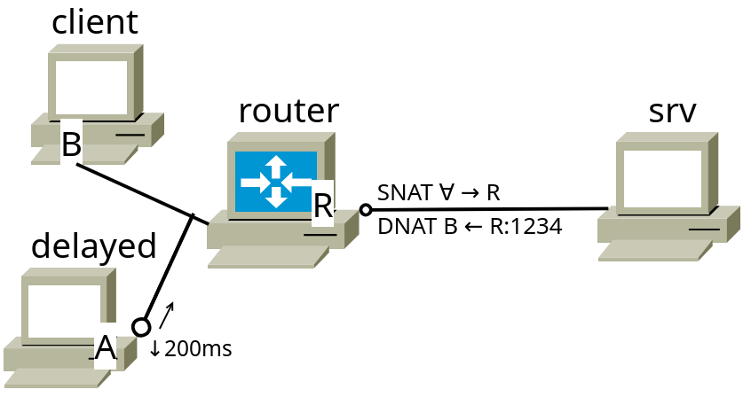

# `NAT`

Ещё при первом обсуждении `IP`-адресации и работе в сети говорилось о некоторых особых адресах, в частности, приватных, для которых, вообще говоря, доступ в глобальную сеть запрещён. Для обращения в "большой" интернет для таких сетей необходимо подменять `IP`-адреса на допустимые. Технология подмены (правильный термин "трансляции") адресов называется `Network Address Translation` ([`NAT`](https://en.wikipedia.org/wiki/Network%20address%20translation)). Первая встреча с этим протоколом была проделана при изучении команд `iptables`, где на одной из машин вручную на пограничной машине устанавливалась трансляция адресов. 

На практике в процессе передачи данных происходит несколько независимых трансляций. В качестве примера рассмотрим обращение с виртуальной машины на `ww.ru`

`srv`
```srv
[root@srv ~]# dhcpcd eth0  
dhcpcd-10.2.2 starting  
eth0: waiting for carrier  
eth0: carrier acquired  
eth0: soliciting a DHCP lease  
eth0: offered 10.0.2.15 from 10.0.2.2  
eth0: leased 10.0.2.15 for 86400 seconds  
eth0: adding route to 10.0.2.0/24  
eth0: adding default route via 10.0.2.2  

[root@srv ~]# ip a sh eth0  
2: eth0: <BROADCAST,MULTICAST,UP,LOWER_UP> mtu 1500 qdisc fq_codel state UNKNOWN group default qlen 100  
0  
   link/ether 08:00:27:a2:8f:77 brd ff:ff:ff:ff:ff:ff  
   altname enp0s3  
   altname enx080027a28f77  
   inet 10.0.2.15/24 brd 10.0.2.255 scope global dynamic noprefixroute eth0  
      valid_lft 86153sec preferred_lft 75353sec  

[root@srv ~]# traceroute -n ww.ru  
traceroute to ww.ru (104.21.56.42), 30 hops max, 60 byte packets  
1  10.0.2.2  1.299 ms  1.254 ms  1.183 ms  
2  192.168.1.1  3.599 ms  3.295 ms  3.190 ms  
3  10.248.8.1  7.874 ms  11.383 ms  11.316 ms  
4  176.117.112.1  11.246 ms  11.172 ms  11.138 ms  
5  93.191.9.89  12.110 ms  12.035 ms  11.957 ms  
6  * * *  
7  80.77.167.7  10.189 ms  15.389 ms  15.326 ms  
8  172.68.8.49  14.425 ms * *  
9  104.21.56.42  7.356 ms  7.233 ms  7.203 ms  
[root@srv ~]#
```

Первый переход к пограничному маршрутизатору `VirtualBox` (10.0.2.2) производится ещё без подмены. На маршрутизаторе адрес 10.0.2.15 транслируется во внутреннюю сеть компьютера, а перед шагом 4 - транслируется в адрес с доступом в глобальную сеть. Существуют сервисы, позволяющие узнать конечный `IP`, с которым пакет доходит до сайта, например, `ipinfo.io`:

`srv`
```srv
[root@srv ~]# curl http://ipinfo.io  
{  
 "ip": "176.117.112.157",  
 "city": "Dzerzhinsky",  
 "region": "Moscow Oblast",  
 "country": "RU",  
 "loc": "55.6274,37.8580",  
 "org": "AS50045 PJSC Montazh",  
 "postal": "140090",  
 "timezone": "Europe/Moscow",  
 "readme": "https://ipinfo.io/missingauth"  
}[root@srv ~]#
```

## `NAT` без транспортного уровня

Как и любая сетевая технология, простота понимания `NAT` скрывает за собой множество сложностей внутренней реализации. Основная проблема - определение правил трансляции адресов. Первым решением была **статическая** табличная замена 1:1. Для этого в `ip route` и `ip rule` существуют специальные команды трансляции адресов. Однако такой способ сразу создаёт множество проблем:
 + Выделение на каждый внутренний адрес собственного адреса для трансляции - как минимум, затратное и небезопасное действие, поскольку может раскрыть структуру сети; 
 + При передаче данных множество контрольных сумм завязано на `IP`, и их необходимо пересчитывать при каждой трансляции для каждого адреса;

На практике такой метод трансляции не используется вовсе. основной задачей стало создание поддержки трансляции вида `N:1` и / или `M:N`

## `NAPT` - `NAT` с идентификацией потока

Для решения проблемы определения правил трансляции было решено использовать дополнительные параметры передачи. `NAPT` - `Network Address and Port Translation` - предлагает при трансляции адресов вести динамическую таблицу, в которой кроме транслируемых адрессов запомнимать любые идентифицирующие пользователей данные: 
 + В случае `TCP`  - классическая четвёрка (2 порта + 2 `IP`) и параметры открытого соединения;
 + В случае `UDP` - четвёрка + `DNS Query ID` и / или `Originator Timestamp`;
 + Для `ping`-запроса - `IP` и поле `ICMP-serial`;
и так далее.

Такой способ позволяет определять разные информационные потоки даже в случае, когда они направлены в одно место с одного транслирующего маршрутизатора (когда данные получателя и отправителя после трансляции совпадают), а, главное, позволяет сводить множество адресов в один (или меньшее количество) транслируемых в глобальную сеть.

---

Разберём пример трансляции адресов на примере:

```console
~/papillon_rouge: vbintnets
srv:  
       eth1: intnet  
inner:  
       eth1: intnet  
       eth2: deepnet
~/papillon_rouge: 
```

Для начала ещё раз вспомним команду `iptables` для трансляции адресов. Не будем подробно вдаваться в правилаработы с этим файерволлом, поскольку в будущих главах их изучение будет проводиться не на `iptables`, а на `nftables`.

`srv`
```srv
[root@srv ~]# dhcpcd eth0  
dhcpcd-10.2.2 starting  
eth0: waiting for carrier  
eth0: carrier acquired  
eth0: rebinding lease of 10.0.2.15  
eth0: leased 10.0.2.15 for 86400 seconds  
eth0: adding route to 10.0.2.0/24  
eth0: adding default route via 10.0.2.2  

[root@srv ~]# iptables -t nat -A POSTROUTING -o eth0 -j MASQUERADE  
```

Файерволл представляет из себя множество таблиц, в котором существуют блоки последовательностей, а в них - цепочки правил. Буквально в команде неписано: "Для таблицы `nat` в последовательности `POSTROUTING` (то есть, перед самой отправкой пакета, уже после определения пути его отправления) на пакетах, исходящих через `eth0` проведи цепочку действий `MASQUERADE` - проведи трансляцию их адресов в допустимые". В правилах `iptables` отметится добавление нового параметра:

`srv`
```srv
[root@srv ~]# iptables-save  
# Generated by iptables-save v1.8.10 on Thu Apr 17 14:38:30 2025  
*nat  
:PREROUTING ACCEPT [0:0]  
:INPUT ACCEPT [0:0]  
:OUTPUT ACCEPT [0:0]  
:POSTROUTING ACCEPT [0:0]  
-A POSTROUTING -o eth0 -j MASQUERADE  
COMMIT  
# Completed on Thu Apr 17 14:38:30 2025  
```

Теперь проведём базовую настройку машин и попробуем обратиться с `inner` в сеть:

`srv`
```srv
[root@srv ~]# autonet  
```

`inner`
```inner
[root@inner ~]# autonet  
[root@inner ~]# ip route add default via 10.9.0.26  
[root@inner ~]# echo "nameserver 1.1.1.1" > /etc/resolv.conf  

[root@inner ~]# curl http://ipinfo.io  
{  
 "ip": "176.117.112.157",  
 "city": "Dzerzhinsky",  
 "region": "Moscow Oblast",  
 "country": "RU",  
 "loc": "55.6274,37.8580",  
 "org": "AS50045 PJSC Montazh",  
 "postal": "140090",  
 "timezone": "Europe/Moscow",  
 "readme": "https://ipinfo.io/missingauth"  
}[root@inner ~]#
```

Доступ в интернет есть, трансляция проведена. Посмотрим на таблицы трансляции, которые получились на машине `srv`:

`srv`
```srv
[root@srv ~]# conntrack -L  
udp      17 6 src=10.9.0.27 dst=1.1.1.1 sport=44464 dport=53 src=1.1.1.1 dst=10.0.2.15 sport=53 dport=4  
4464 mark=0 use=1  
tcp      6 96 TIME_WAIT src=10.9.0.27 dst=34.117.59.81 sport=50488 dport=80 src=34.117.59.81 dst=10.0.2  
.15 sport=80 dport=50488 [ASSURED] mark=0 use=1  
conntrack v1.4.8 (conntrack-tools): 2 flow entries have been shown.  

<few seconds later>

[root@srv ~]# conntrack -L  
conntrack v1.4.8 (conntrack-tools): 0 flow entries have been shown.  
[root@srv ~]#
```

В таблицах сохранилось два подключения: `UDP` для разыменования домена, а также `TCP` при проведении `HTTP`-запроса. Со временем таблица автоматически очищается от неактуальных записей.

---

Даже при работе с динамическими таблицами при большом количестве абонентов могут возникать коллизии. Например, при совпадении портов отправителей с разных `IP`-адресов их трансляция будет неразличимой. Для решения таких коллизий добавляются дополнительные параметры идентификации пользователей, в частности, `SEQN` сообщений (совпадение которого статистически происходит с меньшей вероятностью).

## `SNAT` и `DNAT`

Тот вид трансляции, который рассматривался до этого, имеет более точное название - `SNAT`, `Source NAT`. Это вид трансляции, осуществляющийся при передаче сообщений из некоторой сети. Существует также вид трансляции, осуществляющийся при приёме сообщений, например, когда межсетевой экран, получающий все входящие в локальную сеть сообщения расположен на одной машине, а веб-сервер, к которому непосредственно направлено сообщение — внутри сети, на другой машине. Он носит название `Destination NAT` (`DNAT`), трансляция проводится сразу при получении пакета.

Разберём на следующем примере его работу:

```console
~/papillon_rouge: vbintnets
srv:  
       eth1: intnet  
inner:  
       eth1: intnet  
       eth2: deepnet  
web:  
       eth1: deepnet
~/papillon_rouge: 
```

`web`
```web
[root@web ~]# autonet  
[root@web ~]# ip a show eth1  
3: eth1: <BROADCAST,MULTICAST,UP,LOWER_UP> mtu 1500 qdisc fq_codel state UP group default qlen 1000  
   link/ether 08:00:27:53:66:a6 brd ff:ff:ff:ff:ff:ff  
   altname enp0s8  
   altname enx0800275366a6  
   inet 10.4.0.28/24 scope global eth1  
      valid_lft forever preferred_lft forever  
[root@web ~]# ip route add default via 10.4.0.27  
[root@web ~]#
```

Опишем команду `iptables` для `DNAT`:

`inner`
```inner
[root@inner ~]# iptables -t nat -A PREROUTING -i eth1 -p tcp --dport 222 -j DNAT --to-destination 10.4.0.28:22  
[root@inner ~]#
```

Опишем, что написнао в данной команде: "Для таблицы `nat` в последовательности `PREROUTING` (то есть, как только получен пакет) на пакетах, приходящих через `eth1` по `TCP` на порт получателя 222 проведи цепочку действий `DNAT` - проведи трансляцию адреса и порта получателя в указанные".

Попробуем теперь с `srv` подключиться к порту 222 `inner`:

`srv`
```srv
[root@srv ~]# netcat 10.9.0.27 222  
SSH-2.0-OpenSSH_9.6  
  
Invalid SSH identification string.  
[root@srv ~]#
```

Проброс успешный (поскольку 22й порт относится к `ssh`), попробуем подключиться к `web`:

***ПРЕДУПРЕЖДЕНИЕ***: Для поключения по `ssh` можно использовать ключи, а можно подключаться по `root`-паролю. ***Никогда*** на реальных машинах не допускайте подключение по `root`-паролю во избежание потери управления и доступа к устройствам!

`web`
```web
[root@web ~]# nano /etc/openssh/sshd_config  
<>
#LoginGraceTime 2m  
PermitRootLogin yes    
#StrictModes yes
<>
[root@web ~]# systemctl restart sshd  
[root@web ~]#
```

`srv`
```srv
[root@srv ~]# ssh 10.9.0.27 -p 222  
root@10.9.0.27's password:    
Last login: Thu Apr 17 18:27:29 2025  
[root@web ~]# cal    
    April 2025        
Su Mo Tu We Th Fr Sa  
      1  2  3  4  5  
6  7  8  9 10 11 12  
13 14 15 16 17 18 19  
20 21 22 23 24 25 26  
27 28 29 30            
                      
[root@web ~]#    
logout  
Connection to 10.9.0.27 closed.  
[root@srv ~]#
```

## Обход `NAT` с помощью `STUN`

При взаимодействии абонентов из разных сетей, разделённых несколькими `NAT`-экранами, могут возникать проблемы в установлении соединения. Допустим, в топологии вида `клиент1 - сервер1[NAT] - [NAT]сервер2 - клиент2` установить соединение между клиентами.

Задача легко решается через "проброс портов" (собственно, `DNAT`), однако при отсутствии доступа к серверам это неосуществимо. Решением становится добавление ещё одного устройства - координатора -, к которому клиенты будут обращаться для проверки, нет ли желающих установить с ними соединение.

Способ соединения через координатора имеет название `STUN` (`Session Traversal Utilities for NAT`) и базируется на двух (вообще говоря, необоснованных) предположенияхпри работе с `NAT`:
 + Если с клиента послать _`UDP`-пакет_ какому-то серверу, в `conntrack` в течение некоторого времени находится запись, позволяющая получить _`UDP`-«ответ»_ на этот пакет со стороны сервера, _с порта получателя на порт отправителя_
    + Так работают _прикладные_ протоколы (например, `DNS`), но датаграмма не подразумевает ответ
+ Предположим, в `UDP`-пакете, предназначенном координатору, указан порт отправителя **A**, а при выходе из `NAT` на сервере1 порт отправителя превратился в **B**, о чём была сделана запись в `conntrack`. Тогда если послать ещё один `UDP`-пакет, на этот раз серверу2, указав _тот же самый_ порт отправителя **A**, то на сервере1 порт отправителя _тоже не изменится_ и будет **B**.

Таким образом, если с одного клиента послать `UDP`-пакет с малым `TTL`, а затем ожидать на указанный порт ответ, а второму клиенту попытаться ответить на указанный порт, получится за счёт `UDP`-записей таблицы `NAT` организовать `UDP`-соединение. (`TCP`-соединение таким образом организовать не получится, поскольку необходимо будет угадать `SEQN`, что, мягко говоря, проблематично)


# Введение в обработку трафика

Обработка трафика - огромный раздел, описывающий взаимодействие потоков и абонентов в сети передачи данных. Мы лишь кратко коснёмся основной задачи обработки трафика - контроля передачи (`traffic shaping`). 

При работе со множеством потоков необходимо обеспечивать "справедливое" разделение трафика между абонентами, а также поддерживать работоспособность сети при перегрузках. Решением данных задач занимается специальная утилита `tc`([traffic control](http://www.linux-ip.net/articles/Traffic-Control-HOWTO/index.html)), по ней существует множество материалов, например, [ArchWiki](https://wiki.archlinux.org/title/Advanced_traffic_control) и даже просто [man](https://man7.org/linux/man-pages/man8/tc.8.html). 

Основная идея работы в рамках контроля трафика: "маршрутизируемые пакеты нельзя просто перекладывать по одному". При передаче собираются данные о нагрузке канала ([Quality of Service](https://ru.wikipedia.org/wiki/QoS), [Type of Service](https://ru.wikipedia.org/wiki/%D0%A2%D0%B8%D0%BF_%D0%BE%D0%B1%D1%81%D0%BB%D1%83%D0%B6%D0%B8%D0%B2%D0%B0%D0%BD%D0%B8%D1%8F)), выбираются протоколы для передачи, выделяются и приоритизируются потоки, часть данных буферизуется. Однако сложность управления буферизацией вызывает побочный эффект, из-за которого увеличивается время прохождения пакета в сети из-за постоянной буферизации ([bufferbloat](https://ru.wikipedia.org/wiki/%D0%98%D0%B7%D0%BB%D0%B8%D1%88%D0%BD%D1%8F%D1%8F_%D1%81%D0%B5%D1%82%D0%B5%D0%B2%D0%B0%D1%8F_%D0%B1%D1%83%D1%84%D0%B5%D1%80%D0%B8%D0%B7%D0%B0%D1%86%D0%B8%D1%8F))

В рамках управления трафиком существует [множество дисциплин](https://man7.org/linux/man-pages/man8/tc.8.html#CLASSLESS_QDISCS) распределения его между абонентами: по длине очереди, времени ожидания и т.д. По умолчанию для управления трафиком установлена дисциплина [`tc-fq_codel`](http://man7.org/linux/man-pages/man8/tc-fq_codel.8.html), препятствующая `bufferbloat`, а также реализующая "честное" равное разделение трафика.

---

Попробуем на примерах рассмотреть разные дисциплины управления трафиком. Изначальное состояние системы, как было сказано выше, продиводействует задержкам буферизации и осуществляет равное распределение трафика:

`inner`
```inner
[root@inner ~]# tc qdisc show  
qdisc noqueue 0: dev lo root refcnt 2    
qdisc fq_codel 0: dev eth1 root refcnt 2 limit 10240p flows 1024 quantum 1514 target 5ms interval 100ms  
memory_limit 32Mb ecn drop_batch 64    
qdisc fq_codel 0: dev eth2 root refcnt 2 limit 10240p flows 1024 quantum 1514 target 5ms interval 100ms  
memory_limit 32Mb ecn drop_batch 64    

[root@inner ~]# tc -s qdisc show  
qdisc noqueue 0: dev lo root refcnt 2    
Sent 0 bytes 0 pkt (dropped 0, overlimits 0 requeues 0)    
backlog 0b 0p requeues 0  
qdisc fq_codel 0: dev eth1 root refcnt 2 limit 10240p flows 1024 quantum 1514 target 5ms interval 100ms  
memory_limit 32Mb ecn drop_batch 64    
Sent 37612 bytes 318 pkt (dropped 0, overlimits 0 requeues 0)    
backlog 0b 0p requeues 0  
 maxpacket 0 drop_overlimit 0 new_flow_count 0 ecn_mark 0  
 new_flows_len 0 old_flows_len 0  
qdisc fq_codel 0: dev eth2 root refcnt 2 limit 10240p flows 1024 quantum 1514 target 5ms interval 100ms  
memory_limit 32Mb ecn drop_batch 64    
Sent 32426 bytes 300 pkt (dropped 0, overlimits 0 requeues 0)    
backlog 0b 0p requeues 0  
 maxpacket 0 drop_overlimit 0 new_flow_count 0 ecn_mark 0  
 new_flows_len 0 old_flows_len 0  

[root@inner ~]# ping -f -c1000 10.4.0.28  
PING 10.4.0.28 (10.4.0.28) 56(84) bytes of data.  
   
--- 10.4.0.28 ping statistics ---  
1000 packets transmitted, 1000 received, 0% packet loss, time 148ms  
rtt min/avg/max/mdev = 0.000/0.103/3.712/0.120 ms, ipg/ewma 0.147/0.096 ms  
[root@inner ~]#
```

Как мы видим, в обычном состоянии передача всех пакетов происходит без потерь и задержек.

Расмотрим теперь дисциплину [`Network Emulator`](https://man7.org/linux/man-pages/man8/tc-netem.8.html), позволяющую влиять на задержки и потери пакетов:

Установим задержку на передачу:

`inner`
```inner
[root@inner ~]# tc qdisc add dev eth2 root netem delay 400ms  
[root@inner ~]#tc qdisc show  
qdisc noqueue 0: dev lo root refcnt 2    
qdisc fq_codel 0: dev eth1 root refcnt 2 limit 10240p flows 1024 quantum 1514 target 5ms interval 100ms  
memory_limit 32Mb ecn drop_batch 64    
qdisc netem 8001: dev eth2 root refcnt 2 limit 1000 delay 400ms seed 2673734303007896506  
[root@inner ~]#ping -f -c100 10.4.0.28  
PING 10.4.0.28 (10.4.0.28) 56(84) bytes of data.  
                                       
--- 10.4.0.28 ping statistics ---  
100 packets transmitted, 100 received, 0% packet loss, time 1123ms  
rtt min/avg/max/mdev = 400.011/400.477/402.474/0.332 ms, pipe 37, ipg/ewma 11.339/400.369 ms  
[root@inner ~]#
```

Как мы видим, все параметры `rtt` колеблются близ значения задержки.

Теперь установим настройку потери пакетов:

`inner`
```inner
[root@inner ~]# tc qdisc del root dev eth2  
[root@inner ~]# tc qdisc show  
qdisc noqueue 0: dev lo root refcnt 2    
qdisc fq_codel 0: dev eth1 root refcnt 2 limit 10240p flows 1024 quantum 1514 target 5ms interval 100ms  
qdisc netem 8003: dev eth2 root refcnt 2 limit 1000 loss 10% seed 1792931595982941069  
[root@inner ~]# ping -f -c500 10.4.0.28  
PING 10.4.0.28 (10.4.0.28) 56(84) bytes of data.  
.............................................................    
--- 10.4.0.28 ping statistics ---  
500 packets transmitted, 439 received, 12.2% packet loss, time 793ms  
rtt min/avg/max/mdev = 0.091/0.253/0.979/0.101 ms, ipg/ewma 1.590/0.413 ms  
[root@inner ~]#
```

---

Говоря непосредственно про шейпинг трафика, стоит заметить, что смысл шейпить имеет только исходящий трафик, поскольку работа с уже полученным трафиком никак не сказывается на состоянии сети. 

Самойпростой дисциплиной по урезанию трафика является [`Token Bucket Filter`](http://man7.org/linux/man-pages/man8/tc-tbf.8.html), получающий очередь пакетов, распределяющий "жетоны" доступа между ними, после чего согласно "жетонам" пакеты могут быть отправлены в сеть. Правила выдачи жетонов могут строится на разных критериях контроля трафика:
 + По объёму: `tbf limit объём_очереди burst ёмкость_ведра rate пропускная_способность`
 + - - По времени ожидания: `tbf latency сколько_ждать burst ёмкость_ведра rate пропускная_способность`
В рамках дисциплины доступна работа с классовыми очередями, произвольной топологией, приоритизацией по ToS и т.п.

Для исследования влияния дисциплины на сеть воспользуемся утилитой [`IPerf`](https://iperf.fr/iperf-download.php)

`web`
```web
[root@web ~]# iperf3 -4s  
-----------------------------------------------------------  
Server listening on 5201 (test #1)  
-----------------------------------------------------------

```

`inner`
```inner
[root@inner ~]# iperf3 -t5 -4c 10.4.0.28  
Connecting to host 10.4.0.28, port 5201  
[  5] local 10.4.0.27 port 52432 connected to 10.4.0.28 port 5201  
[ ID] Interval           Transfer     Bitrate         Retr  Cwnd  
[  5]   0.00-1.00   sec   421 MBytes  3.53 Gbits/sec  1359    226 KBytes          
[  5]   1.00-2.00   sec   425 MBytes  3.56 Gbits/sec  1197    249 KBytes          
[  5]   2.00-3.00   sec   427 MBytes  3.58 Gbits/sec  1240    212 KBytes          
[  5]   3.00-4.00   sec   427 MBytes  3.58 Gbits/sec  1453    201 KBytes          
[  5]   4.00-5.00   sec   430 MBytes  3.60 Gbits/sec  1073    215 KBytes          
- - - - - - - - - - - - - - - - - - - - - - - - -  
[ ID] Interval           Transfer     Bitrate         Retr  
[  5]   0.00-5.00   sec  2.08 GBytes  3.57 Gbits/sec  6322            sender  
[  5]   0.00-5.00   sec  2.08 GBytes  3.57 Gbits/sec                  receiver  
  
iperf Done.  
[root@inner ~]#
```

Теперь понизим пропускную способность до `1Mbit/sec`

`inner`
```inner
[root@inner ~]# tc qdisc add dev eth2  root tbf rate 1mbit burst 32kbit latency 400ms  
[root@inner ~]# tc qdisc show  
qdisc noqueue 0: dev lo root refcnt 2    
qdisc fq_codel 0: dev eth1 root refcnt 2 limit 10240p flows 1024 quantum 1514 target 5ms interval 100ms  
memory_limit 32Mb ecn drop_batch 64    
qdisc tbf 8005: dev eth2 root refcnt 2 rate 1Mbit burst 4Kb lat 400ms    
[root@inner ~]# iperf3 -t5 -4c 10.4.0.28  
Connecting to host 10.4.0.28, port 5201  
[  5] local 10.4.0.27 port 60908 connected to 10.4.0.28 port 5201  
[ ID] Interval           Transfer     Bitrate         Retr  Cwnd  
[  5]   0.00-1.00   sec   256 KBytes  2.10 Mbits/sec    0   43.8 KBytes          
[  5]   1.00-2.00   sec   256 KBytes  2.10 Mbits/sec    0   49.5 KBytes          
[  5]   2.00-3.00   sec  0.00 Bytes  0.00 bits/sec    1   17.0 KBytes          
[  5]   3.00-4.00   sec   128 KBytes  1.05 Mbits/sec    1   35.4 KBytes          
[  5]   4.00-5.00   sec   128 KBytes  1.05 Mbits/sec    0   41.0 KBytes          
- - - - - - - - - - - - - - - - - - - - - - - - -  
[ ID] Interval           Transfer     Bitrate         Retr  
[  5]   0.00-5.00   sec   768 KBytes  1.26 Mbits/sec    2            sender  
[  5]   0.00-5.23   sec   512 KBytes   802 Kbits/sec                  receiver  
  
iperf Done.  
[root@inner ~]#
```

# Домашняя работа

 + Суть: воспроизвести примеры из лекции, с выходным `NAT`-ом, пробросом порта и задержкой на интерфейсе.
 + Площадка (сетевые адреса и маршруты настроены заранее, в отчёт не входят)

 + `A` — адрес `delayed`
 + `B` — адрес `client`
 + `R` — «внешний» (для доступа из `srv`) адрес `router`

 + Отчёт:
    1. `report 7 router`        
         + Настроить исходящий `NAT` на интерфейсе `R`, который работал бы для `A` и `B` (Например, для всей их сети)            
         + Настроить проброс порта 1234 при подключении к `R` → на порт 1234 адреса `B`
         + Запустить `tcpdump` на «внешнем» интерфейсе, который отловит все пакеты `TCP`-соединения от `client` на `srv` и несколько пакетов `ping`-а, а затем сам остановится (ключ `-c`). Если сложно — просто остановите перед продолжением отчёта.
    2. `report 7 srv`
         + Принять одно `TCP`-соединение на порт 1212 (в `tcpdump` на `router`-е должно быть видно, что это соединение от `R`, потому что `SNAT`)
    3. `report 7 delayed`
         + Настроить (с помощью `netem`) задержку при отсылке пакетов в `200ms`
         + Немного по `ping`-ать `srv` (чтобы запущенный там `tcpdump` остановился)
    4. `report 7 client`
         + Отправить несколько строк на порт 1212 машины `srv`
         + Запустить `ping` адреса `A` (в отчёте должна быть видна задержка ⩾ `200ms`)
         + Принять одно `TCP`-соединение на порт 1234
    5. (продолжение отчёта `srv`)
         + Отправить несколько строк на порт 1234 адреса `R` (его должен принять `B`, потому что `DNAT`)
 + Четыре отчёта (названия сохранить, должно быть: `report.07.router`, `report.07.srv`, `report.07.client`, `report.07.delayed`) переслать одним письмом в качестве приложений на [uneexlectures@cs.msu.ru](mailto:uneexlectures@cs.msu.ru)
     + В теме письма должно встречаться слово `LinuxNetwork2025`