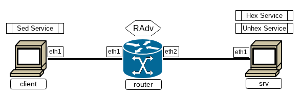

# Что и зачем?

При разговоре о прикладном уровне речь будет в большей степени вестись не о сетях, а непосредственно о `Linux` в них. Связано это с тем, что все задачи **передачи** данных в сети уже решены на низлежащих уровнях: настроена среда передачи данных, обозначен рабочий интерфейс, налажена связность и доступность абонентов в сети, сформирован поток или принята датаграмма. На данном этапе полученную информацию необходимо лишь обработать.

Как и на других уровнях, здесь имеет место быть разделение на две основных рещающихся задачи. \
`Bottom-half` представляет из себя **активацию интерпретатора данных**. Здесь обеспечивается готовность сервисов-интерпретаторов к обработке данных, сопоставление потоков конкретным интерпретаторам. На этом уровне обеспечивается _связывание порта и интерпретатора_, _запуск и обслуживание интерпретатора_, а также контроль работы прикладных служб: учёт потребления ресурсов, анонс доступных сервисов по сети (и, соответственно, распознавание таких анонсов для отправляющей информацию стороны).  \
`Top-half` задачу описать точнее, чем простым "интерпретация данных" трудно, поскольку работа каждого отдельного прикладного протокола направлена на решение отдельной задачи. Это самая верхняя часть стека протоколов, не имеющая никаких ограничений и / или требований в отношении работы с получаемыми или отправляемыми данными и ограниченная лишь фантазией разработчика.

# `Systemd Networkd`

Разбирая задачи связывания портов и запуска и обслуживания интерпретаторов, возникает желание работать с некоторым универсальным управляющим сервисом, способным объединить и унифицировать управление всеми прикладными службами. Для каждого дистрибутива `Linux` (да и в каждом сообществе любой операционной системы) существуют свои собственные "сервисы по управлению сервисами". В этой и последующих главах будет рассматриваться одна из подсистем инициализирующего комплекса программ [`Systemd`](https://ru.wikipedia.org/wiki/Systemd) - `systemd-networkd`. Несмотря на не самый простой синтаксис и логику управления сервисами, эта подсистема позволяет универсальными способами управлять прикладными службами и обеспечивать контроль работы сервисов.

Прежде чем переходить к сетевым сервисам, для начала обсудим, что из себя представляет сервис в `systemd` вообще. Базовым понятием в `systemd` выступает [`systemd.unit`](https://www.freedesktop.org/software/systemd/man/latest/systemd.unit), через него описываются все действия, которые можно сделать с помощью `systemd` - монтирование файловой системы, подключение сокетов и т.д. Непосредственно [`systemd.service`](https://www.freedesktop.org/software/systemd/man/latest/systemd.unit) описывает некоторые прикладные службы, запускаемые в момент появления специальных триггеров (обращения к ним, прихода данных, изменения некоторых статусов и т.д.). Список всех существующих сервисов описан в `/etc/services`, там же указаны закреплённые за системными сервисами порты и имена (те самые, которые при отсутствии ключа `-n` в командах выдавались в примерах из предыдущих глав вместо номеров портов), а также поддерживаемые протоколы передачи в сети (несмотря на их большое количество, принято указывать (и использовать) только классические протоколы `TCP` и `UDP`).

Управление сервисами осуществляется с помощью команд `systemctl`. Существуют команды ручного управления сервисами (`start / restart / stop / status`), автоматического подключения сервисов (`enable` / `disable`). Также система управления `systemd` поддерживает обработку зависимостей сервисов и их параллельный запуск.

При разговоре о работе с сервисами также стоит вновь упомянуть о не самой простой логике работы `systemd`. [Леннарт Пёттеринг](https://ru.wikipedia.org/wiki/%D0%9F%D1%91%D1%82%D1%82%D0%B5%D1%80%D0%B8%D0%BD%D0%B3,_%D0%9B%D0%B5%D0%BD%D0%BD%D0%B0%D1%80%D1%82), один из главных разработчиков `SystemD`, внёс несколько неочевидные и не всегда понятные действия в работу службы, которые далее в тексте будут помечаться карикатурой Дональда Нормана:  . И первое место, достойное такой пометки - непосредственно собственная настройка сервисов. По умолчанию `systemctl` умеет настраивать только существующие сервисы, а на все пользовательские для их создания отвечает:

`athena`
```console
[root@athena ~]# systemctl edit new.service
No files found for new.service.  
Run 'systemctl edit --force --full new.service' to create a new unit.  
[root@athena ~]#
```
Почему логика работы устроена именно так, известно одному только Леннарту. 

Вместе с понятием сервиса `systemd` парой возникает [`systemd.socket`](https://www.freedesktop.org/software/systemd/man/latest/systemd.socket). Этот юнит описывает исключительно правила сетевого взаимодействия с указанной службой без какой-либо привязки к интерпретатору. Таким образом, в `systemd`, как по волшебству, разделены в соответствии с описанными выше задачами системы сетевого управления и связывания порта с интерпретатором и системы непосредственной обработки интерпретатором данных.

## Связь с интерпретатором

При работе с сетевыми службами в `Linux`, обеспечивающими связь с интерпретатором, существует несколько вариантов их реализации. \
Схема с **полноценным сервисом** подразумевает, что подсистема запуска сервиса контролирует лишь его запуск и остановку по расписанию или запросу. А сам сервис создаёт сокет, обеспечивает обработку соединений к нему, интерпретирует потоки ввода-вывода и организовывает управление сервисом. \
Другая реализация относит нас к платоновским **демонам** (собственно, термин "служба" для `Linux`-утилит неродной). **Даймон** (`daemon`), как его следует называть, это утилита, ожидающая обращения к ней для запуска непосредственно исполняемого сервиса. В терминах реализации сетевых служб этот способ называется **сокет-активацией**. В ней подсистема (в нашем случае `systemd`) полностью самостоятельно занимается обслуживанием сокета, его настройкой, обработкой соединений, управлением сервисом посредством сигналов. Сам сервис же лишь интерпретирует входные и выходные потоки, уже подключённые подсистемой, и, быть может, через дополнительные утилиты или сокеты выводит доступ для управления сервисом командами. Одним из примеров служб-даймонов выступают известные из прошлых глав `netcat` и `socat`, подсистема которых обеспечивает подключение, а сами сервисы обработки потоков данных срабатывают лишь при подключении к соответствующим адресам и портам.

Для `systemd` существует ещё одна -реализация связи, при которой подсистема создаёт сокет, а после передаёт его в службу. Этот способ необходим, когда непосредственное управление сокетом можно вынести от сервиса, а его наполнение (подключения и обработку соединений) он сможет обеспечить самостоятельно. Идея такой реализации лежит в ограничении прав доступа для сервисов (для создания сокета и управления им необходимы `root`-права, при этом сам сервис может (и зачастую должен) работать с пользовательскими правами). Однако на практике экономия от вынесения действий и отсутствия дополнительных операций по снижению прав сервиса видна лишь на крупных серверах.

# Запуск сетевого сервиса

Попробуем самостоятельно организовать сетевой сервис на небольшом стенде:

```console
~/papillon_rouge: vbintnets
athena:
        eth1: intnet
boney:
        eth1: intnet
~/papillon_rouge: 
```

Для начала локально попробуем запустить "сокет-активацию для бедных". Среди работающих сетевых сервисов на виртуальных машинах всегда работает только `ssh`:

`athena`
```console
[root@athena ~]# ss -ltp
State       Recv-Q      Send-Q             Local Address:Port             Peer Address:Port      Process
LISTEN      0           128                      0.0.0.0:ssh                   0.0.0.0:*          users:(("sshd",pid=593,fd=3))
LISTEN      0           128                         [::]:ssh                      [::]:*          users:(("sshd",pid=593,fd=4))
[root@athena ~]#
```

Запустим с помощью `socat` простейший сервис, который при подключении к нему будет запускать указанный интерпретатор, например, печатать календарь:

`athena`
```console
[root@athena ~]# ip link set eth1 up
[root@athena ~]#
[root@athena ~]# socat TCP6-LISTEN:1234 EXEC:/usr/bin/cal &
[1] 726
[root@athena ~]# ss -ltp
State       Recv-Q      Send-Q            Local Address:Port             Peer Address:Port      Process
LISTEN      0           128                     0.0.0.0:ssh                   0.0.0.0:*          users:(("sshd",pid=593,fd=3))
LISTEN      0           128                        [::]:ssh                      [::]:*          users:(("sshd",pid=593,fd=4))
LISTEN      0           5                             *:1234                        *:*          users:(("socat",pid=726,fd=5))
[root@athena ~]#
```

Обратимся к нему через `netcat` и посмотрим результат:

`athena`
```console
[root@athena ~]# netcat localhost 1234
      July 2026
Su Mo Tu We Th Fr Sa
          1  2  3  4
 5  6  7  8  9 10 11
12 13 14 15 16 17 18
19 20 21 22 23 24 25
26 27 28 29 30 31

[1]+  Done                    socat TCP6-LISTEN:1234 EXEC:/usr/bin/cal
[root@athena ~]# ss -ltp
State       Recv-Q      Send-Q             Local Address:Port             Peer Address:Port      Process
LISTEN      0           128                      0.0.0.0:ssh                   0.0.0.0:*          users:(("sshd",pid=593,fd=3))
LISTEN      0           128                         [::]:ssh                      [::]:*          users:(("sshd",pid=593,fd=4))
[root@athena ~]#
```

Как и ожидалось, даймон `socat` дождался непосредственного обращения, отработал и завершился. 

Аналогичным способом можно организовать сервис для сети:

`athena`
```console
[root@athena ~]# ip a sh eth1
3: eth1: <BROADCAST,MULTICAST,UP,LOWER_UP> mtu 1500 qdisc fq_codel state UP group default qlen 1000
    link/ether 08:00:27:41:1c:46 brd ff:ff:ff:ff:ff:ff
    altname enp0s8
    altname enx080027411c46
    inet6 fe80::a00:27ff:fe41:1c46/64 scope link proto kernel_ll
       valid_lft forever preferred_lft forever
[root@athena ~]# socat TCP6-LISTEN:1234,reuseaddr EXEC:/usr/bin/python3

```

`boney`
```console
[root@boney ~]# ip link set eth1 up
[root@boney ~]# ip a sh eth1
3: eth1: <BROADCAST,MULTICAST,UP,LOWER_UP> mtu 1500 qdisc fq_codel state UP group default qlen 1000
    link/ether 08:00:27:02:d8:52 brd ff:ff:ff:ff:ff:ff
    altname enp0s8
    altname enx08002702d852
    inet6 fe80::a00:27ff:fe02:d852/64 scope link proto kernel_ll
       valid_lft forever preferred_lft forever
[root@boney ~]# netcat [fe80::a00:27ff:fe41:1c46%eth1] 1234
netcat: getaddrinfo: Name or service not known
[root@boney ~]# netcat fe80::a00:27ff:fe41:1c46%eth1 1234
for i in range(5):
        print(i)
^D
0
1
2
3
4
[root@boney ~]#
```

Таким образом, `socat` может выступать в роли подсистемы запуска для разных сервисов. Из важных параметров `socat` при таком использовании стоит упомянуть:
 + Параметр `reuseaddr` - в прошлых главах обсуждалось, что при работе с сокетом по окончании работы сервиса сокет на указанном порту некоторое время остаётся открытым. Для того чтобы переподключаться к тому же сокету (принудительно его отключать и подключать снова), необходим указанный параметр;
 + Параметр `fork` - в примерах `socat`-сервис обрабатывал только одно подключение. Для того чтобы обеспечить множественную работу сервиса без постоянного включения его после обращения, необходим указанный параметр; 

## Запуск собственных служб с помощью `systemd`

Теперь организуем сервис с использованием `systemd`.

`athena`
```console
[root@athena ~]# systemctl edit --force --full cal.service
```

`athena#SYSTEMD-EDITOR`
```
[Unit]  
Description=Calendar  
  
[Service]  
ExecStart=/usr/bin/socat TCP6-LISTEN:1234,reuseaddr,fork EXEC:/usr/bin/cal
```

`athena`
```console
[root@athena ~]# systemctl edit --force --full cal.service
"/etc/systemd/system/.#cal.service070cd395ce30707f" 5L, 119B written
Successfully installed edited file '/etc/systemd/system/cal.service'.
[root@athena ~]# systemctl start cal
[root@athena ~]# ss -ltp
State       Recv-Q      Send-Q            Local Address:Port             Peer Address:Port      Process
LISTEN      0           128                     0.0.0.0:ssh                   0.0.0.0:*          users:(("sshd",pid=593,fd=3))
LISTEN      0           128                        [::]:ssh                      [::]:*          users:(("sshd",pid=593,fd=4))
LISTEN      0           5                             *:1234                        *:*          users:(("socat",pid=932,fd=5))
[root@athena ~]#
```

`boney`
```console
[root@boney ~]# netcat fe80::a00:27ff:fe41:1c46%eth1 1234
      July 2026
Su Mo Tu We Th Fr Sa
          1  2  3  4
 5  6  7  8  9 10 11
12 13 14 15 16 17 18
19 20 21 22 23 24 25
26 27 28 29 30 31

[root@boney ~]#
```

Получился простейший самостоятельный сервис, запускающий и контролирующий сокет, подключения и интерпретацию.

Теперь реализуем сервис с сокет-активацией. Для этого отдельно опишем сокет сервиса и его реализацию:

`athena`
```console
[root@athena ~]# systemctl edit --force --full hexdump.socket
```

`athena#SYSTEMD-EDITOR`
```
[Unit]  
Description=Hex Dump Socket  
  
[Socket]  
ListenStream=1234  
Accept=yes
```

`athena`
```console
[root@athena ~]# systemctl edit --force --full hexdump@.service
```

`athena#SYSTEMD-EDITOR`
```
[Unit]  
Description=Hex Dump  
  
[Service]  
ExecStart=/usr/bin/hexdump -C  
StandardInput=socket  
```

Для сокета указывается порт подключения, а также параметр `Accept`, разрешающий подключение к сокету и создание параллельных обращений к сервису. В название самого сервиса при этом необходимо внести специальный символ `@`, который при подключении к сервису нового обращения будет заменён на идентификатор этого подключения, что позволит отличать несколько параллельно работающих подключений. Также в самом сервисе указываются потоки ввода-вывода данных (без указания потока вывода он автоматически считается равным потоку ввода), по которым определяются триггеры запуска сервиса.

`athena`
```console
[root@athena ~]# systemctl stop cal
[root@athena ~]# systemctl start hexdump.socket
[root@athena ~]# ss -ltp
State       Recv-Q      Send-Q           Local Address:Port             Peer Address:Port      Process
LISTEN      0           128                    0.0.0.0:ssh                   0.0.0.0:*          users:(("sshd",pid=593,fd=3))
LISTEN      0           128                       [::]:ssh                      [::]:*          users:(("sshd",pid=593,fd=4))
LISTEN      0           4096                         *:1234                        *:*          users:(("systemd",pid=1,fd=77))
[root@athena ~]#
```

`boney`
```console
[root@boney ~]# cal | netcat fe80::a00:27ff:fe41:1c46%eth1 1234
00000000  20 20 20 20 20 20 4a 75  6c 79 20 32 30 32 36 20  |      July 2026 |
00000010  20 20 20 20 0a 53 75 20  4d 6f 20 54 75 20 57 65  |    .Su Mo Tu We|
00000020  20 54 68 20 46 72 20 53  61 0a 20 20 20 20 20 20  | Th Fr Sa.      |
00000030  20 20 20 20 31 20 20 32  20 20 33 20 20 34 0a 20  |    1  2  3  4. |
00000040  35 20 20 36 20 20 37 20  20 38 20 20 39 20 31 30  |5  6  7  8  9 10|
00000050  20 31 31 0a 31 32 20 31  33 20 31 34 20 31 35 20  | 11.12 13 14 15 |
00000060  31 36 20 31 37 20 31 38  0a 31 39 20 32 30 20 32  |16 17 18.19 20 2|
00000070  31 20 32 32 20 32 33 20  32 34 20 32 35 0a 32 36  |1 22 23 24 25.26|
00000080  20 32 37 20 32 38 20 32  39 20 33 30 20 33 31 20  | 27 28 29 30 31 |
00000090  20 20 0a 20 20 20 20 20  20 20 20 20 20 20 20 20  |  .             |
000000a0  20 20 20 20 20 20 20 0a                           |       .|
000000a8
[root@boney ~]#
```

Так как наш сервис настроен на сокет-активацию, в момент отсутствия подключения он неактивен, существует лишь открытый сокет, за которым следит сам `systemd`:

`athena`
```console
[root@athena ~]# systemctl | grep hexdump
  system-hexdump.slice                                                                        loaded active active    Slice /system/h
exdump
  hexdump.socket                                                                              loaded active listening Hex Dump Socket
[root@athena ~]#
```

`boney`
```console
[root@boney ~]# netcat fe80::a00:27ff:fe41:1c46%eth1 1234

```

`athena`
```console
[root@athena ~]# systemctl | grep hexdump
  hexdump@1-9-fe80::a00:27ff:fe41:1c46:1234-fe80::a00:27ff:fe02:d852:41090.service            loaded active running   Hex Dump ([fe80
::a00:27ff:fe02:d852]:41090%eth1)
  system-hexdump.slice                                                                        loaded active active    Slice /system/h
exdump
  hexdump.socket                                                                              loaded active listening Hex Dump Socket
[root@athena ~]#
```

Кроме обозначения самого сервиса можно также увидеть идентификаторы текущего соединения.

Настройки параметров сервисов `systemd` огромны. Он позволяет задавать динамические значения, зависимости и т.д. Добавим в качестве эксперимента стартовую выходную строку:

`athena`
```console
[root@athena ~]# systemctl edit --force --full hexdump@.service
```

`athena#SYSTEMD-EDITOR`
```
[Unit]  
Description=Hex Dump  
  
[Service]
ExecStartPre=echo "Hexdump on %H %i"
ExecStart=/usr/bin/hexdump -C  
StandardInput=socket  
```

`athena`
```console
[root@athena ~]# systemctl edit --force --full hexdump@.service
Successfully installed edited file '/etc/systemd/system/hexdump@.service'.  
[root@athena ~]# systemctl restart hexdump.socket
[root@athena ~]#
```

`boney`
```console
[root@boney ~]# cal | netcat fe80::a00:27ff:fe41:1c46%eth1 1234
Hexdump on athena 0-10-fe80::a00:27ff:fe41:1c46:1234-fe80::a00:27ff:fe02:d852:36650
00000000  20 20 20 20 20 20 4a 75  6c 79 20 32 30 32 36 20  |      July 2026 |
00000010  20 20 20 20 0a 53 75 20  4d 6f 20 54 75 20 57 65  |    .Su Mo Tu We|
00000020  20 54 68 20 46 72 20 53  61 0a 20 20 20 20 20 20  | Th Fr Sa.      |
00000030  20 20 20 20 31 20 20 32  20 20 33 20 20 34 0a 20  |    1  2  3  4. |
00000040  35 20 20 36 20 20 37 20  20 38 20 20 39 20 31 30  |5  6  7  8  9 10|
00000050  20 31 31 0a 31 32 20 31  33 20 31 34 20 31 35 20  | 11.12 13 14 15 |
00000060  31 36 20 31 37 20 31 38  0a 31 39 20 32 30 20 32  |16 17 18.19 20 2|
00000070  31 20 32 32 20 32 33 20  32 34 20 32 35 0a 32 36  |1 22 23 24 25.26|
00000080  20 32 37 20 32 38 20 32  39 20 33 30 20 33 31 20  | 27 28 29 30 31 |
00000090  20 20 0a 20 20 20 20 20  20 20 20 20 20 20 20 20  |  .             |
000000a0  20 20 20 20 20 20 20 0a                           |       .|
000000a8
[root@boney ~]#
```

# Перманентная настройка сети с помощью `systemd-networkd`

С умением настраивать сервисы перейдём непосредственно к настройке сети с их помощью. При работе с `systemd-networkd` - сервисом настройки параметров сети - используется особая схема хранения конфигурационных файлов, так называемая [.d-схема](https://uneex.org/Books/LinuxIntro/10ChapterBoot#A.2BBCEERQQ1BDwEMA_.22._d.22). Её особенность заключается в сборке итогового конфига из нескольких маленьких блоков в лексикографическом порядке их хранения в специальной директории - **`.d`-каталоге** `/etc/systemd/network`.

При работе systemd-networkd ориентируется на конфигурационные файлы следующих типов:

 + [systemd.link](https://www.freedesktop.org/software/systemd/man/latest/systemd.link): переименование и настройка физических сетевых интерфейсов (это отслеживается не самим systemd-networkd, а другим сервисом — [systemd-udevd](https://www.freedesktop.org/software/systemd/man/latest/systemd.udevd.html) —, но получаемые интерфейсы используются при настройке networkd)
 + [systemd.netdev](https://www.freedesktop.org/software/systemd/man/latest/systemd.netdev.html): создание виртуальных сетевых устройств (например, бриджей и VLAN-ов)
 + [systemd.network](https://www.freedesktop.org/software/systemd/man/latest/systemd.network.html): настройки параметров сети на интерфейсах и настройки специальных подсистем


Важный -момент: в случае ошибок при настройке **нигде** кроме `journalctl` это отмечено не будет. При этом все корректные части настройки сработают.

## Настройка статического маршрута

`networkd` позволяет также настраивать маршруты и `ip-forwarding`. С помощью него настроим маршруты между машинами:

`athena`
```console
[root@athena ~]# cd /etc/systemd/network
[root@athena network]# vim 50-internal.network
```

`athena#EDITOR`
```
[Match]
Name=eth1

[Network]
Address=2001:db8:0:b::915/64
Gateway=fe80::2
```

Match-секция отвечает за интерфейс применения параметров: по имени интерфейса, по MAC-адресу, пути. Network-секция — за описание общих сетевых настроек: адреса, маршрута по умолчанию, протокола автонастройки.

`athena`
```console
[root@athena network]# networkctl reload
[root@athena network]# ping -c3 2001:db8:0:b::915
PING 2001:db8:0:b::915 (2001:db8:0:b::915) 56 data bytes
64 bytes from 2001:db8:0:b::915: icmp_seq=1 ttl=64 time=0.043 ms
64 bytes from 2001:db8:0:b::915: icmp_seq=2 ttl=64 time=0.201 ms
64 bytes from 2001:db8:0:b::915: icmp_seq=3 ttl=64 time=0.056 ms

--- 2001:db8:0:b::915 ping statistics ---
3 packets transmitted, 3 received, 0% packet loss, time 2046ms
rtt min/avg/max/mdev = 0.043/0.100/0.201/0.071 ms
[root@athena network]#
```

Для настройки статического маршрута в тот же файл описывается секция Route (она может повторяться в одном и том же файле несколько раз для описания множества маршрутов):

`athena#EDITOR`
```
[Route]
Gateway=маршрутизатор
Destination=сеть
```

Для настройки маршрутизации устройством (то есть активации `net.ipv6.conf.all.forwarding`) описывается настройка всей службы в `/etc/systemd/networkd.conf`:

`athena#EDITOR`
```
[Network]
…
IPv6Forwarding=yes
```

## Настройка автоматической конфигурации

Самый простой вариант автоматической конфигурации — ICMP RD. При включённом networkd на интерфейсе параметр `net.ipv6.conf.интерфейс.accept_ra` всегда _выключен_ — разбором RA-сообщений занимается сам systemd-networkd.

Для обработки укажем на клиенте явное получение и и обработку RA-сообщений:

`boney#/etc/systemd/network/50-intnet.network`
```
[Match]
Name=eth1

[Network]
IPv6AcceptRA=yes
```

На маршрутизаторе опишем анонс RA-сообщений, заодно взяв себе оттуда адрес (опция `Assign=yes` при описании префикса)

`athena#/etc/systemd/network/50-internal.network`
```
[Match]
Name=eth1

[Network]
Address=2001:db8:0:b::915/64
Gateway=fe80::2
IPv6SendRA=yes

[IPv6SendRA]
RouterLifetimeSec=200

[IPv6Prefix]
Prefix=2001:db8:0:c::/64
Assign=yes
```

`athena#/etc/systemd/networkd.conf`
```
[Network]
IPv6Forwarding=yes
```

`athena`
```console
[root@athena ~]# systemctl reload systemd-networkd
[root@athena ~]# ip a sh eth1
3: eth1: <BROADCAST,MULTICAST,UP,LOWER_UP> mtu 1500 qdisc fq_codel state UP group default qlen 1000
    link/ether 08:00:27:41:1c:46 brd ff:ff:ff:ff:ff:ff
    altname enp0s8
    altname enx080027411c46
    inet6 2001:db8:0:c:a00:27ff:fe41:1c46/64 scope global
       valid_lft forever preferred_lft forever
    inet6 2001:db8:0:b::915/64 scope global
       valid_lft forever preferred_lft forever
    inet6 fe80::a00:27ff:fe41:1c46/64 scope link proto kernel_ll
       valid_lft forever preferred_lft forever
[root@athena ~]#
```

`boney`
```console
[root@boney ~]# systemctl enable --now systemd-networkd
…
[root@boney ~]# ip a sh eth1
3: eth1: <BROADCAST,MULTICAST,UP,LOWER_UP> mtu 1500 qdisc fq_codel state UP group default qlen 1000
    link/ether 08:00:27:02:d8:52 brd ff:ff:ff:ff:ff:ff
    altname enp0s8
    altname enx08002702d852
    inet6 2001:db8:0:c:a00:27ff:fe02:d852/64 scope global dynamic mngtmpaddr noprefixroute
       valid_lft 3599sec preferred_lft 1799sec
    inet6 fe80::a00:27ff:fe02:d852/64 scope link proto kernel_ll
       valid_lft forever preferred_lft forever
[root@boney ~]#
```

# Домашняя работа



***Суть:***  три виртуалки; на маршрутизаторе выдать двум другим виртуалкам RA с помощью systemd-networkd; на client и srv запустить три сетевых сервиса: два вырожденных и один простой.
1. Первый сервис получает на вход произвольный файл, и выдаёт на выход `hexdump` этого файла _в любом удобном для решения задачи_ формате
2. Второй сервис выполняет обратную задачу
3. Третий сервис запускается на client, и он посложнее.
     + На вход подаётся три или более текстовых строк в формате `ASCII`
        1. Шаблон (первая строка)
        2. Замена (вторая строка)
        3. Текст из одной или более строк
	 + На выходе должен получиться «текст», в котором все вхождения «шаблона» заменены на «замену».


0. Настроить на двух интерфейсах router сеть с помощью systemd-networkd (в отчёт не входит)
 + client и srv должны получить глобальные адреса и иметь между собой связность

1. Перманентно настроить сеть на client и srv (в отчёт не входит)

2. Оформить все три сервиса как чисто текстовые обработчики с сокет-активацией. С помощью этих сервисов организовать замену произвольного байта на любой другой произвольный байт (каждый байт — это две шестнадцатеричные цифры).
 + Настройка сети и запуск служб производятся заранее и в отчёт не входят
 + Подсказка: почитайте [systemd.exec](https://www.freedesktop.org/software/systemd/man/latest/systemd.exec): имеет смысл отделить stderr сервиса от stdout
 + Спойлер: первые два сервиса за нас сделает [xxd](https://manpages.org/xxd) с ключами -c1 -p и -r -p соответственно.

3. Площадка:
 + srv — хост с двумя вырожденными сервисами (1) и (2)
 + router — маршрутизатор с двумя интерфейсами в сторону srv и client
 + client — хост с сервисом замены текста (3). Для программирования на client доступны (можно пользоваться чем угодно, что найдёте в образе; я выбрал python3):
   + bash (на bash+sed это три строки), awk, … прочие стандартные утилиты linux, python3, perl

4. Отчёт:
 + report 8 client
   + Сделать networkctl status eth1 -n 1
   + Сделать systemctl cat сервису (3) и его сокет-активатору
   + Если для обработки написан какой-то скрипт на каком-то языке, сделать ему cat
   + Подать на вход сервису три строки: 33, 44 и 33, и убедиться, что он возвращает 44:
```
echo -e '33\n44\n33' | netcat localhost порт
```
   + Сделать systemctl status сокет-активатору: должно показать нулевое количество соединений в данный момент (Connected:) и ненулевое — обслуженных соединений (Accepted:)

 + report 8 router
   + Сделать networkctl status eth1 -n 1
   + Сделать networkctl status eth2 -n 1
   + Запустить tcpdump -nv на любом из этих двух интерфейсов так, чтобы поймать передаваемые между службами данные

 + report 8 srv
   + Сделать networkctl status eth1 -n 1
   + Сделать systemctl cat обоим сервисам и их сокет-активаторам
   + Сделать systemctl status обоим сокет-активаторам
   + Проверить, что преобразование в сервисах обратимо:
```
date > d; netcat localhost порт1 < d | netcat localhost порт2 | cmp d -
```
   + Собрать следующий конвейер из netcat-ов:
```
{ echo 09; echo 2d; netcat localhost порт1 < /etc/crontab.template; } | netcat клиент порт | netcat localhost порт2
```
(табуляции должны замениться минуcами)

   + Сделать systemctl status обоим сокет-активаторам: должно показать нулевое количество соединений в данный момент (Connected:) и ненулевое — обслуженных соединений (Accepted:)

5. Три отчёта (названия сохранить, должно быть: `report.08.client`, `report.08.router`, `report.08.srv`) переслать одним письмом в качестве приложений на uneexlectures@cs.msu.ru
 + В теме письма должно встречаться слово `LinuxNetwork2027`