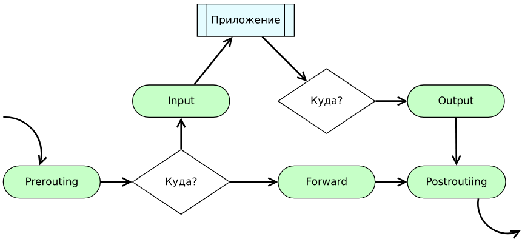
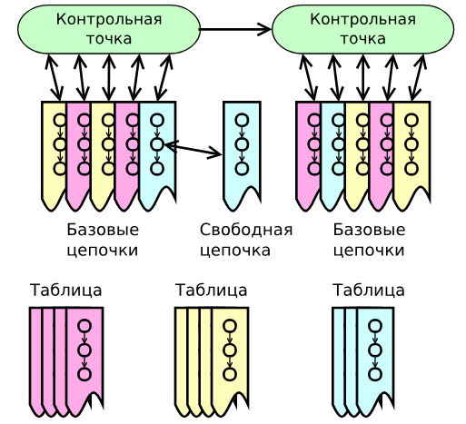

В предыдущих главах уже был рассмотрен весь стек сетевых протоколов, были рассмотрены протоколы прикладного уровня, постоянно используемые при работе в сети (`DNS`, `ZeroConf technologies` и т.д.) В этой главе рассматривается особая программная (или аппаратно-программная) технология обработки сетевого трафика - ***межсетевые экраны***. 

Межсетевые экраны работают на всех уровнях стека протоколов (за исключением, быть может, физического, но даже для него можно организовать обработку трафика, например, его шифрование), и с помощью описываемых в них правил занимаются **ограничением** (контроль количества и скорости поступления трафика), **перенаправлением** (`DNAT`, `Port Forwarding`), **преобразованием** (в самом частом случае трансляцией (`SNAT`) ) и **учётом** (в первую очередь для последующего анализа, поскольку абсолютной точности не гарантируется) трафика, причём как поступающего, так и исходящего или просто проходящего через устройство.

Для разных уровней стека протоколов существуют разные межсетевые экраны: [`Ethernet Bridge tables`](https://ru.wikipedia.org/wiki/ebtables) для работы на интерфейсном уровне и обработки фреймов; затрагиваемый в прошлых главах [`iptables`](https://ru.wikipedia.org/wiki/iptables) для обработки трафика на сетевом и транспортном уровнях (поскольку задачи для межсетевых экранов на этих уровнях общие - отслеживание потоков, обработка пакетов и т.д. - обычно они объединены). В данной главе, однако, будет рассмотрен более универсальный межсетевой экран [`nftables`](https://wiki.nftables.org/), который за счёт предобработки правил с помощью специальной виртуальной машины обладает большими возможностями и может работать на всех уровнях стека протоколов. [Подробная статья](https://wiki.archlinux.org/title/nftables) о работе сервиса, а также её [русская версия](https://wiki.archlinux.org/title/Nftables_%28%D0%A0%D1%83%D1%81%D1%81%D0%BA%D0%B8%D0%B9%29) помогут на примерах разобраться в особенностях правил `nft`.

В зависимости от типа поступающего трафика он может обрабатываться на разных [контрольных точках](https://wiki.nftables.org/wiki-nftables/index.php/Netfilter_hooks) ("хуках") сервиса.


Наибольший интерес для изучения в этой главе будет представлять `IP Layer` - уровень обработки, соответствующий сетевому и транспортному уровням стека протоколов. Лишь упомянем, что на `Bridge Layer` проводится работа с фреймами (этот уровень соответствует интерфейсному в стеке протоколов), а `ARP Layer` соответсвует специальной обработке `ARP`-запросов.

Ближе рассмотрим путь пакета в `IP Layer`:



Все поступающие пакеты первоначально проходят контрольную точку `Prerouting`, после чего проверяется адресат пакета. В случае обработки пакета своего сервиса производится передача его приложению через контрольную точку `Input`. При маршрутизации пакета он проходит контрольную точку `Forward`, после чего отправляется, на выходе проходя контрольную точку `Postrouting`. При отправке пакета из приложения он проходит контрольную точку `Output` и также отправляется, проходя `Postrouting`.

# Особенности структуры NFTables

Рассмотрим более детально структуру построения правил в межсетевом экране. Все правила представляют из себя некоторые единичные действия нам пакетами, точками входа-выхода трафика, некоторыми статически или динамически собранными множествами и т.д. 



Однотипные правила, решающие общую подзадачу, объединяются в **цепочки** и выполняются последовательно друг за другом. При этом при выполнении некоторых условий возможно прерывать исполнение цепочки для, например, перехода к следующей цепочке или выполнения другой цепочки с последующим возвратом в текущую.

Цепочки привязываются к **контрольным точкам (хукам)** и выполняются пследовательно (согласно приоритетам) в рамках обработки одной контрольной точки. И также, как и для цепочек, существуют правила перехода к слудующим контрольным точкам. \
Цепочки не обязаны быть строго закреплёнными за контрольными точками, в таком случае их называют *свободными* и обращаются к ним через некоторые правила из привязанных к хукам цепочек.

Цепочки можно объединять в **таблицы** с целью работы с ними, как с единым объектом (для общего создания или удаления, например). В качестве примера можно рассмотреть таблицу трансляции `NAT`, в которой глобально выделяются две цепочки, вообще говоря, относящиеся к совершенно разным контрольным точкам: цепочка маркировки пакетов на `Prerouting` и цепочка трансляции маркировеннах капетов на `Postrouting`.

Ещё одной важной особенностью `nftables` является наличие **типов данных**. Для большинства межсетевых экранов такой возможности нет, поскольку их обработка строится на прямом исполнении задаваемых правил. Предобработка правил и интерпретация некоторого байт-кода в `nftables`, открывает возможность работы с [типами данных](https://wiki.nftables.org/wiki-nftables/index.php/Data_types), а также со сложными [структурами](https://wiki.nftables.org/wiki-nftables/index.php/Main_Page#Advanced_data_structures_for_performance_packet_classification), позволяющими упростить настройку сложных цепочек. \
Есть небольшая обратная сторона работы с интерпретацией кода `nftables`, связанная со сбором статистики трафика: без явного указания данные не будут нигде храниться, и простую сборку данных по некоторым условиям осуществить нельзя. Однако при задании необходимых параметров можно настроить хранилища любой сложности и специфики, в том числе динамической (с хранением лишь в течение некоторого времени).

# Использование `NFTables`

Рассмотрим некоторые примеры использования `NFTables` для работы с трафиком. настроим стенд из трёх абонентов согласно топологии:

```console
papillon_rouge: vbintnets
srv:  
       eth1: intnet  
router:  
       eth1: intnet  
papillon_rouge:
```

Настроим `srv` и для начала с помощью `nftables` обеспечим трансляцию адресов.

`srv`
```srv
[root@srv ~]# autonet  
[root@srv ~]# cat /etc/systemd/network/10-inet.network    
[Match]  
Name=eth0  
  
[Network]  
DHCP=ipv4  
IPv4Forwarding=yes  

[root@srv ~]# cat /etc/systemd/network/50-intnet.network    
[Match]  
Name=eth1  
  
[Network]  
Address=10.9.0.26/24  
  
[Route]  
Gateway=10.9.0.27  
Destination=10.4.0.0/24  
  
[root@srv ~]# systemctl enable --now systemd-networkd  
[root@srv ~]#
```

Подключим `nftables` и посмотрим с помощью команды `nft list ruleset` текущий вид таблиц межсетевого экрана:

`srv`
```srv
[root@srv ~]# systemctl enable --now nftables.service    
Created symlink '/etc/systemd/system/multi-user.target.wants/nftables.service' -> '/usr/lib/systemd/sys  
tem/nftables.service'.  
[root@srv ~]# nft list ruleset  
table inet filter {  
       chain input {  
               type filter hook input priority filter; policy accept;  
       }  
  
       chain forward {  
               type filter hook forward priority filter; policy accept;  
       }  
  
       chain output {  
               type filter hook output priority filter; policy accept;  
       }  
}  
[root@srv ~]#
```

По умолчанию в системе присутствует единственная таблица с именем `filter` (имя таблицы может быть любым и никак не связано с типом входящих в него цепочек), цепочки из которой применяются для пакетов всех типов (ключечое слово `inet` используется для цепочек, подходящих под все пакеты, слова `ip` и `ipv6` - только для пакетов соответствующих протоколов). 

Таблица содержит три пустые цепочки (имена цепочек могут быть любыми и никак не связаны с контрольными точками, куда они привязываются). Для каждой цепочки задаются тип правил в ней (`nat` - преобразование, `filter` - фильтрация, `route` - перенаправление), соответствующий хук (если он есть), а также приоритет цепочки с помощью ключевых слов. Также следует явно указывать политику использования цепочки (некоторые могут иметь явный `reject` и не обрабатывать трафик до наступления некоторых условий или явной смены политики). 

Никаких правил в данных цепочках нет.

Добавим новую цепочку (в новой таблице) с правил трансляции адресов.

`srv`
```srv
[root@srv ~]# vim /etc/nftables/nftables.nft
...

table ip masq {  
 chain do_masq {  
       type nat hook postrouting priority srcnat; policy accept;  
       oifname eth0 masquerade;  
 }  
}

...
```

Данная таблица читается так:
 + Создать новую таблицу с именем `masq` для обработки пакетов протокола `IPv4`;
 + В таблице создать цепочку `do_masq` типа "Преобразование" в привязкой к контрольной точке `Postrouting`, приоритет цепочки - `srcnat`;
 + На выходе с интерфейса `eth0` (`oif` - `Output InterFace`) проводить трансляцию исходящего адреса.

Проверим работу `nftables`:

`srv`
```srv
[root@srv ~]# nft list ruleset  
table inet filter {  
       chain input {  
               type filter hook input priority filter; policy accept;  
       }  
  
       chain forward {  
               type filter hook forward priority filter; policy accept;  
       }  
  
       chain output {  
               type filter hook output priority filter; policy accept;  
       }  
}  
table ip masq {  
       chain do_masq {  
               type nat hook postrouting priority srcnat; policy accept;  
               oifname "eth0" masquerade  
       }  
}  
[root@srv ~]#
```

`router`
```router
[root@router ~]# autonet  
[root@router ~]# ip route add default via 10.9.0.26  
[root@router ~]# echo "nameserver 1.1.1.1" > /etc/resolv.conf  
[root@router ~]# ping ya.ru -c5  
PING ya.ru (77.88.44.242) 56(84) bytes of data.  
64 bytes from ya.ru (77.88.44.242): icmp_seq=1 ttl=254 time=8.43 ms  
64 bytes from ya.ru (77.88.44.242): icmp_seq=2 ttl=254 time=65.3 ms  
64 bytes from ya.ru (77.88.44.242): icmp_seq=3 ttl=254 time=54.8 ms  
64 bytes from ya.ru (77.88.44.242): icmp_seq=4 ttl=254 time=37.7 ms  
  
--- ya.ru ping statistics ---  
5 packets transmitted, 4 received, 20% packet loss, time 4005ms  
rtt min/avg/max/mdev = 8.427/41.569/65.326/21.522 ms  
[root@router ~]#
```

`NAT` работает более чем успешно.

---

Кроме способа явного описания структур в файл настройки `nftables` существует возможность выполнять те же действия с помощью команд сервиса.

Организуем фильтрацию портов для работы с помощью команд `nftables`. Для начала добавим для удобства проверки работы системы сервис `avahi`.

`srv`
```srv
[root@srv ~]# systemctl enable --now avahi-daemon     
Synchronizing state of avahi-daemon.service with SysV service script with /usr/lib/systemd/systemd-sysv  
-install.  
Executing: /usr/lib/systemd/systemd-sysv-install enable avahi-daemon  
Created symlink '/etc/systemd/system/dbus-org.freedesktop.Avahi.service' -> '/usr/lib/systemd/system/av  
ahi-daemon.service'.  
Created symlink '/etc/systemd/system/multi-user.target.wants/avahi-daemon.service' -> '/usr/lib/systemd  
/system/avahi-daemon.service'.  
Created symlink '/etc/systemd/system/sockets.target.wants/avahi-daemon.socket' -> '/usr/lib/systemd/sys  
tem/avahi-daemon.socket'.  
[root@srv ~]#
```

`router`
```router
[root@router ~]# systemctl enable --now avahi-daemon  
Synchronizing state of avahi-daemon.service with SysV service script with /usr/lib/systemd/systemd-sysv-install.
Executing: /usr/lib/systemd/systemd-sysv-install enable avahi-daemon
Created symlink '/etc/systemd/system/dbus-org.freedesktop.Avahi.service' -> '/usr/lib/systemd/system/avahi-daemon.service'.
Created symlink '/etc/systemd/system/multi-user.target.wants/avahi-daemon.service' -> '/usr/lib/systemd/system/avahi-daemon.service'.
Created symlink '/etc/systemd/system/sockets.target.wants/avahi-daemon.socket' -> '/usr/lib/systemd/system/avahi-daemon.socket'.

[root@router ~]# ping -fc3 srv.local
PING srv.local (10.9.0.26) 56(84) bytes of data.
 
--- srv.local ping statistics ---
3 packets transmitted, 3 received, 0% packet loss, time 1ms
rtt min/avg/max/mdev = 0.353/0.412/0.477/0.050 ms, ipg/ewma 0.575/0.408 ms
[root@router ~]# 
```

Добавим новую цепочку в основную таблицу:

`srv`
```srv
[root@srv ~]# nft add chain inet filter restrict "{type filter hook input priority filter; policy drop;  
}"  
```

 + Добавляем цепочку в таблицу `inet filter` (обращение к таблицам делается на основе не только имени, но и типа обрабатываемых пакетов) с именем `restrict`;
 + Тип цепочки "Фильтрация", кнтрольная точка `Input`, политика - сброс пакета.


`srv`
```srv
[root@srv ~]# nft list ruleset  
table inet filter {  
       chain input {  
               type filter hook input priority filter; policy accept;  
       }  
  
       chain forward {  
               type filter hook forward priority filter; policy accept;  
       }  
  
       chain output {  
               type filter hook output priority filter; policy accept;  
       }  
  
       chain restrict {  
               type filter hook input priority filter; policy drop;  
       }  
}  
table ip masq {  
       chain do_masq {  
               type nat hook postrouting priority srcnat; policy accept;  
               oifname "eth0" masquerade  
       }  
}
```

Поскольку никаких условий на прохождение этой цепочки не задано, она применяется ко всем пакетам, достигающим `Input`, отчего сеть перестаёт отвечать: 

`srv`
```srv
[root@srv ~]# ping -fc5 router.local  
ping: router.local: Name or service not known  
[root@srv ~]#
```

`router`
```router
[root@router ~]# ping -fc5 srv.local  
ping: srv.local: Name or service not known  
[root@router ~]#
```

Добавим разрешение на прохождение пакетов по `ssh`:

`srv`
```srv
[root@srv ~]# nft add rule inet filter restrict "tcp dport ssh accept"  
[root@srv ~]#
```

 + Правило для цепочки `inet filter restrict`;
 + Пропускать пакеты с портом получателя `ssh` (22), остальные придерживать основной политики (сбрасывать).

`router`
```router
[root@router ~]# ping -fc5 srv.local  
ping: srv.local: Name or service not known  
[root@router ~]# ping -fc5 10.9.0.26    
PING 10.9.0.26 (10.9.0.26) 56(84) bytes of data.  
.....  
--- 10.9.0.26 ping statistics ---  
5 packets transmitted, 0 received, 100% packet loss, time 43ms  
  
[root@router ~]# ssh 10.9.0.26  
The authenticity of host '10.9.0.26 (10.9.0.26)' can't be established.  
ED25519 key fingerprint is SHA256:BxaYoHAW5ddfM6EwmgSAZ2tKXCH0zoppLfEcQ8YiGdg.  
This key is not known by any other names.  
Are you sure you want to continue connecting (yes/no/[fingerprint])? yes  
Warning: Permanently added '10.9.0.26' (ED25519) to the list of known hosts.  
Last login: Sat May 31 13:49:16 2025  
[root@srv ~]#    
logout  
Connection to 10.9.0.26 closed.  
[root@router ~]#
```

Всё падает, `ssh` работает.

Для настройки всех других используемых служб необходимо для каждой из них прописать своё правило. Так, например, для работы `multicastDNS` (на основе которого и работает `avahi`) нужно разрешить ещё несколько протоколов, включая `ICMP`, который в меру специфики `nftables` указывается с дополнительными ключевыми словами. Для обычного пользователя, знакомящегося с межсетевыми экранами львиную долю времени будет занимать поиск и разбор таких нестандартных описаний команд и правил:

`srv`
```srv
[root@srv ~]# nft add rule inet filter restrict "tcp dport 53 accept"  
[root@srv ~]# nft add rule inet filter restrict "udp dport 53 accept"  
[root@srv ~]# nft add rule inet filter restrict "udp dport 5353 accept"  
[root@srv ~]# nft add rule inet filter restrict "meta l4proto icmp accept"  

[root@srv ~]# ping -fc5 router.local  
PING router.local (10.9.0.27) 56(84) bytes of data.  
   
--- router.local ping statistics ---  
5 packets transmitted, 5 received, 0% packet loss, time 1ms  
rtt min/avg/max/mdev = 0.181/0.277/0.434/0.084 ms, ipg/ewma 0.361/0.351 ms  
[root@srv ~]#
```

Поскольку добавление правил производилось с помощью команд, перезагрузка сервиса вернёт систему в первоначальное состояние:

`srv`
```srv
[root@srv ~]# nft list ruleset  
table inet filter {  
       chain input {  
               type filter hook input priority filter; policy accept;  
       }  
  
       chain forward {  
               type filter hook forward priority filter; policy accept;  
       }  
  
       chain output {  
               type filter hook output priority filter; policy accept;  
       }  
  
       chain restrict {  
               type filter hook input priority filter; policy drop;  
               tcp dport 22 accept  
               tcp dport 53 accept  
               udp dport 53 accept  
               udp dport 5353 accept  
               meta l4proto icmp accept  
       }  
}  
table ip masq {  
       chain do_masq {  
               type nat hook postrouting priority srcnat; policy accept;  
               oifname "eth0" masquerade  
       }  
}  

[root@srv ~]# systemctl restart nftables.service    

[root@srv ~]# nft list ruleset  
table inet filter {  
       chain input {  
               type filter hook input priority filter; policy accept;  
       }  
  
       chain forward {  
               type filter hook forward priority filter; policy accept;  
       }  
  
       chain output {  
               type filter hook output priority filter; policy accept;  
       }  
}  
table ip masq {  
       chain do_masq {  
               type nat hook postrouting priority srcnat; policy accept;  
               oifname "eth0" masquerade  
       }  
}  
[root@srv ~]#
```

---

Разберём более сложный пример с ограничением частоты соединений. 

Создадим новую таблицу и цепочку с правилом ограничения:

`srv`
```srv
[root@srv ~]# nft add table ip limiter  
[root@srv ~]# nft add chain ip limiter sshstop "{type filter hook input priority filter;}"  
[root@srv ~]# nft add rule ip limiter sshstop "tcp dport ssh ct state new limit rate over 15/minute drop"  

[root@srv ~]# nft list table ip limiter  
table ip limiter {  
       chain sshstop {  
               type filter hook input priority filter; policy accept;  
               tcp dport 22 ct state new limit rate over 15/minute burst 5 packets drop  
       }  
}  
[root@srv ~]#
```

 + В таблицу для пакетов протокола `IPv4` названия `limiter` добавить цепочку `sshstop`;
 + Добавить в цепочку правило "Если по `TCP` на `ssh`-порт происходит новых подключений (`ct state new` - `Connection Tracker state == new`) более 15 в минуту, сбрасывать пакеты"

В данном примере мы никак не контролируем и не отслеживаем, кто проводит соединение. Усложним пример, добавим динамически составляемый чёрный список подключений, для которых и будет осуществляться сброс.

Для начала добавим множество, в котором будет храниться чёрный список абонентов:

`srv`
```srv
[root@srv ~]# systemctl restart nftables.service    
[root@srv ~]# nft add set inet filter over1234 "{type ipv4_addr; flags timeout;}"  

[root@srv ~]# nft list set inet filter over1234  
table inet filter {  
       set over1234 {  
               type ipv4_addr  
               flags timeout  
       }  
}  
[root@srv ~]#    
```

Добавим правило попадания в чёрный список: если: 
 + `connection tracker` отследил установление соединения на порт 1234;
 + Выполняется условие метрики `flood` "Соединений более 5 в секунду"
то  адрес отправителя добавляется в множество `over80` на срок 6 секунд"

Также добавим счётчик `stat` для подсчёта пакетов и правило его заполнения

`srv`
```srv
[root@srv ~]# nft add rule inet filter input "ct state new tcp dport 1234 meter flood { ip saddr limit  
rate over 5/second } add @over1234 { ip saddr timeout 6s }"  

[root@srv ~]# nft add counter inet filter stat  
[root@srv ~]# nft add rule inet filter input "ip saddr @over1234 counter name stat drop"  # Сбрасывать все пакеты от абонентов чёрного списка с подсчётом их в stat

[root@srv ~]# nft list ruleset  
table inet filter {  
       counter stat {  
               packets 0 bytes 0  
       }  
  
       set over1234 {  
               type ipv4_addr  
               size 65535  
               flags timeout  
       }  
  
       set flood {  
               type ipv4_addr  
               size 65535  
               flags dynamic  
       }  
  
       chain input {  
               type filter hook input priority filter; policy accept;  
			   ct state new tcp dport 1234 add @flood { ip saddr limit rate over 5/second burst 5 packets } add @over1234 { ip saddr timeout 6s }  
               ip saddr @over1234 counter name "stat" drop  
       }  
  
       chain forward {  
               type filter hook forward priority filter; policy accept;  
       }  
  
       chain output {  
               type filter hook output priority filter; policy accept;  
       }  
}  
table ip masq {  
       chain do_masq {  
               type nat hook postrouting priority srcnat; policy accept;  
               oifname "eth0" masquerade  
       }  
}  
[root@srv ~]#
```

Проверим работу системы: запустим небольшой фоновый сервис, к которому будет производиться обращение. Заодно через него будем отслеживать показатели `stat`.

`srv`
```srv
[root@srv ~]# socat TCP-LISTEN:1234,reuseaddr,fork EXEC:"nft list counter inet filter stat" &  
[1] 2517  
[root@srv ~]# ss -lntp  
State   Recv-Q  Send-Q     Local Address:Port     Peer Address:Port  Process                              
LISTEN  0       128              0.0.0.0:22            0.0.0.0:*      users:(("sshd",pid=696,fd=3))       
LISTEN  0       5                0.0.0.0:1234          0.0.0.0:*      users:(("socat",pid=2517,fd=5))     
[root@srv ~]#
```

Убедимся, что изначально во множестве пусто, и `stat` нулевой:

`srv`
```srv
[root@srv ~]# nft list counter inet filter stat  
table inet filter {  
       counter stat {  
               packets 0 bytes 0  
       }  
}  
[root@srv ~]# nft list set inet filter over1234  
table inet filter {  
       set over1234 {  
               type ipv4_addr  
               size 65535  
               flags timeout  
       }  
}  
[root@srv ~]#
```

Запустим на `router` одиночное обращение к сервису:

`router`
```router
[root@router ~]# netcat srv.local 1234  
table inet filter {  
       counter stat {  
               packets 0 bytes 0  
       }  
}  
[root@router ~]#
```

Теперь запустим множество подключений и заметим, что первые пять обращений проходят без проблем, после чего происходит шестисекундная пауза, после которой производятся оставшиеся пять подключений.

`router`
```router
[root@router ~]# for n in `seq 10`; do echo $n; netcat srv.local 1234 < /dev/null; done  
1  
table inet filter {  
       counter stat {  
               packets 0 bytes 0  
       }  
}  
2  
table inet filter {  
       counter stat {  
               packets 0 bytes 0  
       }  
}  
3  
table inet filter {  
       counter stat {  
               packets 0 bytes 0  
       }  
}  
4  
table inet filter {  
       counter stat {  
               packets 0 bytes 0  
       }  
}  
5  
table inet filter {  
       counter stat {  
               packets 0 bytes 0  
       }  
}  
6  
table inet filter {  
       counter stat {  
               packets 6 bytes 360  
       }  
}  
7  
table inet filter {  
       counter stat {  
               packets 6 bytes 360  
       }  
}  
8  
table inet filter {  
       counter stat {  
               packets 6 bytes 360  
       }  
}  
9  
table inet filter {  
       counter stat {  
               packets 6 bytes 360  
       }  
}  
10  
table inet filter {  
       counter stat {  
               packets 6 bytes 360  
       }  
}  
[root@router ~]#
```

`srv` также обновит временную таблицу чёрного списка:

`srv`
```srv
[root@srv ~]# nft list counter inet filter stat  
table inet filter {  
       counter stat {  
               packets 6 bytes 360  
       }  
}  
[root@srv ~]# nft list set inet filter over1234  
table inet filter {  
       set over1234 {  
               type ipv4_addr  
               size 65535  
               flags timeout  
               elements = { 10.9.0.27 timeout 6s expires 3s214ms }  
       }  
}  
[root@srv ~]#
```

# Домашняя работа

 + `client` → `router` → `server` (***Настройка в отчёт не входит***)
     + «выход в интернет» должен работать на всех трёх машинах через `server`
         + `DNS` разрешается настраивать вручную при помощи `10.0.2.3` в `/etc/resolv.conf`
             + Если у вас старая версия `VirualBox`, впишите адрес `DNS`-сервера вашего провайдера (или `1.1.1.1`)
         + Все сетевые настройки выполняются перманентно с помощью `sytemd-networkd`
             + (маршрут по умолчанию, маршрут с `srv` на `client` и обратно)
         + `SNAT` на `srv` должен быть настроен перманентно с помощью `/etc/nftables/nftables.nft`
     + Настроить на `router` перманентно с помощью `/etc/nftables/nftables.nft` (руками вводить не надо):
         + Проброс порта `2222` → `client:22` (подключение с `server` к `router` на порт `2222` должно приводить к подключению к `client` на `22`)
         + Ограничение по количеству входящих `TCP`-соединений к `server` по `ssh` за определённый период времени с записью нарушителей в счётчик
             + как в «сложном примере» из лекции,
             + но поскольку обрабатываются не принятые, а _пересылаемые_ пакеты, точка привязки (`hook`) должна быть другая
     + `IP`-адрес машины `_client_` — `10.3.0.27/24`

 + Отчёт (вместо слов с `_нижним подчёркиванием_` могут быть числа, `IP`-адреса и т. п.):
    1. `report 10 server`:
         + `networkctl status eth0`
         + `networkctl status eth1`
         + `nft list ruleset`
         + `ssh _router_ -p 2222` (должен привести к _подключению_ на `10.3.0.27`!)
             + (2025-04-28) Для того, чтобы `login` сработал, надо на клиенте в `/etc/openssh/sshd_config` вписать строку `PermitRootLogin yes` и перезапустить сервис
             + выполнить там `ip a`
    2. `report 10 router`:
         + `networkctl status eth1`
         + `networkctl status eth2`
         + `nft list ruleset`
         + `date | netcat ya.ru 80` (должно показать 400)
    3. `report 10 client`:
         + `date | netcat ya.ru 80` (должно показать 400)
         + `for i in $(seq _число_ ); do date | netcat _server_ 22; done`
             + Должен отработать в рамках ограничения (сколько положено по квоте), а дальше зависнуть
    4. `router` (продолжение)
         + Посмотреть множество нарушителей квоты по подключениям (там должен быть `10.3.0.27`)
    5. Остановить зависшие команды на `10.3.0.27` и `server`

 + Три отчёта (названия сохранить, должно быть: `report.10.server`, `report.10.router` и `report.10.client`) переслать одним письмом в качестве приложений на [uneexlectures@cs.msu.ru](mailto:uneexlectures@cs.msu.ru)
     + В теме письма должно встречаться слово `LinuxNetwork2025`