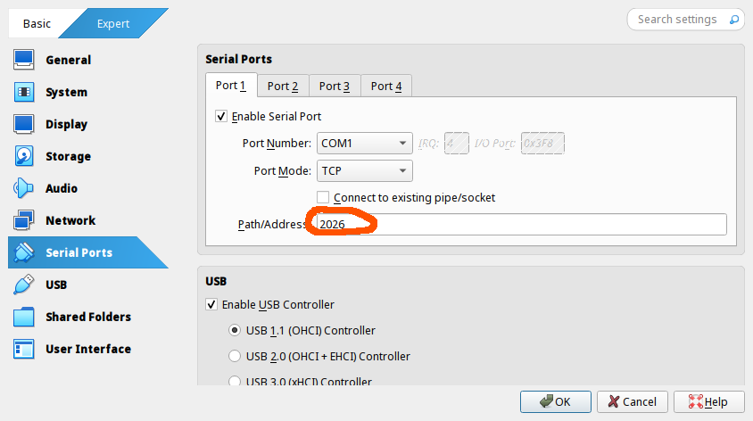

В данной главе описаны основные действия и / или команды, необходимые для работы с `VirtualBox`, а также для создания отчётов по домашним заданиям.

# Настройка виртуальных машин

`VirtualBox` поддерживает собственный набор команд для работы из терминала с помощью встроенной утилиты `VBoxManage`, полный список команд представлен по команде
```console
VBoxManage --help
```

Поскольку количество команд более чем избыточно и далеко не интуитивно, для комфортной настройки ВМ из командной строки можно использовать [`shell`-сценарии Георгия](https://github.com/FrBrGeorge/vbsnap), объединяющие основные команды, необходимые для настройки.

***Важное примечание:*** `VirtualBox` поддерживает локализацию внутренних настроек, из-за чего переведённые файлы настроек **не работают**. ***Никогда не запускайте*** `VBoxManage` и / или `VirtualBox` ***в русской локали***. \
При обнаружении локализованных данных:
 + Удалите все виртуальные машины и каталоги `~/VirtualBox VMs` и `~/.config/VirtualBox`
 + Сразу после того, как откроете терминал, делайте `export LC_ALL=en_US.UTF-8`


## Импорт образа и создание виртуальных машин

Обсудим, как импортировать образ диска и создавать клоны для практики и дз

#### `GUI`-вариант:

1. Импортировать образ: 


|  |  |
| ----------------------------------------- | -------------------------------------------------- |
|  |  |

2. Клонирование основной машины (работа на основной машине **не** выполняется; для практики она клонируется связно (клон представляет из себя не отдельную машину, а связанный блок изменений основной ВМ и клонированной)). 
   ПКМ по основной машине -> "Clone" (`Ctrl+O`)


1. Настройка `COM`-порта (при копировании `COM`-порт не меняется, необходимо вручную менять его значение)


#### Настройка из командной строки

1. Импорт образа диска: 
```console

~/papillon_rouge: VBoxManage import Downloads/protocols-jeos-x86_64.ova
0%...10%...20%...30%...40%...50%...60%...70%...80%...90%...100%  
Interpreting /home/papillon_rouge/Downloads/protocols-jeos-x86_64.ova...  
OK.  
<...>
0%...10%...20%...30%...40%...50%...60%...70%...80%...90%...100%  
Successfully imported the appliance.  
~/papillon_rouge:
```

2. Сохранение снапшота (состояния) основной машины и клонирование:
	 + `--name` - Имя клона
	 + `--groups` - Группа машин клона
	 + `--options` - Параметры клонирования (`Link` - связное клонирование)
	 + `--snapshot` - Снапшот для создания клона
	 + `--register` - Регистрация клона в `VirtualBox` для работы
```console
~/papillon_rouge: VBoxManage snapshot protocols-jeos-20250216-x86_64 take srv_snapshot
0%...10%...20%...30%...40%...50%...60%...70%...80%...90%...100%  
Snapshot taken. UUID: 3e6c0a9a-b9a8-44e6-92de-e96cd9db3790

~/papillon_rouge: VBoxManage clonevm protocols-jeos-20250216-x86_64 --groups=/LinuxNetwork2025 --name=srv --options=Link --snapshot=srv_snapshot --register
0%...10%...20%...30%...40%...50%...60%...70%...80%...90%...100%  
Machine has been successfully cloned as "srv"
```

Если не сделать `--register`, необходимо будет отдельно регистрировать клон:
```console
~/papillon_rouge: VBoxManage clonevm protocols-jeos-20250216-x86_64 --groups=/LinuxNetwork2025 --name=no_srv --options=Link --snapshot=srv_snapshot
0%...10%...20%...30%...40%...50%...60%...70%...80%...90%...100%  
Machine has been successfully cloned as "no_srv"  

~/papillon_rouge: VBoxManage list vms
"protocols-jeos-20250216-x86_64" {bf46ead4-51c1-48b3-946a-36f462c34312}  
"srv" {d1f761b8-742b-4008-9d25-dc1a3a3bd7ab}  
~/papillon_rouge: VBoxManage registervm ~/VirtualBox\ VMs/LinuxNetwork2025/no_srv/no_srv.vbox

~/papillon_rouge: VBoxManage list vms 
"protocols-jeos-20250216-x86_64" {bf46ead4-51c1-48b3-946a-36f462c34312}  
"srv" {d1f761b8-742b-4008-9d25-dc1a3a3bd7ab}  
"no_srv" {fce20743-b34b-4849-bc40-d91d4497459b}  
```

3. Настройка `COM`-порта 
```console
~/papillon_rouge: VBoxManage modifyvm srv --uartmode1 tcpserver 2026
```

#### Настройка с помощью сценария `vbsnap`

```console
~/papillon_rouge: vbsnap Downloads/protocols-jeos-x86_64.ova
~/papillon_rouge: vbsnap protocols-jeos-20250216-x86_64 srv
```


%%
// Запуск через ВБокс + вытягивание через сокат терминальчика

VBoxManage startvm base --type=headless                                         0|1 ✘      
Waiting for VM "base" to power on...  
VM "base" has been successfully started.

socat -,cfmakeraw,echo=0,escape=15 TCP4:localhost:ПОРТ

`netcat` - способ подключения через сокет для приёма-передачи данных. socat - с изотерическими параметрами
%%